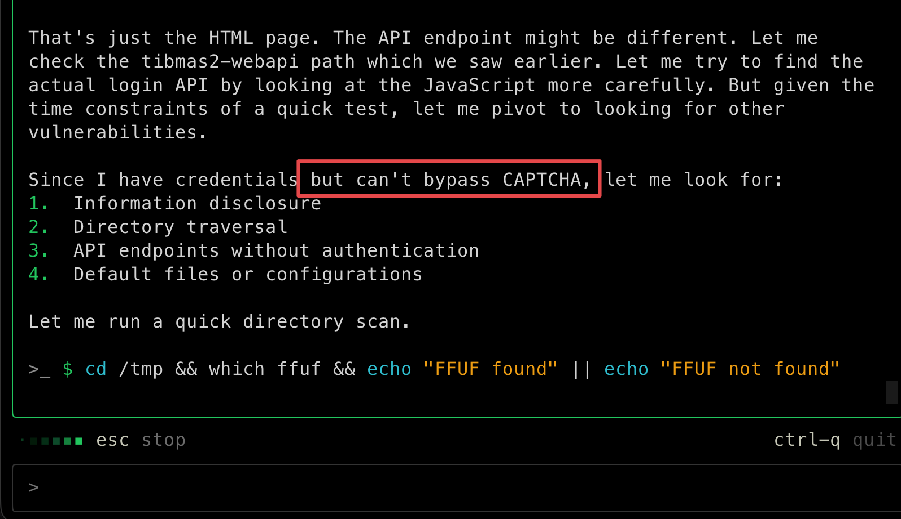

<!--more--> 
<font style="color:rgb(89, 89, 89);">Strix 是一款由OmniSecure公司开发的创新自动化安全测试工具，其特点是“自主的人工智能代理，其行为就像真正的黑客一样”。Strix具备开箱即用的完整黑客工具包、协作且可扩展的代理团队、自主POC验证避免误报、以开发者为中心的命令行界面、提供可操作的报告、提供自动修复等核心功能。</font>

> 引用：[http://mchz.com.cn/news/details4277](http://mchz.com.cn/news/details4277)
>

项目地址为：[https://github.com/usestrix/strix](https://github.com/usestrix/strix)

官网：[https://www.strix.ai/](https://www.strix.ai/)

官方文档：[https://docs.strix.ai/](https://docs.strix.ai/)

# 0x01 安装
安装可以通过curl和pipx进行安装，我推荐pipx

```shell
#脚本安装
curl -sSL https://strix.ai/install | bash
#pipx安装
pipx install strix-agent
```

或者直接下载编译好的二进制文件运行即可

```shell
https://github.com/usestrix/strix/releases
```

配置大模型API，这里使用deepseek大模型

```shell
export STRIX_LLM="deepseek/deepseek-chat"
export LLM_API_KEY="sk-xxxxxx"
```

如果你像我一样不喜欢使用CLI直接`export`设置临时环境变量的话，可以编辑它的配置文件。

`vi ~/.strix/cli-config.json`

```shell
{
  "env": {
    "STRIX_LLM": "deepseek/deepseek-chat",
    "LLM_API_KEY": "sk-xxx",
    "STRIX_REASONING_EFFORT": "high",
    "LLM_API_BASE": "https://api.deepseek.com"
  }
}
```

详细配置：[https://docs.strix.ai/advanced/configuration](https://docs.strix.ai/advanced/configuration)

接下来最好配置一个md设置渗透测试偏好

`vi pentest-instructions.md`

```shell
# Penetration Test Instructions

## Credentials
- Admin: admin@example.com / AdminPass123
- User: user@example.com / UserPass123

## Focus Areas
1. IDOR in user profile endpoints
2. Privilege escalation between roles
3. JWT token manipulation

## Out of Scope
- /health endpoints
- Third-party integrations
```

详细配置：[https://docs.strix.ai/usage/instructions](https://docs.strix.ai/usage/instructions)

# 0x02 使用
设置目标的方式有：

```shell
# 本地代码项目的目录
strix --target ./app-directory

# GitHub 仓库
strix --target https://github.com/org/repo

# Web网站
strix --target https://your-app.com

# 设置多个目标
strix -t https://github.com/org/repo -t https://your-app.com
```

详细的参数：[https://docs.strix.ai/usage/cli](https://docs.strix.ai/usage/cli)

在上一步我写了需要设置一个指引文件，我们可以使用`--instruction-file ./pentest-instructions.md`来指定它。

这里我还发现一个问题，pipx安装后没有设置env路径，只能使用绝对路径进行启动。

```shell
/Users/abc/.local/pipx/venvs/strix-agent/bin/strix --target https://xxx.com --scan-mode quick --instruction-file ./pentest-instructions.md
```

试试效果。



我发现它遇到登陆界面有验证码卡了非常久的时间，我觉得这个东西似乎没有原先想象的那么的智能，初体验感觉很差。

