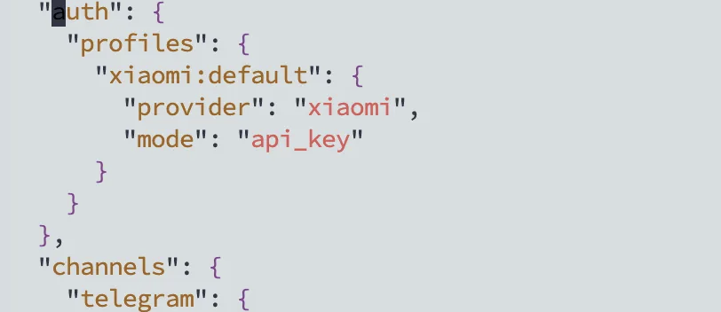
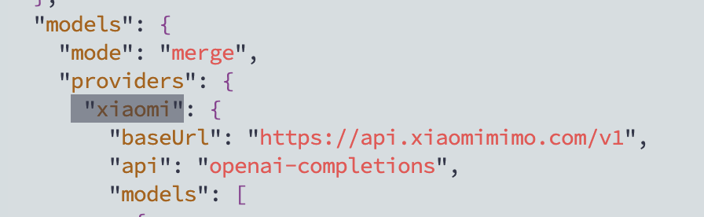
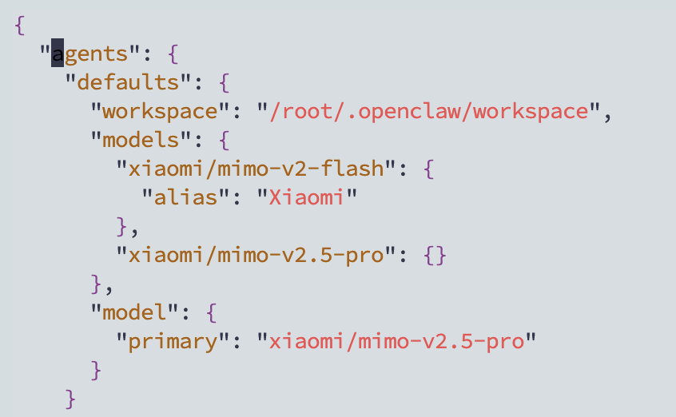
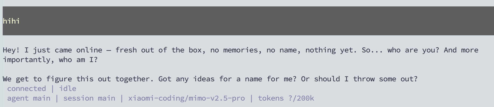

<!--more--> 
> openclaw 只是一个harness工具，需要LLM提供商。
>

openclaw 官网：[https://openclaw.ai/](https://openclaw.ai/)

直接运行下面的命令进行安装。

```bash
curl -fsSL https://openclaw.ai/install.sh | bash
```

如果要卸载运行下面的命令：

> 更多阅读[https://docs.openclaw.ai/zh-CN/install/uninstall](https://docs.openclaw.ai/zh-CN/install/uninstall)
>

```bash
openclaw uninstall --all --yes --non-interactive
```

我在“I understand this is personal-by-default and shared/multi-user use requires lock-down. Continue?”选择了No，发现重新尝试时出现了不一样的选项。

使用`openclaw reset`命令来重置全部，这样子就能回到刚开始安装配置阶段了。

```bash
◇  Reset scope
│  Full reset
│
◇  Proceed with full reset?
│  Yes
```

然后运行`openclaw onboard --install-daemon`即可开始配置。

重点配置模型，我这里选择了小米的mimo

```bash
◇  I understand this is personal-by-default and shared/multi-user use requires lock-down. Continue?
│  Yes
│
◇  Setup mode
│  QuickStart (recommended)
│
◇  Model/auth provider
│  More…
│
◇  Model/auth provider
│  Xiaomi
│
◇  Enter Xiaomi API key
│  ▪▪▪▪▪▪▪▪▪▪▪▪▪▪▪▪▪▪▪▪▪▪▪▪▪▪▪▪▪▪▪▪▪▪▪▪▪▪▪▪▪▪▪▪▪▪▪▪▪▪▪
│
◇  Default model
│  Enter model manually
│
◇  Default model
│  xiaomi/mimo-v2.5-pro
```

然后是对话，我选择了TG，你不需要的话可以跳过，用TUI也是一样的。搜索提供我跳过了，没有Key。hooks我全部选择了，选择操作要用到空格键。

```bash
◇  Select channel (QuickStart)
│  Telegram (Bot API)
◇  How do you want to provide this Telegram bot token?
│  Enter Telegram bot token
│
◇  Enter Telegram bot token
│
◇  Search provider
│  Brave Search
│
◇  Brave Search API key
│  
│
◇  Configure skills now? (recommended)
│  No
◆  Enable hooks?
│  ◻ Skip for now
│  ◼ 🚀 boot-md (Run BOOT.md on gateway startup)
│  ◼ 📎 bootstrap-extra-files (Inject additional workspace bootstrap files via glob/path patterns)
│  ◼ 📝 command-logger (Log all command events to a centralized audit file)
│  ◼ 🧹 compaction-notifier (Send visible chat notices when session compaction starts and finishes.)
│  ◼ 💾 session-memory (Save session context to memory when /new or /reset command is issued)
```

后面可以通过`Updated config: ~/.openclaw/openclaw.json`配置进行修改。

又遇到了一个问题：

Error: Config validation failed: tools.web.search.provider: web_search provider is not available: brave (install or enable plugin "brave", then run openclaw doctor --fix)

不过我不打算修复这个问题，直接使用`openclaw tui`进行测试。

```bash
hi                                                                                                                
connected | error  
```

我的mimo没有连接上，通过查看xiaomi官方文档才知道coding plan需要使用直接修改文件的方式进行配置。

> 更多 [https://platform.xiaomimimo.com/docs/zh-CN/integration/openclaw](https://platform.xiaomimimo.com/docs/zh-CN/integration/openclaw)
>

需要删除“auth”字段



在 models.provider.<font style="color:rgb(92, 92, 98);">provider</font> 路径找到刚才通过正常配置过程设置的“xiaomi”修改成“xiaomi-coding”

baseURL修改成：“https://token-plan-cn.xiaomimimo.com/v1”

然后增加**“apiKey”**



找到agents修改“xiaomi”修改成“xiaomi-coding”



我改成了

```bash
"agents": {
    "defaults": { 
      "workspace": "/root/.openclaw/workspace",
      "models": {
        "xiaomi-coding/mimo-v2.5-pro": {}
      },
      "model": {
        "primary": "xiaomi-coding/mimo-v2.5-pro"
      }
    }
  }
```

再次尝试发现已经可以使用。

然后正常用TG机器人进行star，按照提示来就行。这里不写如何创建TG机器人，上网搜一下就知道了。


