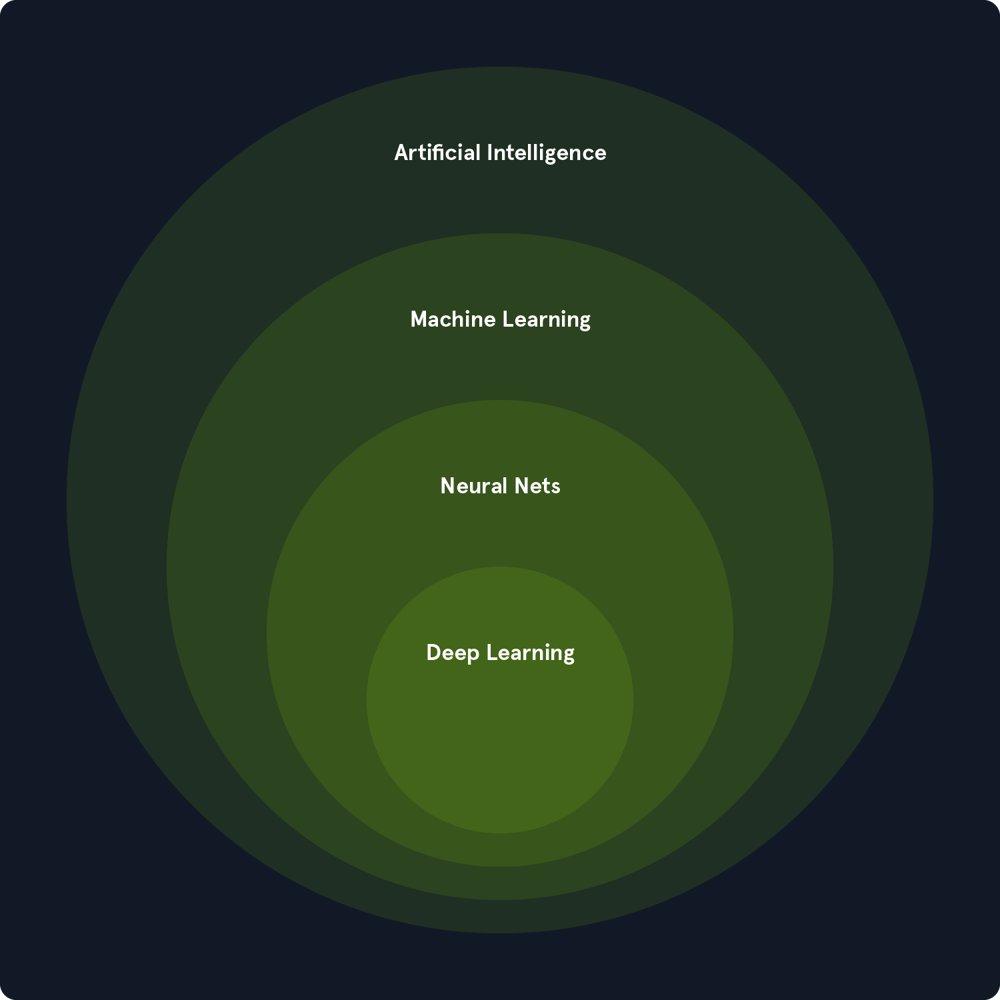

<!--more--> 
# 人工智能与机器学习概述
## 名词解释
人工智能，Artificial Intelligence （ AI ） 是完成通常需要人类智慧任务的**智能系统**。这些任务包括理解自然语言、识别物体、做决策、解决问题以及从经验中学习。 

机器学习，Machine Learning （ ML ） 是人工智能的一个子领域，使系统能够从数据中学习。**机器学习算法**利用**统计技术**识别数据集中的模式、趋势和异常，使系统能够基于新的输入数据做出预测、决策或分类。

自然语言处理，Natural Language Processing （ NLP ）： 使计算机能够理解、解释并生成人类语言。

深度学习，Deep Learning （ DL ） 是机器学习的一个子领域，利用**多层神经网络**从复杂数据中**学习和提取特征**。  
神经网络，Neural Nets，能够自动识别大数据集中的复杂模式和表示，使其在涉及**非结构化或高维数据**的任务中尤为强大，如图像、音频和文本。

## 机器学习的三大类
### 监督学习（Supervised Learning ）
该算法从标记数据中学习，每个数据点对应一个已知的结果或标签。

+ Image classification 图像分类
+ Spam detection 垃圾邮件检测
+ Fraud prevention 防欺诈

> 重点是需要老师（Tokens参数更多的AI、我们人类）对数据点正确的标记。
>

### 非监督学习（Unsupervised Learning ）
该算法从未标记的数据中学习，但不提供结果或标签。

+ Customer segmentation 客户细分
+ Anomaly detection 异常检测
+ Dimensionality reduction 降维

> 重点是提取数据特征，根据不同特征构建不同维度，以此进行规律发现。
>

### 强化学习（Reinforcement Learning）
+ Game playing 游戏玩法
+ Robotics 机器人
+ Autonomous driving 自动驾驶

> 重点是做对了得到奖励，做错了则受到批评，经过反复体验，自然找到最合适的行为方式。
>

## 深度学习常用的神经网络类型
卷积神经网络，Convolutional Neural Networks （ CNNs ）： 专注于图像和视频数据，CNN利用卷积层来检测局部模式和空间层级。

循环神经网络，Recurrent Neural Networks （ RNNs ）： RNN设计用于文本和语音等顺序数据，具有环路，允许信息跨时间步持续存在。

变换器，Transformers ：DL的最新进展是，变换器在自然语言处理任务中尤为有效。他们利用自我关注机制来处理远程依赖关系。

## 小结
机器学习和深度学习都是AI的子集，使系统能够从数据中学习并做出智能决策。机器学习有三大类：监督学习、无监督学习和强化学习。  
个人理解：机器学习使用统计技术解析特征，深度学习做特征提取，结合后能够处理复杂多维度的数据。如监督学习算法和卷积神经网络能够使机器准确“看到”和解读图像。

# 监督学习算法
该算法旨在学习**映射函数**，以预测新的未见数据的标签。这一过程涉及识别特征（输入变量）与相应标签（输出变量）之间的模式和关系。

> 回顾，监督学习特点是提供标记好结果或者标签的数据，可以想象成一套正确答案的试卷。
>

## 工作原理
想象你正在教一个孩子识别不同的水果。你给他们看一个苹果，说：“这是个苹果。”然后你给他们看一个橙子，说：“这是个橙子。”通过反复展示带有标签的例子，孩子学会根据水果的颜色、形状和大小等特征**区分**它们。

监督式学习算法的工作原理类似。他们会接收大量标注样本的数据集，并利用这些数据训练模型，预测新的、未见过的样本的标签。训练过程包括调整**模型参数**，达到预测与实际标签之间的**最小化差异**。

监督式学习问题大致可分为两大类：

1. **分类，Classification** ：在分类问题中，目标是预测一个类别标签。例如，将邮件分类为垃圾邮件或识别猫、狗或鸟类的图片。
2. **回归，Regression** ：在回归问题中，目标是预测一个连续的值。例如，可以根据房屋的大小、位置及其他特征预测价格，或者预测股市。

> 回归分析是一种统计方法，通过建模因变量与一个或多个自变量之间的关系来做出预测
>

## 核心概念
### Training Data 训练数据
它是用于训练ML模型的带标签数据集。该数据集由输入特征及其对应的输出标签组成。

> 这个是重点，用来区分了机器学习的类型。数据集强调数量和准确度。
>

### Features 特征
特征是作为模型输入的数据的可测量属性或特征。它们是算法用来学习和做出预测的变量。

**并不是特征越多越好！应当选择与你目的相关的特征，强调关联性。**

例如，在预测房价时，特征可能包括：

+ 房子大小
+ 厕所数量
+ 房子位置

### Labels 标签
标签是训练集中每个数据点相关的已知结果或目标变量。它们代表模型旨在预测的“正确答案”。

在房价预测的例子中，标签是房屋的实际价格。

### Model 模型
是特征与标签之间关系的数学表示。它是从训练数据中学习的，并用于预测新的、未被看到的数据。可以model看作是一个**函数**，将特征作为输入，输出标签的预测。

### Training 训练
是将数据集输入算法并调整模型参数以**最小化预测误差**的过程。算法通过迭代调整内部参数来提升预测准确性。

### Prediction 预测
一旦训练好，model就可以用于预测新的、未被看到的数据。这包括提供model新数据点的特征，并model输出标签的预测。预测是推理的一种特定应用，重点是生成可作的输出，比如将电子邮件归类为垃圾邮件或预测股价。

### Inference 推断
推断是一个更广泛的概念，涵盖了预测，同时也包括理解数据中的底层结构和模式。它涉及使用受过训练model的 来推导洞察、估计参数并理解变量之间的关系。例如，推断可能涉及确定决策树中哪些特征最重要，估计线性回归模型中的系数，或分析不同输入如何影响模型的预测。**预测强调可作的输出，而推理则通常侧重于解释和解释结果。**

### Evaluation 评价（关键）
它涉及评估模型的性能，以确定其准确性和对新数据的泛化能力。常见的评估指标包括：

> true and flase，正与负，对与错，可以互相用。  
以下指标均为分类问题性能指标，具体涉及混淆矩阵。即标记正与否与模型预测结果的正与负相乘，得到四组：  
真正(True Positive , TP)：被模型预测为正的正样本。
>
> 假正(False Positive , FP)：被模型预测为正的负样本。
>
> 假负(False Negative , FN)：被模型预测为负的正样本。
>
> 真负(True Negative , TN)：被模型预测为负的负样本。
>

+ 准确率，Accuracy：**全部样本**中正确预测的比例，即整体预测对多少。  
Accuracy = (TP+TN)/(TP+FN+FP+TN)
+ 精确率，Precision：**预测为正样本**中正确预测的比例，即预测准不准。  
Precision = TP/(TP+FP)
+ 召回率，Recall：**标记为正样本**中正确预测的比例，即预测全不全。  
Recall = TP/(TP+FN)
+ F1-score：一个综合评价指标，当精确率和召回率接近时，F值最大。能够平衡衡量模型的性能。

Precision 是站在“模型预测结果”的角度看，Recall 是站在“标记为正样本”的角度看。

