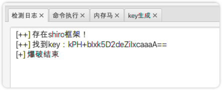
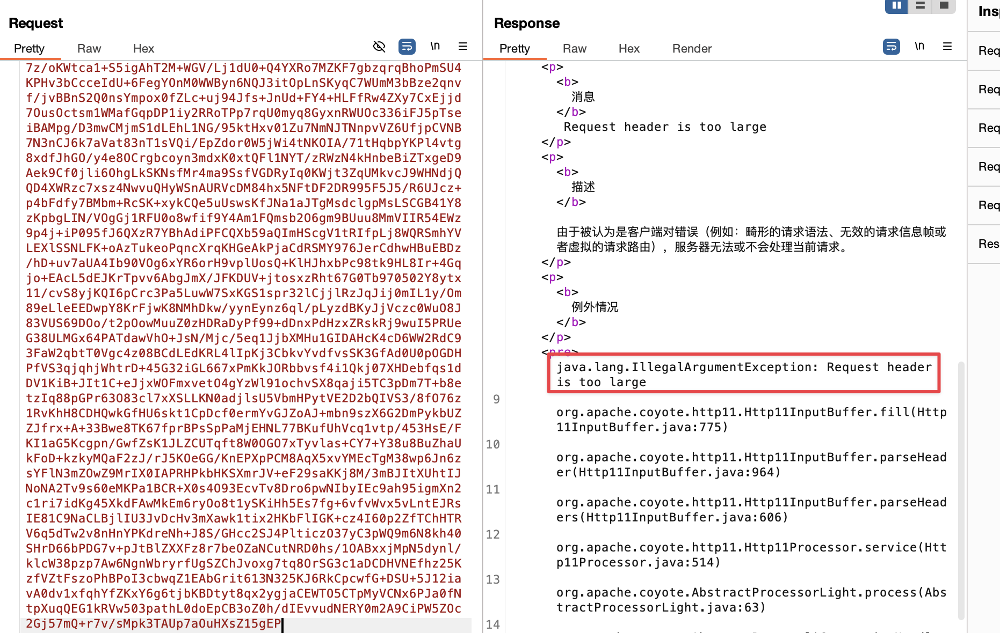
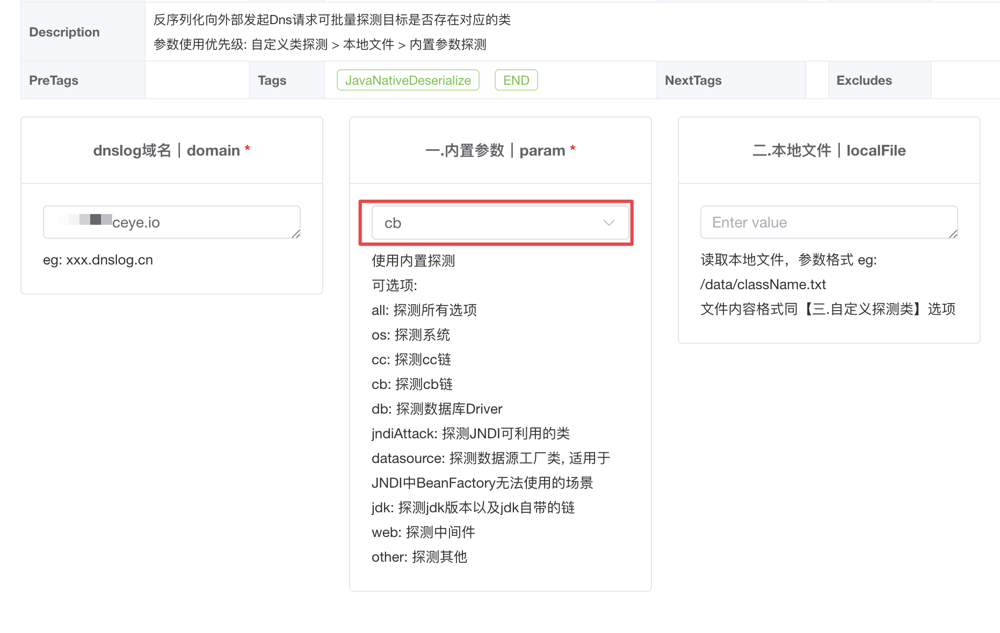
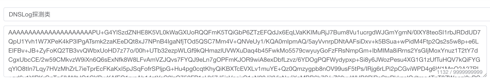
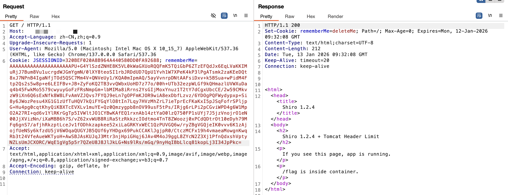
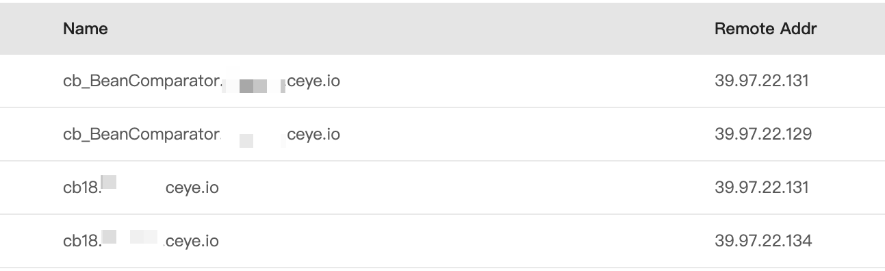
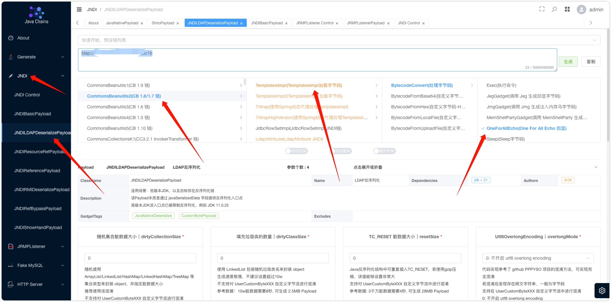
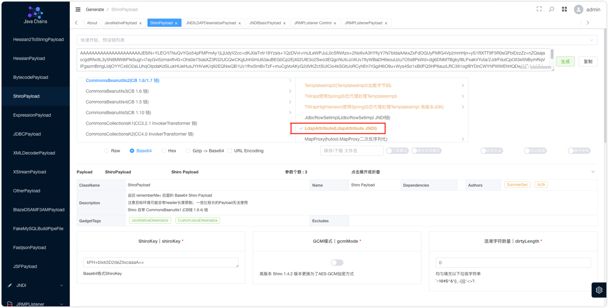
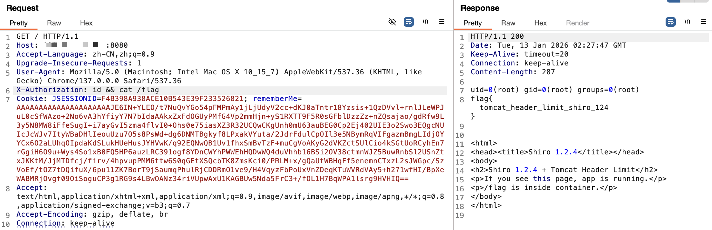

<!--more--> 
# 限制
Tomcat请求头限制主要通过server.xml中Connector的maxHttpHeaderSize属性配置，默认8KB（8192字节），用于限制整个HTTP请求头（包括URL和所有字段）的大小，过大时会报“Request header is too large”错误，可增大此值或使用HTTP/2进行头压缩以解决. 

配置方法

1. 找到server.xml：位于Tomcat安装目录的conf文件夹下.
2. 定位Connector标签：通常在<Connector port="8080" protocol="HTTP/1.1" ... />中.
3. 修改或添加maxHttpHeaderSize属性：例如，将限制提高到16KB：maxHttpHeaderSize="16384"。例如，将限制提高到64KB：maxHttpHeaderSize="65536".
4. 保存并重启Tomcat：
5. 修改配置后，需要重启Tomcat服务使之生效. 

```shell
<Connector port="8080" protocol="HTTP/1.1"
           connectionTimeout="20000"
           redirectPort="8443"
           maxHttpHeaderSize="16384" />
```

# 过程
## 获得Key
爆破的事情还是交给工具：[https://github.com/SummerSec/ShiroAttack2/](https://github.com/SummerSec/ShiroAttack2/)



发现是默认密钥。

## 突破限制
推荐使用工具：[https://github.com/vulhub/java-chains/blob/main/README.zh-cn.md](https://github.com/vulhub/java-chains/blob/main/README.zh-cn.md)，最好在VPS上安装，不然用不了JNDI服务。

上来先试了一下长字节的payload，直接就提示过长了。



仅生成探测cb链的payload，生成的长度仅有1132。





执行后成功收到了信息，探测到了CommonsBeanUtils1.8的版本。



因为长度的限制，所以我们选择使用Ldap注入。先使用JNDI反序列化payload，设置依赖为cb1.8，然后Echo回显。命令设置头为：`X-Authorization`



然后使用cb1.8依赖的Ldap放入上面的链接。生成后payload的长度仅有856，可以完美的执行。



直接执行即可，成功绕过payload长度限制。



