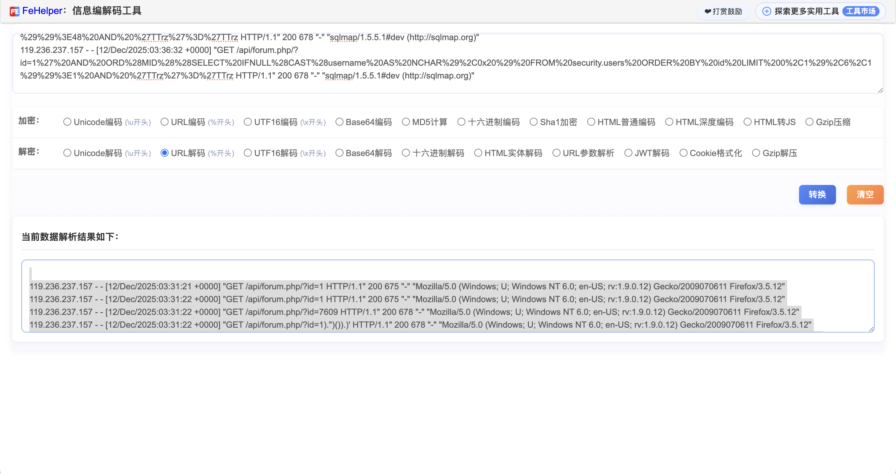
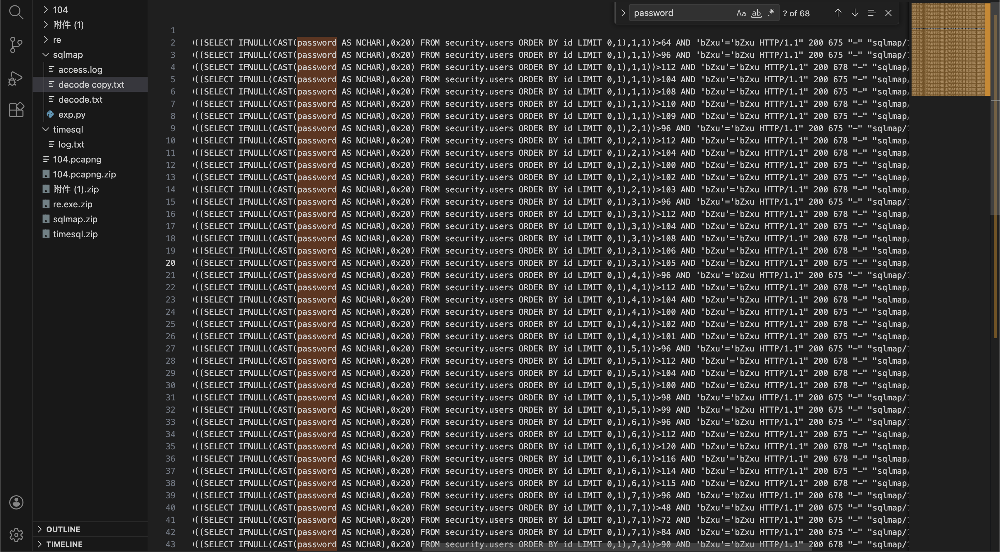
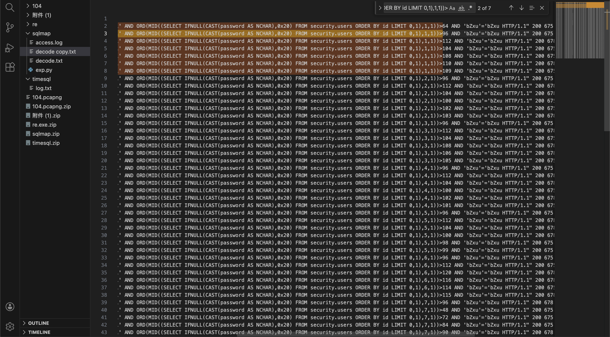
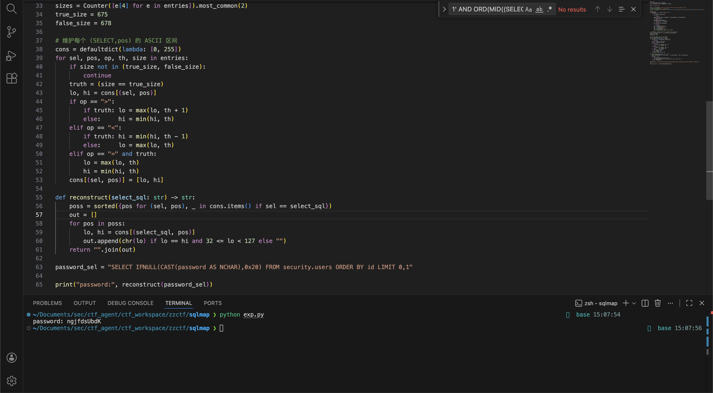

<!--more--> 
# 题目
黑客通过sqlmap工具获取到了管理员的密码，该密码为?(10位字符)

# 解题过程
## 过滤出主要日志
题目提示通过sqlmap工具获取到了管理员的密码，给到的文件是txt，里面是访问日志。先进行URL decode。任何能够进行URL解码的工具都可以，在线的或者JS也可以。



然后通过编辑器过滤出关键词 password



## 具体分析
发现是常见的猜解字符的SQL注入语句，通过比较大小得到最终字符。

可以看到响应码有675和678。675出现次数多于678，当出现错误时会比正常返回大或者小，所以判断出。

bytes=675 视为 True

bytes=678 视为 False



当 >112时返回 False，说明字符的ASCII值 ≤ 112

当 >110时返回 False，说明字符的ASCII值 ≤ 110

当 >109时返回 True，说明字符的ASCII值 > 109

因此字符的ASCII值范围是：109 < 值 ≤ 110

由于ASCII值是整数，所以唯一可能的取值是：110

以此类推

## 脚本
```shell
import re
from urllib.parse import unquote
from collections import defaultdict, Counter

LOG = "./access.log"

line_re = re.compile(r"\"GET\s+([^\s]+)\s+HTTP/[^\"]+\"\s+(\d{3})\s+(\d+)")
# 解析：ORD(MID((SELECT ...),pos,1))>k
ord_re = re.compile(r"ORD\(MID\(\((?P<select>.*)\),(?P<pos>\d+),(?P<len>\d+)\)\)\s*(?P<op>>|<|=)\s*(?P<th>\d+)")

entries = []
with open(LOG, "r", errors="ignore") as f:
    for raw in f:
        m = line_re.search(raw)
        if not m:
            continue
        path, status, size = m.group(1), int(m.group(2)), int(m.group(3))
        if status != 200:
            continue
        decoded = unquote(path)
        if "ORD(MID" not in decoded:
            continue
        m2 = ord_re.search(decoded)
        if not m2:
            continue
        sel = m2.group("select")
        pos = int(m2.group("pos"))
        op  = m2.group("op")
        th  = int(m2.group("th"))
        entries.append((sel, pos, op, th, size))

# 找两种最常见 bytes，并选择本题映射：675=True, 678=False
sizes = Counter([e[4] for e in entries]).most_common(2)
true_size = 675
false_size = 678

# 维护每个 (SELECT,pos) 的 ASCII 区间
cons = defaultdict(lambda: [0, 255])
for sel, pos, op, th, size in entries:
    if size not in (true_size, false_size):
        continue
    truth = (size == true_size)
    lo, hi = cons[(sel, pos)]
    if op == ">":
        if truth: lo = max(lo, th + 1)
        else:     hi = min(hi, th)
    elif op == "<":
        if truth: hi = min(hi, th - 1)
        else:     lo = max(lo, th)
    elif op == "=" and truth:
        lo = max(lo, th)
        hi = min(hi, th)
    cons[(sel, pos)] = [lo, hi]

def reconstruct(select_sql: str) -> str:
    poss = sorted({pos for (sel, pos), _ in cons.items() if sel == select_sql})
    out = []
    for pos in poss:
        lo, hi = cons[(select_sql, pos)]
        out.append(chr(lo) if lo == hi and 32 <= lo < 127 else "")
    return "".join(out)

password_sel = "SELECT IFNULL(CAST(password AS NCHAR),0x20) FROM security.users ORDER BY id LIMIT 0,1"

print("password:", reconstruct(password_sel))
```

输出结果为：ngjfdsUbdK



