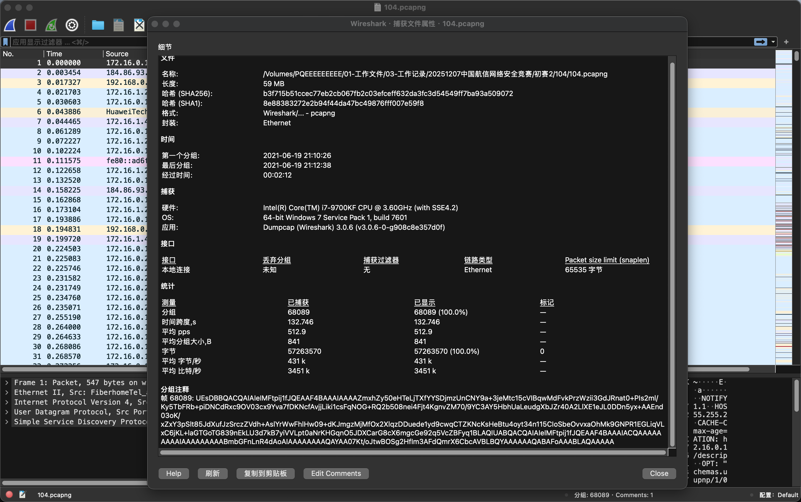
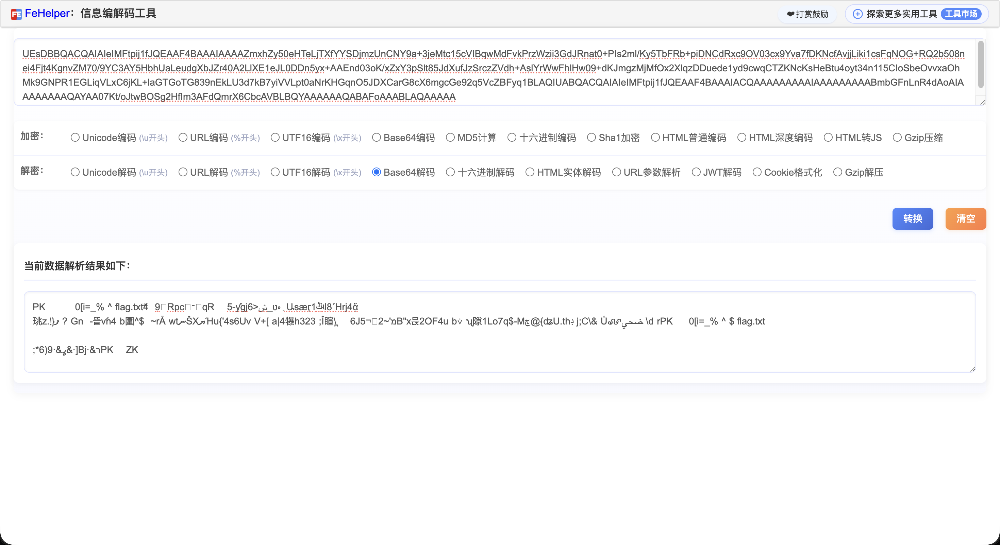
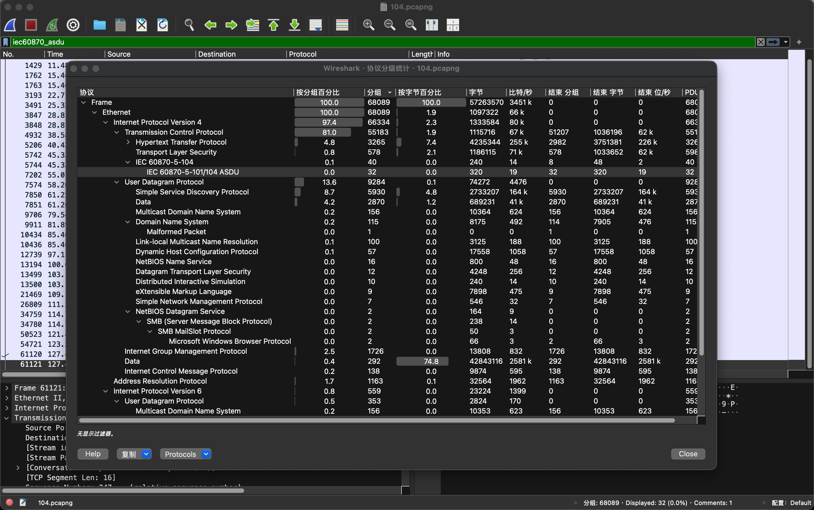
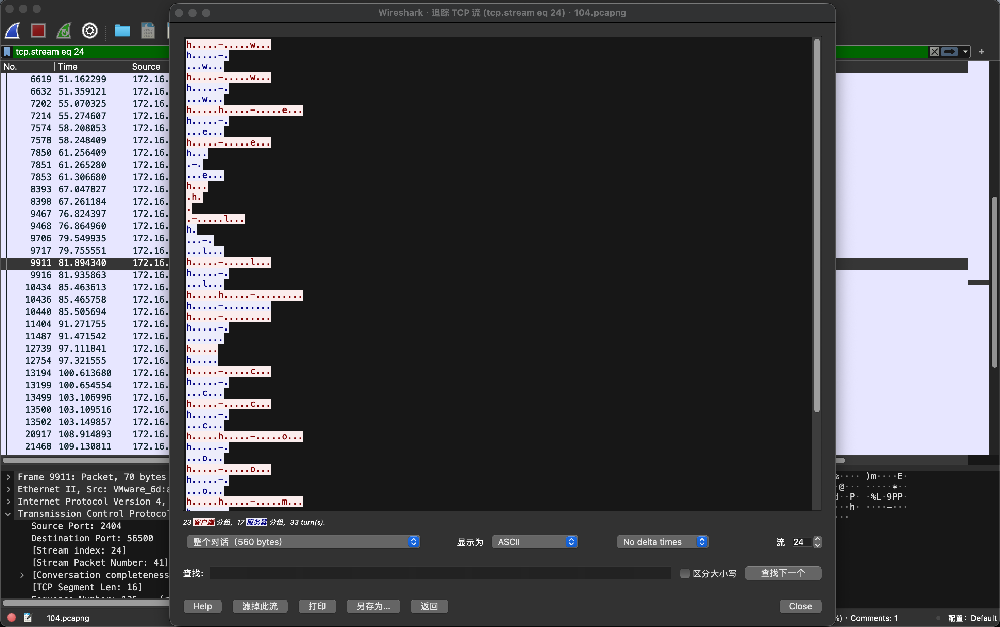
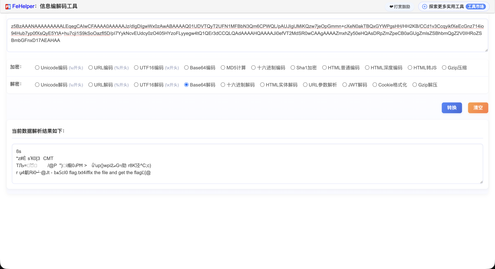
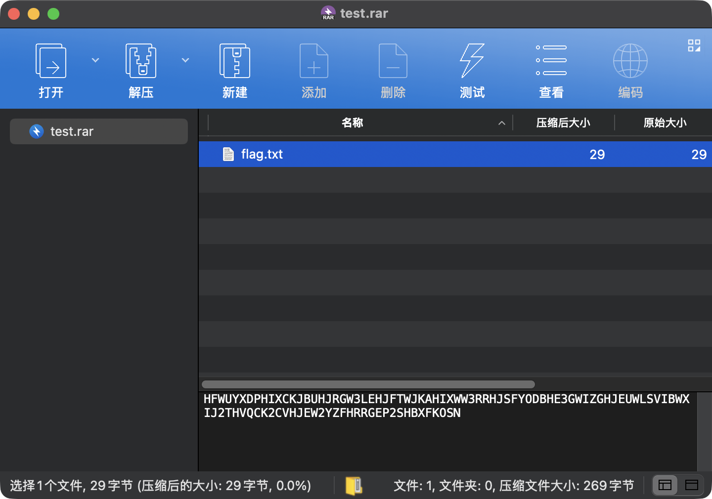
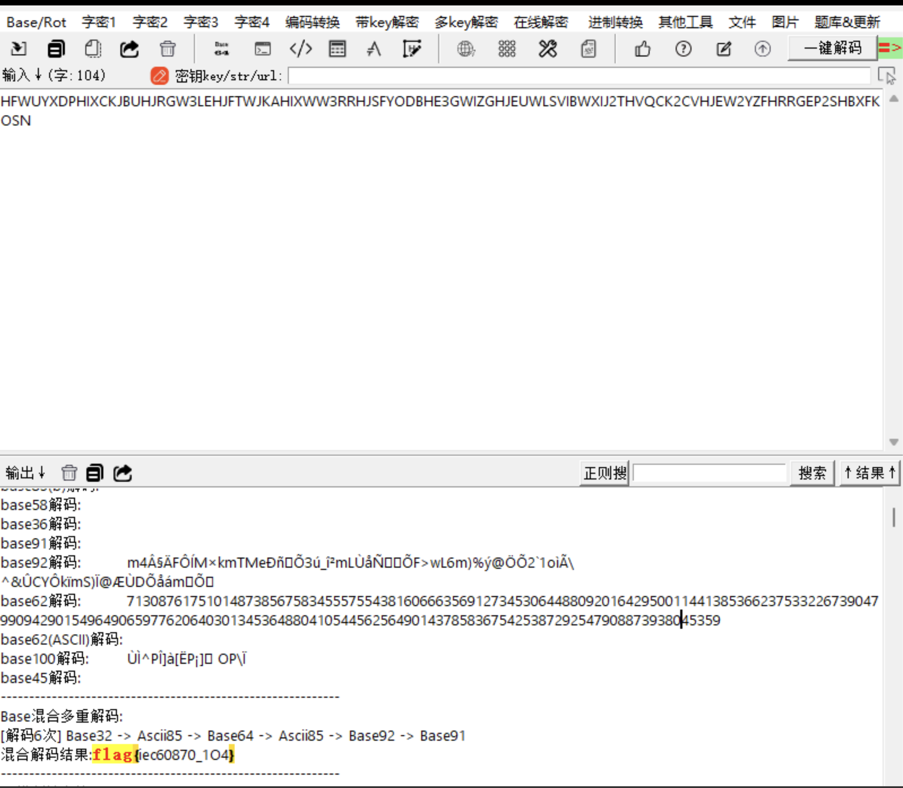

<!--more--> 
关键词：misc; 流量分析; pcap; 解密; 压缩包; 工控

题目就一个104.pcapng，使用Wireshark打开后，习惯性先看一下文件属性，发现分组注释里有一大串似乎是base64的数据。



尝试解码，可以看到有PK开头，可以推测是zip压缩包。



编写python脚本将padding补全后解码写入output.zip

```shell
import base64
s = """UEsDBBQACQAIAIeIMFtpij1fJQEAAF4BAAAIAAAAZmxhZy50eHTeLjTXfYYSDjmzUnCNY9a+3jeMtc15cVIBqwMdFvkPrzWzii3GdJRnat0+PIs2ml/Ky5TbFRb+piDNCdRxc9OV03cx9Yva7fDKNcfAvjjLiki1csFqNOG+RQ2b508nei4Fjt4KgnvZM70/9YC3AY5HbhUaLeudgXbJZr40A2LlXE1eJL0DDn5yx+AAEnd03oK/xZxY3pSlt85JdXufJzSrczZVdh+AslYrWwFhlHw09+dKJmgzMjMfOx2XlqzDDuede1yd9cwqCTZKNcKsHeBtu4oyt34n115CIoSbeOvvxaOhMk9GNPR1EGLiqVLxC6jKL+laGTGoTG839nEkLU3d7kB7yiVVLpt0aNrKHGqnO5JDXCarG8cX6mgcGe92q5VcZBFyq1BLAQIUABQACQAIAIeIMFtpij1fJQEAAF4BAAAIACQAAAAAAAAAIAAAAAAAAABmbGFnLnR4dAoAIAAAAAAAAQAYAA07Kt/oJtwBOSg2HfIm3AFdQmrX6CbcAVBLBQYAAAAAAQABAFoAAABLAQAAAAA"""
s = s.strip()
s += "=" * ((4 - len(s) % 4) % 4)  # 关键：补齐 base64 padding
open("output.zip","wb").write(base64.b64decode(s))
print("written output.zip")
```

双击output.zip准备查看flag.txt，但是提示需要密码。重新回到流量分析，通过协议分级发现存在工控协议。



出题者选择 C_SC_NA_1（TypeID=0x2d） 这类遥控 ASDU，把信息塞在 IOA（信息对象地址）的低字节里。

按时间顺序取 172.16.1.40 发出的 TypeID=0x2d 报文，提取 IOA 低字节并去除重复，即可得到口令 welcome。

（实现可用自写脚本解析：识别 I 帧、读 ASDU 头、读 IOA 三字节，取低字节拼接。）



解开数据包后发现flag.txt里又是一大段base64编码。尝试解码后发现是一个压缩包，但缺了压缩包的头部信息，不知道是什么压缩包。

```shell
- "377ABCAF271C"  # 7z
- "314159265359"  # bz2
- "53514c69746520666f726d6174203300"  # SQLite format 3.
- "1f8b"  # gz tar.gz
- "526172211A0700"  # rar RAR archive version 1.50
- "526172211A070100"  # rar RAR archive version 5.0
- "FD377A585A0000"  # xz tar.xz
- "1F9D"  # z tar.z
- "1FA0"  # z tar.z
- "4C5A4950"  # lz
- "504B0304"  # zip
```



尝试补充了rar的头后发现正确。

```shell
from pathlib import Path
import base64
s = """z5BzAAANAAAAAAAAALEqegCAIwCFAAAA0AAAAAJz/dIgDIgwWx0zAwABAAAAQ01UDVTQyT2UFN1MFBbN3Qm6CPWQL/pAUJIgIJMiKQzw7jeOpGmmn+cXeN0akTBQxGYWPgsHH/HH2KB/CCd1v3CcqyikfXeEcGnz714io94Hub7yp0fXsQyE5YtA+hu7cji1S9kSoOazfl5D/pI7YykNcvEUdcy0zO405HYzoFLyyegw4tQ1QEr3dCCQLQAdAAAAHQAAAAJi0efVT2MdSR0wCAAgAAAAZmxhZy50eHQAsDRpZmZpeCB0aGUgZmlsZSBhbmQgZ2V0IHRoZSBmbGFnxD17AEAHAA"""
s = s.strip()
s += "=" * ((4 - len(s) % 4) % 4)  # 关键：补齐 base64 padding
open("output.zip","wb").write(base64.b64decode(s))
print("written output.zip")
b=Path("inner.bin").read_bytes()
Path("test.rar").write_bytes(bytes.fromhex("526172211A0700")+b)
print("written test.rar", len(b)+7)
```



打开flag.txt发现就是`fix the file and get the flag`

```shell
HFWUYXDPHIXCKJBUHJRGW3LEHJFTWJKAHIXWW3RRHJSFYODBHE3GWIZGHJEUWLSVIBWXIJ2THVQCK2CVHJEW2YZFHRRGEP2SHBXFKOSN
```

将字符复制到CTF编码工具可以一键解码得出：flag{iec60870_1O4}



