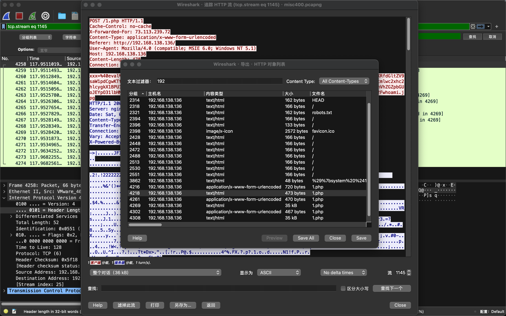
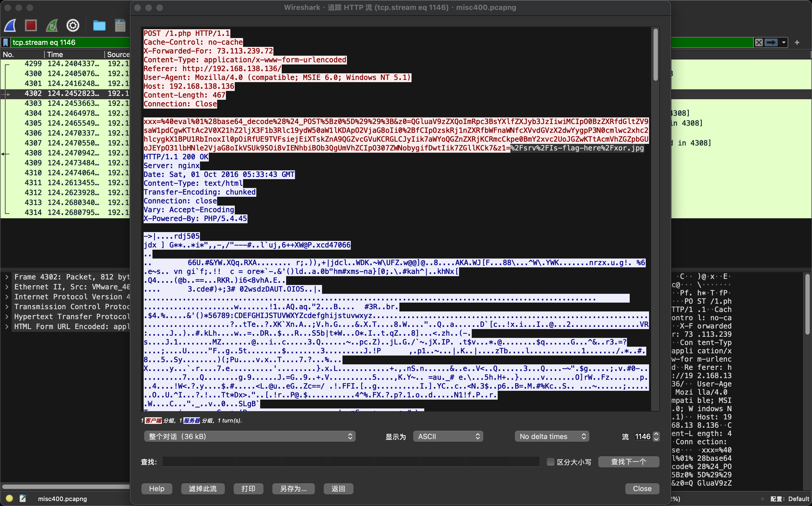
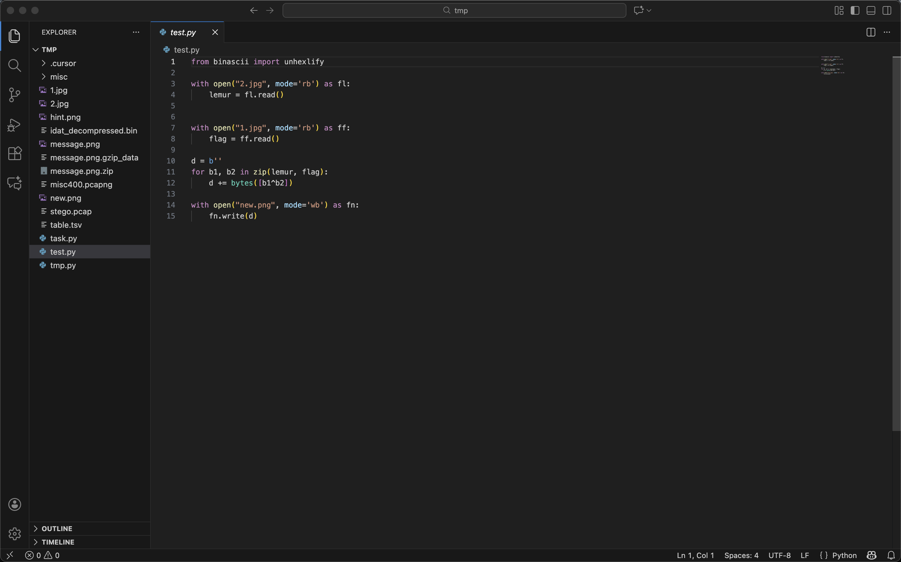
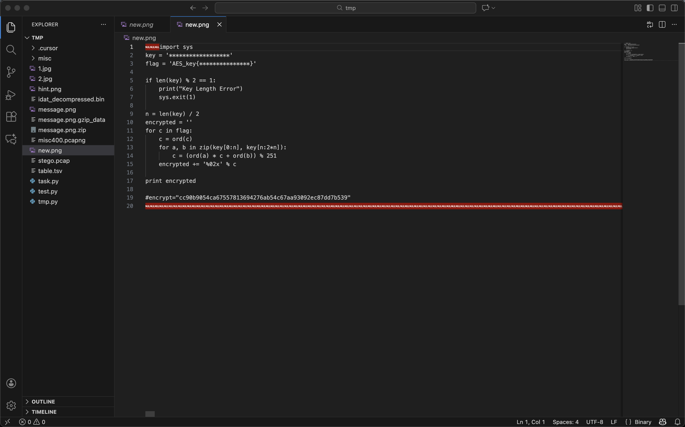
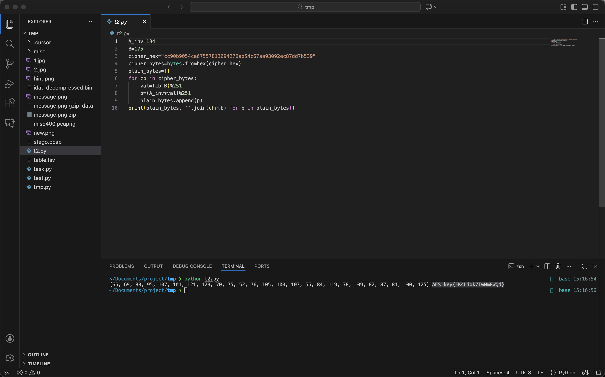

<!--more--> 
# 流量记录分析
通过统计分析发现192.168.138.x网段的数据包分组最多，协议多为HTTP协议。通过导出窗口过滤IP后发现存在可疑的1.php文件。



根据请求和经验分析，这是通过webshell上传文件的数据包，文件名提示了需要xor。



# XOR 图片
导出xor.jpg和whoami.jpg并编写脚本对两张图片进行XOR操作，生成new.png。

```shell
from binascii import unhexlify

with open("2.jpg", mode='rb') as fl:
    lemur = fl.read()
    

with open("1.jpg", mode='rb') as ff:
    flag = ff.read()

d = b''
for b1, b2 in zip(lemur, flag):
    d += bytes([b1^b2])

with open("new.png", mode='wb') as fn:
    fn.write(d)
```



使用文本编辑器直接查看new.png可以看到存在一段通过算法生成flag的程序。

```shell
import sys
key = '******************'
flag = 'AES_key{***************}'

if len(key) % 2 == 1:
    print("Key Length Error")
    sys.exit(1)

n = len(key) / 2
encrypted = 'cc90b9054ca67557813694276ab54c67aa93092ec87dd7b539'
for c in flag:
    c = ord(c)
    for a, b in zip(key[0:n], key[n:2*n]):
        c = (ord(a) * c + ord(b)) % 251
    encrypted += '%02x' % c

print encrypted

#encrypt="cc90b9054ca67557813694276ab54c67aa93092ec87dd7b539"
```



# 解密内容
解出过程：该循环等价于每个字符做一次线性变换 y = A*x + B (mod 251)，对密文前两字节与已知明文 A、E 建立方程，可得 A=236, B=175，其逆元 A^{-1}=184，解密公式 x = 184*(y-175) mod 251。逐字节还原得到：

flag: AES_key{FK4Lidk7TwNmRWQd}

```shell
A_inv=184
B=175
cipher_hex="cc90b9054ca67557813694276ab54c67aa93092ec87dd7b539"
cipher_bytes=bytes.fromhex(cipher_hex)
plain_bytes=[]
for cb in cipher_bytes:
    val=(cb-B)%251
    p=(A_inv*val)%251
    plain_bytes.append(p)
print(plain_bytes, ''.join(chr(b) for b in plain_bytes))
```



