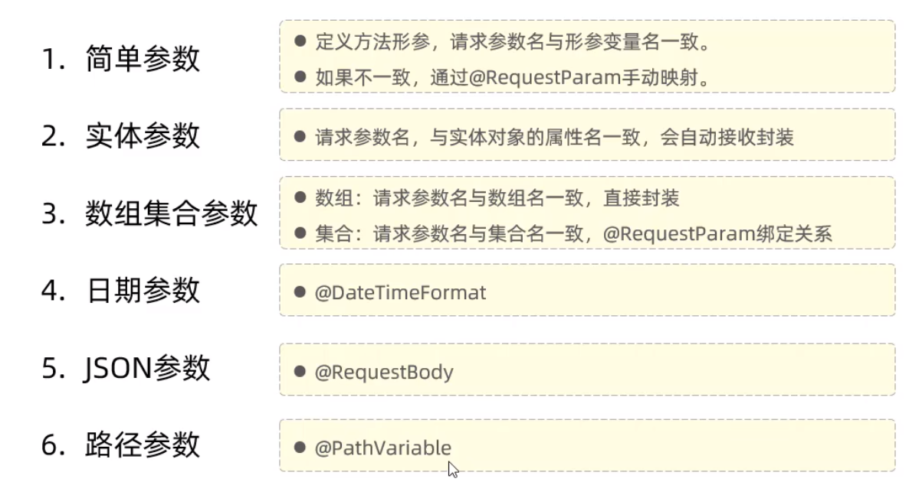
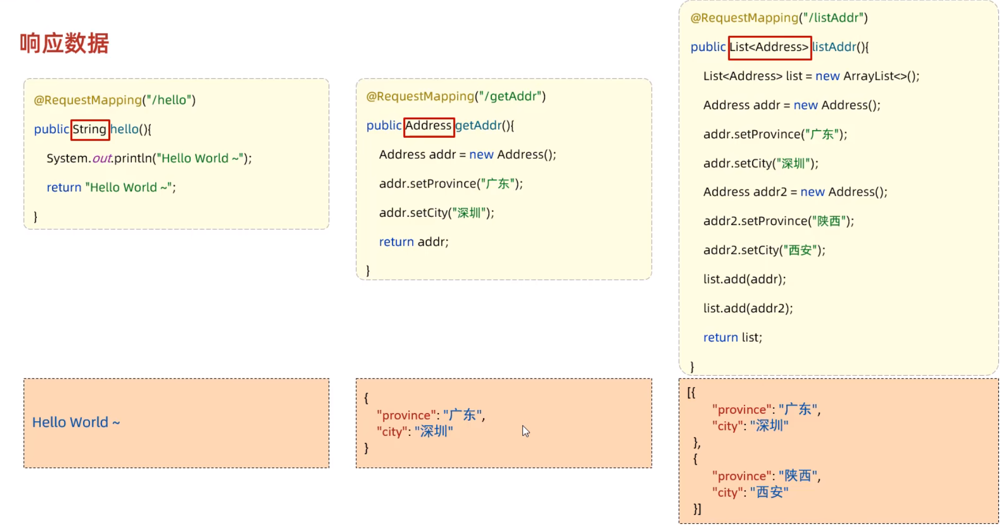
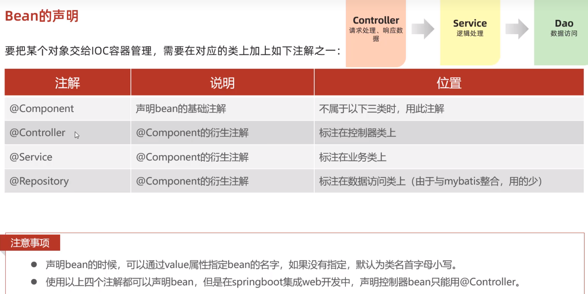
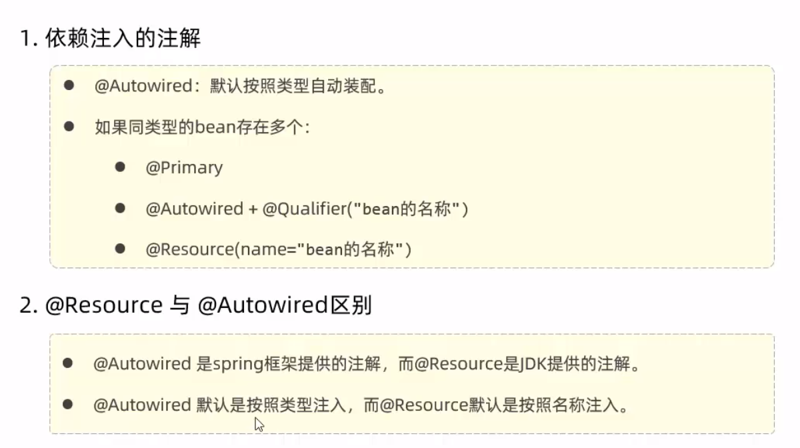
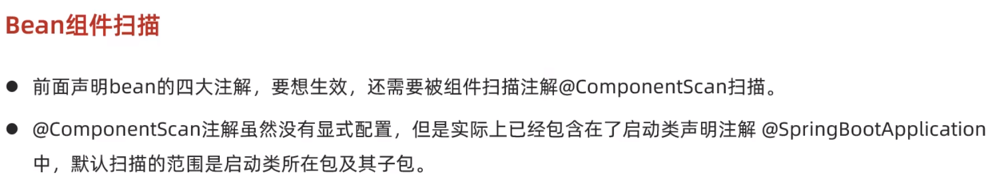
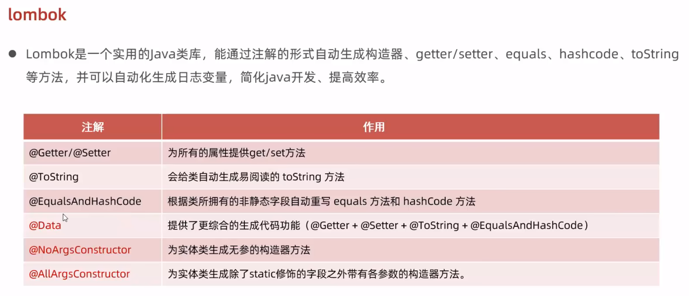
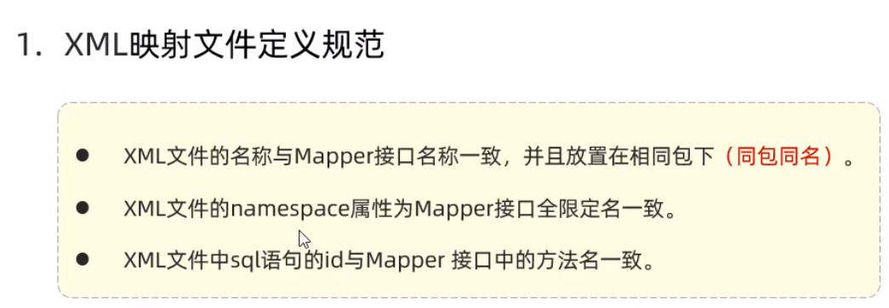
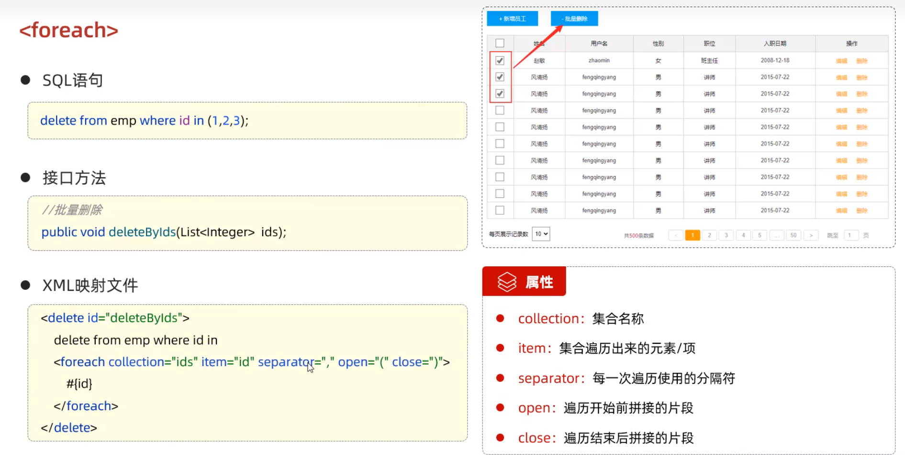

```java
@RestController
    public class HelloController {
        @RequestMapping("/hello")
        public String hello(){
            return "Hello world~!";
        }

        // 普通参数获取
        // http://localhost:8080/sayName?name=test
        @RequestMapping("/sayName")
        public String sayName(HttpServletRequest request){
            return request.getParameter("name");
        }

        // RequestParam 使用
        // http://localhost:8080/sayAge?age2=30
        @GetMapping("/sayAge")
        public int sayAge(@RequestParam(name = "age2", required = false, value = "20")int age){
            return age;
        }

        // POJO 参数获取
        // http://localhost:8080/sayUser?username=test&password=123&address.province=北京&address.city=北京
        // 出现报错 java.lang.NoSuchMethodException: com.range.pojo.Address.<init>()
        // 需要在 Address 实体类创建无参构造器
        @RequestMapping("/sayUser")
        public String sayUser(User user){
            return user.toString();
        }

        // 数组参数获取
        // http://localhost:8080/sayHobby?hobby=game&hobby=game1&hobby=game2
        @GetMapping("/sayHobby")
        public String sayHobby(String[] hobby){
            return Arrays.toString(hobby);
        }

        // List 封装数组参数获取
        // http://localhost:8080/sayHobby?hobby=game&hobby=game1&hobby=game2
        @GetMapping("/sayHobby2")
        public String sayHobby2(@RequestParam List<String> hobby){
            return Arrays.toString(hobby.toArray());
        }

        // 获取时间参数
        @GetMapping("/sayBirthday")
        public String sayBirthday(@DateTimeFormat(pattern = "yyyy-MM-dd HH:mm:ss")LocalDateTime birthday){
            return birthday.toString();
        }

        // 获取 json 格式数据
        // http://localhost:8080/newUser
        /*    {
    "username":"test",
    "password":"123456",
    "address": {
    "province": "北京",
    "city": "北京"
    }
}*/
        @PostMapping("/newUser")
        public String newUser(@RequestBody User user){
            return user.toString();
        }

        // 路径参数
        // http://localhost:8080/showPage/123
        @GetMapping("/showPage/{id}")
        public String showPage(@PathVariable String id){
            return id;
        }

        @GetMapping("/showController/**")
        public String showController(HttpServletRequest request){
            return request.getServletPath();
        }
    }
```


#  依赖注入



# Mybatis
[https://mybatis.net.cn/getting-started.html](https://mybatis.net.cn/getting-started.html)
**（PS: 关于数据库驱动版本的小知识，当connector版本是6.0以前的使用com.mysql.jdbc.Driver，6.0以后的使用com.mysql.cj.jdbc.Driver，我这边使用的是8.0.18版本的）**


实例：
```java
<?xml version="1.0" encoding="UTF-8" ?>
<!DOCTYPE mapper
  PUBLIC "-//mybatis.org//DTD Mapper 3.0//EN"
  "http://mybatis.org/dtd/mybatis-3-mapper.dtd">
<mapper namespace="org.mybatis.example.BlogMapper">
  <select id="selectBlog" resultType="Blog">
    select * from Blog where id = #{id}
  </select>
</mapper>
```

