<!--more--> 
# 0x00 前言
最近看到一篇审计的文章讲了如何巧妙的运用Windows 模式下 PHP 文件写入特性来绕过文件上传的安全校验。虽然提及的技术早在2018年就已经研究过了，但这些知识如今仍然广泛使用，值得我们花一些时间了解一下。

# 0x01 正文
## 1) 我们先来看效果
这是一个白名单正则校验文件后缀的文件上传接口，后缀必须包含图片格式且以图片格式开头，如`png`或者`pngbac`。

我们将正常的文件名`picture.png`修改成了`picture.png.php:.png`提示上传成功。

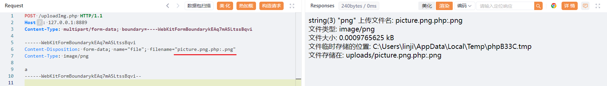

此时我们将文件写入进去了，但文件内容为空。

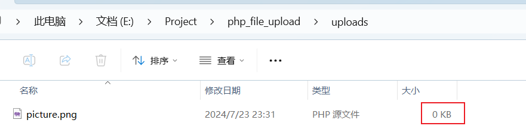

下一步，我们将文件名修改成`picture.png<<<`，再把文件内容修改成`<?= phpinfo();`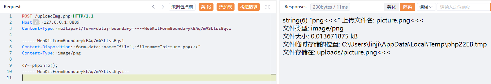

上传成功后，我们访问路径`uploads/picture.png.php`发现已经代码已经执行，说明通过这样的方式可以写入内容。

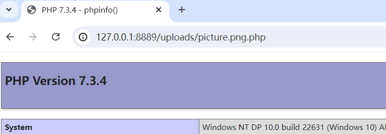

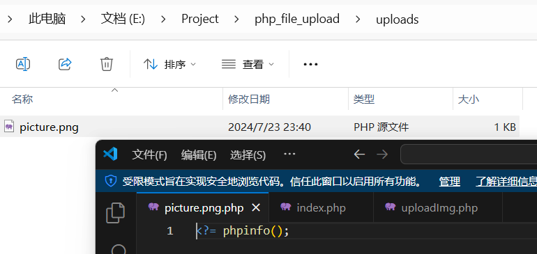

## 2）为什么会有这样的效果？
我们在很早以前就已经知道Windows下文件命名是有规则的。


在windows环境中，当创建的文件名中存在`:`时，文件名会被截断并生成空文件。这也就解释了我们通过修改文件名为`picture.png.php:.png`上传后，保存的文件名为`picture.png.php`但文件为0KB的原因。

我们后续也通过文件名修改`picture.png<<<`来达到文件写入目的而不被规则拦截的动作，为什么可以这样？我们直接说结论。

通过阅读[PHP源码调试之Windows文件通配符分析 - 先知社区](https://xz.aliyun.com/t/2004?time__1311=n4%2Bxni0%3DoQqWqDKDtQDs0f4Yw%2BBnDgmiDpmoD)这篇文章可以知道，以下通配符可以在模式字符串中使用：

● 大于号`>`相等于**通配符**问号`?`

● 小于号`<<`相当于**通配符**星号`*`

● 双引号`"`相等于**通配符匹配**字符点`.`

所以这个上传分为两个步骤：

1. 通过`:`上传后缀为`php`的文件，确保文件名后缀是PHP可以被解析。
2. 通过`<<<`作为通配符来匹配`picture.png*`（开头为picture.png的文件）写入恶意代码。

## 3）举一反三？
主要是通过改变输入的符号转换成通配符来判断匹配的效果。

> 以下摘抄[奇安信攻防社区-记某系统有趣的文件上传](https://forum.butian.net/share/2399)
>

<font style="color:rgb(36, 41, 47);">编写如下代码文件读取代码进行测试。</font>

```php
<?php
$file = @$_REQUEST['filename'];
$file_contents = @file_get_contents($file);
echo "匹配到的文件为：".$file_contents;
```

<font style="color:rgb(36, 41, 47);">在测试代码的同目录下创建六个内容为文件名称的文件。  
</font>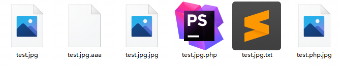<font style="color:rgb(36, 41, 47);">  
</font><font style="color:rgb(36, 41, 47);">使用</font>`<font style="color:rgb(199, 37, 78);">test.jpg<<<</font>`<font style="color:rgb(36, 41, 47);">进行匹配，果然先匹配到了</font>`<font style="color:rgb(199, 37, 78);">test.jpg</font>`<font style="color:rgb(36, 41, 47);">和</font>`<font style="color:rgb(199, 37, 78);">test.jpg.jpg</font>`<font style="color:rgb(36, 41, 47);">，从而导致给php文件写入失败。  
</font>`<font style="color:rgb(199, 37, 78);"><<</font>`<font style="color:rgb(36, 41, 47);">效果测试：  
</font><font style="color:rgb(36, 41, 47);">需要注意单个</font>`<font style="color:rgb(199, 37, 78);"><</font>`<font style="color:rgb(36, 41, 47);">无法正常匹配到结果，只有连着使用两个或两个以上</font>`<font style="color:rgb(199, 37, 78);"><</font>`<font style="color:rgb(36, 41, 47);">才有通配符</font>`<font style="color:rgb(199, 37, 78);">*</font>`<font style="color:rgb(36, 41, 47);">的效果。  
</font>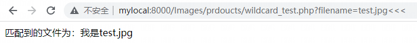<font style="color:rgb(36, 41, 47);">  
</font><font style="color:rgb(36, 41, 47);">删除</font>`<font style="color:rgb(199, 37, 78);">test.jpg</font>`<font style="color:rgb(36, 41, 47);">再次使用相同的参数请求，匹配到</font>`<font style="color:rgb(199, 37, 78);">test.jpg.aaa</font>`<font style="color:rgb(36, 41, 47);">  
</font>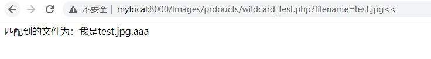<font style="color:rgb(36, 41, 47);">  
</font><font style="color:rgb(36, 41, 47);">删除</font>`<font style="color:rgb(199, 37, 78);">test.jpg.aaa</font>`<font style="color:rgb(36, 41, 47);">再次使用相同的参数请求，匹配到</font>`<font style="color:rgb(199, 37, 78);">test.jpg.jpg</font>`<font style="color:rgb(36, 41, 47);">  
</font><font style="color:rgb(36, 41, 47);">  
</font><font style="color:rgb(36, 41, 47);">删除</font>`<font style="color:rgb(199, 37, 78);">test.jpg.jpg</font>`<font style="color:rgb(36, 41, 47);">文件后再次使用</font>`<font style="color:rgb(199, 37, 78);">test.jpg<<<</font>`<font style="color:rgb(36, 41, 47);">进行匹配，成功获得</font>`<font style="color:rgb(199, 37, 78);">.php</font>`<font style="color:rgb(36, 41, 47);">文件  
</font>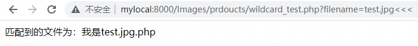<font style="color:rgb(36, 41, 47);">  
</font>**<font style="color:rgb(36, 41, 47);">对其他符号同样进行测试</font>**<font style="color:rgb(36, 41, 47);">  
</font>`<font style="color:rgb(199, 37, 78);">></font>`<font style="color:rgb(36, 41, 47);">效果测试：  
</font><font style="color:rgb(36, 41, 47);">单独</font>`<font style="color:rgb(199, 37, 78);">></font>`<font style="color:rgb(36, 41, 47);">可以匹配零个或一个字符，效果类似于通配符</font>`<font style="color:rgb(199, 37, 78);">?</font>`<font style="color:rgb(36, 41, 47);">，缺失多少拼接多少</font>`<font style="color:rgb(199, 37, 78);">></font>`<font style="color:rgb(36, 41, 47);">就可以匹配到对应的文件。  
</font>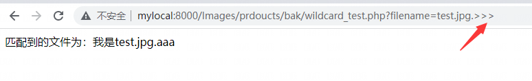<font style="color:rgb(36, 41, 47);">  
</font><font style="color:rgb(36, 41, 47);">但经过测试无法代替文件名中的字符</font>`<font style="color:rgb(199, 37, 78);">.</font>`<font style="color:rgb(36, 41, 47);">使用  
</font>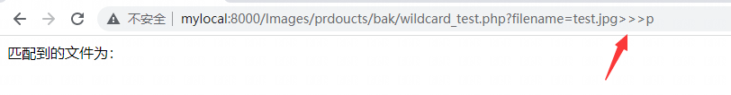<font style="color:rgb(36, 41, 47);">  
</font>`<font style="color:rgb(199, 37, 78);">"</font>`<font style="color:rgb(36, 41, 47);">效果测试：  
</font><font style="color:rgb(36, 41, 47);">符号</font>`<font style="color:rgb(199, 37, 78);">"</font>`<font style="color:rgb(36, 41, 47);">可以匹配到字符</font>`<font style="color:rgb(199, 37, 78);">.</font>`<font style="color:rgb(36, 41, 47);">。  
</font>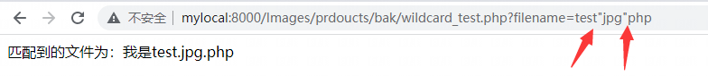

## 4）如何自行验证？
新建文件夹，在文件夹内新建`index.php`，内容如下：

```plain
<form action="/uploadImg.php" method="post" enctype="multipart/form-data">
     <input type="file" name="file" />
     <button type="submit" >上传</button>
</form>
```

在相同目录下新建`uploadImg.php`，内容如下：

```plain
<?php
// 允许上传的图片后缀
$allowedExts = array("gif", "jpeg", "jpg", "png");
$temp = explode(".", $_FILES["file"]["name"]);
$extension = end($temp);     // 获取文件后缀名
if ((($_FILES["file"]["type"] == "image/gif")
|| ($_FILES["file"]["type"] == "image/jpeg")
|| ($_FILES["file"]["type"] == "image/jpg")
|| ($_FILES["file"]["type"] == "image/pjpeg")
|| ($_FILES["file"]["type"] == "image/x-png")
|| ($_FILES["file"]["type"] == "image/png"))
&& ($_FILES["file"]["size"] < 204800)   // 小于 200 kb
&& preg_match('/^(jpg|jpeg|gif|png)/i', $extension))
{
    if ($_FILES["file"]["error"] > 0)
    {
        echo "错误：: " . $_FILES["file"]["error"] . "<br>";
    }
    else
    {
        $file_name = $_FILES["file"]["name"];
        echo "上传文件名: " . $file_name . "<br>";
        echo "文件类型: " . $_FILES["file"]["type"] . "<br>";
        echo "文件大小: " . ($_FILES["file"]["size"] / 1024) . " kB<br>";
        echo "文件临时存储的位置: " . $_FILES["file"]["tmp_name"] . "<br>";

        move_uploaded_file($_FILES["file"]["tmp_name"], "uploads/" . $file_name);
        echo "文件存储在: " . "uploads/" . $file_name;
    }
}
else
{
    echo "非法的文件格式";
}
?>
```

这是一个经典的文件上传，校验文件合法共有两处。

1. 校验`Content-Type`是否为`image/gif`、`image/jpeg`、`image/jpg`等
2. 校验文件后缀是否包含且以`jpg`、`jpeg`、`gif`等

然后再目录下面启动服务`php -S 127.0.0.1:8889`后，访问`http://127.0.0.1:8889`即可。

## 5）底层原因？
> 以下内容摘抄 [PHP源码调试之Windows文件通配符分析 - 先知社区](https://xz.aliyun.com/t/2004?time__1311=n4%2Bxni0%3DoQqWqDKDtQDs0f4Yw%2BBnDgmiDpmoD#toc-4)
>

根据`StackOverflow`上面的一个相关问题和MSDN的解释，这是`NtQueryDirectoryFile` / `ZwQueryDirectoryFile`通过`FsRtlIsNameInExpression`的一个功能特性，对于`FsRtlIsNameInExpression`有如下描述：

```plain
The following wildcard characters can be used in the pattern string.

Wildcard character  Meaning

* (asterisk)        Matches zero or more characters.

? (question mark)   Matches a single character.

DOS_DOT             Matches either a period or zero characters beyond the name
                    string.

DOS_QM              Matches any single character or, upon encountering a period
                    or end of name string, advances the expression to the end of
                    the set of contiguous DOS_QMs.

DOS_STAR            Matches zero or more characters until encountering and
                    matching the final . in the name.
```

另外，MSDN的解释并没有提到`DOC-*`具体指哪些字符，但根据`ntfs.h`，我们发现了如下的定义：

```plain
//  The following constants provide addition meta characters to fully
//  support the more obscure aspects of DOS wild card processing.

#define DOS_STAR        (L'<')
#define DOS_QM          (L'>')
#define DOS_DOT         (L'"')
```

总结：

+ 问题的产生的根本原因PHP调用了Windows API里的FindFirstFileExW()/FindFirstFile()方法
+ 该Windows API方法对于这个三个字符做了特别的对待和处理
+ 任何调用该Windows API方法的语言都有可能存在以上这个问题，比如：Python

