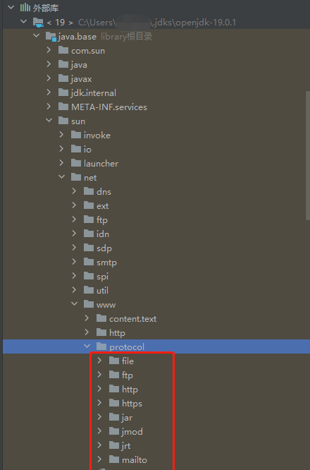

<!--more--> 
# 前言
电气鼠靶场系统包含了常见的漏洞案例，有提示和代码案例。初学者可以通过查询资料等方式通过关卡，在试炼的过程学习漏洞原理和代码审计。
为什么会想到编写电气鼠靶场系统呢？主要是以前入门的时候自己也搭过 pikachu 靶场进行练习。这是入门的好工具，使用的是 PHP 语言实现的。正巧我正在学习 Java 开发，脑子一热就开始编写这套系统。学Java半个月，编写这套系统也差不多花了半个月。
# 系统介绍
电气鼠靶场系统是一种带有漏洞的Web应用程序，旨在为Web安全渗透测试学习者提供学习和实践的机会。
通过在靶场系统上进行实际漏洞攻击和利用，学习者可以更好地理解和掌握Web安全渗透测试的技术和方法，以及如何保护Web应用程序免受攻击。靶场系统的实际攻击模拟也有助于学习者提高他们的安全意识，了解常见的攻击手段和漏洞利用方式，从而更好地保护他们自己和他们所负责的Web应用程序。
该靶场使用 Java 编写，使用 Tomcat + Mysql 的技术完成。可以通过 docker-compose 快速安装。
项目链接：[GitHub - linjiananallnt/ElectricRat: 电气鼠靶场系统是一种带有漏洞的Web应用程序，旨在为Web安全渗透测试学习者提供学习和实践的机会。](https://github.com/linjiananallnt/ElectricRat)
# 案例编写思路
靶场中的案例一定是符合目前Web安全检测的测试用例的。针对一些常见的漏洞进行案例编写，不仅是对漏洞本身进行的一个思考，也是对安全开发的一个思考。漏洞是怎么产生的？需要知根知底。
## XSS 漏洞
XSS（跨站脚本攻击）是一种常见的Web安全漏洞，攻击者可以通过注入恶意脚本代码，实现对用户的攻击。在Java Web开发中，以下业务代码可能存在XSS漏洞：

1.  表单提交和查询结果的显示：在表单提交和查询结果的显示中，用户输入的数据没有经过过滤，直接显示在页面上，攻击者可以通过注入恶意脚本代码实现攻击。解决办法是对用户输入的数据进行HTML编码，可以使用Java自带的工具类或者第三方库来实现。 
2.  URL参数的传递：如果使用URL传递参数，攻击者可以通过注入恶意脚本代码实现攻击。解决办法是对URL参数进行编码，可以使用Java自带的工具类或者第三方库来实现。 
3.  富文本编辑器：富文本编辑器中用户输入的内容可能包含HTML标签和脚本代码，攻击者可以通过注入恶意脚本代码实现攻击。解决办法是使用富文本编辑器自带的过滤器或者使用第三方库对用户输入的内容进行过滤。 
4.  JavaScript代码的编写：在编写JavaScript代码时，要注意防止XSS攻击，不要直接使用用户输入的数据作为JavaScript代码的参数，可以对用户输入的数据进行编码。 

XSS漏洞的原因是业务代码没有对用户输入的数据进行过滤和编码，攻击者可以通过注入恶意脚本代码实现攻击。为了防止XSS漏洞，需要在业务代码中对用户输入的数据进行过滤和编码。
XSS攻击可以达到不同的目的，但大致上有以下几种：

1. 窃取用户信息：攻击者可以通过注入恶意脚本代码获取用户的敏感信息，例如用户名、密码、Cookie等。
2. 欺骗用户：攻击者可以通过注入恶意脚本代码修改页面内容，伪装成合法的页面或者提供虚假的信息，从而欺骗用户。
3. 利用用户权限进行恶意操作：攻击者可以通过注入恶意脚本代码获取用户的权限，例如通过获取管理员的权限进行恶意操作。
4. 传播病毒：攻击者可以通过注入恶意脚本代码，在用户访问网页时传播病毒。
### 开发思路
XSS攻击最终是在游览器客户端展示，其本身与HTML和JS息息相关。根据后端渲染、前后端分离、前端渲染的三种情况，也有不同的XSS展示效果。
一种是前后端分离，在请求接口后返回的响应包设置了`ContentType`为`text/html`那么极有可能会产生漏洞。在实战中一般是 Jsonp 回调接口处会出现这种情况：
```
http://xxx.xxxx.xxx/?callback=jQuery11130014313909482240961_1561597612526&lastpagetime=1559829276&_=1561602219158
```
这里的 `callback` 是可控的。一旦我们设置了返回数据包内容类型为`text/html`那么将会导致XSS反射型漏洞的产生。
```
response.setContentType("text/html;charset=utf-8");
```
还有一种是后端渲染的情况。使用 JSP 或者其他模板语言引擎。例如：Thymeleaf、Velocity、FreeMarker。
一般的JSP输出变量到HTML的写法可以这么写：
```
<% String msg = request.getParameter('msg'); %>
<%=msg%>
```
其他的模板语言有不同的写法，但只要是没有经过过滤直接输出到HTML页面中去的，游览器解析后就会造成XSS攻击。
最后一种是前端渲染。有很多业务都可以使用前端完成，如今有很多前端的开发框架例如：React、Vue、Angular。尽管十分推荐使用类似`innerText`的方式显示数据，但会存在某些业务上无法避免的使用类似`innerHTML`的方法显示数据，一旦没有做好足够严格的数据校验，那么将会产生XSS漏洞。
```
function generateNote(mes){
    return `<div class="callout callout-info">
              <h5><i class="fas fa-info"></i> Note:</h5>${mes}</div>`;
}
function submitText(){
    $("#notice")[0].innerHTML = generateNote("我不在乎你输入的是什么，就算是：" + $("#own-text")[0].value)
  }
```
我开发时没有选择使用框架，直接使用了原生JS ES6语法拼接字符串，并且大量使用`innerHTML`属性。
如果想要减少XSS攻击的产生，我们可以使用`StringEscapeUtils`工具对用户输入的内容进行转义。
代码来源：`com/pika/electricrat/xss/dto/XssServlet.java`
```
public void getMarkData(HttpServletRequest request, HttpServletResponse response) throws IOException {
    String content = request.getParameter("content");
    response.setContentType("text/html;charset=utf-8");
    response.getWriter().write("我不在乎你输入的是什么，就算是：" + StringEscapeUtils.escapeHtml(content));
}
```
## 暴力破解
暴力破解（Brute Force）是黑客常用的一种密码破解方法，其基本思想是不断尝试所有可能的密码组合，直到找到正确的密码为止。通常，黑客会使用自动化的脚本或工具来进行暴力破解攻击，从而加快密码破解的速度。
具体来说，暴力破解攻击通常通过以下步骤实现：

1. 枚举可能的密码：黑客会根据目标账户的相关信息，如用户名、生日、常用词汇等，生成一份可能的密码字典。
2. 尝试所有可能的密码组合：黑客会使用自动化的工具，逐个尝试所有可能的密码组合，直到找到正确的密码为止。
3. 破解成功：一旦黑客找到了正确的密码，就可以使用该密码访问目标账户，进而窃取敏感信息或者进行其他恶意行为。
### 开发思路
为了防止暴力破解攻击，通常采取以下措施：

1. 强密码策略：要求用户设置复杂度较高的密码，如长度大于8个字符、包含大小写字母、数字和特殊字符等。
2. 密码锁定策略：如果用户多次输入错误密码，可以暂时锁定用户账户，防止暴力破解攻击。
3. 多因素认证：除了密码，还需要使用其他身份验证方式，如短信验证码、指纹识别、硬件令牌等，增加攻击者的破解难度。
4. 安全监控和报警：对于异常的登录行为，及时进行监控和报警，以便尽早发现并阻止攻击行为的发生。

上面四种防御手段的维度都有所不同。主要在多因素认证上百花齐放，不同的网站采用不同的因素认证。比较常见的有以下几种，即包括但不限于。

1. 图片验证码：常用于用户注册、登录等场景，要求用户输入图片中的验证码。
2. 隐藏域验证码：将一个随机字符串放在表单中的一个隐藏域中，提交表单时验证字符串是否正确。
3. 图片滑块验证码：将一张图片分成若干块，要求用户将某一块拖动到指定位置。
4. 声音验证码：要求用户听取一段语音，并输入语音中的验证码。

**图片验证码**
在开发中，主要实现了图片验证码和隐藏域验证码的功能。尽管图片验证码的作用十分有效，但我们仍然需要考虑到一些因素，例如图片验证码的不刷新、不过期或短期不过期、如果验证码生成算法不够复杂，可能被破解。如果验证码是纯数字或字母，可以使用机器学习等技术进行破解。
代码来源：`com/pika/electricrat/burteforce/dto/UserServlet.java`
```
public Boolean verificationImageCodeEasy(String text){
    ImageCodeEntity entity = new ImageCodeEntity(text);
    ImageCodeEntity res = icd.find(entity);
    return res != null;
}
```
代码来源：`com/pika/electricrat/burteforce/dao/Impl/ImageCodeDaoImpl.java`
```
@Override
public ImageCodeEntity find(ImageCodeEntity entity) {
    try{
        String sql = "select * from " + entity.getSqlTableName() + " where text=?";
        return jt.queryForObject(sql, new BeanPropertyRowMapper<>(ImageCodeEntity.class), entity.getText());
    }
    catch (Exception e){
        e.printStackTrace();
        return null;
    }
}
```
这里我直接从数据库中通过验证码作为条件语句查询，如果查询到就通过，也就是说一旦生成的验证码足够多，就会导致验证码无效。所以我设置，每次获取验证码时都会清除已过期的验证码，验证码有效期5分钟。一般来说，图片验证码没有有效期——它是一次性的，所以你可以在这5分钟内进行暴力破解。
**隐藏域验证码**
实现思路是，生成随机的Token返回在页面中，提交登录请求的时候携带提交。Token生成在Session中，通过和用户输入的Token进行对比就能防止接口重发。但实际来说，使用Burp可以做到先获取Token再做登录行为，达到暴力破解的目的。
代码来源：`com/pika/electricrat/burteforce/dto/UserServlet.java`
```
// 登录时对比用户输入的Token
@Api({RequestMethodType.POST})
public Map<?, ?> loginWithToken(HttpServletRequest request, HttpServletResponse response){
    String username = request.getParameter("username");
    String password = request.getParameter("password");
    String token = request.getParameter("token");
    HttpSession session = request.getSession();
    String v_token = session.getAttribute("token") != null ? String.valueOf(session.getAttribute("token")) : null;
    HashMap<String, Boolean> data = new HashMap<>();
    if (token == null || !token.equals(v_token)){
        data.put("VerificationStatus", false);
        return data;
    }
    session.removeAttribute("token");
    data.put("VerificationStatus", true);
    data.put("loginStatus", udi.login(username,password));
    return data;
}

// 获取Token
@Api({RequestMethodType.GET})
public Map<?, ?> getToken(HttpServletRequest request, HttpServletResponse response){
    String token = udi.getVerificationToken();
    HttpSession session = request.getSession();
    session.setAttribute("token", token);
    HashMap<String, String> data = new HashMap<>();
    data.put("token", token);
    return data;
}
```
其中`session.removeAttribute("token");`说明了，校验完Token后，该Token会被销毁。但如果攻击者能够获得表单的源代码，可以轻松获取隐藏域中的字符串，并提交伪造的表单。
## CSRF（跨域请求伪造）
CSRF（跨站请求伪造）攻击可能会导致攻击者获得您提供给用户的登录凭据。在CSRF攻击中，攻击者通过欺骗受害者浏览器发起一个跨站请求，该请求利用了受害者当前的登录状态并向攻击者指定的URL发送了一个请求。
CSRF漏洞可以导致用户的账户被劫持，或者攻击者可以执行不被授权的操作，例如更改用户密码、删除数据等。
有朋友可能会问，为什么不再写一个关于CORS漏洞的，CORS（跨来源资源共享）和CSRF（跨站请求伪造）是两种完全不同的安全问题。
实际上，虽然这两个漏洞有共同点，但利用的场景不一样。其中CORS更多的是配合未授权API接口获取敏感信息等，而CSRF携带用户令牌（Cookie）能做的操作会比CORS更多。
### 开发思路
常见防御CSRF的手段：

1. 验证来源站点，服务器端对每个请求进行来源站点验证，只允许来自指定站点的请求通过。
2. 添加token验证，在请求参数或者HTTP头中添加一个token，用于验证请求的合法性。

**验证来源站点**
一般使用referer和origin两种方式来验证。但是，referer易被篡改或者不可靠，而origin可以被使用者自由伪造，因此单独使用这种方式可能存在被绕过的风险。
在开发过程中并没针对这两个头进行限制，但做了用户登录状态校验。
代码来源：`com/pika/electricrat/csrf/dto/UserInfoServlet.java`
```
@Api({RequestMethodType.POST, RequestMethodType.GET})
public Map<?, ?> editInfo(HttpServletRequest request, HttpServletResponse response) throws ServletException, IOException {
    HashMap<String, Object> map = checkLogin(request, response);
    boolean isLogin = (boolean) map.get("loginStatus");

    HashMap<String, Object> data = new HashMap<>();
    data.put("loginStatus", isLogin);
    if (!isLogin) return data;
    String phone = request.getParameter("phone");
    String address = request.getParameter("address");
    UserEntity user = (UserEntity) map.get("user");
    data.put("updateStatus", uisi.updateByUserId(user.getId(),phone,address));
    return data;
}
```
**添加token验证**
需要保证token的随机性和复杂性，以避免被猜测或者攻击者伪造token。
这里跟暴力破解防御中的隐藏域验证码类似，都是通过接口获取到前端，请求时携带到后端进行校验。不过于之不同的是，暴力破解的token验证后会被销毁，而这里的我校验后并没有销毁。而 Session 设置了30分钟过期，也就是说你可以在30分钟内进行CSRF攻击。
代码来源：`com/pika/electricrat/csrf/dto/UserInfoServlet.java`
```
@Api({RequestMethodType.POST, RequestMethodType.GET})
public Map<?, ?> editInfoWithToken(HttpServletRequest request, HttpServletResponse response) throws ServletException, IOException {
    String token = request.getParameter("csrf_token");
    HttpSession session = request.getSession();
    String v_token = session.getAttribute("csrf_token") != null ? String.valueOf(session.getAttribute("csrf_token")) : null;
    HashMap<String, Boolean> data = new HashMap<>();
    if (token == null || !token.equals(v_token)){
        data.put("VerificationStatus", false);
        return data;
    }
    return editInfo(request,response);
}
```
## SQL 注入
SQL注入（SQL Injection）是一种常见的Web安全漏洞，攻击者通过利用应用程序没有对用户输入进行充分验证的缺陷，将恶意的SQL语句注入到后端数据库中，从而导致数据库的数据被窃取、篡改、破坏等风险。
通常，SQL注入攻击发生的原因是开发人员没有对用户输入的数据进行充分验证或过滤，或者使用了不安全的SQL查询方法。攻击者可以通过输入特定的字符串或符号来欺骗程序，从而注入恶意的SQL语句。
### 开发思路
SQL注入真是老生常谈。目前防御SQL注入的手段最有效的还是预编译，当然预编译也不是万能的，大致上有这些防御SQL注入的方式。

1. 使用参数化的SQL语句或预编译语句。
   - 这种方法可以避免直接拼接SQL语句，有效防止SQL注入攻击。但是如果参数不正确地传递，仍可能导致SQL注入漏洞。
2. 对用户输入进行过滤和验证。
   - 这种方法可以检查输入数据的格式、类型、长度等是否符合要求，避免恶意输入攻击，但是需要保证过滤和验证的严格性。
3. 使用ORM框架。
   - ORM框架可以把对象与数据库表映射起来，自动生成SQL语句，有效地避免手写SQL带来的漏洞。但是ORM框架的质量和使用方式也需要谨慎考虑。
4. 限制数据库用户的权限。
   - 把数据库用户权限限制在最小范围内，避免恶意用户获取敏感数据。但是如果数据库被攻破，仍有可能导致数据泄露。
5. 避免把错误信息暴露给用户。
   - 在出现异常或错误时，不要把详细信息直接暴露给用户，避免攻击者利用这些信息进行注入攻击。但是错误信息的处理也需要及时，以便开发人员快速定位和修复问题。
6. 对重要数据进行加密存储。
   - 对于重要数据，采用加密存储的方式，即使数据库被攻破也不容易泄露敏感信息。但是加密的算法和密钥管理也需要谨慎考虑。
7. 定期对数据库进行安全审计。
   - 定期对数据库进行安全审计，检查是否存在异常或漏洞，及时修复问题，保证系统的安全性。但是需要保证审计的全面性和严格性。

Java中执行SQL语句的方式大致有以下几种：

1. 使用 JDBC 的 `java.sql.Statement`执行SQL语句。
2. 使用 JDBC 的 `java.sql.PreparedStatement`执行SQL语句。
3. 使用 Hibernate 的 `createQuery`执行SQL语句。
4. 使用 MyBatis 映射执行SQL语句。

Hibernate 默认会将所有传入的参数使用 JDBC 的 PreparedStatement 进行预编译，从而防止 SQL 注入攻击。
```
Query query = session.createQuery("FROM User WHERE username = :username");
query.setParameter("username", username);
List<User> users = query.list();
```
MyBatis 则是通过编写映射文件，在映射的语句中使用`${}`和`#{}`来设置变量输出的位置。其中`#{}`的底层也是使用 JDBC 的 PreparedStatement 进行预编译。而`${}`则是直接输出变量，类似于字符拼接从而导致SQL注入。
JDBC 的 PreparedStatement 会自动将 SQL 中的占位符`?`替换成预编译后的参数，使用参数化的方式执行 SQL。下面是预编译的例子。
```
String sql = "SELECT * FROM users WHERE username = ? AND password = ?";
PreparedStatement stmt = connection.prepareStatement(sql);
stmt.setString(1, username);
stmt.setString(2, password);
ResultSet rs = stmt.executeQuery();
```
尽管预编译非常好用，但在SQL语句中不能使用单引号的地方往往不能使用预编译。例如 `order by`，这些地方没有过滤就有可能存在SQL注入风险。并且预编译不会对模糊查询中的两个通配符，`%`和`_`做转义，没有过滤的话很有可能导致恶意模糊查询。
如果使用`Statement`的方式，那么将没有预编译，通常是使用字符拼接的方式执行SQL语句，在开发过程中，我大量使用了`Statement.executeQuery`方法，如果不对用户输入的内容自行做过滤，那么不可避免的会导致SQL注入的产生。
代码来源：`com/pika/electricrat/sqli/dao/UserGbkDaoImpl.java`
```
// 查询，字符串拼接
public HashMap<String, Object> findUserById(String id){
    return query("select * from sys_account where id=" + id);
}
// 直接使用 executeQuery 执行SQL语句，没有过滤。
public HashMap<String, Object> query(String sql){
    System.out.println(sql);
    HashMap<String, Object> data = new HashMap<>();
    try {
        ResultSet rs = s.executeQuery(sql);
        rs.next();
        data.put("id", rs.getInt("id"));
        data.put("username", rs.getString("username"));
        data.put("msg", "ok");
    } catch (SQLException e){
        e.printStackTrace();
        data.put("msg", e.getMessage());
    }
    return data;
}
```
值得一提的是参考了【BJDCTF 2020】简单注入，我过滤了单引号，转义成`\'`。
代码来源：`com/pika/electricrat/sqli/dao/UserGbkDaoImpl.java`
```
public HashMap<String, Object> findUserFilter(String username, String password){
    username = username.replaceAll("'+", "\\\\'");
    password = password.replaceAll("'+", "\\\\'");
    return query("select * from sys_account where username='" + username + "' and password='" + password + "'");
}
```
## RCE 远程命令执行
Java RCE（Remote Code Execution）命令执行漏洞指的是通过Java应用程序漏洞，攻击者可以在受害者服务器上执行恶意代码的安全漏洞。攻击者可以通过向Java应用程序发送精心构造的恶意请求，绕过应用程序的身份验证和授权机制，最终在服务器上执行任意命令。
该漏洞的产生原因主要是Java应用程序在处理用户输入时，没有对输入数据进行充分的验证和过滤。攻击者可以通过构造精心制作的请求，绕过应用程序的安全控制，从而在服务器上执行恶意代码。
### 开发思路
在Java中，可以执行系统命令的方法有以下几种：

1. Runtime类的exec()方法

这是Java最基本的执行系统命令的方法，通过Runtime.getRuntime().exec(command)可以执行指定的系统命令。

2. ProcessBuilder类

这是一个更加高级的执行系统命令的方式，它提供了更多的控制和配置选项，例如设置工作目录、环境变量等。
通过ProcessBuilder可以构建一个包含系统命令及参数的列表，然后执行该命令。相比于Runtime类的exec()方法，ProcessBuilder提供了更多的安全保障。ProcessBuilder的命令执行漏洞更好实现，如下所示：
```
String ip = request.getParameter("ip");
ProcessBuilder pb = new ProcessBuilder("ping", "-t", "3", ip);
Process p = pb.start();
```
 Runtime.getRuntime().exec 方法，它有很多不同的执行方式。其中用的比较多的有两种：

1. 作为字符串传入

`Runtime.getRuntime().exec(String command)`

2. 作为字符串数组传入

`Runtime.getRuntime().exec(String[] command)`
第一种方式会经过`StringTokenizer`进行处理，将会改变我们原来的语言，导致命令无法执行。第二种就直接调用 ProcessBuilder 来执行命令了，具体就跟上面给出的实例代码一直。具体其中的不同之处请师傅自行搜索了解，这里不再赘述了。
总之，为了能够成功演示，我使用了`/bin/sh`作为基础文件，保证后面传入的数据被当作参数也能够正常运行。
代码来源：`com/pika/electricrat/rce/RceServlet.java`
```
@Api({RequestMethodType.POST})
public Map<?, ?> cmd(HttpServletRequest request, HttpServletResponse response) throws ServletException, IOException, InterruptedException {
    String command = request.getParameter("cmd");
    HashMap<String, Object> data = new HashMap<>();
    data.put("data", execCmd(command));
    return data;
}

@Api({RequestMethodType.POST})
public Map<?, ?> ping(HttpServletRequest request, HttpServletResponse response) throws ServletException, IOException, InterruptedException {
    String ip = request.getParameter("ip");
    HashMap<String, Object> data = new HashMap<>();
    data.put("data", execCmd("ping -c 4 " + ip));
    return data;
}

public static String execCmd(String cmd) throws IOException, InterruptedException {
    List<String> bash_cmd = new ArrayList<>();
    bash_cmd.add("/bin/sh");
    bash_cmd.add("-c");
    bash_cmd.add(cmd);
    Process p = Runtime.getRuntime().exec(bash_cmd.toArray(new String[bash_cmd.size()]));
    InputStream is = p.getInputStream();
    BufferedReader reader = new BufferedReader(new InputStreamReader(is, StandardCharsets.UTF_8));
    String line;
    StringBuilder text = new StringBuilder();
    while((line = reader.readLine())!= null){
        text.append(line).append("\n");
    }
    p.waitFor();
    is.close();
    reader.close();
    p.destroy();
    return text.toString();
}
```
## URL跳转漏洞
URL跳转漏洞（Open Redirect漏洞）指的是Web应用程序中的一种安全漏洞，攻击者可以利用这种漏洞将用户重定向到恶意网站。
攻击者可以通过构造一个特定的URL，将其伪装成合法的跳转链接，欺骗用户点击跳转链接，最终将用户重定向到恶意网站，从而实施钓鱼、欺诈等攻击行为。例如，攻击者可以伪造一个银行登录页面，让用户输入账号和密码，从而窃取用户的银行账号和密码。
### 开发思路
URL跳转漏洞通常发生在Web应用程序中的跳转功能上。开发人员没有对跳转的URL进行充分的验证和过滤，导致攻击者可以通过修改URL的参数，伪造跳转链接，最终将用户重定向到恶意网站。
在URL跳转这个实现上面，前端和后端都能实现。后端实现的话可以使用设置301/302状态码和`Location`头的方式实现跳转。
```
response.setStatus(301);
response.setHeader("Location", request.getParameter("url"));
```
也可以使用`sendRedirect`进行跳转。
```
response.sendRedirect(request.getParameter("url"));
```
前端实现起来会方便很多。直接修改`window.location.href`属性即可，也没有做其他的过滤。
代码来源：`src/main/webapp/pages/urlredirect/urlredirect.html`
```
function goUrl(){
  window.location.href = $("#url")[0].value;
}
```
## 任意文件上传
任意文件上传漏洞是一种Web应用程序安全漏洞，攻击者可以利用此漏洞将任意文件上传到服务器上，从而实现攻击目的。攻击者通常可以上传包含恶意代码的Web Shell、病毒、木马程序等恶意文件，通过这些文件进行远程控制、信息窃取、篡改网站内容、网站挂马等攻击行为。
任意文件上传漏洞通常是由于Web应用程序的开发人员没有对上传的文件类型和文件大小进行充分的验证和过滤所致。攻击者可以通过修改上传的文件类型、伪造上传的文件头等方式绕过验证，上传任意类型和大小的文件。一旦攻击者上传了恶意文件，他们就可以在服务器上执行任意的命令，并获得系统权限，这将给Web应用程序带来严重的安全威胁。
### 开发思路
通常我们上传文件会特别关注以下几个方面：

1. 文件类型校验：根据文件后缀名或者文件头（magic number）判断文件类型，只接受安全的文件类型（**白名单**），如图片、PDF、文本等，拒绝危险的文件类型，如可执行文件等。
2. 文件大小校验：限制文件大小，避免上传过大的文件。
3. 文件名校验：防止上传包含危险字符的文件名，如 ../ 等。**对文件进行重命名**。
4. 文件内容校验：对于上传的文件，可以对其内容进行检查，如通过杀毒软件进行检查，避免上传带有病毒的文件。

除此之外还有其他防范的操作。

- 文件下载时不提供文件名，只提供文件随机生成的ID。
- 全站不解析JSP、JSPX等可以解析对象的文件。
- 上传文件目录低权限、网站运行权限低权限等。
> 题外话，如果不校验文件内容，那么必须考虑文件包含漏洞存在的情况。

在开发时，我列举了前端检测后缀、后端检测MIME Type、后端检测后缀黑名单的情况。Tomcat10版本已经不使用`ServletFileUpload`而是使用`request.getPart`即可根据 name 获取文件。
代码来源：`com/pika/electricrat/unsafeupload/dto/UploadServlet.java`
```
// 后端检测MIME Type
@Api({RequestMethodType.POST})
public Map<?, ?> imageMIME(HttpServletRequest request, HttpServletResponse response) throws ServletException, IOException {
    Part file = request.getPart("image_file");
    for(String i : FileServerImpl.IMAGE_FILE_TYPE){
        if (file.getContentType().equals("image/"+i)){
            return uploadFile(file, uploadPath(request));
        }
    }
    HashMap<String, Object> data= new HashMap<>();
    data.put("uploadStatus", false);
    return data;
}

// 后端检测后缀黑名单
@Api({RequestMethodType.POST})
public Map<?, ?> imageBlackList(HttpServletRequest request, HttpServletResponse response) throws ServletException, IOException {
    Part file = request.getPart("image_file");
    String fileName = file.getSubmittedFileName();
//        String suffixName = fileName.substring(fileName.lastIndexOf(".")).toLowerCase();
    String suffixName = fileName.substring(fileName.lastIndexOf("."));
    System.out.println(suffixName);
    for(String i : FileServerImpl.BLACK_FILE_TYPE) {
        if (suffixName.equals(i)){
            HashMap<String, Object> data= new HashMap<>();
            data.put("uploadStatus", false);
            return data;
        }
    }
    return uploadFile(file, uploadPath(request));
}

// 上传文件
private HashMap<String, Object> uploadFile(Part imageFile,String filePath){
    HashMap<String, Object> data= new HashMap<>();
    try {
        String fileName = imageFile.getSubmittedFileName();
        long fileSize = imageFile.getSize();
        if(fileSize > FileServerImpl.MAX_FILE_SIZE){data.put("uploadStatus", false);return data;}
        String fileType = imageFile.getContentType();

        File file = new File(filePath);
        if (!file.exists() && !file.isDirectory()){
            file.mkdir();
        }

        imageFile.write(filePath+"\\"+fileName);
        HashMap<String, Object> fileObject = fsi.uploadFile(new FileEntity(fileName, fileType, (filePath+"\\"+fileName),
                System.currentTimeMillis(), fileSize, (new ImageVerificationCode()).GetRandom(8)));
        if (fileObject.isEmpty()){
            data.put("uploadStatus", false);
            return data;
        }
        data.put("file", fileObject);
        data.put("uploadStatus", true);
    } catch (Exception e){
        data.put("uploadStatus", false);
        data.put("msg", e.getMessage());
    }
    return data;
}
```
后端检测MIME Type，可以抓包轻松修改。后端检测后缀黑名单出问题的是忽略了大小写。
`String suffixName = fileName.substring(fileName.lastIndexOf("."));`
这句话本身是获取后缀，但对比时没有考虑到大小写。从下方的`BLACK_FILE_TYPE`可以看出，我们只需要修改后缀为`.jSp`就能绕过。
代码来源：`com/pika/electricrat/unsafeupload/bo/Impl/FileServerImpl.java`
```
public static final String[] IMAGE_FILE_TYPE = {"png", "jpg", "gif"};
public static final String[] BLACK_FILE_TYPE = {".html", ".htm", ".phtml", ".jsp", ".jspa", ".jspx", ".jsw", ".jsv", ".jspf", ".jtml"};
```
还有一种经典的文件上传后缀黑名单检测不严格造成的任意文件上传。它的代码和上面的很相似，只是将`lastIndexOf`换成了`IndexOf`
`String suffixName = fileName.substring(fileName.IndexOf("."));`
也就是说我们只需要将后缀改成`.jpg.jsp`即可绕过黑名单的检测。
## 目录遍历（穿越）
目录遍历漏洞，也称为目录穿越漏洞，是一种常见的Web应用程序安全漏洞，攻击者可以利用此漏洞获取目标服务器上的敏感信息或者执行任意代码。目录遍历漏洞的原理是，攻击者通过修改Web应用程序中的URL，来访问Web服务器上的非授权目录。
攻击者通常通过在URL中添加"../"等目录遍历符号，来访问目标服务器上的上层目录，从而绕过Web应用程序的访问控制，访问Web服务器上的敏感文件和目录，例如/etc/passwd、/etc/shadow等系统文件，以及Web应用程序的配置文件、数据库文件、源代码等敏感信息。
### 开发思路
为了充分的演示，我编写了一个经典的业务逻辑代码——任意文件下载。造成这个漏洞的根本原因是对用户输入的`fileName`没有充分的过滤，直接进行路径拼接。我们除了修改成任意文件名之外，还可以使用`../`访问上层目录文件。
`FileInputStream in = new FileInputStream(uploadPath(request) + "\\" + fileName);`
代码来源：`com/pika/electricrat/dir/FileActionServlet.java`
```
public void getFile(HttpServletRequest request, HttpServletResponse response){
    String fileName = request.getParameter("fileName");
    String suffix = fileName.substring(fileName.lastIndexOf('.'));
    response.setHeader("content-disposition", "attachment;filename=" + ((new ImageVerificationCode()).GetRandom(10) + suffix));
    try {
        FileInputStream in = new FileInputStream(uploadPath(request) + "\\" + fileName);
        ServletOutputStream out = response.getOutputStream();
        byte[] buffer = new byte[1024];
        int length=-1;
        while((length=in.read(buffer))!=-1) {
            out.write(buffer, 0, length);
        }
        in.close();
        out.close();
    } catch (Exception e){
        e.printStackTrace();
    }
}
```
为了防范目录遍历漏洞，我们可以做以下几点：

1. 过滤`./`和`../`这些特殊符号。
2. 采用随机字符串ID方式下载文件。
3. 对目录进行最小权限配置。
4. 路径后拼接后缀，比如说知道下载的一定是图片，那么就在路径后缀添加`.jpg`防止逃逸。（高效）
## XXE（XML实体注入）
XXE漏洞是指XML外部实体注入漏洞（XML External Entity Injection），它是一种Web应用程序安全漏洞，可以让攻击者利用XML解析器漏洞，读取服务器上的任意文件，执行远程请求等恶意操作。
通常，攻击者会在XML文档中注入恶意的外部实体引用，这些实体引用包含了恶意代码，一旦被服务器解析执行，就会执行相应的操作，例如访问敏感数据、上传恶意文件等。攻击者可以通过修改HTTP请求中的XML数据来触发XXE漏洞。
防范XXE漏洞的措施包括：

1. 不要信任来自外部的XML数据，对用户输入的XML数据进行严格的输入验证和过滤，包括对实体引用进行白名单或黑名单限制。
2. 禁用或限制XML解析器中的外部实体功能，例如限制实体的解析范围，禁用或限制DTD解析等。
3. 采用安全编码实践，例如使用SAX解析器，对解析器进行安全配置等。
4. 对Web应用程序进行安全漏洞扫描和渗透测试，及时发现和修复漏洞。
### 开发思路
解析XML有很多方法，比较常见的有XMLReader、SAXBuilder、SAXReader、SAXParserFactory、Digester、DocumentBuilderFactory等。这些方法默认的解析都存在XXE漏洞。
我使用了常见的DocumentBuilderFactory。直接解析请求，并从中根据TagName获取两个标签内容的Text内容。最后还返回了username数据。这就是有回显的XXE漏洞，我们可以用来获取敏感信息。
获取 payload 也很简单，我们可以从GitHub获取。[GitHub - payloadbox/xxe-injection-payload-list: XML External Entity (XXE) Injection Payload List](https://github.com/payloadbox/xxe-injection-payload-list)
```
<!--?xml version="1.0" ?-->
<!DOCTYPE replace [<!ENTITY ent SYSTEM "file:///etc/shadow"> ]>
<userInfo>
 <username>&ent;</username>
 <password>John</password>
</userInfo>
```
代码来源：`com/pika/electricrat/xxe/XXEServlet.java`
```
public void readXML(HttpServletRequest request, HttpServletResponse response) throws ServletException, IOException {
    String result="";
    try {
        DocumentBuilderFactory dbf = DocumentBuilderFactory.newInstance();
        DocumentBuilder db = dbf.newDocumentBuilder();
        InputStream ist = request.getInputStream();
        Document doc = db.parse(ist);
        String username = doc.getElementsByTagName("username").item(0).getTextContent();
        String password = doc.getElementsByTagName("password").item(0).getTextContent();
        int isLogin = username.equals("admin") && password.equals("123456") ? 1 : 0;
        result = String.format("<result><code>%d</code><msg>%s</msg></result>",isLogin,username);
    } catch (Exception e) {
        e.printStackTrace();
        result = String.format("<result><code>%d</code><msg>%s</msg></result>",3,e.getMessage());
    }
    response.setContentType("text/xml;charset=UTF-8");
    response.getWriter().append(result);
}
```
## SSRF（服务器端请求伪造）
SSRF漏洞（Server-Side Request Forgery）指的是攻击者在Web应用程序中发起恶意请求，让服务器端向指定的地址发送网络请求，而这个地址是由攻击者控制的，攻击者可以通过该漏洞访问到应用程序无权访问的资源，比如内部网络中的其他服务、系统文件等。SSRF漏洞很危险，因为攻击者可以利用它来窃取敏感数据、发起攻击、甚至直接获取服务器的控制权。
SSRF漏洞通常是由于Web应用程序在处理输入时，没有对用户输入进行充分的验证和过滤，导致攻击者可以构造恶意的请求。攻击者可以通过修改HTTP请求中的URL参数或POST请求中的数据来触发SSRF漏洞，例如修改请求中的域名或IP地址，或者使用URL编码、IP地址转换等技术来绕过过滤。
防范SSRF漏洞的措施包括：

1. 对用户输入的URL参数或POST数据进行严格的验证和过滤，包括对协议、域名、IP地址等进行白名单限制。
2. 对Web应用程序中发起的网络请求进行安全配置，例如限制请求的目标范围、禁用危险的协议等。
3. 对Web应用程序进行安全漏洞扫描和渗透测试，及时发现和修复漏洞。
4. 在服务器端进行安全配置，例如限制网络端口、禁用危险的系统命令等。
### 开发思路
SSRF漏洞主要有以下几个危害：

1. 获取内网主机、端口和banner信息。
2. 对内网的应用程序进行攻击，例如 Redis、jboss 等。
3. 利用 file 协议读取文件。
4. 可以攻击内网程序造成溢出。

Java 中我们不能像 PHP 那样使用 gopher 协议来拓展攻击面。我们可以从`sun.net.www.protocol`下看到支持的协议。

我们可以通过 file 进行文件读取操作，对于无回显的文件也可以通过利用 FTP 协议进行外带攻击。一般来说，我们想要使用以上所有的协议，我们需要用到`URLConnection`和`URL`方法。
 SSRF漏洞通常出现在社交分享、远程图片加载或下载、图片或文章收藏、转码、通过网址在线翻译、网站采集、从远程服务器请求资源等功能点。
我这里实现了远程图片采集的功能，将获取到的数据进行base64编码并返回，没有限制请求的URL，从而导致SSRF漏洞的产生。
代码来源：`com/pika/electricrat/ssrf/SSRFServlet.java`
```
public void getRemoteImage(HttpServletRequest request, HttpServletResponse response) throws ServletException, IOException {
    String url = request.getParameter("imageURL");
    try {
        URL u = new URL(url);
        URLConnection urlConnection = u.openConnection();
        BufferedInputStream in = new BufferedInputStream(urlConnection.getInputStream());
        List<Byte> buffer = new ArrayList<>();
        int length = -1;
        while ((length = in.read()) != -1){
            buffer.add((byte) length);
        }
        in.close();
        byte[] image2 = new byte[buffer.size()];
        for (int i = 0; i < buffer.size(); i++){
            image2[i] = buffer.get(i);
        }
        response.getWriter().append("data:image/jpeg;base64,").append(
                new String(Base64.getEncoder().encode(image2)));
    } catch (Exception e){
        response.setStatus(400);
    }
}
```
## SpEL表达式注入
SpEL表达式注入漏洞指的是攻击者通过构造恶意的SpEL（Spring Expression Language）表达式，在Spring应用程序中执行任意的Java代码，从而获取系统权限或者窃取敏感数据。SpEL表达式是Spring框架中用来动态计算表达式的一种机制，允许开发人员在配置文件或注解中使用表达式来动态设置参数值。
SpEL表达式注入漏洞通常是由于开发人员在使用SpEL表达式时，没有对用户输入进行充分的验证和过滤，导致攻击者可以在表达式中注入恶意代码。攻击者可以通过修改请求中的参数或者请求头等信息，来触发SpEL表达式注入漏洞。
### 开发思路
在 SpEL 表达式中可以使用`T(Type)`来表示`java.lang.Class`实例。一旦未对用户输入进行处理就直接通过解析引擎对SpEL 表达式进行解析，就会达到 RCE 的目的。
网络上 Payload 的层出不穷，无法利用黑名单进行防御。不过 String 官方推出了`SimpleEvaluationContext`作为安全类进行防御。
代码来源：`com/pika/electricrat/spel/SpelServlet.java`
```
public void spelView(HttpServletRequest request, HttpServletResponse response) throws ServletException, IOException {
    String apply = request.getHeader("apply");
//        String spel = "T(java.lang.Runtime).getRuntime().exec("calc")";
    ExpressionParser parser = new SpelExpressionParser();
    Expression expression = parser.parseExpression(apply);
    System.out.println(expression.getValue().toString());
    response.getWriter().append(expression.getValue().toString());
}
```
## SSTI模板注入
SSTI（Server-Side Template Injection）是一种常见的Web应用程序漏洞，攻击者可以通过SSTI漏洞在Web应用程序中注入恶意模板代码，从而执行任意的命令或者获取敏感信息。JAVA SSTI注入漏洞是指在Java应用程序中存在SSTI漏洞的情况。
在Java应用程序中，常见的模板引擎包括Thymeleaf、FreeMarker、Velocity等。这些模板引擎在处理模板时，通常会将用户输入的数据作为变量传递到模板中进行解析。如果开发人员没有对用户输入进行充分的过滤和验证，攻击者就可以通过构造恶意的模板代码，来执行任意的命令或者获取敏感信息。
### 开发思路
SSTI模板注入在 Python Flask/Django 和 PHP 中非常常见。一旦模板引擎可以调用对象，那么便有办法构造命令执行。在GIthub上有不同模板引擎不同的 Payload，可以针对不同的模板引擎进行尝试。
代码来源：`com/pika/electricrat/ssti/SSTIServlet.java`
```
public void showTemple(HttpServletRequest request, HttpServletResponse response) throws ServletException, IOException {
    // #set($e="e");$e.getClass().forName("java.lang.Runtime").getMethod("getRuntime",null).invoke(null,null).exec("calc")
    // #set+($exp+=+"exp");$exp.getClass().forName("java.lang.Runtime").getRuntime().exec("calc");
    String template = request.getParameter("template");
    Velocity.init();
    VelocityContext context = new VelocityContext();
    StringWriter sw = new StringWriter();
    Velocity.evaluate(context, sw, "test", template);
}
```
如果需要向用户公开模板编辑，可以选择无逻辑的模板引擎，如 Handlebars、Moustache 等。甚至使用 Vue 等前端框架。
## Java反序列
Java反序列化漏洞是指攻击者利用Java中的反序列化功能，通过构造特定的序列化数据来实现远程代码执行等攻击。Java中的反序列化功能可以将二进制数据转换成Java对象，反序列化通常用于数据持久化、网络传输等场景。然而，如果攻击者可以控制反序列化的数据，就有可能通过构造恶意的序列化数据，来实现任意的代码执行。
Java反序列化漏洞通常存在于需要从网络或其他不受信任的来源接收对象的应用程序中，比如RMI、JMX、JMS、HTTP、SOAP等。攻击者可以通过发送构造的恶意序列化数据到目标应用程序，来实现远程代码执行等攻击。
### 开发思路
Java反序列化过程中，涉及到的主要生命周期函数包括：

1. readObject()：在对象反序列化时，这个函数用于读取对象中的数据，并初始化对象的各个成员变量。
2. writeObject()：在对象序列化时，这个函数用于将对象中的数据写入输出流中。
3. readResolve()：在对象反序列化时，这个函数用于处理对象的唯一性，防止反序列化得到不同的对象。
4. writeReplace()：在对象序列化时，这个函数用于处理对象的替换，可以将一个对象替换成另一个对象。

其中，readObject()是最常用的反序列化生命周期函数，也是Java反序列化漏洞的重点关注对象。攻击者通过构造恶意的序列化数据，在readObject()函数中执行任意代码，从而实现远程代码执行攻击。
> readResolve()函数在readObject()函数执行前执行，开发者可以通过对readResolve()函数进行过滤和验证，来增强程序的安全性。

Java反序列化的函数主要包括以下几种：

1. ObjectInputStream.readObject()：从ObjectInputStream中读取对象并进行反序列化。
2. ObjectOutputStream.writeObject()：将对象写入ObjectOutputStream并进行序列化。
3. XMLDecoder.readObject()：从XMLDecoder中读取XML并进行反序列化。
4. XMLEncoder.writeObject()：将对象写入XMLEncoder并进行序列化。
5. JSONDeserializer.deserialize()：从JSON字符串中反序列化对象。
6. Jackson ObjectMapper.readValue()：使用Jackson库从JSON字符串中反序列化对象。

在实现过程中，我直接使用`ObjectInputStream`完成该项演示。对象序列化字符串通过 Cookie 里面的 rememberMe 参数获取。再通过 readObject 实例化对象。
代码来源：`com/pika/electricrat/serialize/SerializeServlet.java`
```
public void serializeView(HttpServletRequest request, HttpServletResponse response){
    response.setContentType("text/plan;charset=utf-8");
    try {
        Cookie hasCookie = checkCookie(request);
        if (hasCookie != null){
            if (hasCookie.getValue().equals("deleteMe")){
                response.getWriter().append("请更新 Cookie rememberMe 并进行请求。");
                return;
            }
            byte[] decode = Base64.getDecoder().decode(hasCookie.getValue());

            ByteArrayInputStream bytes = new ByteArrayInputStream(decode);
            ObjectInputStream in = new ObjectInputStream(bytes);
            Object o = in.readObject();
            response.getWriter().append(((UserSerializeEntity)o).getRes());
            in.close();
        } else {
            response.getWriter().append("请携带 Cookie rememberMe 进行请求。");
        }
    } catch (Exception e){
        e.printStackTrace();
        response.setStatus(500);
    }
}
```
为了达到 RCE 的效果，我先创建了一个类实现`Serializable`。
代码来源：`com/pika/electricrat/serialize/po/UserSerializeEntity.java`
```
public class UserSerializeEntity extends UserEntity implements Serializable {
    private String cmd;
    private String res;

    public String getCmd() {
        return cmd;
    }

    public void setCmd(String cmd) {
        this.cmd = cmd;
    }

    public String getRes() {
        return res;
    }

    public void setRes(String res) {
        this.res = res;
    }

    @Serial
    private void readObject(java.io.ObjectInputStream stream) throws Exception{
        stream.defaultReadObject();
        res = RceServlet.execCmd(cmd);
    }
}
```
重写 readObject 让它在实例化的时候执行`RceServlet.execCmd`函数，这个函数是我自己编写用来执行命令的函数。这里图方便直接引用了。实际上应该自己写`Runtime.getRuntime().exec`，下面是`execCmd`方法的详细。
代码来源：`com/pika/electricrat/rce/RceServlet.java`
```
public static String execCmd(String cmd) throws IOException, InterruptedException {
    List<String> bash_cmd = new ArrayList<>();
    bash_cmd.add("/bin/sh");
    bash_cmd.add("-c");
    bash_cmd.add(cmd);
    Process p = Runtime.getRuntime().exec(bash_cmd.toArray(new String[bash_cmd.size()]));
    InputStream is = p.getInputStream();
    BufferedReader reader = new BufferedReader(new InputStreamReader(is, StandardCharsets.UTF_8));
    String line;
    StringBuilder text = new StringBuilder();
    while((line = reader.readLine())!= null){
        text.append(line).append("\n");
    }
    p.waitFor();
    is.close();
    reader.close();
    p.destroy();
    return text.toString();
}
```
# 如何贡献代码和反馈问题
ElectricRat 是一个开源项目，欢迎开发者和用户一起参与贡献。如果您发现了问题或者有任何建议，可以通过以下方式反馈：

- 在 GitHub 上提交 issue：[https://github.com/en0th/ElectricRat](https://github.com/en0th/ElectricRat)
- 通过电子邮件联系我：en0th@hotmail.com

如果您想为 ElectricRat 贡献代码，可以通过以下方式参与：

- Fork 仓库并创建新的分支；
- 编写新的代码或者修复已知问题；
- 提交 Pull Request。
# 结语
暂时写了这么多。不是所有事情都是在某一刻完结。后续如果有好的漏洞案例也会被添加进来。希望大家玩的开心的同时学到东西。无论该系统拿来试炼还是当轮子用都可以。
最后感谢您使用 ElectricRat，如果您对 ElectricRat 有任何问题或者建议，欢迎随时联系我。
