<!--more--> 
## 前言
我一般通过反弹 shell 或者web shell 拿到权限后，可以直接搭建隧道进行后续攻击，同时我们还可以收集机器上是否有留存其他凭据。


## 查找包含 password 的文件
`find / -type f -name '*.properties' | xargs grep -n 'password='`

这里通过 -name 指定了文件名 properties，可以改成 text、xml、xsls、doc、docx、pdf 等文件后缀。

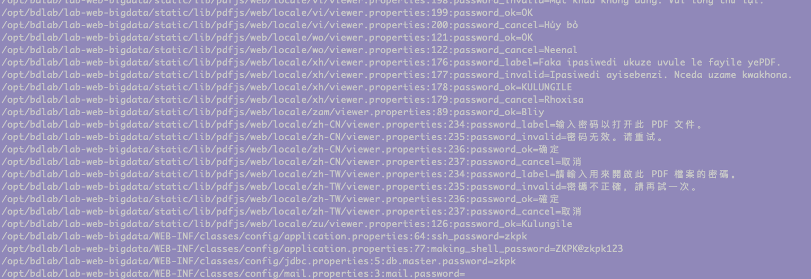


## 查看端口连接&应用服务位置
`netstat -pantu`

这里发现了 53 端口的 dns 本地服务器，配合 `ifconfig` 可以得知 192.168.122.1 其实是虚拟网，这里又运行 docker ，判断是 docker 提供的虚拟路由。

发现 40436 端口运行的是 sunloginclien，还看到 16062 运行 phtunnel 服务，这个是花生壳的服务。 

 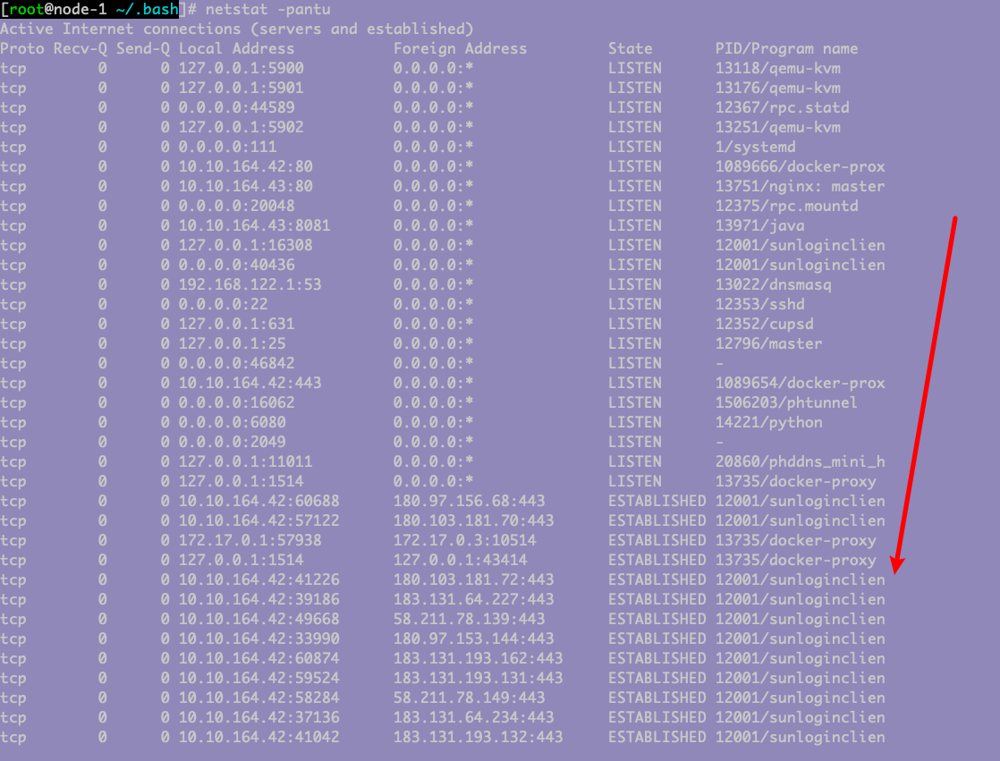

这里通过 `ps -aux | grep sunloginclien` 找到了执行路径。

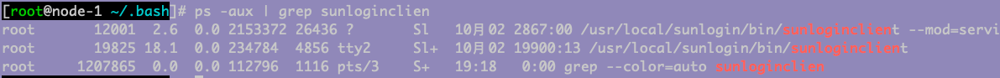

伴随着向日葵的程序一般都有 config 文件，我们先看看有没有什么敏感信息。

`find /usr/local/sunlogin -name 'config.ini'`

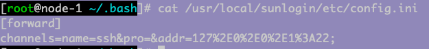

这里我直接打开向日葵 `/usr/local/sunlogin/bin/sunloginclient`

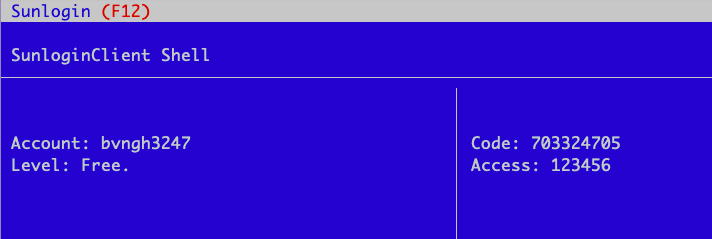

发现上面有账号，但是我们在 Linux 的情况下没法找到其他机器的控制权。尝试通过 code 登陆，无果。


## 查看 known_hosts 尝试横向
`cat /root/.ssh/known_hosts`

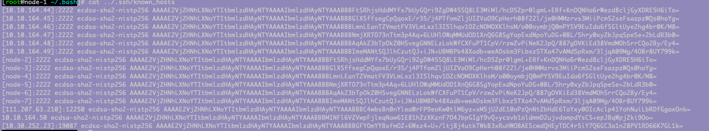

尝试访问一个外网服务器

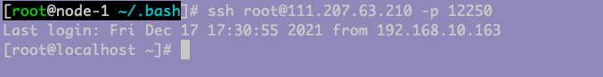

成功登陆。


## 历史命令
了解用户输入的历史命令可以知道执行过什么程序，更可以帮助我们定位机子用途。

`history`

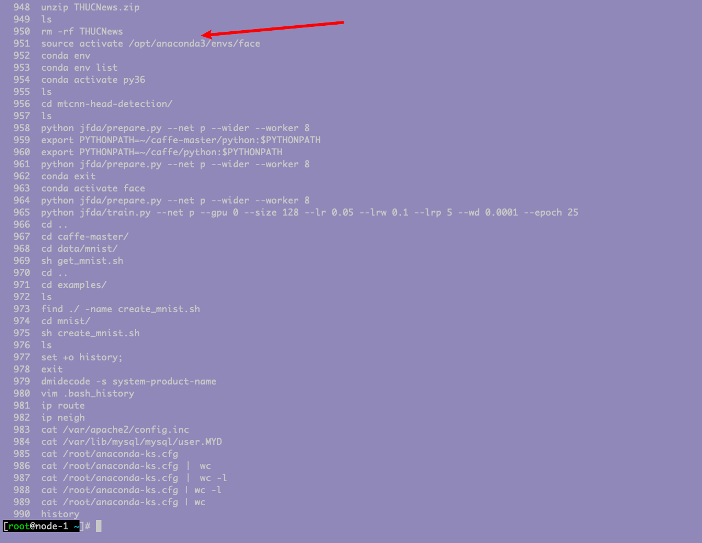

这里我发现存在 anaconda 可以通过 `cat /root/anaconda-ks.cfg` 查看执行过什么命令。我没有找到什么可以用的信息，但知道了 192.168.101.100 这个主机有过交互。

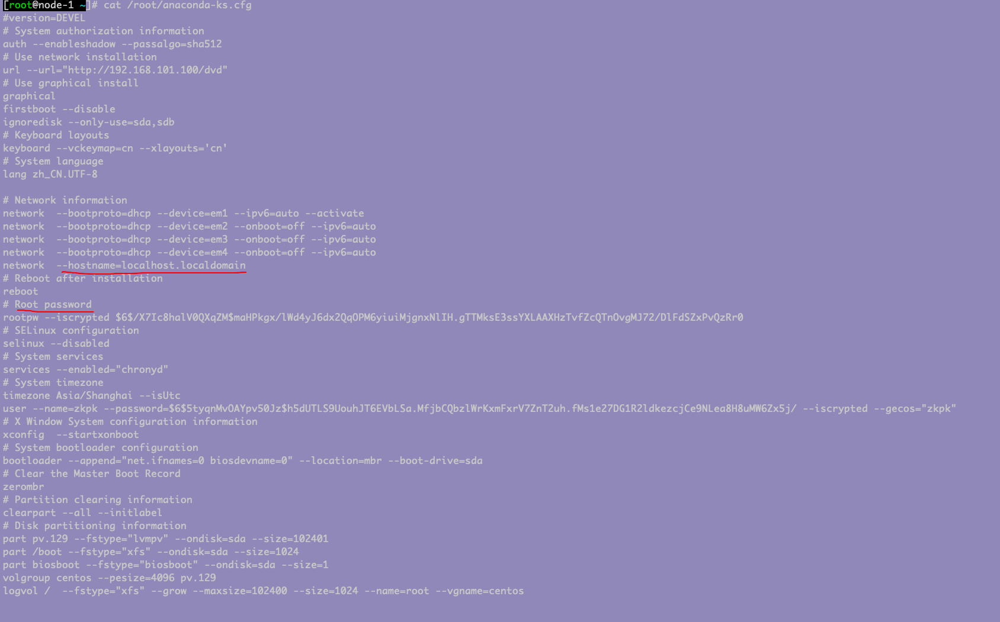


## 用户相关passwd&破解
`cat /etc/passwd` 得到机器上的所有用户，包括权限和是否可以登陆。这里看到有三个个人账户。

思路是：拿到 root 和这些账户的密码横向爆破，说不定有惊喜。

这里还看到有个 ldap 的账户，我暂时还不知道是什么账户。

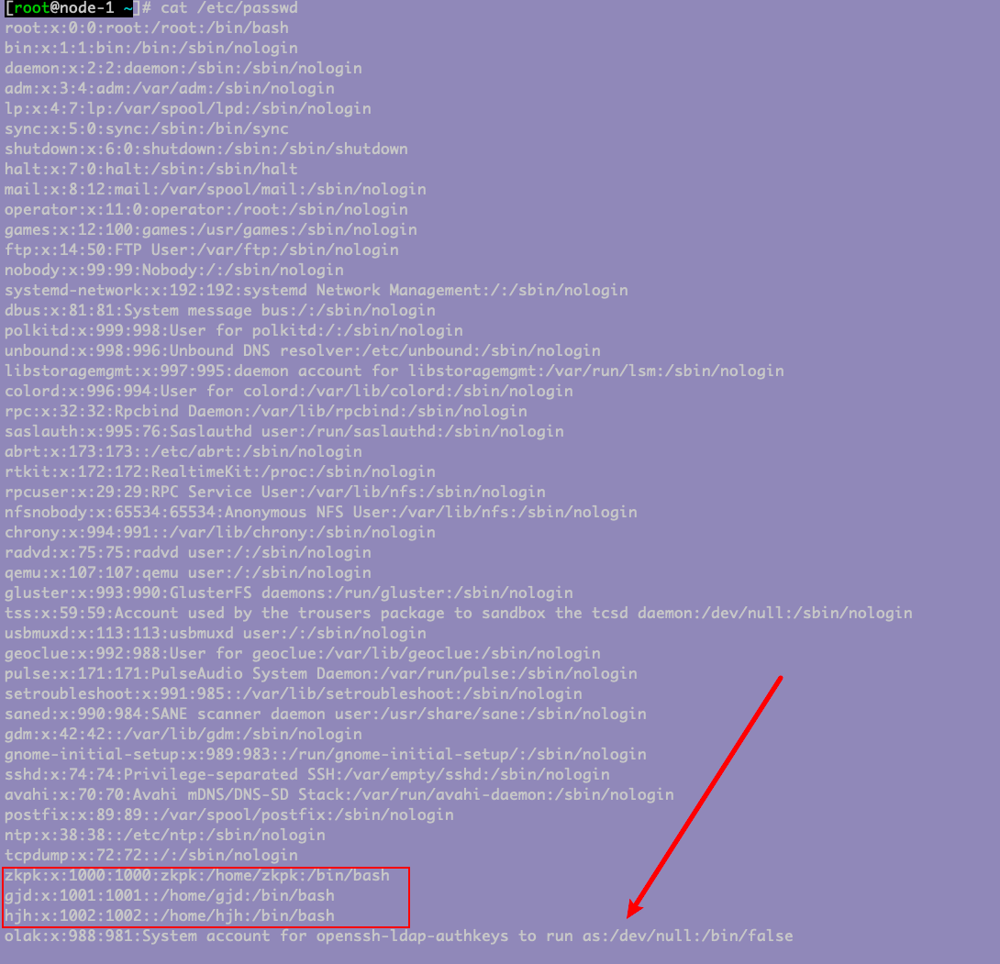

`cat /etc/shadow` 这个可以更加直观看到可以登陆的用户。同时可以复制 hash 去 cmd5 进行查询，运气好就能出来。

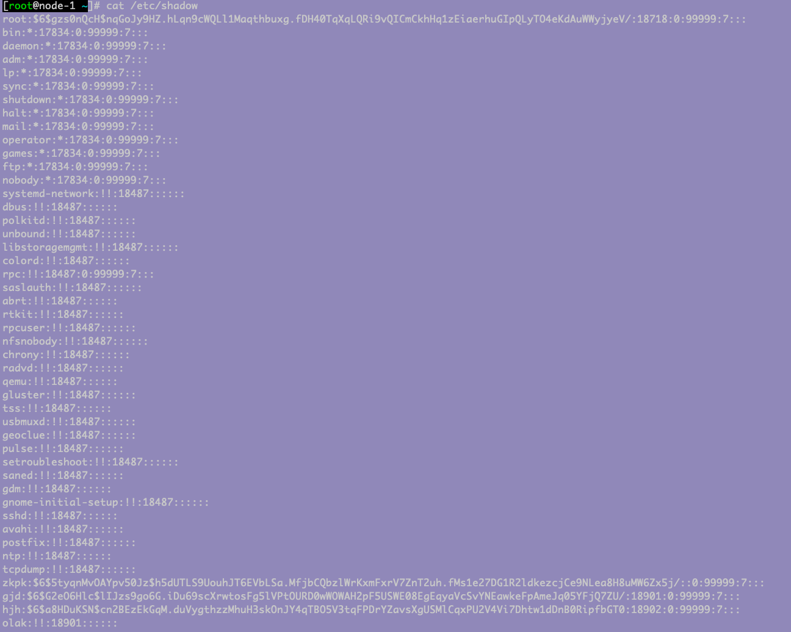

我们同时复制 passwd 和 shadow 的内容到 kali 机器，通过 unshadow 破解。不过一般都不太可能。

```shell
mkdir .join
unshadow passwd.txt shadow.txt > hash.txt
gzip /usr/share/wordlists/rockyou.tar.gz
john --wordlist=/usr/share/wordlists/rockyou.txt hash.txt
```

## 通过 last 收获其他网段
`last` 这里我发现了 10.11.3.204 10.30.1.7 等内网地址。

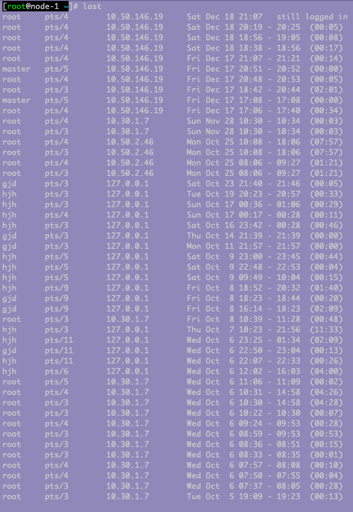

## 判断是否是虚拟机
`systemd-detect-virt` 可以直接判断，这里返回 none 说明不是。

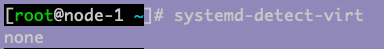

如果是 vmware 说明不是。 

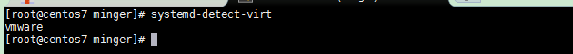

`lscpu` 这个语句查看 CPU 是否是虚拟化，从而判断是否是虚拟机。这里可以看到我们是实打实到物理机器

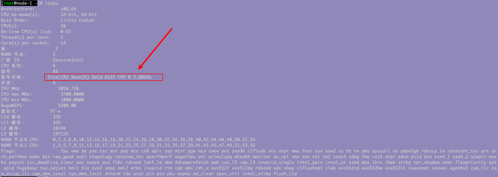

如果出现 vmare 说明是虚拟机。

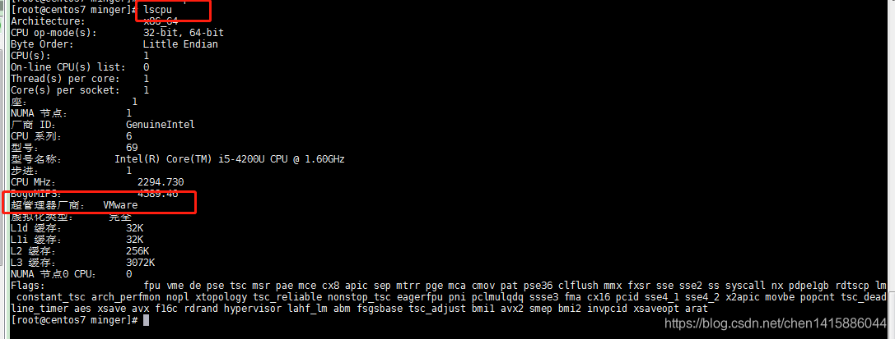

`<font style="color:rgb(77, 77, 77);">cat /proc/1/cgroup</font>` 判断是不是docker

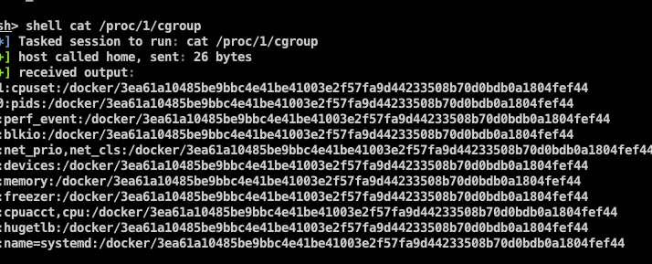

