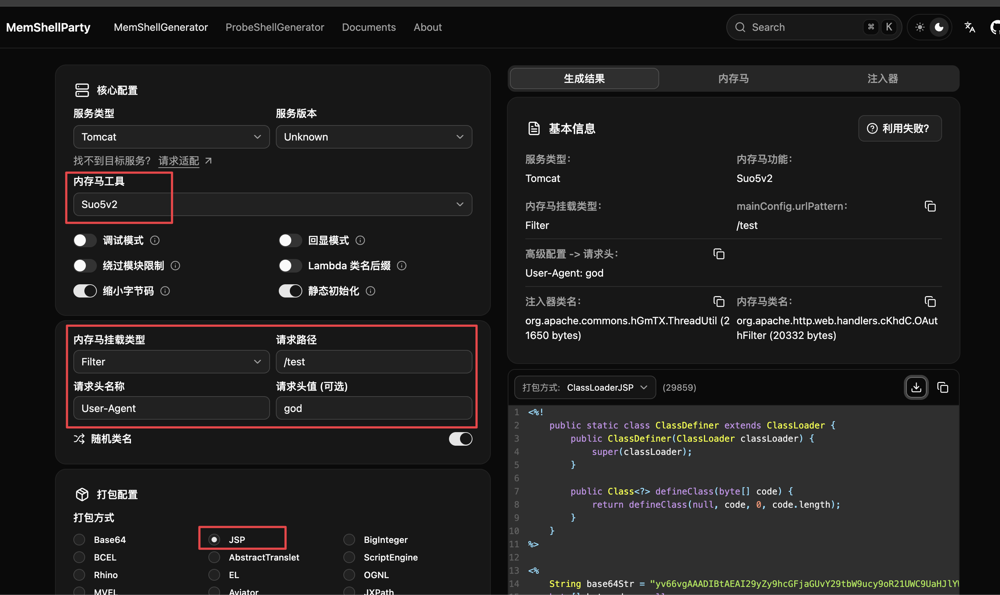
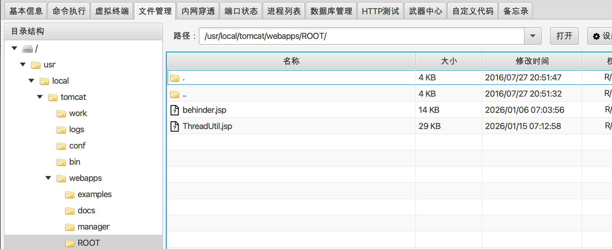
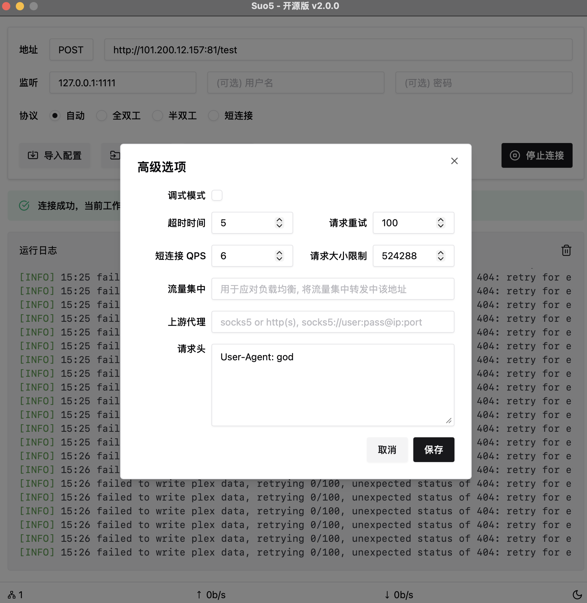
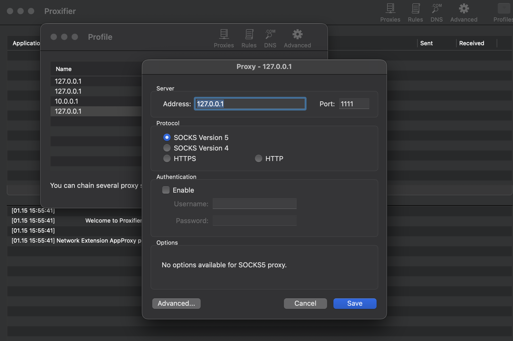
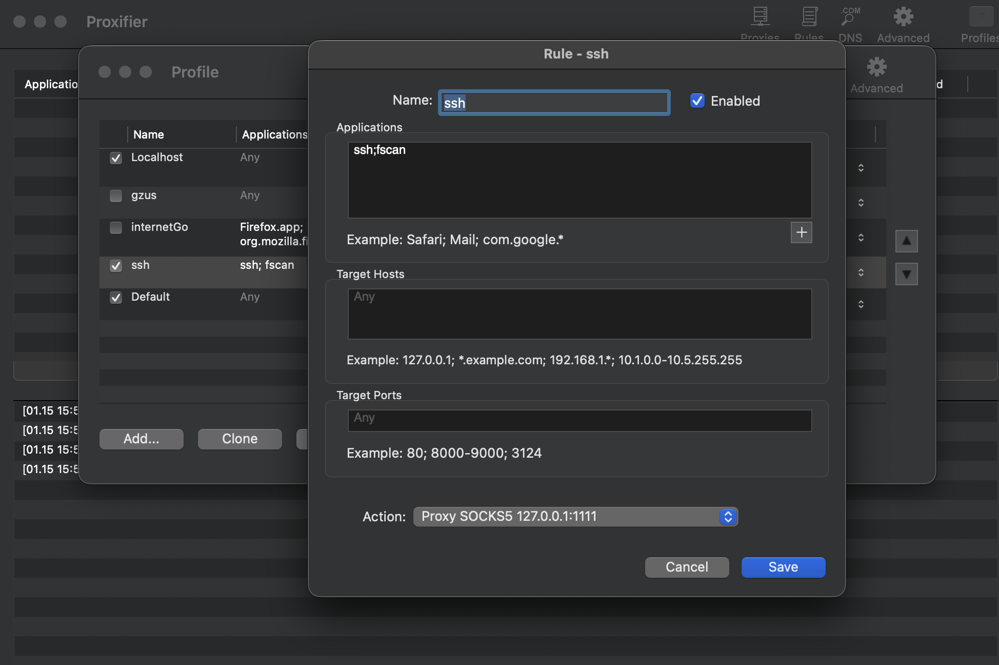
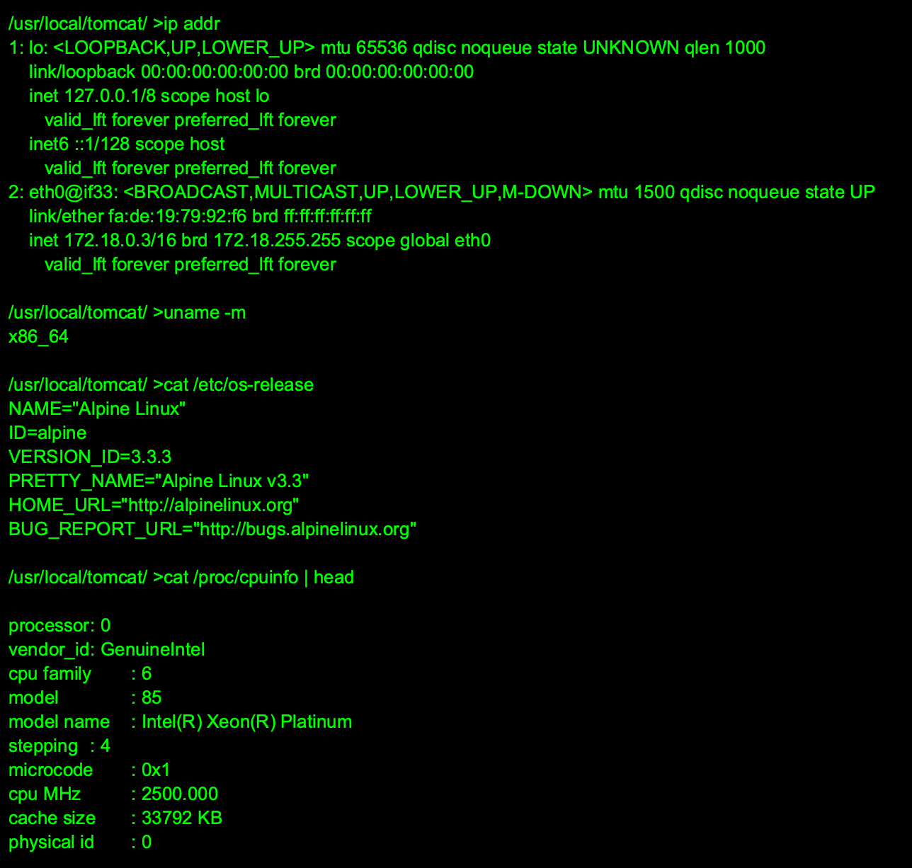
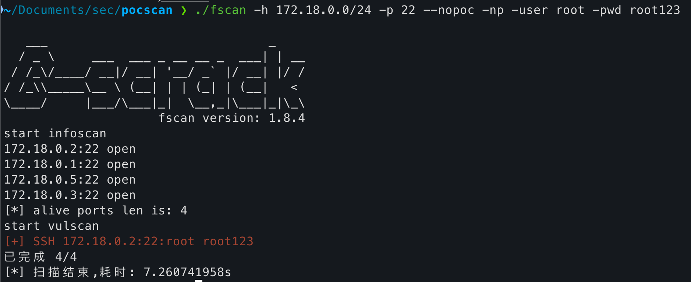
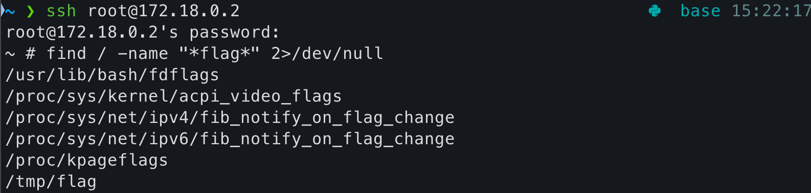
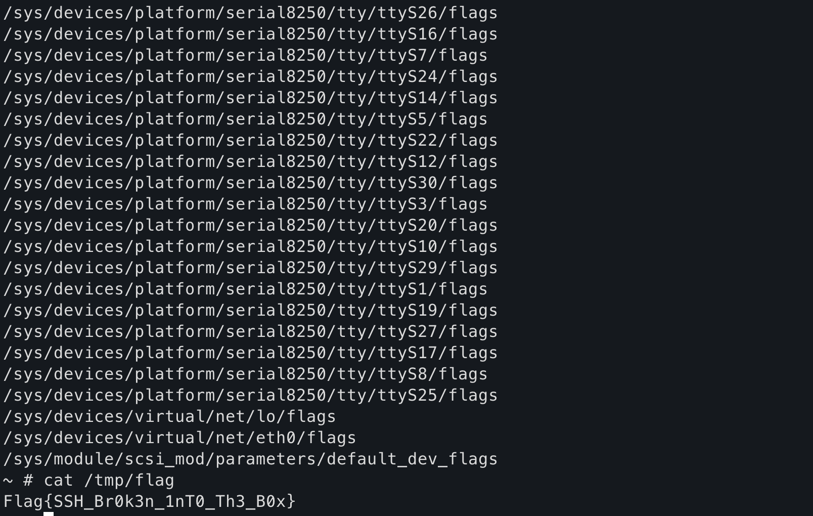

<!--more--> 
# 准备的工具
+ [https://github.com/zema1/suo5/](https://github.com/zema1/suo5/)
+ [https://github.com/ReaJason/MemShellParty](https://github.com/ReaJason/MemShellParty)

# 背景
当前已经通过外网打点获取了WebShell，下一步需要需要利用隧道代理工具进行内网横向移动。题目要求获取同C段SSH机器上的Flag，机器的密码为root/root123。

+ Webshell注入路径：http://<IP>:81/behinder.jsp
+ 请求头：User-Agent: test，密码：test

# 过程
1. 先使用MemShellParty生成用于注入的JSP。



2. 通过Behinder连接shell，这里需要注意，访问behinder.jsp后注入是需要访问根目录，即`http://<IP>:81/`。连接后到ROOT目录上传刚生成的JSP。



3. 然后打开suo5客户端连接工具，输入自定义的请求头和请求路径，最好把重试开高一些，因为负载均衡的原因。



4. 打开Proxifier，设置代理地址。



5. 设置代理规则。



6. 打开Webshell终端，使用命令检查一下当前环境和网络情况。发现机器提供了一个B类网址，这里还运行了`ip route`和`arp`均没有收获。



7. 因为题目提示的是C段，所以我直接根据子网掩码然后设置网络地址扫描C段即可，很快就有了答案。



8. 通过ssh访问172.18.0.2，通过常用手段搜索flag：`find / -name "*flag*" 2>/dev/null`



9. 发现可疑的flag，直接cat得到最终flag。



# 题外话
这是一个通过docker运行的Alpine 3.3 容器，这个版本很低，如果你直接将工具放进去那么可能会因为没有链库（即os文件）运行不了。如果一定要运行，那么有两个解决方案：1. 通过代理 2. 自行编译

下面给出了一个例子：

```shell
docker run -it golang:1.23-alpine sh
apk add --no-cache git build-base
git clone https://github.com/qi4L/qscan.git
cd qscan
go build -o qscan
exit
docker cp qscan-build:/go/qscan/qscan ./qscan
```

