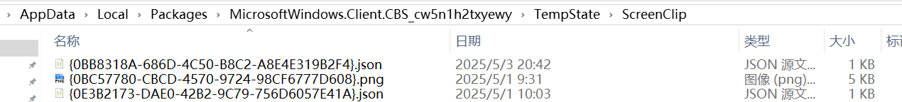

<!--more--> 
# 用户痕迹
## Windows 屏幕截图记录
参考：[Where is clipboard data located in Windows 10 if we have enabled Clipboard History?](https://superuser.com/questions/1516709/where-is-clipboard-data-located-in-windows-10-if-we-have-enabled-clipboard-histo)

```bash
C:\Users\[yourname]\AppData\Local\Packages\MicrosoftWindows.Client.CBS_cw5n1h2txyewy\TempState
```

可以看到近三天内的信息，其中包含了.json和图片，只需要关注图片即可。



## 登录登出痕迹
参考：[How Can You Find The Location of the Windows Log Files?](https://www.hostitsmart.com/manage/knowledgebase/424/find-location-of-windows-log-files.html)

文件位置：C:\Windows\System32\winevt\Logs

### <font style="color:rgb(36, 41, 47);">常见事件ID</font>
| **<font style="color:rgb(36, 41, 47);">分类</font>** | **<font style="color:rgb(36, 41, 47);">事件ID示例</font>** | **<font style="color:rgb(36, 41, 47);">取证意义</font>** |
| --- | --- | --- |
| **<font style="color:rgb(36, 41, 47);">账户活动</font>** | **<font style="color:rgb(36, 41, 47);">4624（登录成功）   </font>****<font style="color:rgb(36, 41, 47);">4625（登录失败）</font>**<font style="color:rgb(36, 41, 47);">   </font><font style="color:rgb(36, 41, 47);">4648（显式凭证尝试）   </font><font style="color:rgb(36, 41, 47);">4672（特权登录）</font><br/>**<font style="color:rgb(36, 41, 47);">4647 （用户主动注销）</font>**<br/><font style="color:rgb(36, 41, 47);">4634（账户被注销）</font> | <font style="color:rgb(36, 41, 47);">识别暴力破解、横向移动、特权滥用</font> |
| **<font style="color:rgb(36, 41, 47);">权限变更</font>** | <font style="color:rgb(36, 41, 47);">4720（用户创建）   </font><font style="color:rgb(36, 41, 47);">4726（用户删除）   </font><font style="color:rgb(36, 41, 47);">4732（组策略变更）   </font><font style="color:rgb(36, 41, 47);">4738（密码修改）</font> | <font style="color:rgb(36, 41, 47);">检测账户异常创建/删除、权限提升</font> |
| **<font style="color:rgb(36, 41, 47);">系统完整性</font>** | <font style="color:rgb(36, 41, 47);">1102（日志清除）   </font><font style="color:rgb(36, 41, 47);">4616（时间篡改）   </font><font style="color:rgb(36, 41, 47);">4688（进程创建）   </font><font style="color:rgb(36, 41, 47);">7045（服务安装）</font> | <font style="color:rgb(36, 41, 47);">发现攻击者清除痕迹、安装后门</font> |
| **<font style="color:rgb(36, 41, 47);">网络安全</font>** | <font style="color:rgb(36, 41, 47);">4771（Kerberos失败）   </font><font style="color:rgb(36, 41, 47);">5140（共享访问）   </font><font style="color:rgb(36, 41, 47);">5156（网络连接放行）   </font><font style="color:rgb(36, 41, 47);">5447（IPsec丢弃）</font> | <font style="color:rgb(36, 41, 47);">分析横向移动、协议攻击、防火墙策略变更</font> |
| **<font style="color:rgb(36, 41, 47);">应用程序监控</font>** | <font style="color:rgb(36, 41, 47);">11707（软件安装成功）   </font><font style="color:rgb(36, 41, 47);">11708（安装失败）   </font><font style="color:rgb(36, 41, 47);">5（病毒告警）   </font><font style="color:rgb(36, 41, 47);">1000（应用崩溃）</font> | <font style="color:rgb(36, 41, 47);">追踪可疑软件安装、排除病毒干扰、分析系统稳定性</font> |
| **<font style="color:rgb(36, 41, 47);">系统生命周期</font>** | <font style="color:rgb(36, 41, 47);">6005（日志服务启动）   </font><font style="color:rgb(36, 41, 47);">6006（日志服务停止）   </font><font style="color:rgb(36, 41, 47);">1074（关机/重启）</font> | <font style="color:rgb(36, 41, 47);">确认系统异常重启、强制关机行为</font> |


注意：<font style="color:rgb(36, 41, 47);">远程登录（类型3）、本地交互登录（类型2）</font>

### **<font style="color:rgb(36, 41, 47);">常见类似账户</font>**
| **<font style="color:rgb(36, 41, 47);">账户类型</font>** | **<font style="color:rgb(36, 41, 47);">示例名称或域</font>** | **<font style="color:rgb(36, 41, 47);">用途</font>** |
| --- | --- | --- |
| **<font style="color:rgb(36, 41, 47);">默认管理员账户</font>** | `<font style="color:rgb(36, 41, 47);">Administrator</font>` | <font style="color:rgb(36, 41, 47);">系统内置超管账户</font> |
| **<font style="color:rgb(36, 41, 47);">虚拟化服务账户</font>** | `<font style="color:rgb(36, 41, 47);">NT VIRTUAL MACHINE\...</font>` | <font style="color:rgb(36, 41, 47);">Hyper-V虚拟机管理、容器服务</font> |
| **<font style="color:rgb(36, 41, 47);">系统服务账户</font>** | `<font style="color:rgb(36, 41, 47);">LOCAL SERVICE</font>`<br/><font style="color:rgb(36, 41, 47);">、</font>`<font style="color:rgb(36, 41, 47);">NETWORK SERVICE</font>` | <font style="color:rgb(36, 41, 47);">运行Windows基础服务（低权限）</font> |
| **<font style="color:rgb(36, 41, 47);">自动生成GUID账户</font>** | `<font style="color:rgb(36, 41, 47);">S-1-5-21-...</font>`<br/><font style="color:rgb(36, 41, 47);">（SID形式）</font> | <font style="color:rgb(36, 41, 47);">临时会话或特定任务（如远程桌面连接）</font> |


## 系统策略
路径：C:\Windows\System32\GroupPolicy\Machine\Registry.pol


# 其他
## 图标缓存文件
参考：[win10快捷方式变成白纸的解决办法](https://www.bilibili.com/opus/778707652947476518)

<font style="color:rgb(24, 25, 28);">Iconcache.db 图标缓存文件</font>

```bash
C:\Users\当前登录用户\AppData\Local
```

