<!--more--> 
学习资源&参考：

1. 微信公众号：金星路406取证人、WXF技术相关

# 基础使用
## 语言修改
打开文件后，可以修改成中文。

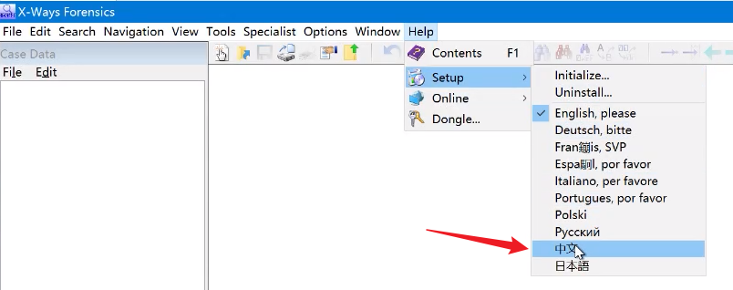

## 新建案件
案件数据，选择创建案件

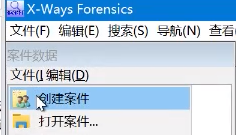

只需要修改案件名称就可以了。

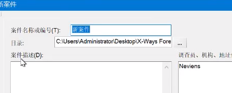

默认是按电脑语言来的，最好换成UTF-8。

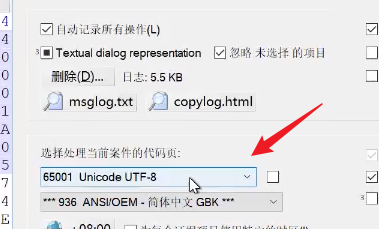

然后点击添加镜像文件（如E01），这是最常用的。

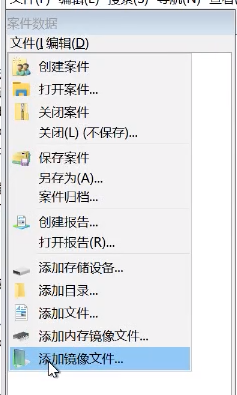

点击这里可以查看当前镜像存在的SID，即用户。

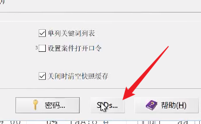

可以方便看到SID和用户名对应。

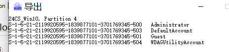

## 高效配置
1. 常规设置

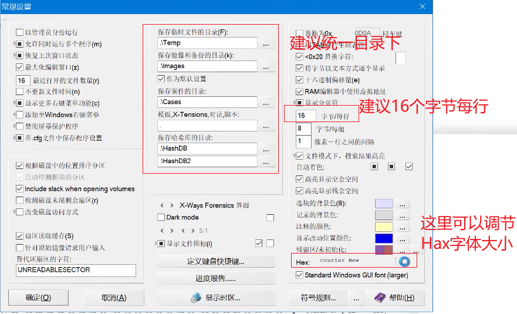

2. 添加多个字符集查看，建议添加UTF-8、UTF-16小端序、GBK

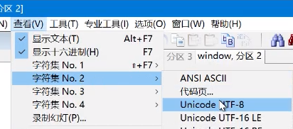

GBK需要打开代码页进行添加。

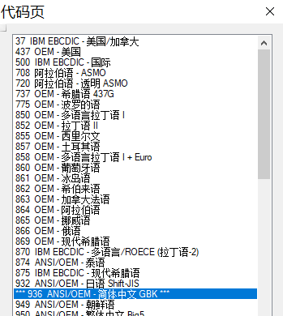

3. 配置查看器

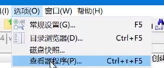

添加一些基本的查看工具，自定义查看器添加后，可以在右键菜单中看到。

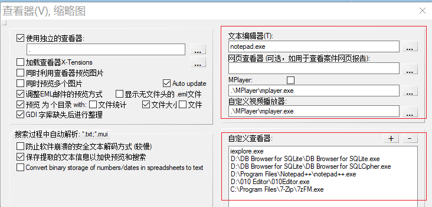

软件会导出文件后用关联的程序进行打开查看。

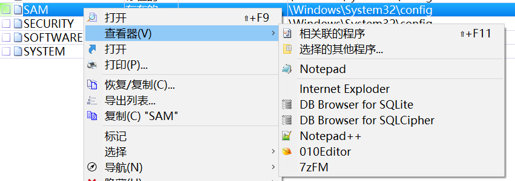

4. 数据解释器

可以方便展示选中的hax进行进制转换。

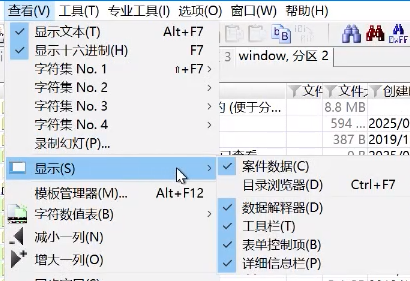

右键弹出选项。

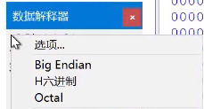

可以将常用的勾选上，IP address也常用。

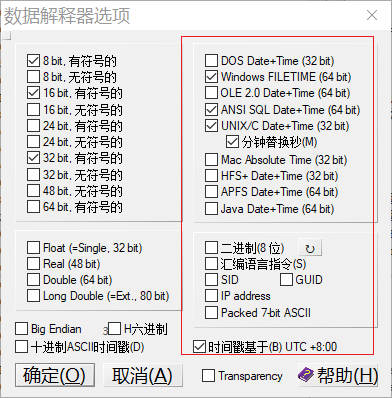

这样就会显示的比较全面。

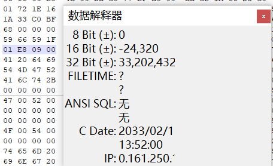

## 手动磁盘分析
为了搜索能够全面，可以手动进行磁盘快照。

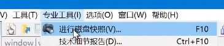

勾选需要的选项。 

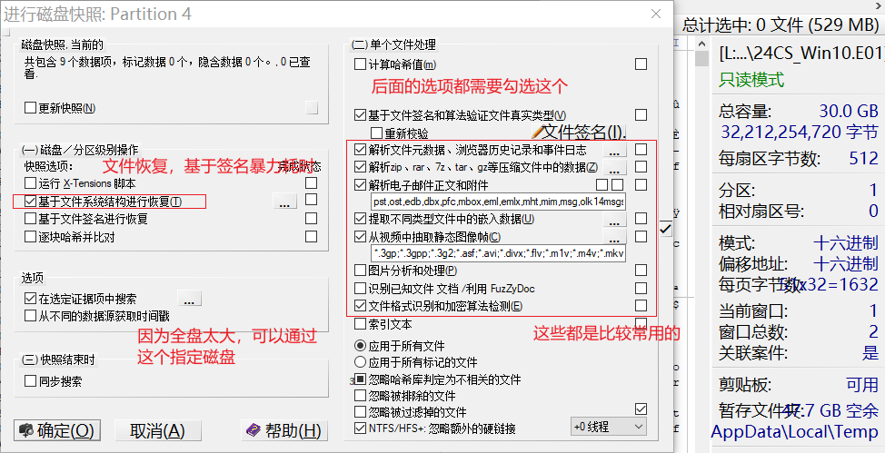

不熟悉所以点击默认了。

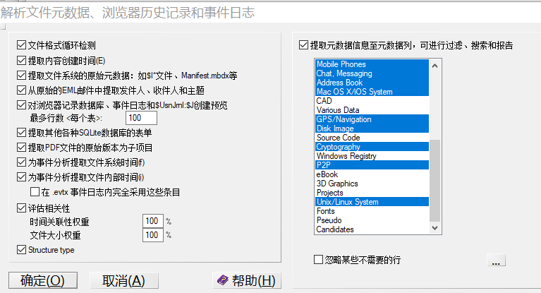

这里也是默认，下面有个选项是利用收集的密码尝试解密，是在案件设置里的。

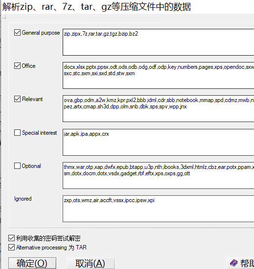

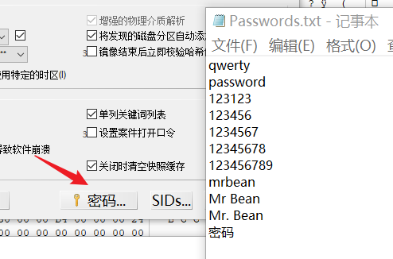

也可以通过选中指定文件进行磁盘快照。

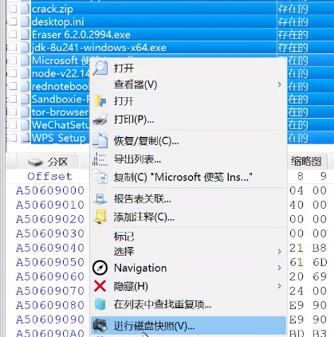

分析完成后可以快速预览压缩包内的信息

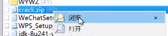

点击游览进入后可以看到里面的内容。

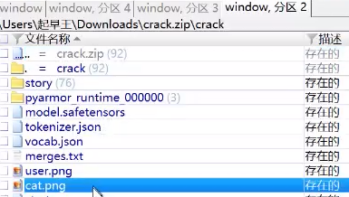

## 查看磁盘信息
磁盘右键点击属性即可。

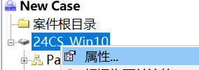

详细可以看案件描述。

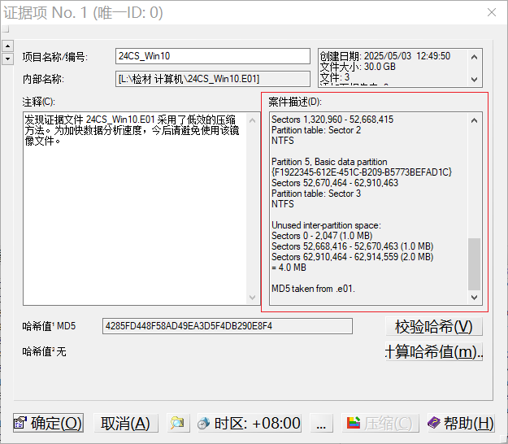

## 查找丢失的分区
可以在磁盘工具里找到。

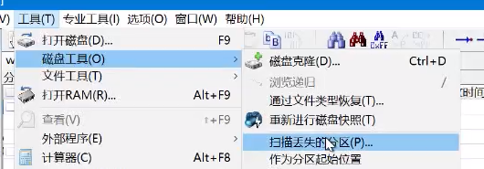

Windows一般只选第一个，安卓可以选Ext2。只推荐选一个，不建议多选。

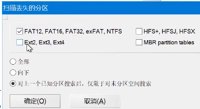

## 过滤
右键分区，点击游览递归，可以查看子目录的文件。

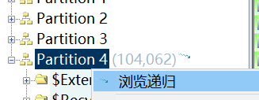

1. 导入过滤方法

点击文件游览器的右边箭头。如果要保存，点击箭头旁边的存储按钮，可以保存settings文件。

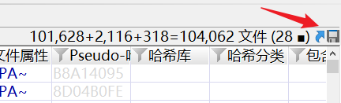

选择settings文件。

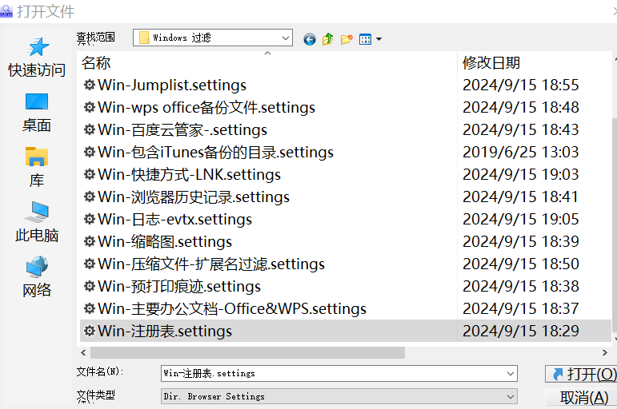

点击打开后就可以筛选出来了。

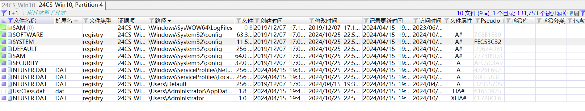

2. 手动过滤

点击想要过滤器图标按钮，在过滤类型中选择想要找到的文件类型，最后点击激活。

如果要取消过滤，同样的点击图片按钮，再点击禁用即可。

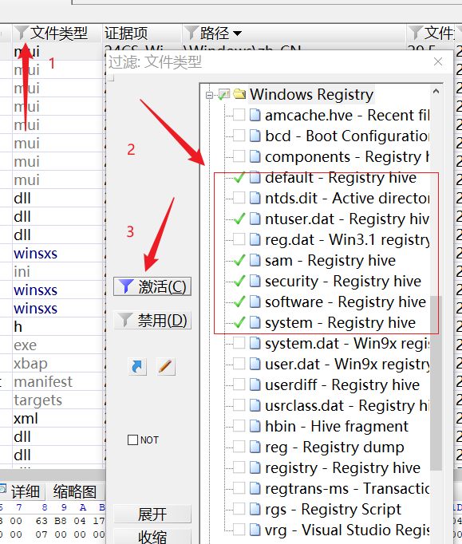

点击之后可以看到因为过滤规则不一样，搜索出来的注册表也不一样。

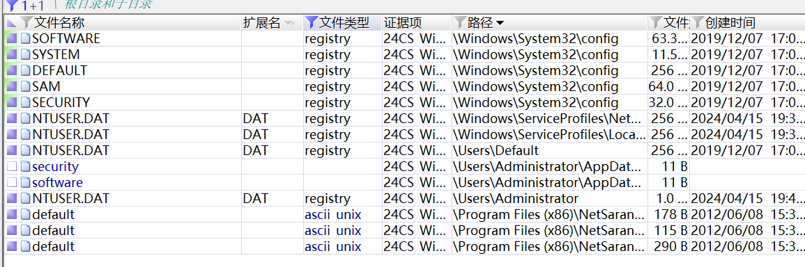

3. 取消所有过滤条件

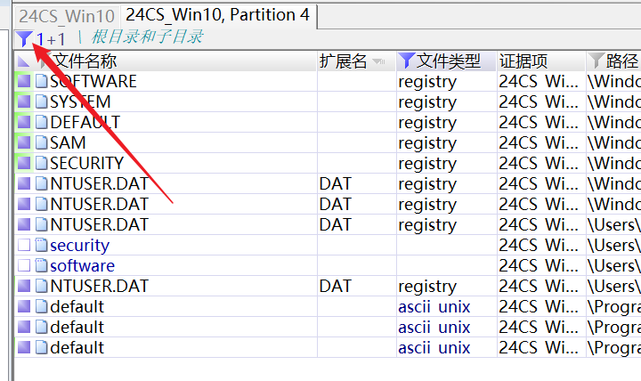

4. 简单查找加密容器

容器一般大于1G，也可以不勾选大于条件或者大于条件设置为大于1M，但这样会造成广泛筛选出很多文件。

为什么是mod 1048576？因为VeraCrypt创建加密容器设置容量大小时要求输入整数倍数字。

这里显示出了两个，很明显vhdx是一个容器卷。

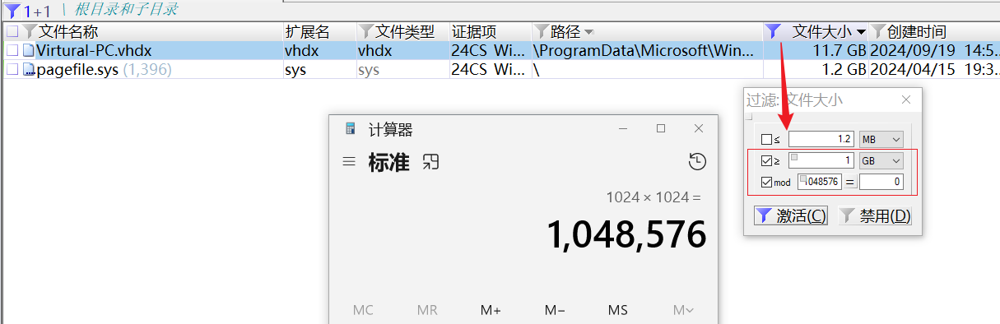

右键进行磁盘快照。

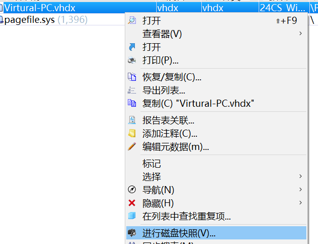

然后选择加密算法检测。

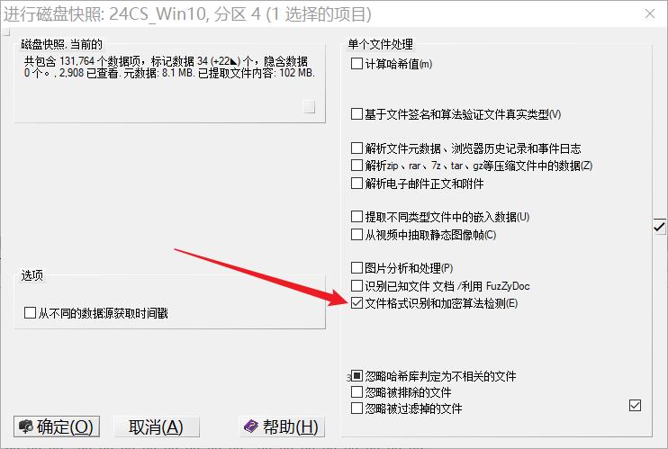

VeraCrypt创建加密容器。

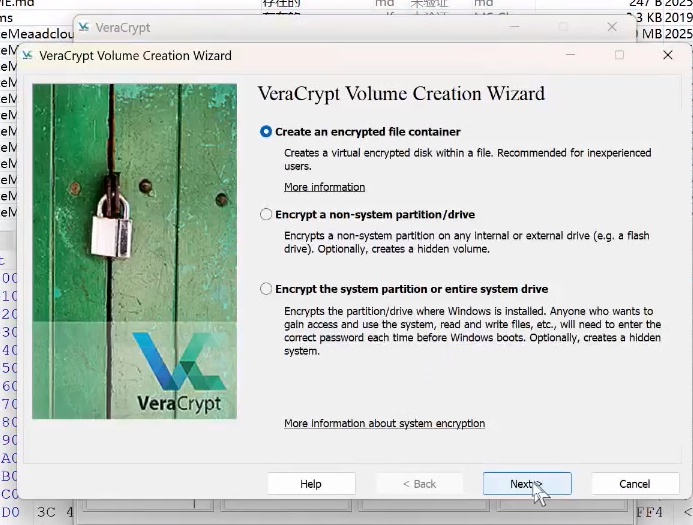

需要设置容量大小的，这里的大小都是整数倍。

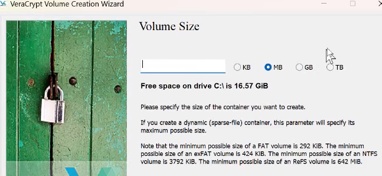

5. 设置显示字段

点击地址栏的地方

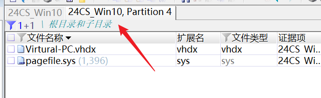

点击更换状态是是否启用，为0是不启用状态。

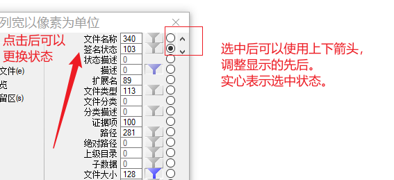

## 同步搜索
参考：[07 - Quick Guide to X-Ways Forensics: Recover/Copy](https://www.youtube.com/watch?v=An430_P-3nc&list=PLB0pU0wP67A9LezmyZO5I6DnHPEWjgjOD&index=7)

全局进行搜索，可以再搜索菜单里点击同步搜索。

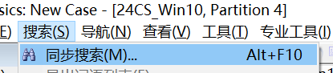

红色框内的选项根据实际情况进行修改。

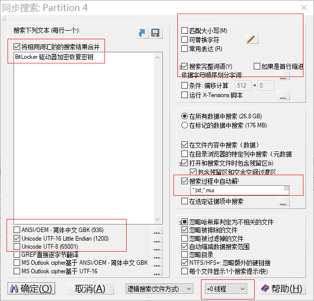

搜索时，可以点击这个图片按钮查看已经查找到的文件。

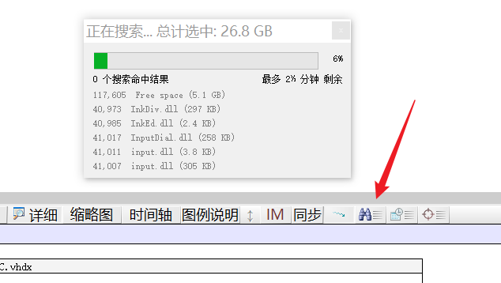

