<!--more--> 
# 0x00 前言
工作需要有一台安卓测试机器，原本考虑购买 pixel。无奈手头紧，只能考虑我的备用机器了。华为从2018年开始就不提供官方的BL码用于解锁了，系统从EMUI10开始只能解锁Fastmode的BL不能解锁User BL，并且重启自动恢复。所以我们的步骤是先将机器刷到EMUI9版本，再解除BL限制，再刷Root。本篇文章提供的方法为拆机，使用com1.0端口刷机的方法。

**<font style="color:rgb(33, 33, 33);">注意解锁后掉USB2.0及快充，连接ADB需要使用工程线，如不能接受就可以不用看了。</font>**

> 如果你通过OC的Repair开启了降级，然后不小心的通过OTG刷包的方式刷错了系统导致无法正常启动机器（变砖），也可以通过以下这种方式挽救。
>

# 0x01 前期准备
此阶段你只需要准备以下四样东西，我给出了参考图。我给出了参考价格，可以不需要跟着我买，我觉得拆机工具我买贵了。

1. 一台Windows10/11电脑
2. Huawei Mate 20 Pro（LYA-AL00）
3. 菊花三代工程线（没错线就可以了）
4. 拆机工具（**注意看有没有镊子，这是你的必需品！！！**）
5. 网络，用于远程连接加密狗端口。

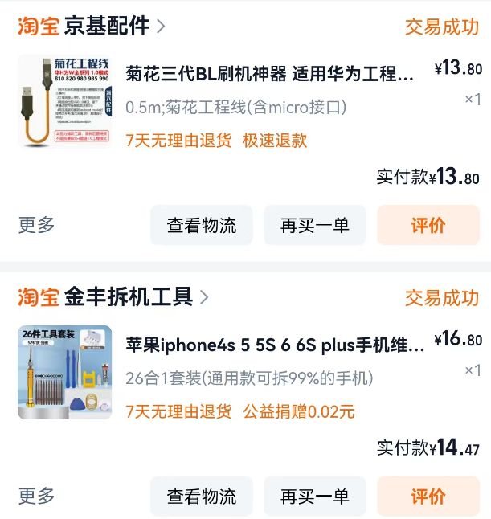

注意本篇文章提供的链接有YouTube或者其他国外的网站，如需访问需要魔法上网（VPN/代理）。

其次网络很重要，不能在你使用OC时断开，一旦断开网络，加密狗也会断开，你的OC就会停止工作，你也会心态裂开。

# 0x02 解BL
## 拆机
> 详细的拆机教程我看的是：[https://www.youtube.com/watch?v=Pm-W7_zrhdc](https://www.youtube.com/watch?v=Pm-W7_zrhdc)
>

### 拆开后盖
这一步你需要使用工具撬开后盖，如果有吹风筒功率大可以在划片插入后，加热后盖四周，胶一般受热后就松软，帮助我们更好的拆卸机器。但我后盖本身就碎了，所以没有执行这一步骤。

### 卸下螺丝
拆开后盖后你能看到NFC、无线充电模块，你需要使用拆机工具中的螺丝刀卸下主板盖板的8颗螺丝。

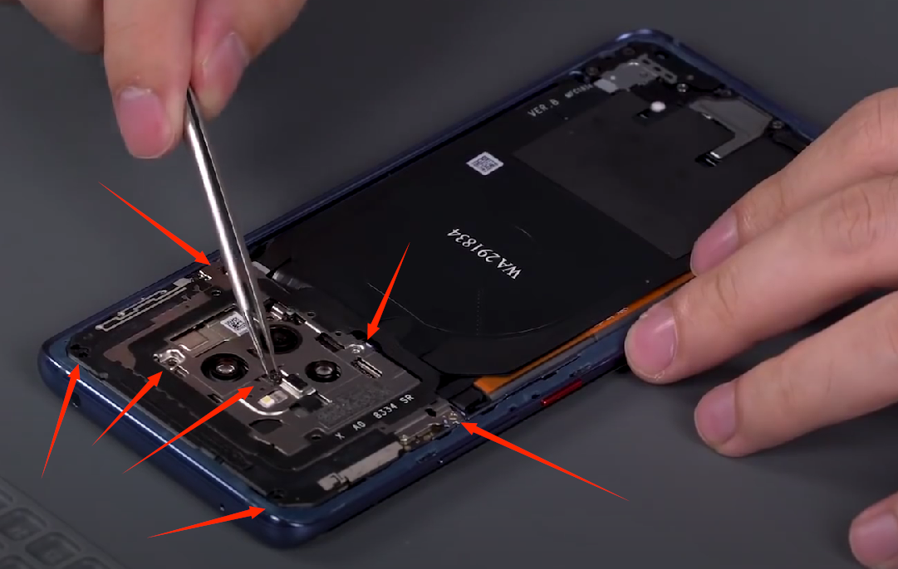

### 卸下主板盖板
卸下螺丝后，从右侧掰开卡扣到左边就能拆下主板盖板了。这里需要注意是有卡扣的，不要硬掰！

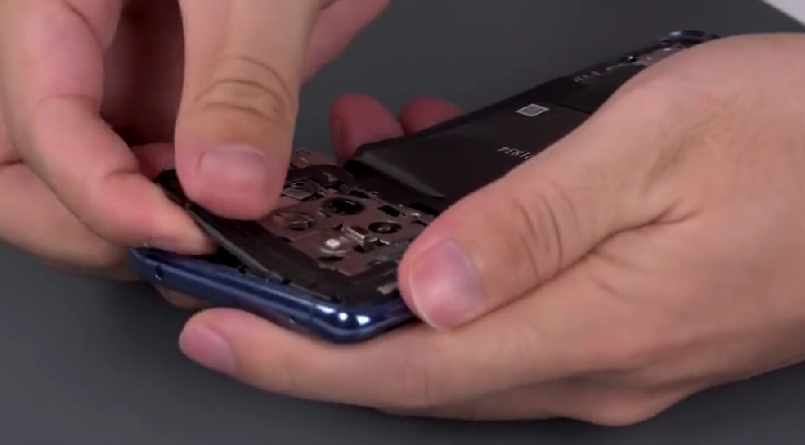

### 断电
挑开电池BTB，进行断电。

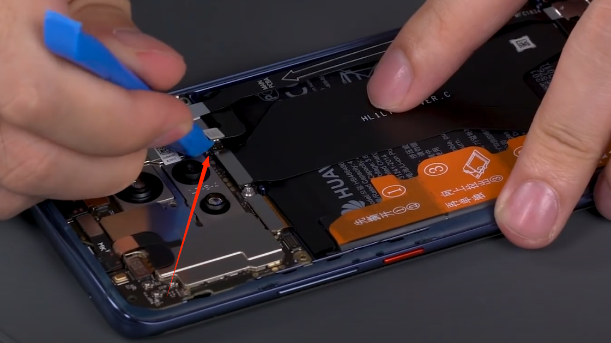

## 开启com1.0接口
### 短接工程测试点
> 参考：
>
> [https://www.youtube.com/watch?v=sMMGakJGxSg](https://www.youtube.com/watch?v=sMMGakJGxSg)
>
> [https://www.youtube.com/watch?v=9Hr_r-FXLzw](https://www.youtube.com/watch?v=9Hr_r-FXLzw) （非常详细）
>

参考下方图片，用镊子短接Test Point（测试点）后接入USB。（注意此时是断开了电源BTB的）

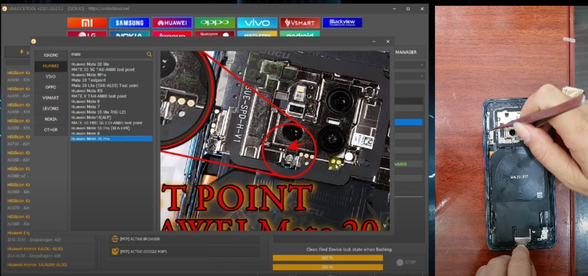

用镊子一端接触到即可，**不要太用力**。这种情况下不太好插TypeC口，你可以使用小拇指推一下，这样比较好插，因为充电口太紧了。

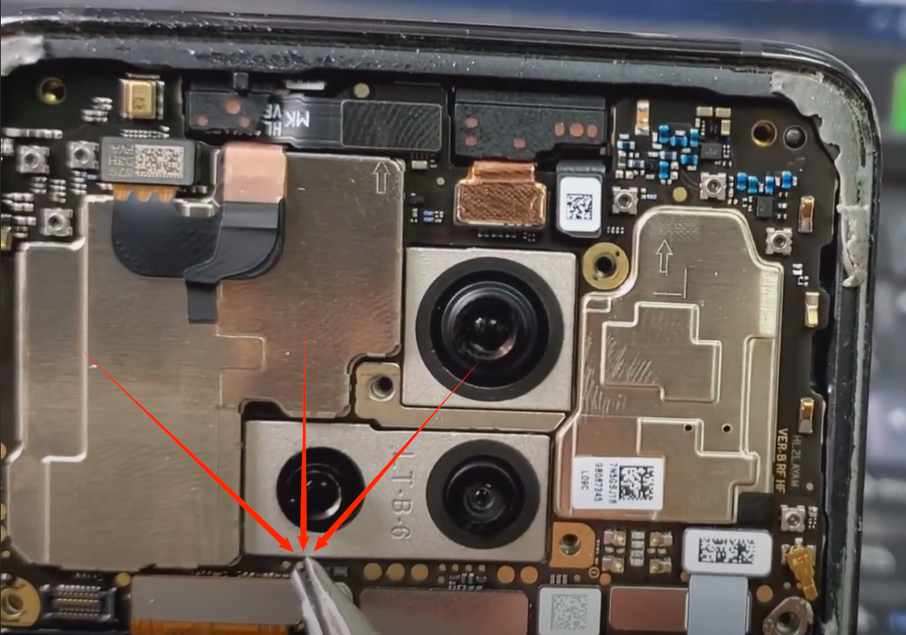

### 安装驱动
> 这里我结合参考了不同的链接
>
> [https://www.bilibili.com/read/cv15810335/](https://www.bilibili.com/read/cv15810335/) （主要看了如何加载驱动）
>
> [https://www.youtube.com/watch?v=Cn2mbuipsaw](https://www.youtube.com/watch?v=Cn2mbuipsaw) （方法同上）
>
> [https://www.youtube.com/watch?v=p2Mt7hL82dI](https://www.youtube.com/watch?v=p2Mt7hL82dI) （更加详细的知道如何加载驱动步骤）
>

手机连上电脑，打开设备管理器，如果看到“USB SER"的设备就说明短接成功。 可以使用Win+R，输入`devmgmt.msc`打开设备管理器。

**如果这一步你没有看到USB SER，你可以按一下菊花工程线的按钮进行强开。**

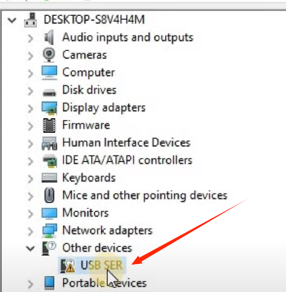

右键USB SER，点“更新驱动程序”→“浏览我的电脑以查找驱动程序”→“让我从计算机上可用的驱动程序列表中选取”→“端口（COM和LPT）”→厂商选“Huawei Incorporated”，驱动选“HUAWEI USB COM 1.0”。注意这里的驱动没有版本号。 下面是步骤图片，也可以看我提供的参考链接。

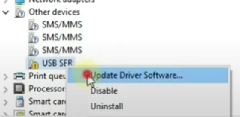

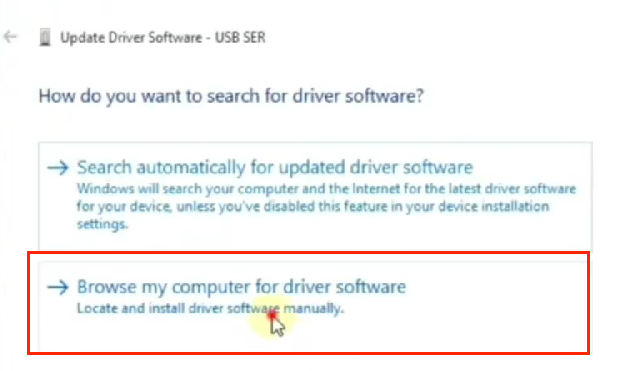

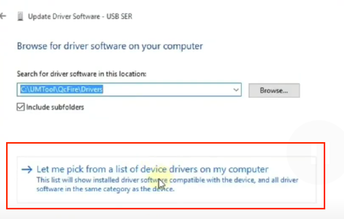

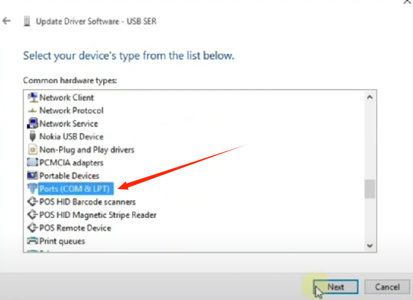

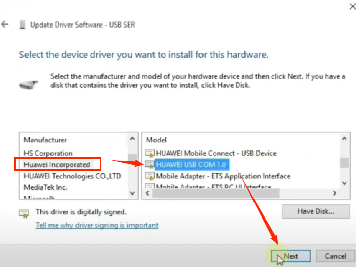

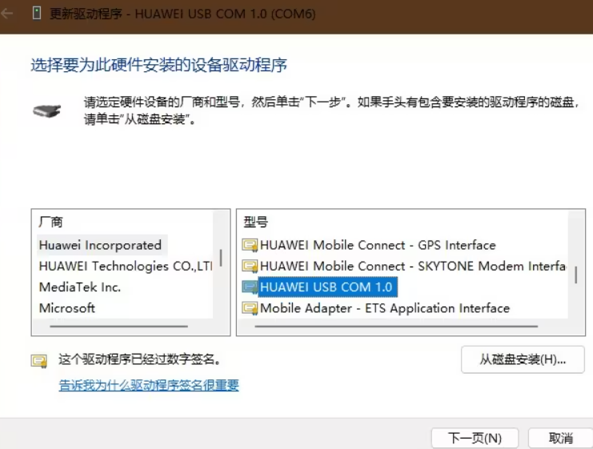

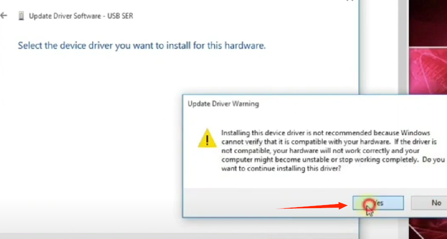

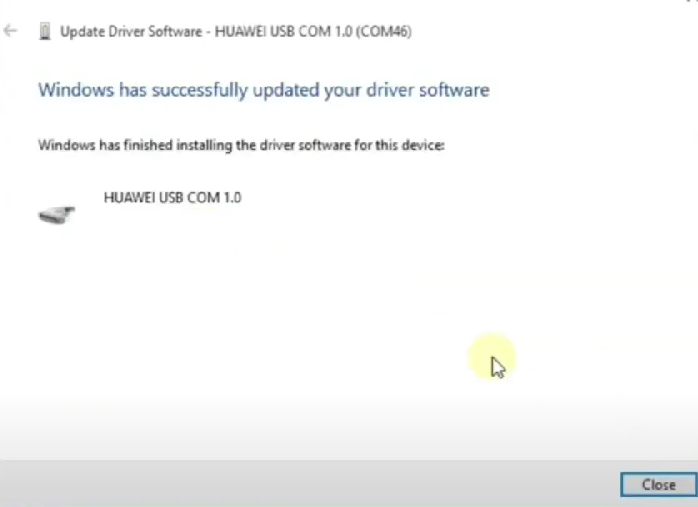

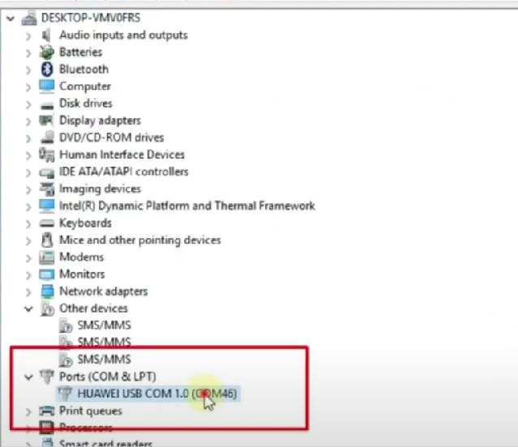

点下一页后，把弹出的不兼容提示关掉，驱动就正确安装了。下图表示COM1.0驱动已正确安装，图标上没有感叹号。 

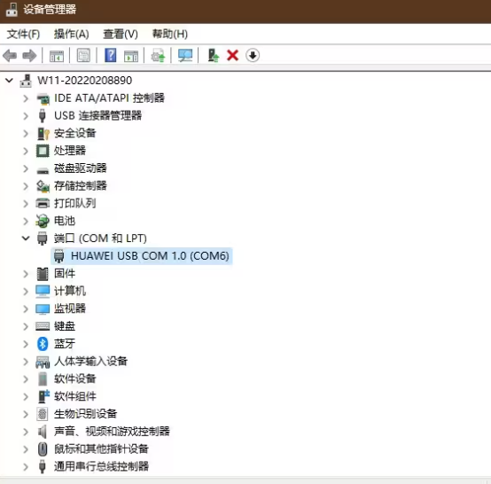

## <font style="color:rgb(33, 33, 33);">临时解锁方法一：AU写入底层</font>
> 先从官网安装 Android Utility，[https://www.mfdl.io/](https://www.mfdl.io/)
>
> 也可以直接访问该链接下载 [https://www.mediafire.com/file/0v09dwa0pib8yif/AUP.v156.7z/](https://www.mediafire.com/file/0v09dwa0pib8yif/AUP.v156.7z/)
>
> 压缩包密码：mfdl
>
> **这一步需要魔法上网**
>

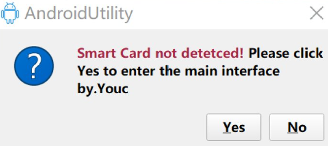

如果出现这个弹窗直接点击Yes即可。

### 绕过软件更新
> 网络上可能有去更新的版本，但是我没有找到，直接从官网下载了。
>
> 这种可以通过网络拦截改包的方式绕过也可以通过Odebug修改汇编强制绕过。
>

**如果你没有提示这个弹窗，请你跳过这一小节。**

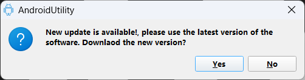

可以通过拦截修改数据包进行解决，其他方式暂未尝试。

你需要下载两个软件：

1. [https://www.proxifier.com/](https://www.proxifier.com/) （如需永久激活请自行搜索激活码）
2. [https://yaklang.com/](https://yaklang.com/) （需要安装HTTPS证书，具体请自行百度）

#### 启动代理
打开 proxifier 在菜单栏选择 `Profile->Proxy Servers->Add`，按照下图输入地址和端口，并且选择协议为`sockst5`。

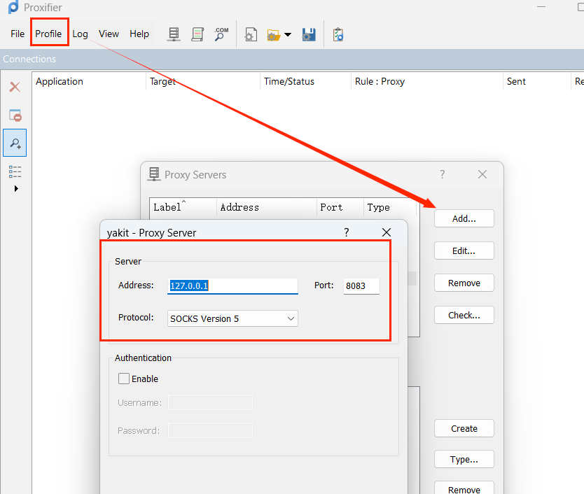

菜单栏选择 `Profile->Proxification Rules->Add`，填写名字、应用、代理，输入后点击OK进行保存。

提供复制：`AndroidUtility.exe`

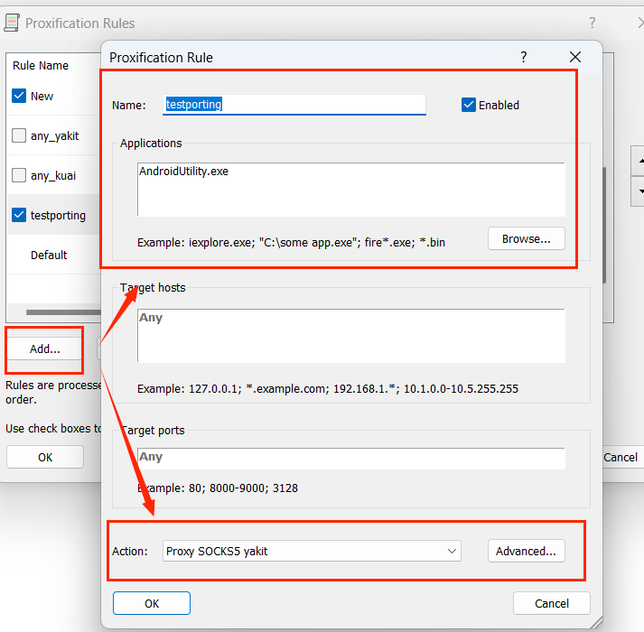

#### 启动拦截
打开Yakit，选择临时项目。

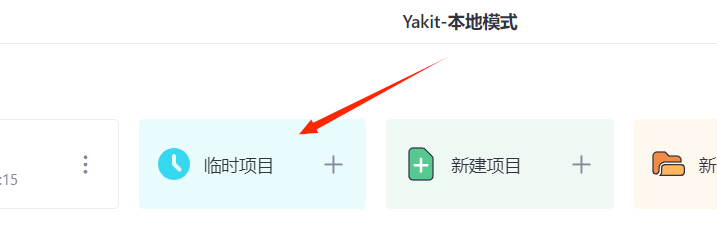

直接点击启动劫持。

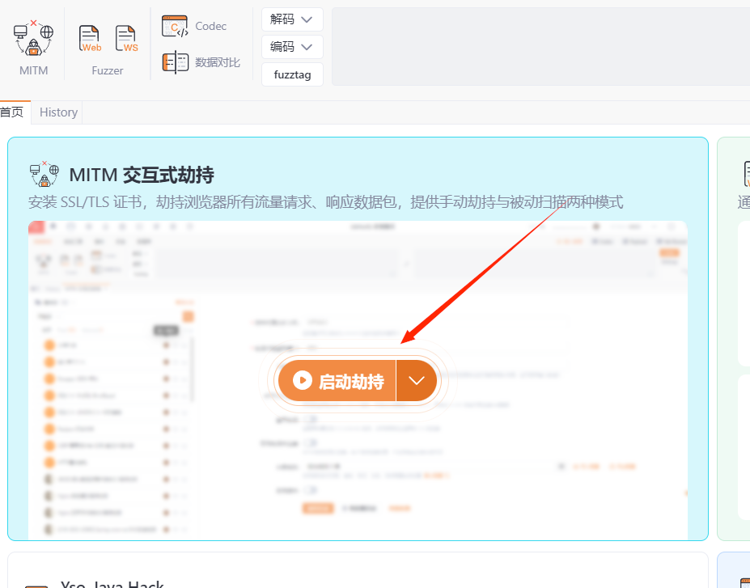

> 在这一步之前你应当已经安装了CA证书，用于拦截监听HTTPS流量。
>
> 具体教程：[https://yaklang.com/products/mitm/hijack-configuration/#ca%E8%AF%81%E4%B9%A6%E7%9A%84%E5%AE%89%E8%A3%85](https://yaklang.com/products/mitm/hijack-configuration/#ca%E8%AF%81%E4%B9%A6%E7%9A%84%E5%AE%89%E8%A3%85)
>

在MITM交互劫持界面，选择手动劫持。

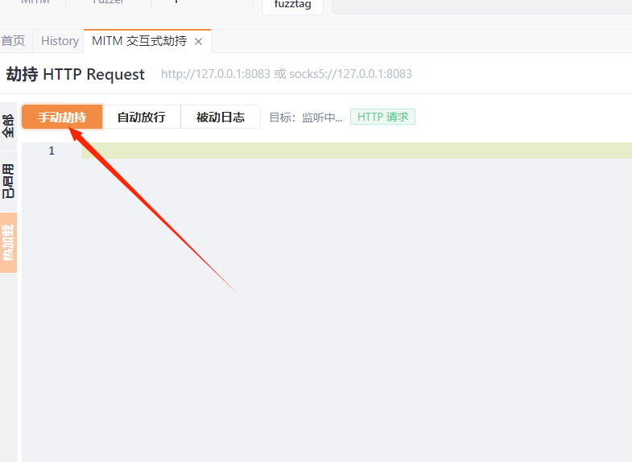

此时我们再次打开`AndroidUtility.exe`可以看到有一个请求。右键，选择劫持该请求。

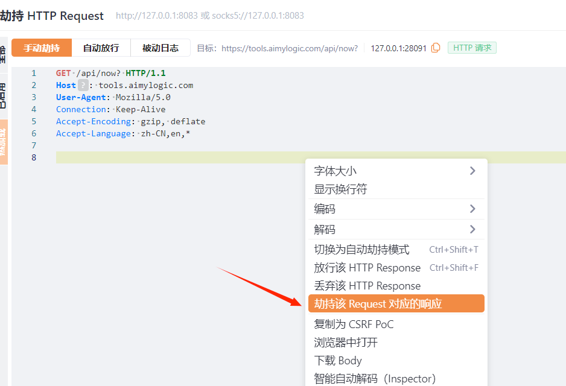

此处修改两个字段`formatted`和`timestamp`，可以直接照抄我的，也可以自定义设置。原理是将时间修改成历史版本。

```plain
{
  ...
  "formatted": "01.09.2024 02:16",
  "timestamp": 1030427364721,
  ...
}
```

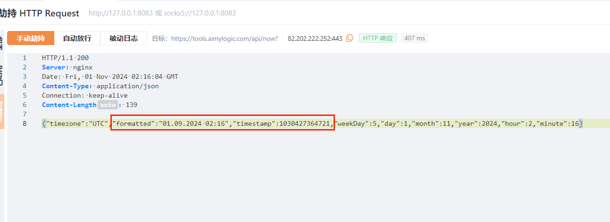

修改后，在右边点击提交请求即可进入界面。

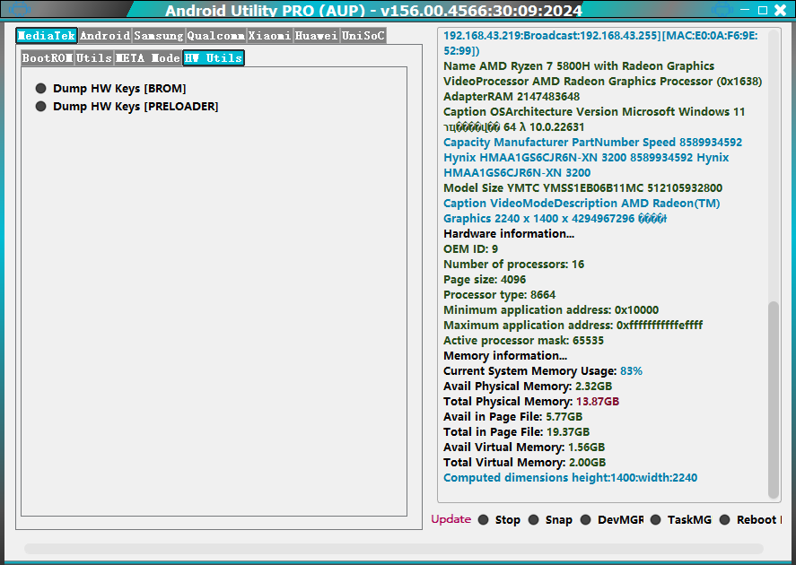

接下来退出这两个软件，继续操作即可。

### 绕录底层
在选项卡选择Huawei，进入到Service界面，在下方下拉选择框中选择KIRIN980后，点击Load Factory Fastboot。

**请确保你的Huawei Com 1.0端口存在！**

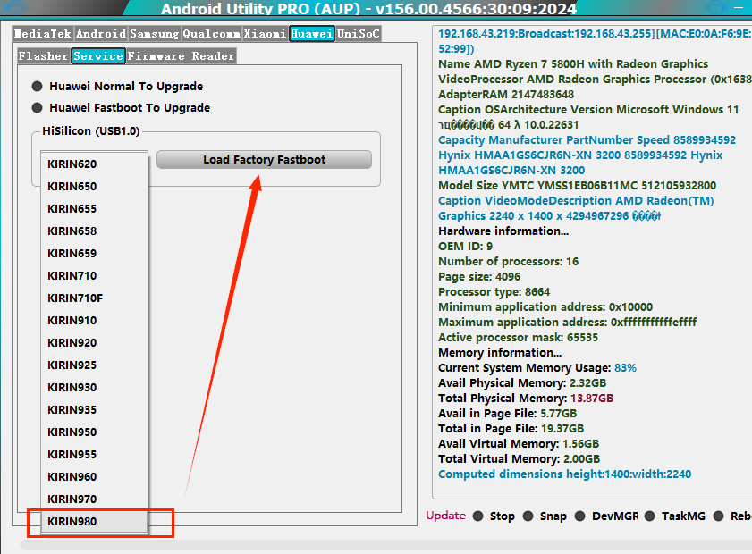

```plain
Waiting for hisi usb device... ok
BootMode : HISI_VCOM[COM9]
DriverDesc : HUAWEI USB COM 1.0
DriverPath : usb\vid_12d1&pid_3609\6&1e1514e9&0&2
DriverSRV : HWHandSet
DriverVersion : 2.0.6.725
DriverDate : 11-28-2016
DriverCFG : oem51.inf
DriverOEM : Huawei Incorporated
●●● Start Huawei Vcom Download ●●●
Downlaod hi63xx DDR [0] ...OK
Downlaod hi63xx DDR [1] ...OK
Downlaod hi63xx DDR [2] ...OK
Unlocking Bootloader (TMP)...
please reconnect phone in usb com...
```

注意看右侧日志输出，见到`please reconnect phone in usb com`，需要重置1.0状态，**此时拔掉数据线，插上电池排线并再次短接连接电脑即可重置1.0状态。**

如果`Downlaod hi63xx DDR [2]`或者0、1失败时，请你重新试多几次。

```plain
Waiting for hisi usb device... ok
BootMode : HISI_VCOM[COM9]
DriverDesc : HUAWEI USB COM 1.0
DriverPath : usb\vid_12d1&pid_3609\6&1e1514e9&0&2
DriverSRV : HWHandSet
DriverVersion : 2.0.6.725
DriverDate : 11-28-2016
DriverCFG : oem51.inf
DriverOEM : Huawei Incorporated
Downlaod hi63xx DDR [0] ...OK
Downlaod hi63xx DDR [1] ...OK
Downlaod hi63xx DDR [2] ...OK
Downlaod hi63xx DDR [3] ...OK
Downlaod hi63xx DDR [4] ...OK
Huawei USBVcom Download success!
Waiting for fastboot device...
```

见到`Waiting for fastboot device`，请将按下菊花工程线的按钮进行切换。如果切换成功，你能够在设备管理器中见到ADB interface（接口）。

然后出现以下提示即写入完成。

```plain
[FBSN:3EP0218C06001561]
Model 	:   LYA-AL00
D_Model 	:   LYA-AL00
FW Ver 	:   LYA-AL00 10.1.0.165(C00E165R3P8)
Base VER 	:   LYA-LGRP1-CHN 11.0.0.156
Custom 	:   LYA-AL00-CUST 11.0.0.139(C00)
Preload 	:   LYA-AL00-PRELOAD 11.0.0.6(C00R3)
Bl_Lock 	:   UNLOCKED
Region  	:   ALL/CN
HW_KEY 	:   OKAY [  0.000S]
Rescue_v 	:   RESCUE0.6
Extra 	:   all: undefine
Finished. Total time: 0.000s
OEMDeviceInfo 	:   FAILED (remote: 'invalid command')
fastboot: error: Command failed
```

注意观察一下：`Bl_Lock 	:   UNLOCKED`BL锁的状态，不需要理会`FAILED`等报错。

### 手动解锁
此时手机带着菊花3代，也进入了解开临时bl的工厂fastboot

然后打开adb命令行，输入`fastboot erase xloader`回车

擦除 xloader 引导分区防止启动。

然后再输入`fastboot oem unlock`回车

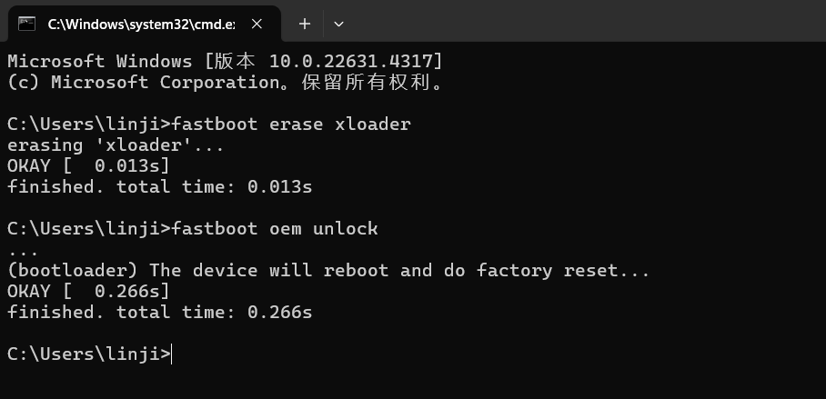

如果`fastboot oem unlock`这条命令出现报错，请你重新烧录底层并解开临时BL锁。

出现如图提示就解锁USER BL成功了！

## 临时解锁方法二：OC写入底层
下面还要继续刷包降级，需要使用到OC。

> OC下载地址
>
> 链接：[https://pan.baidu.com/s/1qt47emzD0OKWKVHRWiw7ZA](https://pan.baidu.com/s/1qt47emzD0OKWKVHRWiw7ZA) 
>
> 提取码：0000
>

可以通过淘宝或者闲鱼搜索OC加密狗端口。

这里你需要花费4-10元购买OC的加密狗端口使用权，如果花销阻碍到你继续刷机，我很抱歉。

1. <font style="color:rgb(33, 33, 33);">点击oc里面的</font>`<font style="color:rgb(33, 33, 33);">write firmware</font>`<font style="color:rgb(33, 33, 33);">选项卡，然后点第一个</font>`<font style="color:rgb(33, 33, 33);">write firmware</font>`<font style="color:rgb(33, 33, 33);">按钮。</font>

> 下载空firmware文件
>
> 链接：[https://pan.baidu.com/s/1AbjmfUV_6AsgBxwJJVgYRQ?pwd=oy6a](https://pan.baidu.com/s/1AbjmfUV_6AsgBxwJJVgYRQ?pwd=oy6a) 
>
> 提取码：oy6a 
>

2. 在第一个导入文件，选择上面下载的空firmware文。

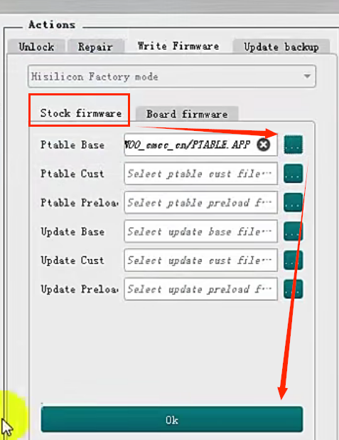

3. 勾掉`Select all`点击开始

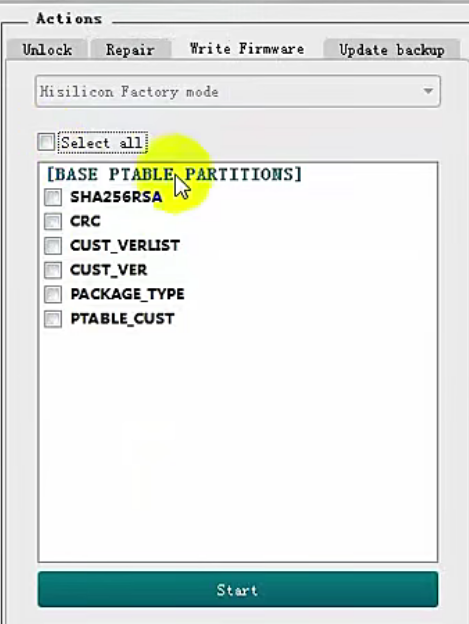

4. 新版会弹出选择刷入的类型，直接选EMUI12的底层。~~（因为找不到图了，就放了个差不多的）~~

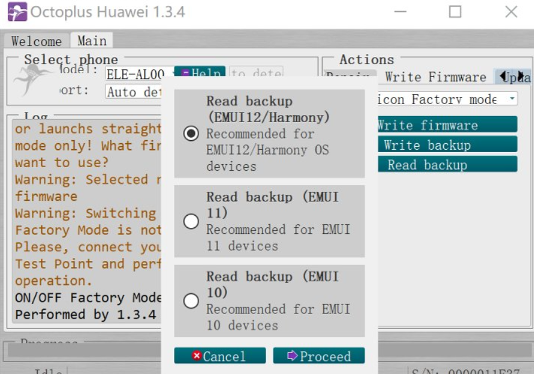

5. <font style="color:rgb(33, 33, 33);">点击Proceed,有提示就再点一下Proceed。</font>
6. <font style="color:rgb(33, 33, 33);">提示</font>`<font style="color:rgb(33, 33, 33);">Warning:If you use modified USB cable please reconnect cable from the mother board and press "Ok"to proceed the operation</font>`<font style="color:rgb(33, 33, 33);">时，</font>**<font style="color:rgb(33, 33, 33);">请你务必拔插菊花工程线连接手机！  
</font>**<font style="color:rgb(33, 33, 33);">如果拔插后设备管理器没有出现ADB端口，按一下菊花工程线的按钮或者拔插菊花工程线电脑USB接口。</font>
7. <font style="color:rgb(33, 33, 33);">然后点击 OK 然后出现</font>`<font style="color:rgb(33, 33, 33);">Detected UFS partition table</font>`<font style="color:rgb(33, 33, 33);">时，直接关闭OC。（也可以使用任务管理器直接终结进程）</font>

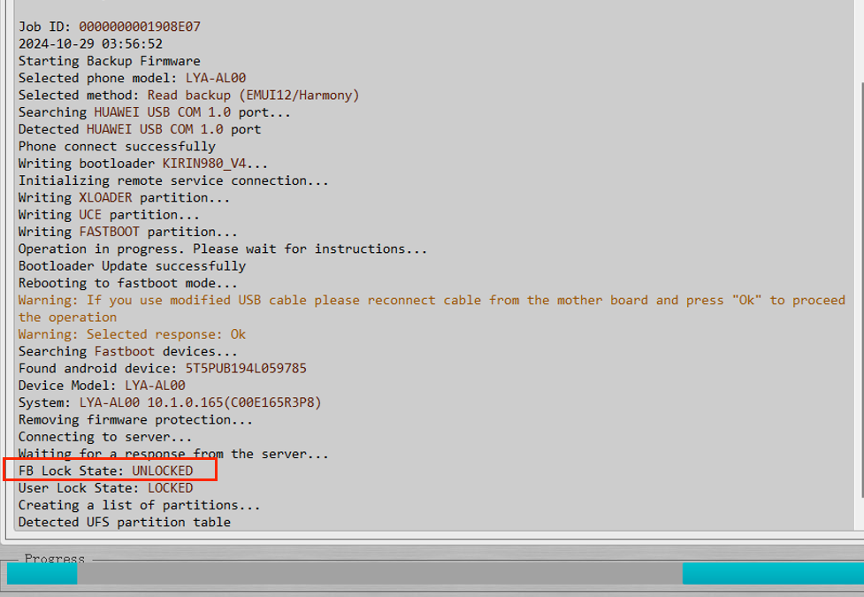

<font style="color:rgb(33, 33, 33);">此时进入解开临时BL的快速工厂fastboot模式。</font>

## <font style="color:rgb(33, 33, 33);">刷入降级包</font>
### 提取ROM
> 下载EMUI9.1.0卡刷包
>
> [https://pan.baidu.com/s/1P8Y7PfwGbmEZ0UX9lLQ3xw?pwd=5zwd](https://pan.baidu.com/s/1P8Y7PfwGbmEZ0UX9lLQ3xw?pwd=5zwd)
>

解压主包后进入`Software\dload`，将里面的三个压缩包进行解压缩。

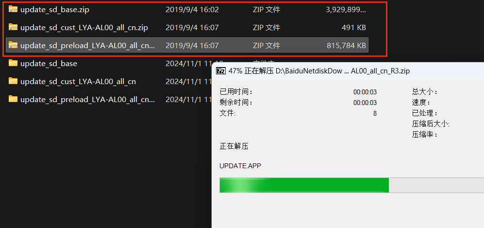

> 下载刷机提取工具
>
> [https://pan.baidu.com/s/1WyFAM1j4w6d1wzLuq7tRWA](https://pan.baidu.com/s/1WyFAM1j4w6d1wzLuq7tRWA)
>

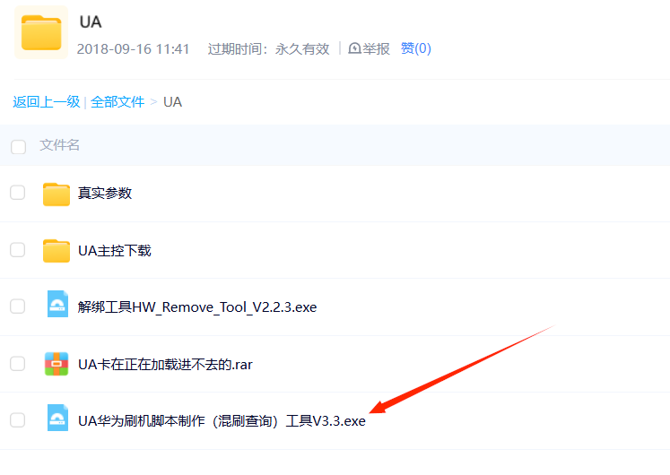

如果提示木马/病毒，请进行忽略。将解压后的三个文件夹拖入工具界面后，点击提取ROM。

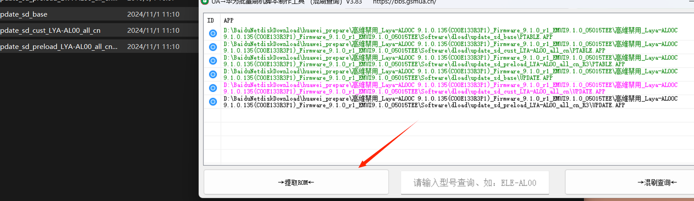

成功后，会在生成一个`LYA-AL00_ROM`目录。

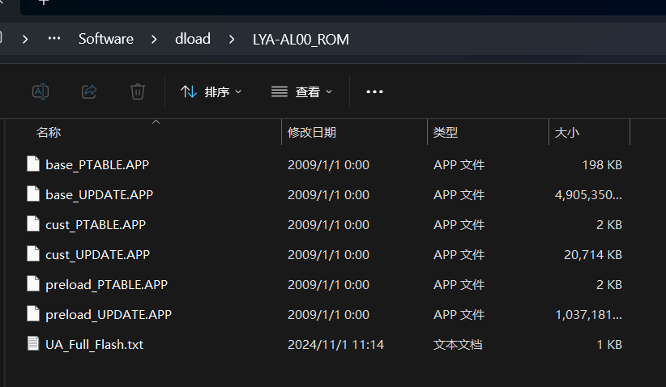

### AU工具刷入系统
> 我试过直接用OC写入Firmware，成功后进入系统却提示Recovery。
>
> 但是使用AU却可以，~~非常玄学~~。
>

打开AU工具，选择Huawei，点Flasher。

1. 在界面的7个选择框（`Click to load ...`）选择我们刚刚提取的ROM，注意需要对应导入，可以参考下图。
2. 导入完后，点击**<font style="color:rgb(33, 33, 33);">Firmware Update （FB）</font>**

<font style="color:rgb(33, 33, 33);">确保你的手机在解开了临时BL的工厂fastboot，然后就会开始刷写。</font>

3. <font style="color:rgb(33, 33, 33);">刷写完成后会显示Done并自动重启。</font>

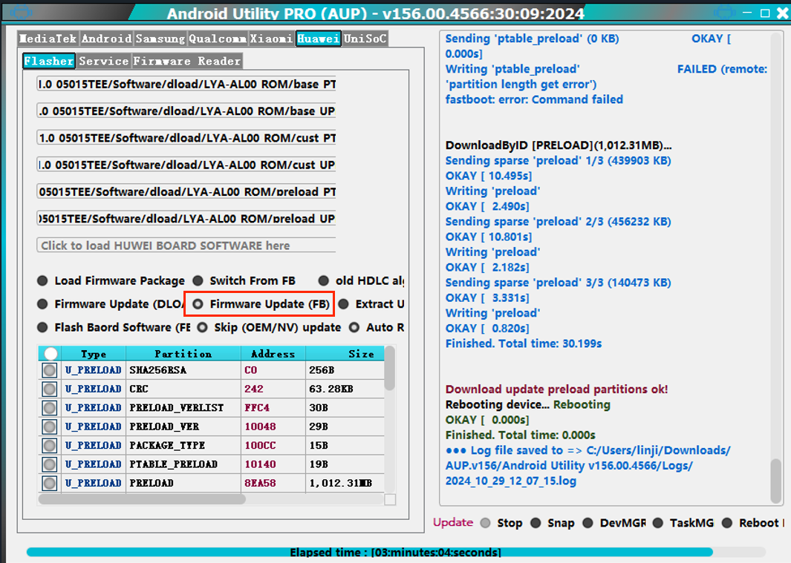

重启后，启动时会出现下图的黄字，说明已经刷机降级并且已经解开了BL锁。

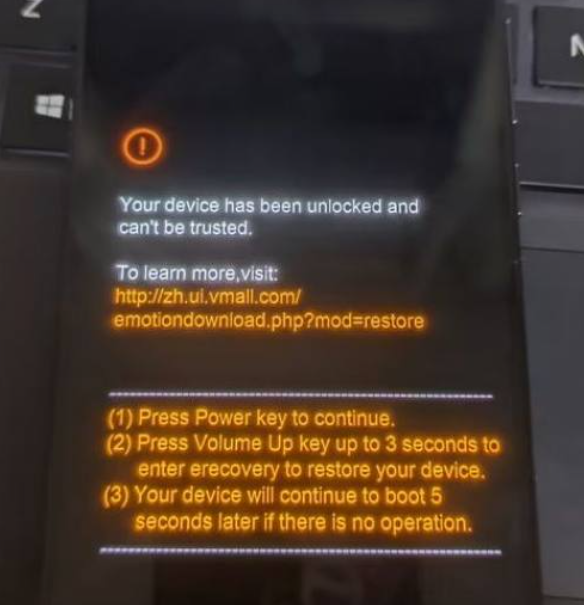

快速完成用户引导后，进入系统可以看到，我们的安卓版本为9。

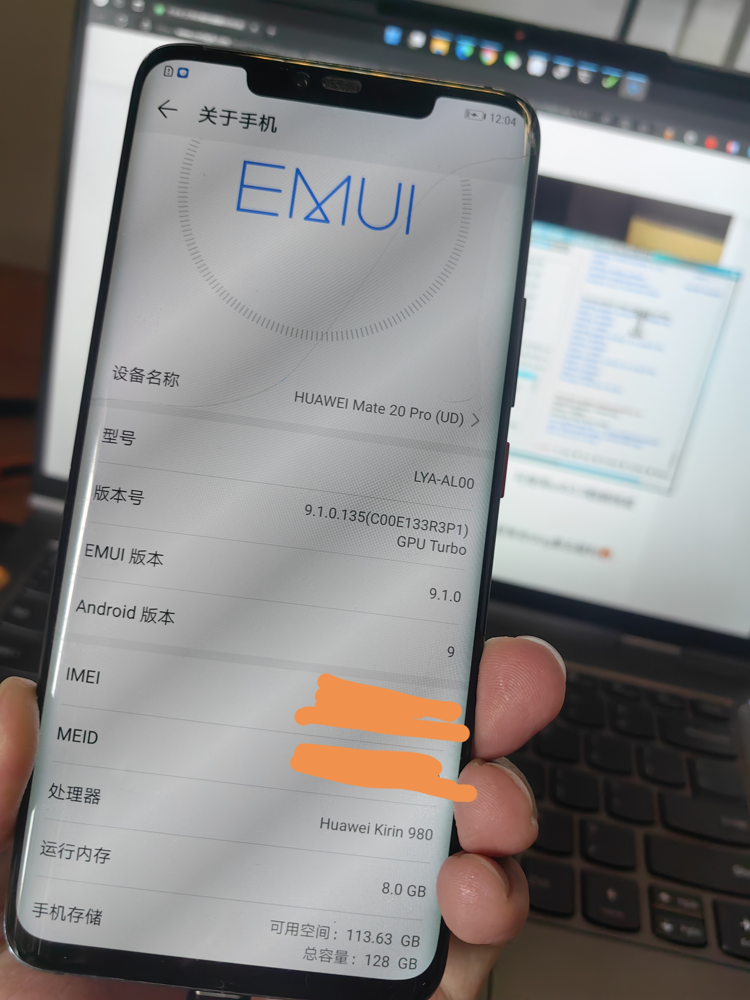

到此我们已经刷机降级并且已经解开了BL锁。

# 0x03 Root
## 提取IMG镜像
> 需要用到 HuaweiUpdateExtractor
>
> 下载地址：[https://androidfilehost.com/?fid=6006931924117931206](https://androidfilehost.com/?fid=6006931924117931206)
>

打开 HuaweiUpdateExtractor，先切到Settings选项卡，将所有选项全部勾掉。

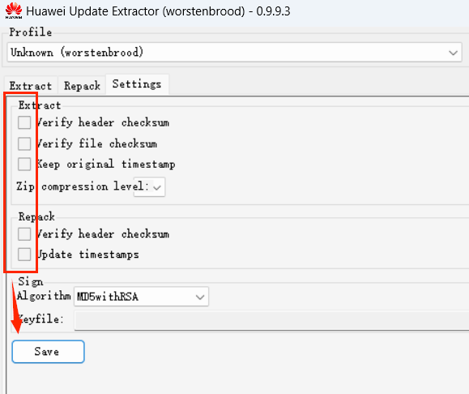

切换到Extract选项卡，将我们之前提取的ROM文件中的`base_UPDATE.APP`拖入到软件中。

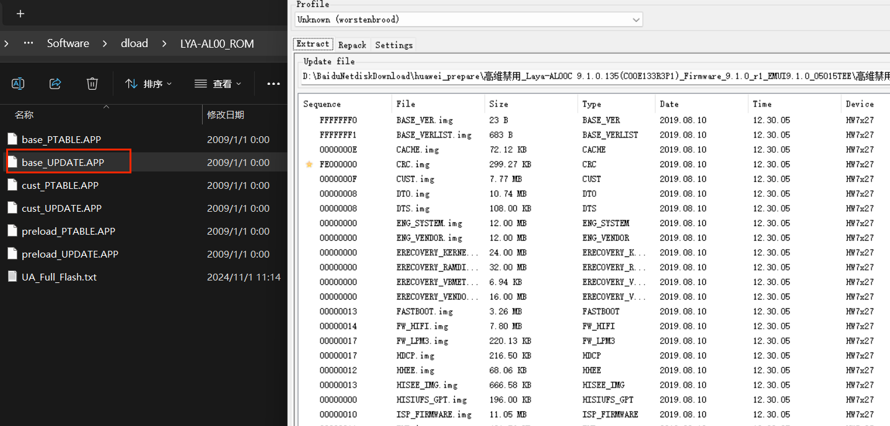

找到`RECOVERY_RAMDIS.img`右键，菜单栏选择第一个。

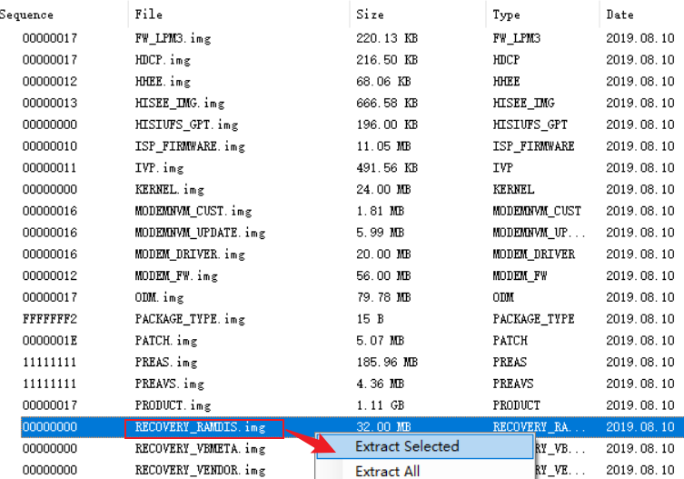

## 安装Magisk
> 下载面具
>
> [https://magiskcn.com/magisk-download](https://magiskcn.com/magisk-download)
>
> 如果你没有ADB工具：
>
> [https://www.123pan.com/s/BTXLVv-Ly113.html](https://www.123pan.com/s/BTXLVv-Ly113.html)
>

这里需要开启ADB：

1. 确保自己打开了开发者模式（设置→系统→关于手机→连续点击版本号七次）
2. 开发者模式开启之后，系统→ 开发人员选项→勾选开启USB调试，勾选开启“仅充电”模式下允许ADB调试
3. 拔插菊花工程线，如果设备管理器还没显示，则按一下工程线上的按钮。

> 我第一次刷完后开机用菊花工程线连电脑没找到ADB，然后下载了一个华为手机助手，激活了授权弹窗。可以用华为助手传输文件。激活授权弹窗后，我就用任务管理器关闭了华为手机助手和一个相关线程`HuaweiHiSuiteService64.exe`（不把这个终止掉，你连接手机会自动弹出华为手机助手的）。
>
> 还有一个我自己用的小妙招，如果上述方法都不行，我就去撤销所有USB授权，然后拔插菊花工程线再试。
>
> 目前很稳定了，基本上就是拔插后，按下菊花工程线按钮就出ADB了。
>

打开CMD输入ADB命令，直接通过ADB命令安装。

下面的命令中，`D:\BaiduNetdiskDownload\`请更换成你自己实际的路径。

```plain
adb install -r D:\BaiduNetdiskDownload\app-release.apk
```

看到Success说明安装成功，打开手机可以看到面具APP。

下面将我们从ROM提取出的IMG传输到手机的`/sdcard/Download`上。

```plain
adb push D:\BaiduNetdiskDownload\RECOVERY_RAMDIS.img /sdcard/Download
```

## 修补IMG
> 参考：[https://magiskcn.com/](https://magiskcn.com/)
>

<font style="color:rgb(51, 51, 51);">打开Magisk：</font>

1. <font style="color:rgb(51, 51, 51);">安装 </font>
2. <font style="color:rgb(51, 51, 51);">选择 RECOVERY_RAMDIS.img</font>
3. <font style="color:rgb(51, 51, 51);">开始修补文件 </font>
4. <font style="color:rgb(51, 51, 51);">修补完成（修补生成 magisk_patched-xxx.img 文件在 Download 目录）</font>
5. <font style="color:rgb(51, 51, 51);">通过adb将</font>`<font style="color:rgb(51, 51, 51);">magisk_patched-xxx.img</font>`<font style="color:rgb(51, 51, 51);">拖到电脑。</font>

```plain
adb pull /storage/emulated/0/Download/magisk_patched-xxx.img D:\BaiduNetdiskDownload\save.img
```

具体路径要从`Output file is written to`下面看到。

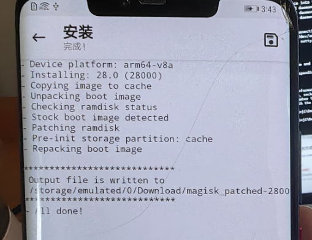

## 刷入 Magisk root
手工进入`bootloader`方法：关机，**按住手机降低音量键（音量下键）后插入数据线**，将进入 bootloader 模式。

成功进入会看到这个界面，也能看到`PHONE Unlocked`。

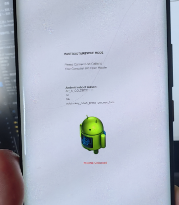

拔插一下菊花工程线，可以在设备管理器中看到ADB interface。打开控制台调用fastboot命令。

```plain
fastboot flash recovery_ramdisk C:\Users\linji\Downloads\huawei_prepare\save.img
fastboot reboot
```

此时回重启手机，重启后我们先关机。

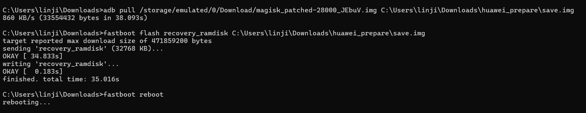

手工进入`eRecovery`方法：关机，**按住音量增加键（音量上键）然后按开机键**，看到Huawei Logo时松开。

然后你应当可以看到下面这个界面，跟我们直接开机进入系统是不同的。

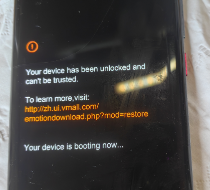

显示Magisk的版本，就是刷好了的。

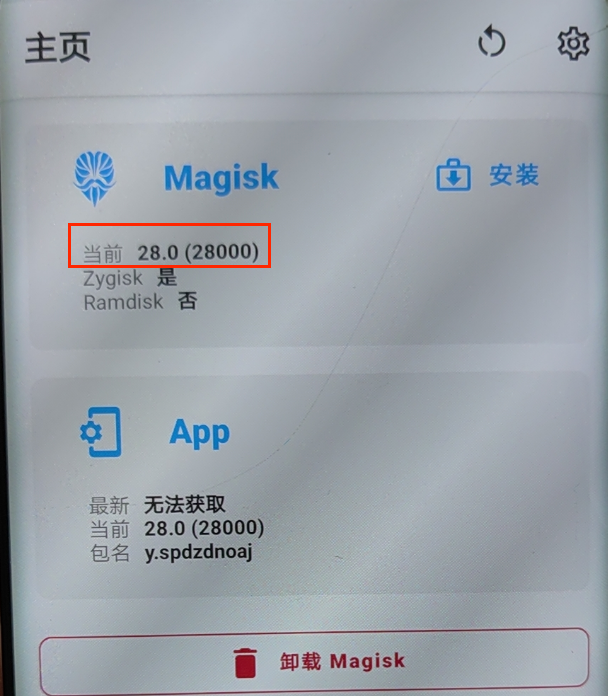

注意：**以后重启请用Magisk的重启到Recovery才有Root，如果直接重启就不会有Root。**

可以通过这种方式来选择Root和不Root的状态。

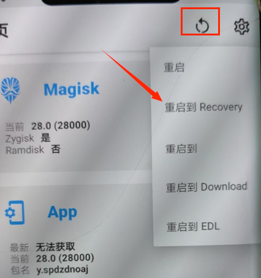

## 如何还原？
如果你不小心通过`fastboot flash recovery_ramdisk`命令刷入了错误的东西，导致你无法正常进入系统，那么你可以重新进入到`bootloader`，刷入我们从ORM提取的IMG。

```plain
fastboot flash recovery_ramdisk D:\BaiduNetdiskDownload\RECOVERY_RAMDIS.img
```

# 0x04 玩机
## 推荐安装的应用
GPS的意思是可以从Google Play Store下载。

### 文件管理类型
+ Root Explorer： [https://rootexplorer.co/](https://rootexplorer.co/)
+ MT管理器：[https://mt2.cn/download/](https://mt2.cn/download/)
+ 钛备份：[https://titanium-backup-root.en.uptodown.com/android/download](https://titanium-backup-root.en.uptodown.com/android/download)

### 应用商店
+ LSPosed：[https://github.com/LSPosed/LSPosed/releases](https://github.com/LSPosed/LSPosed/releases)

安装教程：[https://magiskcn.com/lsposed-install](https://magiskcn.com/lsposed-install)

+ Google Play Store：[https://apkpure.com/cn/google-play-store/com.android.vending/download](https://apkpure.com/cn/google-play-store/com.android.vending/download)

### 手机测试
+ Remote-ADB：[https://github.com/jarhot1992/Remote-ADB](https://github.com/jarhot1992/Remote-ADB)
+ （GPS）WADB：[https://github.com/RikkaApps/WADB](https://github.com/RikkaApps/WADB)
+ drozer：[https://github.com/WithSecureLabs/drozer](https://github.com/WithSecureLabs/drozer)
+ （GPS）SQLite编辑器：[https://apkpure.com/cn/sqlite-database-editor/com.tomminosoftware.sqliteeditor](https://apkpure.com/cn/sqlite-database-editor/com.tomminosoftware.sqliteeditor)

### 网络测试
+ （GPS）Reqable：[https://reqable.com/zh-CN/download](https://reqable.com/zh-CN/download)
+ （GPS）Netstat Plus：[https://apkpure.com/netstat-plus/com.rinacode.android.netstatplus](https://apkpure.com/netstat-plus/com.rinacode.android.netstatplus)
+ VProxid：[https://www.vproxid.com/](https://www.vproxid.com/)
+ SSL Killer：[https://github.com/Xposed-Modules-Repo/com.simo.ssl.killer](https://github.com/Xposed-Modules-Repo/com.simo.ssl.killer)

## 隐藏三部曲
直接参考官方教程即可：[https://magiskcn.com/hide-magisk-app](https://magiskcn.com/hide-magisk-app)

我补充一个知识点：白名单情况下如何授权Root

> 参考：[https://web.vip.miui.com/page/info/mio/mio/detail?app_version=dev.20051&postId=36872874](https://web.vip.miui.com/page/info/mio/mio/detail?app_version=dev.20051&postId=36872874)
>

1. 通过菊花工程线连接电脑开启ADB
2. 通过MT管理器打开文件：/data/system/packages.xml
3. 搜索应用名称获取UID
4. 电脑的CMD进入ADB连接，输入`adb shell`
5. 终端输入su (应用的uid) -c su
6. 此时会弹出授权窗口，点击允许即可。

如下图，应用WADB的UID为10171。

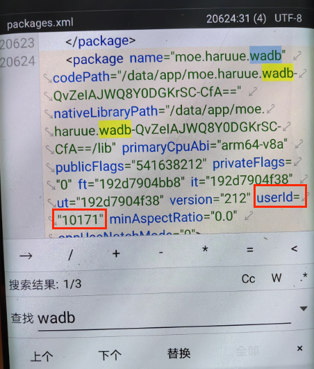

## 关闭华为更新
> 参考：[https://blog.csdn.net/hu1010037197/article/details/122269608](https://blog.csdn.net/hu1010037197/article/details/122269608)
>

进入ADB模式，输入命令。成功后是进不去软件更新界面的。

```plain
adb shell pm disable-user com.huawei.android.hwouc
```

## <font style="color:rgb(33, 33, 33);">Root后短信闪退的修复</font>
> 参考：[【关于mate20 root后 短信闪退... 来自 白檀先生 - 酷安](https://www.coolapk.com/feed/34827566?shareKey=MzE5N2I5ZjdjYTJmNjcyNTA4MDg~&shareUid=3543706&shareFrom=com.coolapk.market_14.5.3)
>

1、下载一个钛备份

2、备份/还原栏搜索 存储

3、清理 联系人存储

4、清理 通话/信息存储

清理完毕后，闪退现象就能修复。

# 0x05 换后盖
因为之前的后盖本身就碎了，前面拆完后盖就完全没法用了。淘宝上购买了华强北发货的副厂后盖（不是拆机）进行更换。

## 清理胶水
第一步得先清理完第一次拆机后遗留的胶水，这里可以使用拆机片抠一个小角，撕拉一下就可以把一圈的胶丝滑的弄掉了。

如果有残留，即顽固胶水，可以通过橡皮擦擦掉。

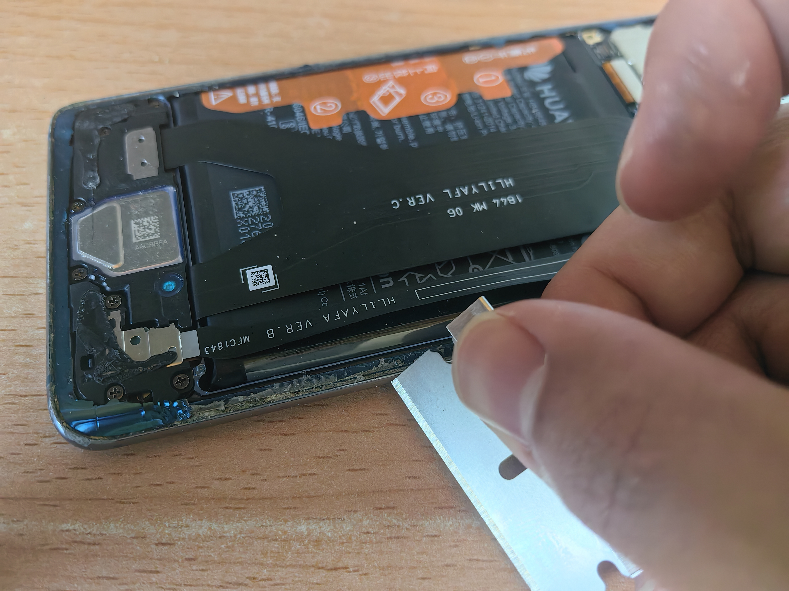

## 扣回主板盖板
这里要将包含了闪光灯、NFC、无线充模块的主板盖板给他扣回去，按照图片先将这个小扣扣好。

再按压盖板，扣好四周，稳固好盖板

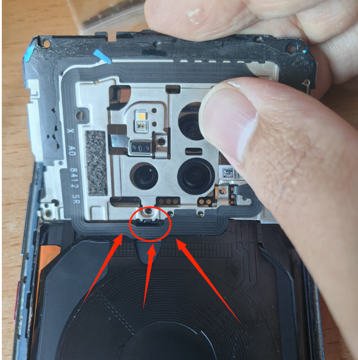

## 上螺丝
将原本的8颗螺丝安装回去。

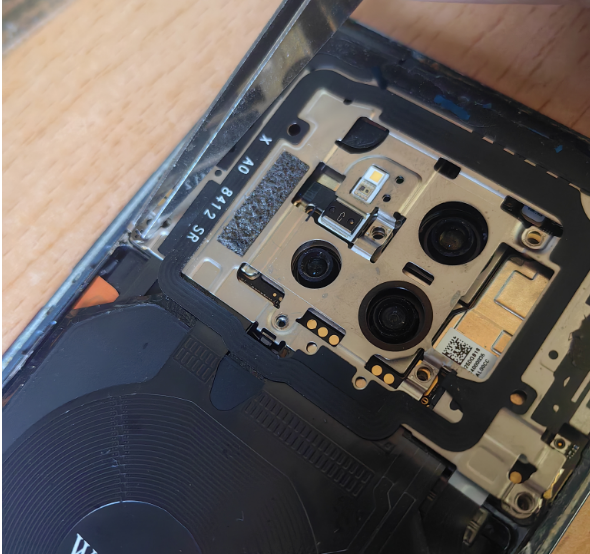

## 擦拭摄像头灰尘
这里用棉签蘸酒精擦拭镜头灰尘。~~原谅我拿了一个带有碘伏的棉签。~~


## 安装后盖
接下来按照商家给的后盖安装视频安装即可，我是没有看直接通过双面胶安装好了。忘记涂些胶水了，涂了能更加稳固。这里吐槽一下，商家没有直接发你视频，除非你问了。而且副厂的后盖缝隙真的很大，容易进入灰尘。

我的解决方案是买了一个透明手机壳，平时带壳使用就好了。

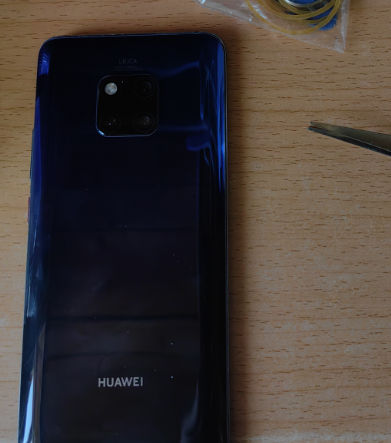

# 0x06 主要参考
+ [千字长文带你解锁麒麟980BL锁！ 来自 Youc_ - 酷安 (coolapk.com)](https://www.coolapk.com/feed/53331650?shareKey=NDFkMjNkMjY3NWQ3NjcyMDQ0OGI~&shareUid=3543706&shareFrom=com.coolapk.app_5.7.5)
+ [华为荣耀Magic2获取系统boot.img 并root 的方式_huawei tny-al00 root-CSDN博客](https://blog.csdn.net/R3332136304/article/details/128897875)

# 0x07 后记
最开始我不了解完整的刷机过程，选择从公众号、抖音、YouTube、B站搜索了一些类似的文章了解到我手上这台`Mate 20 Pro 全网通版 (LYA-AL00)`芯片是麒麟980，能够解锁。这些破碎的信息让我了解到了一些国内外用于解锁的工具。这里不得不说，国内抖音、B站上的一些“专业”商家还打码了这些工具的名称，导致我一知半解，知道从YouTube上看到类似手段后，才知道所谓的专业知识都是一些软件使用教程。并且我通过网盘下载了官方的EMUI10卡刷包，然后通过教程自行从鸿蒙2.0降级到EMUI10，这给了我无比大的信心。

知道如何使用加密狗和软件以及拿卡刷包降级不足以让我了解全面，从淘宝商家上询问后得知需要准备菊花工程线和拆机。这无疑是给我指了一条明路，通过搜索结合从YouTube上看到的拆机接入的工程点位后，成功开启了工程com1.0端口，这无疑是巨大的进步，后面我花费了8美刀购买OC积分得到账号，再花费10RMB购买OC加密狗端口后，疯狂使用OC进行刷机和开启降级，但都不能让我刷到EMUI9，甚至经历了一次“变砖”（因为不小心通过Recovery刷了个其他型号的系统）。

国外的论坛也有说如何进行解锁和Root，但那些教程都太过于久远，参考价值不大。随后我安装了国内的酷安，在板块找到了我想要的答案，顺利的通过教程步骤刷机降级解锁成功。感谢这些人提供的方法，这才是玩机社区该有的分享精神。

