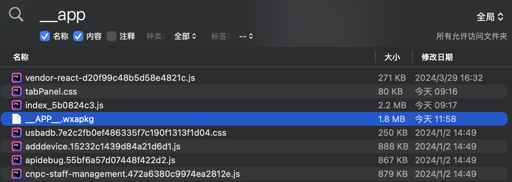
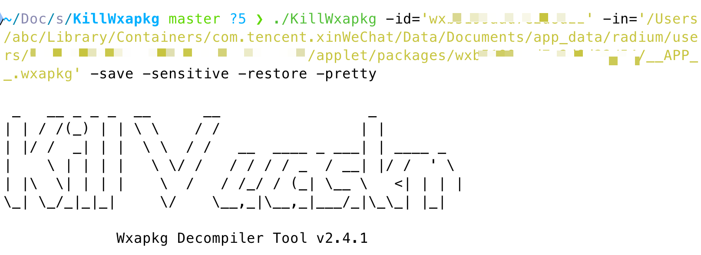

<!--more--> 
Mac的 applet 包的路径可以到下面这个路径查询，进入到users目录。如果你以前登陆过多个微信账户，那么下面可能会有多个文件夹。

```plain
~/Library/Containers/com.tencent.xinWeChat/Data/Documents/app_data/radium/users/
```

进入到用户目录后就可以看到applet目录，在进去两个目录就可以找到`__APP__.wxapkg`。

```plain
applet/packages/wxxxxx/55
```

还有一种快捷的方式，安装文件管理的软件，推荐Qspace，我直接搜索全局，然后按照时间就可以知道哪个是我的目标。



下一步就是解包，我推荐使用KillWxapkg

[https://github.com/search?q=KillWxapkg&type=repositories](https://github.com/search?q=KillWxapkg&type=repositories)

```plain
./KillWxapkg -id='wx' -in='/Users/abc/Library/Containers/com.tencent.xinWeChat/Data/Documents/app_data/radium/users/[id]/applet/packages/wx/54/__APP__.wxapkg' -save -sensitive -restore -pretty
```



详细命令：

```plain
Usage of ./KillWxapkg:
  -ext string
    	处理的文件后缀 (default ".wxapkg")
  -hook
    	是否开启动态调试
  -id string
    	微信小程序的AppID
  -in string
    	输入文件路径（多个文件用逗号分隔）或输入目录路径
  -noClean
    	是否清理中间文件
  -out string
    	输出目录路径（如果未指定，则默认保存到输入目录下以AppID命名的文件夹）
  -pretty
    	是否美化输出
  -repack string
    	重新打包wxapkg文件
  -restore
    	是否还原工程目录结构
  -save
    	是否保存解密后的文件
  -sensitive
    	是否获取敏感数据
  -watch
    	是否监听将要打包的文件夹，并自动打包
```

