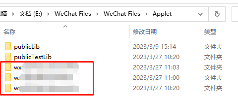
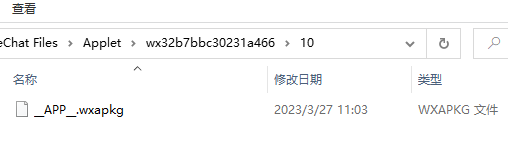
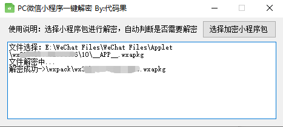
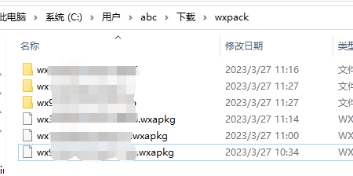
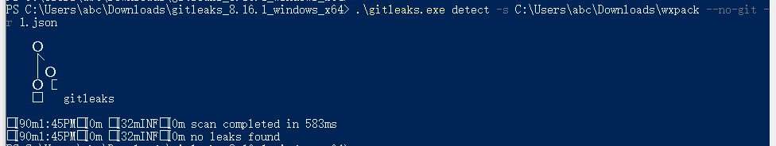

# 微信小程序反编译
### 1. 找到路径
**请先通过PC微信打开小程序哦**
存放小程序文件的地方在 `\WeChat Files\WeChat Files\Applet`
例如我这里是在 `E:\WeChat Files\WeChat Files\Applet`
也可以使用 everything 全局搜索 `.wxapkg` 的文件来定位位置。
进入目录可以看到我打开三个小程序生成的文件。

进入到其中一个可以看到`__APP__.wxapkg`这个就是主包，
如果出现除这个之外的多个的`.wxapkg`文件那么就是主包+分包的形式。

### 2. 解包
Windows上的微信小程序在使用反编译工具进行反编译时可能会出现以下错误：
`Magic number is not correct!`
这是因为需要先解码。我们可以使用 [https://gitee.com/ceartmy/wxappUnpacker-master-master](https://gitee.com/ceartmy/wxappUnpacker-master-master)
因为默认保存的路径是`\Downloads\wxpack`例如我这里的是`C:\Users\abc\Downloads\wxpack`
所以需要在`Downloads`目录下创建命名为`wxpack`的文件夹。
之后可以选择指定的`__APP__.wxapkg`文件进行解包了。

### 3. 反编译
我推荐使用 [https://github.com/system-cpu/wxappUnpacker](https://github.com/system-cpu/wxappUnpacker) 这个工具。
在使用时需要**先安装nodejs的运行环境**。
```
git clone https://github.com/system-cpu/wxappUnpacker 
cd wxappUnpacker
npm install
npm install esprima
npm install css-tree
npm install cssbeautify
npm install vm2
npm install uglify-es
npm install uglify-js
npm install js-beautify
```
然后使用`node wuWxapkg.js wx6666666666.wxapkg`命令就能解包了

# 硬编码扫描
目前公网上最好用的应该是
[hthttps://github.com/gitleaks/gitleaks/releases](https://github.com/gitleaks/gitleaks/releases)
下载Windows压缩包到本地后可以使用命令：
`gitleaks detect -s <source_path> --no-git -r <outfile_path>`
例如：
`.\gitleaks.exe detect -s C:\Users\abc\Downloads\wxpack --no-git -r 1.json`

这种情况是没有扫出硬编码问题，如果有的话可以在`gitleaks`的目录下找到 1.json 文件获取详细内容。

