# 前言
支付漏洞是一个攻击者可以通过利用漏洞，窃取用户支付信息或篡改订单，从而获得非法利益。这些漏洞可能源自支付系统的设计缺陷、开发过程中的疏忽、系统配置不当、网络攻击等多种原因。因此，支付漏洞的存在会给用户和商家带来严重的经济损失和信任崩溃。为了保障支付安全，企业需要不断加强对支付系统的监控、修复漏洞、加强用户认证等措施。
## xxxx门诊部商城
在某次项目中关注了一个公众号，在这个公众号服务中我发现有一个商城。（ps:每次看到这种商城，都会看看卖些什么东西）
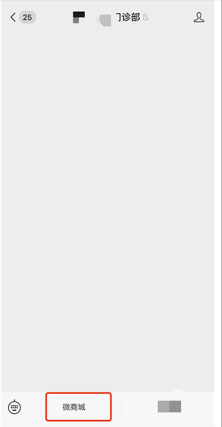

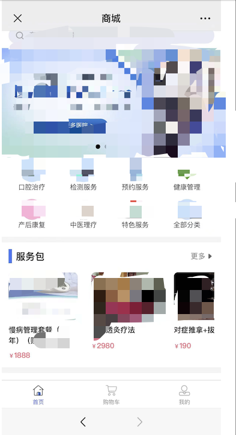
（好像都是服务类的商品，什么针灸，推拿。。。）
直接买吧
我这里挑选第一个慢病管理套餐
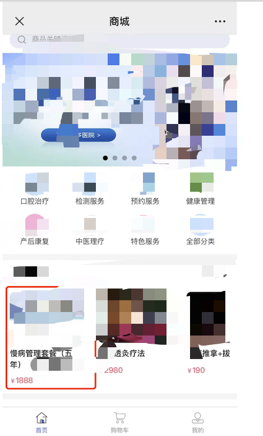
打开我的burp，这里用手机抓包的话是需要设置一个代理的，当然手机和电脑要在同一个wifi下
burp端：
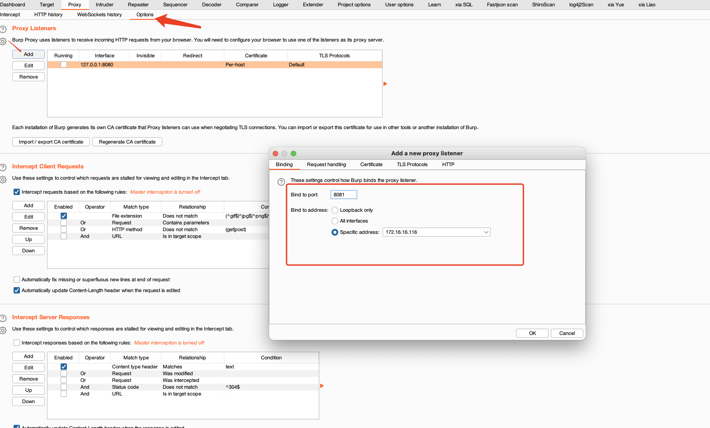
手机端：
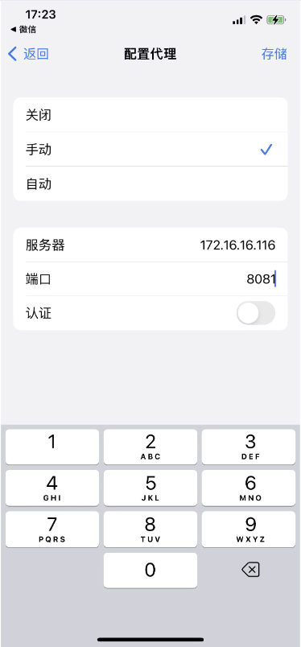
设置完成，那么接下来进行登录了测试

## 测试步骤

1、在“我的”页面中需要进行登录。这个时候注册一下
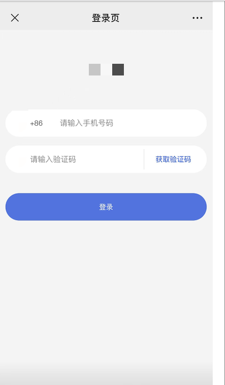
2、返回到首页，点进刚刚那个1888的套餐，直接立即购买，生成一个订单
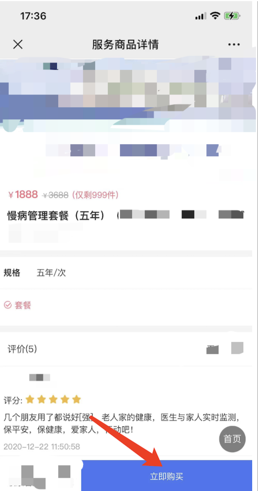
3、点击立即购买，数据包如下图所示：
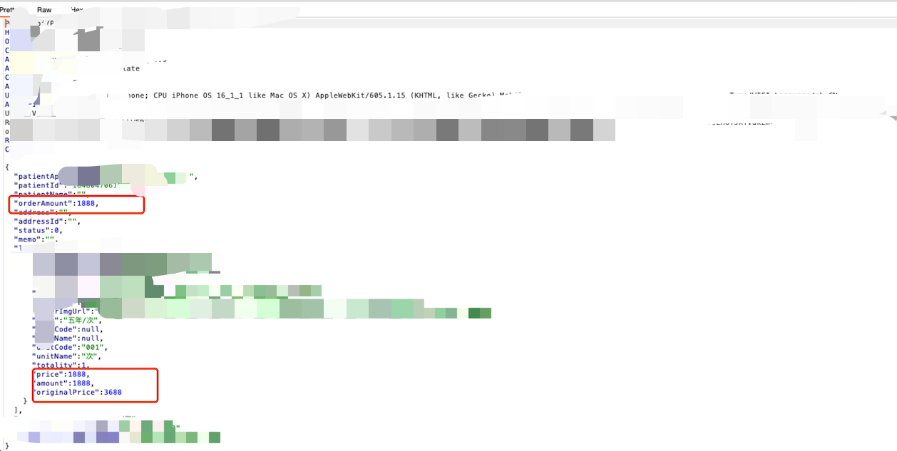
4、我将金额改成负数，发包，重放。页面显示值最低最小值1，我不信，超过0.01我就不买了
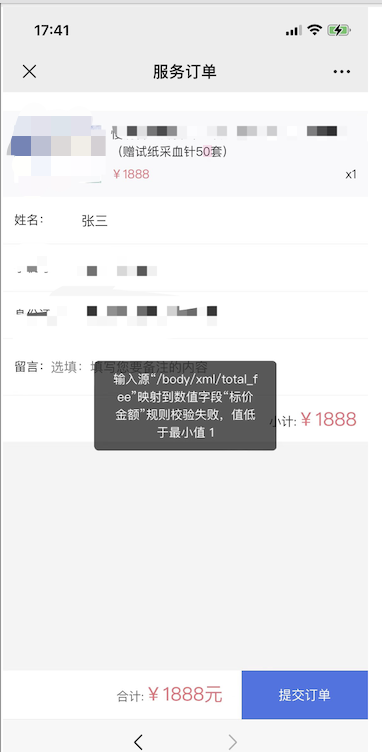
5、再抓一次包，将金额设置成0.01，数据包如下所示：
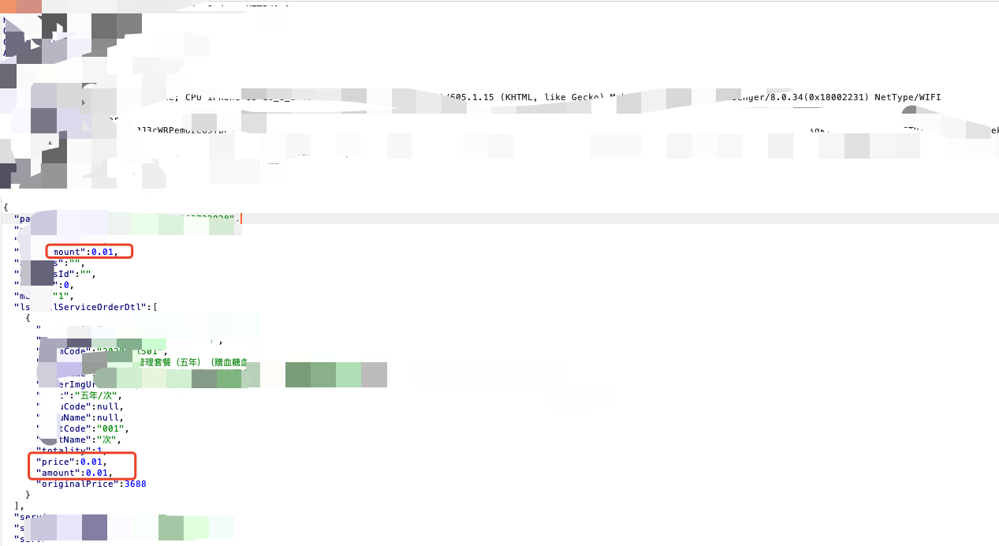
6、经过层层放包，出现了一个可以修改金额的数据包，不放过，继续改：
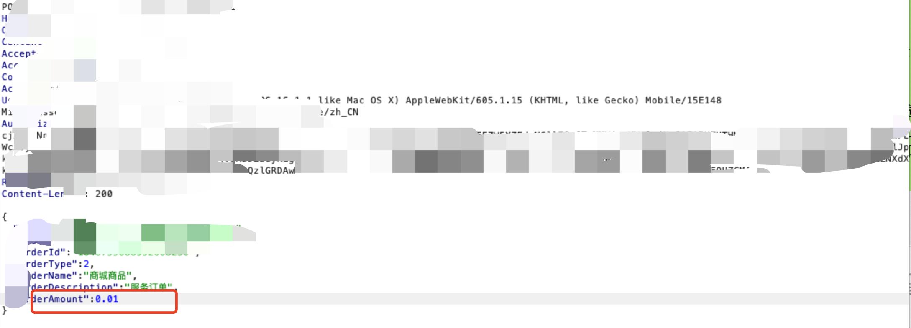
7、手机端页面跳转到付款界面，如下图所示：
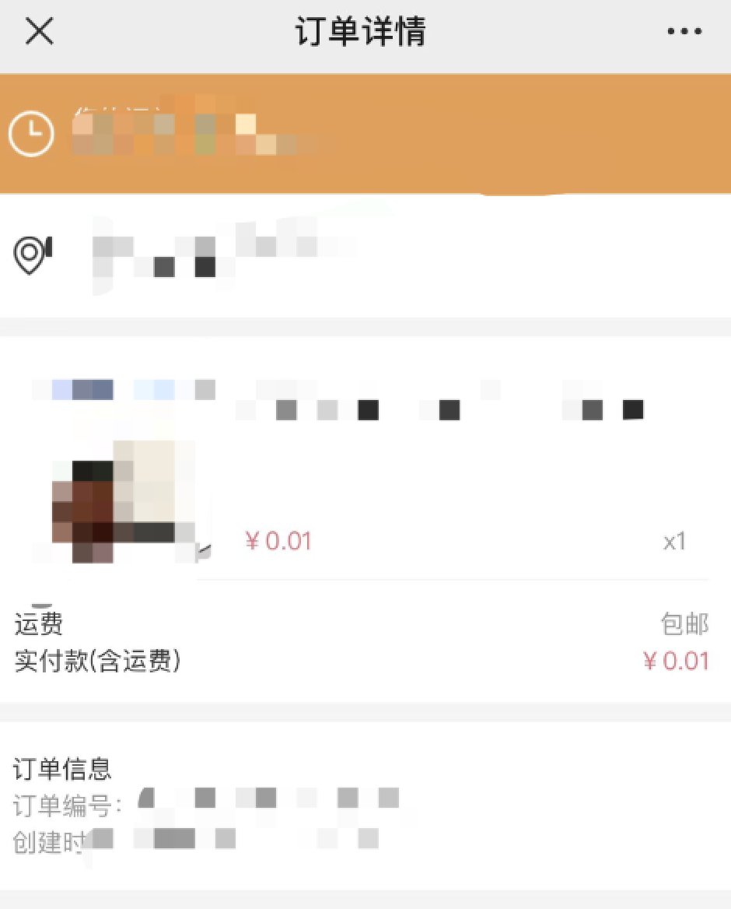
可以看到成功修改了（还说不能低于1）
8、后面就之间付款啦
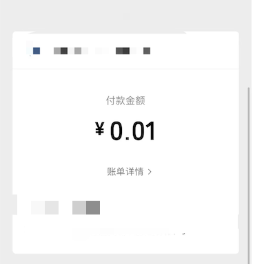
9、订单页面：
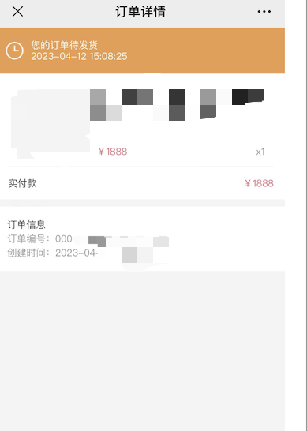
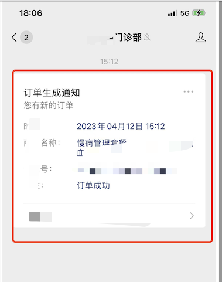
后面还发短信了
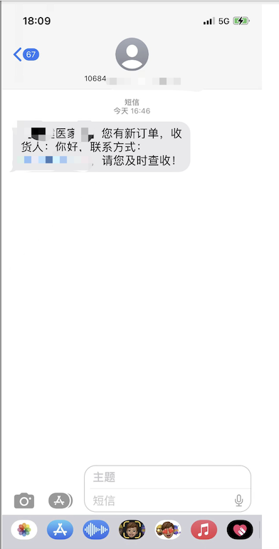
## 总结
一分钱购物逻辑漏洞的流程基本上是这样的：用户进入网站，浏览商品，选择商品后进行抓包，修改数据包里面的金额、数量等等，每种情况都可以试一下，最好不要放过任何一个数据包。接着进入支付页面，输入支付密码即可支付成功。（ps:本次测试是在有授权的情况下进行测试，对此记录一下）

