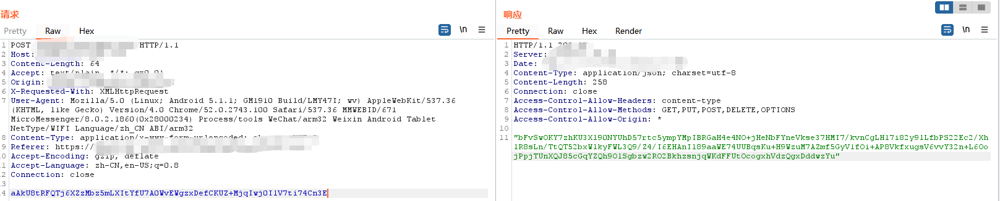
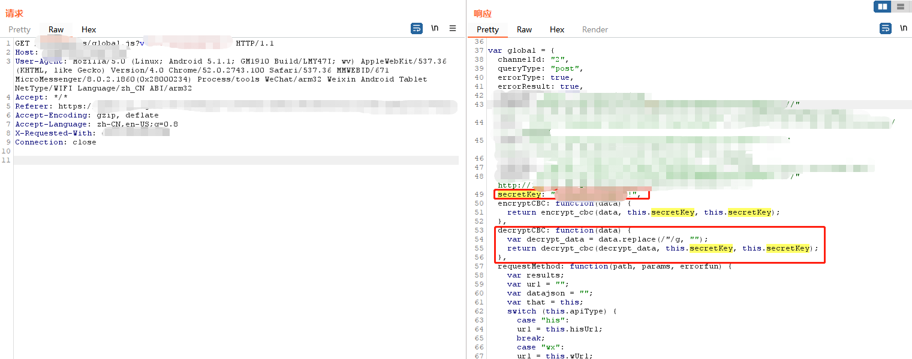
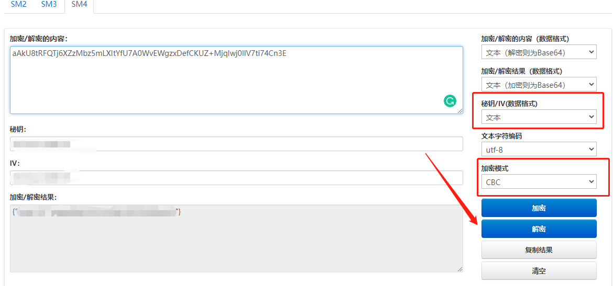
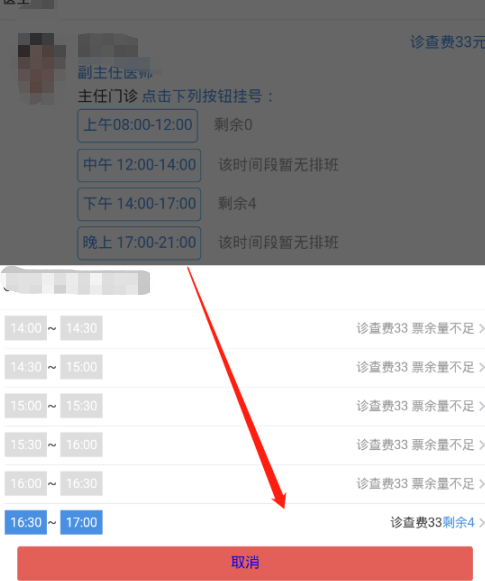
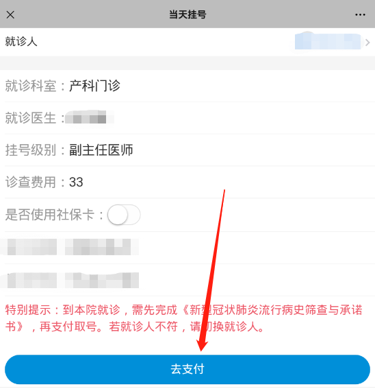
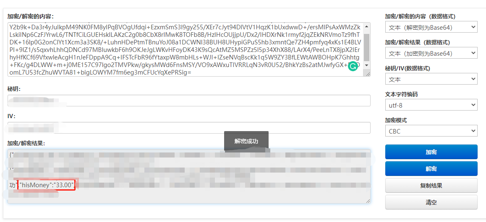
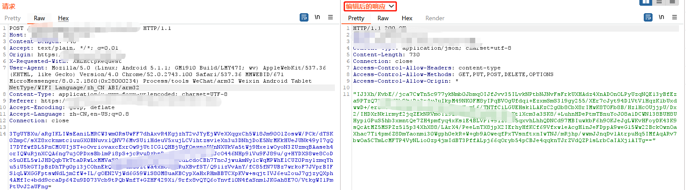
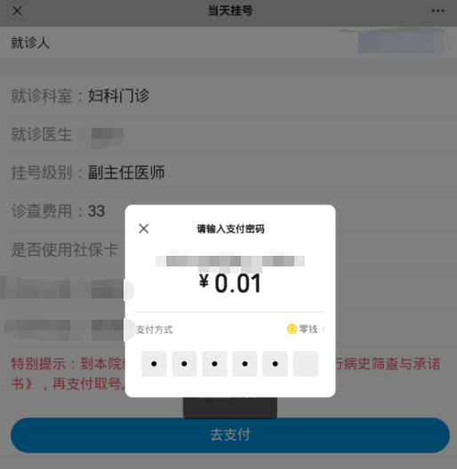
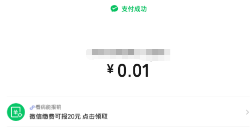

<!--more--> 
接到一个小程序测试的任务，获取资产后通过burp进行测试，发现整个小程序的传输数据包内容经过了加密。

小程序都是使用API的方式请求，那么如果使用加密的话，前端一定会有加密函数。通过Burp suite观察Js传输包。发现是使用CBC加密，并且有硬编码的secretKey。

这里的解密函数使用的不是AES的CBC，而是国密SM4的CBC加密模式，因为它引用了sm4.js。可以通过[http://lzltool.com/SM4](http://lzltool.com/SM4) 在线进行解密。

这里使用CBC加密模式需要密钥和IV保持一致，最终解出了我们想要的内容。

这个小程序是一个医疗小程序，它存在挂号系统，那么挂号是存在金额支付过程的。

我们随意找一个医生预约任意一个时间段，点击进入挂号页面。

点击去支付并进行抓包，对返回包进行拦截。在进行支付的时候，会产生很多种包，其实该小程序有做过金额数比对的，只不过是在对比数据库时进行的校验，没有在申请微信支付的请求中对订单金额进行校验。流程是创建订单->对比数据库->申请微信支付->创建微信支付->支付完成。

对原始数据返回包进行解密，发现有一个参数决定了金额大小。这里我将金额改成 0.01 重新进行加密。将加密后的密文替换返回包内容。下面是完整的交互包。放包后不拦截后面的数据包。

放包后提示我支付0.01 按照流程支付即可。

支付成功截图。

在挂号记录中的挂号记录可以看到已取号。

