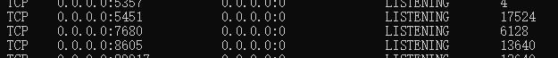
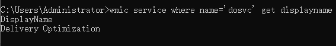

<!--more--> 
> 此篇为转发文章，[点击查看原文](https://huaweicloud.csdn.net/635644e9d3efff3090b5cfc9.html)。

**简介：** 对通过服务启动的进程查找主进程，出现大量7680端口的内网连接，百度未找到端口信息，需证明为系统服务，否则为蠕虫。
###  1、 确认端口对应进程PID 
`netstat -ano`

7680 端口对应 pid：6128
### 2、 查找pid对应进程 
`tasklist | find "6128"`

对应进程为svchost.exe ，为系统服务进程，是从动态链接库 (DLL) 中运行的服务的通用主机进程名称,许多服务通过注入到该程序中启动，所以会有多个该文件的进程。说明进程是从服务启动的，去找对应的服务。
### 3、 查找对应pid 6128的服务名称
`tasklist /svc | find "6128"`

服务名为：DoSvc ,进入“服务”查找该服务，但是你可能会找不到该服务，因为上面找到的是“**服务名称**”，而管理工具“服务”里显示的是“**显示名称**”
### 4、 可以通过命令查找对应的“显示名称” 
`wmic service where name = "dosvc" get displayname`

得到“显示名称”：Delivery Optimization
### 5、 关闭“传递优化”服务
微软查询得到 Delivery Optimization 为 Windows10 补丁更新的一种模式叫“传递优化”，内网主机可以从已经下载的主机里下载补丁，同时也就占用了你主机的网速，神坑

关闭该端口： “更新”-“高级选项”中-“传递优化”-“关闭允许从其他电脑下载”
许多后门也是利用“服务”来加载进程，造成进程里无法直接查看到主进程名
