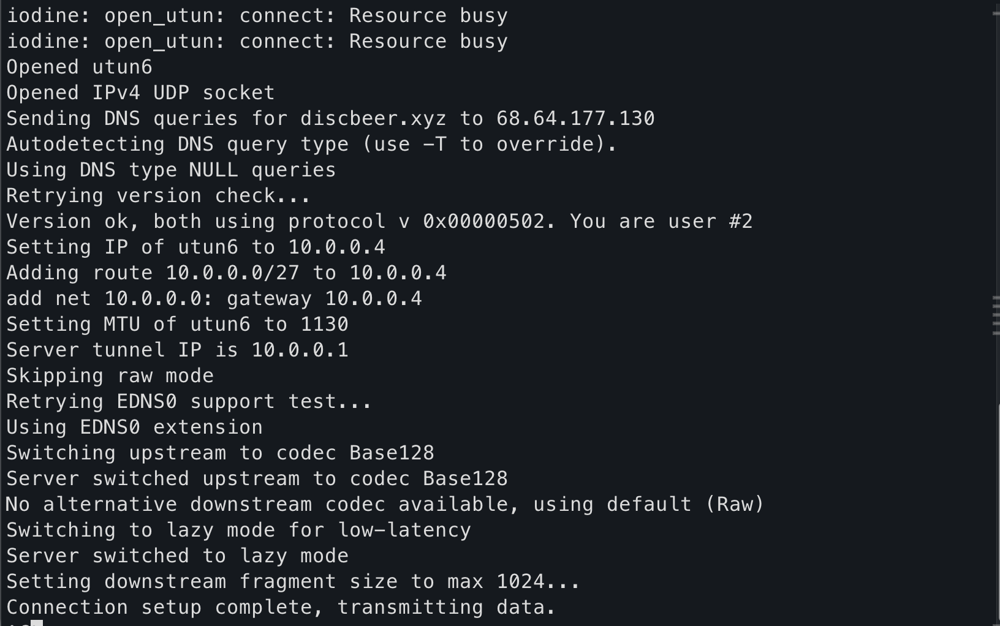
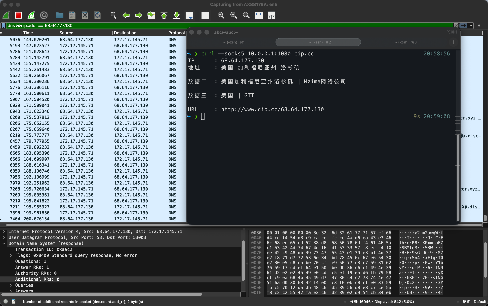

<!--more--> 
# 0x00 前言
在一个不能访问外网的机器上，我想使用DNS隧道突破这个限制，并且通过隧道访问外网。

iodine + SSH 是一种经典的“多层隧道”组合方案，主要用于：

+ 仅允许 DNS 出口 的受限网络
+ 防火墙 / 审计 / DPI 严格的环境
+ 应急通信、穿透实验、网络原理学习

那么有什么缺点？

+ 带宽极低，DNS 报文长度受限的情况下还使用Base 编码膨胀（Base128 也有开销）。**DNS 从来就不是为数据传输设计的协议**
+ 丢包放大效应，一个 fragment 丢失，整个IP包都需要重新传。
+ 空闲即断，iodine 没有内建 keepalive。我就遇到`No downstream data received in 60 seconds`断联的问题。
+ 环境对其影响大，DNS 隧道容易被NAT 超时、运营商 DPI、公共 DNS 重写、UDP 被限速影响。
+ DNS 流量本身极其“显眼”，DNS 频率异常、Query 名超长、NULL / TXT RR、Base 编码特征明显。
+ 除了上述的缺点，我认为还有一个，它没有办法处理全局代理，要是有两个终端同时执行curl请求，他们就会冲突。尽量让他只跑一个任务好吗。TwT

# 0x01 前提条件
1. 你需要有一个域名，域名的A记录必须对应的是服务器IP，千万不要使用cloudflare代理！
2. 你需要有一个服务器，我使用的国外的服务器，可以使用53端口。
3. 服务端和客户端都需要安装iodine。

# 0x02 先行了解
1. iodine 的作用是什么？

iodine 把“IP 数据包”伪装成“DNS 查询和响应”，从而在只能出 DNS 的网络里通信

```shell
IP 包
 ↓
tun/utun 虚拟网卡
 ↓
iodine 客户端
 ↓
把 IP 包切碎 + 编码
 ↓
塞进 DNS Query / DNS Response
 ↓
DNS 服务器（iodined）
 ↓
解码 → 还原 IP 包
```

2. tun/utun 在里面的角色

tun是一个虚拟三层网卡，你在使用代理软件时，如clash可以安装tun虚拟网卡来进行全局代理。而且可以将所有的协议都代理到。例如ICMP（ping）、TCP（SSH / HTTP）、UDP。

3. SSH 在 iodine 里的角色

在建立DNS隧道之后，SSH能够提供一个 高层的、安全、可控的代理。不然DNS隧道很容易断联，有keepalive，还能提供加密服务。

# 0x03 步骤
## 服务端
1. 安装 iodined

```shell
apt update
apt install -y iodine openssh-server
```

2. 启动 iodined（DNS 隧道服务端）

```shell
iodined -f -c -P 你设置的密码 10.0.0.1 abc.com

# 测试成功后可以将它放到后台运行
# nohup iodined -f -c -P 你设置的密码 10.0.0.1 abc.com &
```

参数说明：

+ f：前台运行（调试用）
+ c：允许多个客户端
+ P disc：共享密码

10.0.0.1：隧道内服务端 IP

abc.com：隧道域名

注：放到后台可以查看日志输出`cat nohup.out`

成功标志：

出现客户端连接日志

生成接口 dns0

3. 开启 IP 转发

```shell
echo 1 > /proc/sys/net/ipv4/ip_forward
```

永久生效：

```shell
sysctl -w net.ipv4.ip_forward=1
```

4. 配置 NAT（让客户端流量出公网）

假设公网网卡为 eth0：

```shell
iptables -t nat -A POSTROUTING -s 10.0.0.0/27 -o eth0 -j MASQUERADE
iptables -A FORWARD -i dns0 -j ACCEPT
iptables -A FORWARD -o dns0 -j ACCEPT
```

5. 启动 SOCKS（通过 SSH）

强烈建议仅监听隧道地址：

```shell
ssh -f -N -D 10.0.0.1:1080 root@localhost
```

参数说明：

+ D = Dynamic Port Forwarding（动态端口转发）在本机监听一个 SOCKS5 代理端口。当前在 10.0.0.1 上开启一个 SOCKS5 代理端口 1080。
+ N = Do not execute a remote command 即不启动 shell、不执行 bash、不跑任何远程命令
+ f = Requests ssh to go to background just before command execution. SSH 连接成功后**自动进入后台运行**释放当前终端。可以解决关闭SSH窗口就停止转发的问题。

说明：SOCKS5 代理监听在 DNS 隧道内，不会暴露到公网

## 客户端
1. 安装 iodine

macOS：

```shell
brew install iodine
```

Linux：

```shell
apt install iodine
```

2. 启动 iodine 客户端（稳定推荐命令）

```shell
sudo iodine -f -P 你设置的密码 -r -T -m 1024 -L 1 你的服务器IP abc.com
```

关键参数：

+ r：禁用 raw UDP，仅 DNS
+ T：使用 TCP DNS（更稳定）
+ m 1024：降低 fragment size 防丢包
+ L 1：lazy mode

成功标志：

出现 **Connection setup complete**



客户端获得 10.0.0.x

3. 使用 SOCKS 代理访问公网

```shell
curl --socks5 10.0.0.1:1080 cip.cc
```



