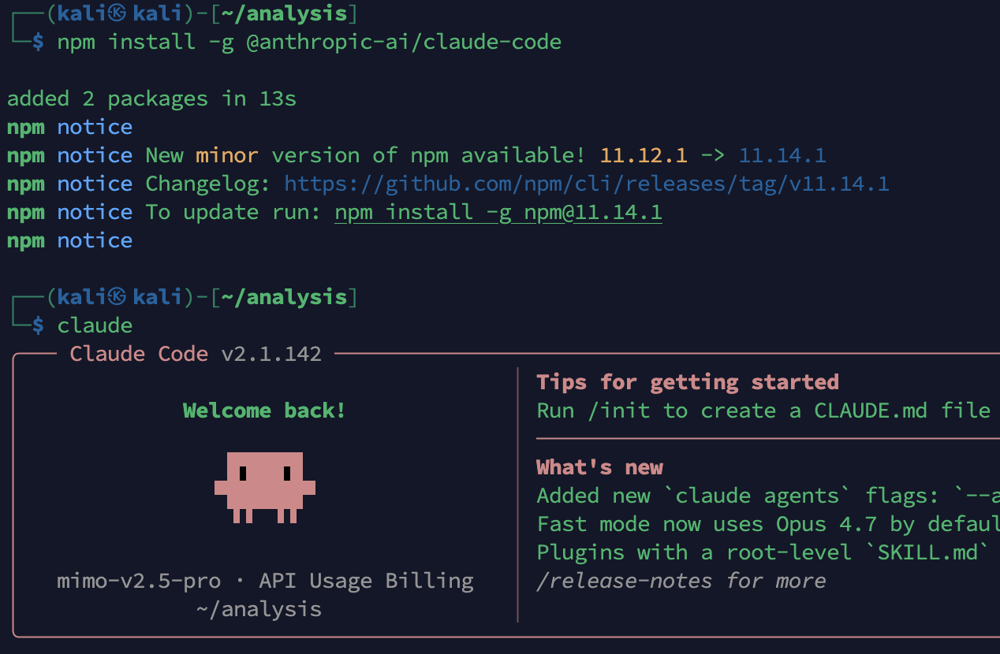

<!--more--> 
# 0x00 安装 nodejs 环境
`nvm`（Node Version Manager）是一个非常优雅的工具，它让你能在用户级别安装和管理多个独立、互不干扰的 Node.js 版本。整个过程无需`sudo`权限，彻底告别权限错误。

1. **安装依赖与环境**

```bash
sudo apt update
# 安装构建工具和 curl，这是安装 nvm 和编译某些原生模块所必需的
sudo apt install build-essential curl -y
```

2. **安装 **`nvm`  
使用官方安装脚本，它会自动将`nvm`配置到你的 shell 环境中。

```bash
curl -o- https://raw.githubusercontent.com/nvm-sh/nvm/v0.39.7/install.sh | bash
```

访问速度过慢时可以使用国内代理，网址是：[https://gh-proxy.com/](https://gh-proxy.com/)

```bash
curl -o- "https://gh-proxy.org/https://raw.githubusercontent.com/nvm-sh/nvm/v0.40.3/install.sh" | bash
```

3. **重启终端或加载配置**  
关闭并重新打开终端，或者执行以下命令让配置立即生效：

```bash
source ~/.bashrc
# 如果你使用的是 Kali 默认的 zsh，请用 source ~/.zshrc
```

4. **安装并使用 Node.js**  
你可以选择安装最新的长期支持版（LTS）或特定的版本号。

```bash
# 安装最新的 LTS 版本
nvm install --lts
# 使用刚安装的 LTS 版本
nvm use --lts

# 或者，安装其他特定版本，例如 v22
nvm install 22
```

5. **验证安装**

```bash
node -v   # 应显示 v22.x.x 或更高
npm -v    # 应显示 10.x.x 或更高
```

# 0x01 安装 Claude
一行命令即可

```bash
npm install -g @anthropic-ai/claude-code
```

安装完成后输出`Claude`即可打开Cli



