<!--more--> 
# IdaPro9.3
资源出处：[https://bbs.kanxue.com/thread-290063.htm](https://bbs.kanxue.com/thread-290063.htm)

使用9.3没有9.0的30016报错问题。

## 安装
#### 复制激活脚本到目录
复制`crack_ida90_beta.py`到包内容路径

默认路径为：`/Applications/IDA Professional 9.3.app/Contents/MacOS/`

#### 改名并执行脚本
将libida32.dylib改成libida64.dylib后执行python脚本

#### 改名并覆盖原文件
将生成的libida.dylib.patched和libida.dylib64.patched改名，删除.patched后缀和将64改成32，然后覆盖原文件。

#### 复制许可证并导入
将activation中的idapro.hexlic复制到～/.idapro  
启动 IDA Pro，进入 License manager，选择 “Use local idapro.hexlic file”*，浏览并选中第一步生成的 .hexlic 文件，点击 OK。

#### 验证结果
验证结果，点击 Help -> About，如果看到如下方图片所示，则说明大功告成。

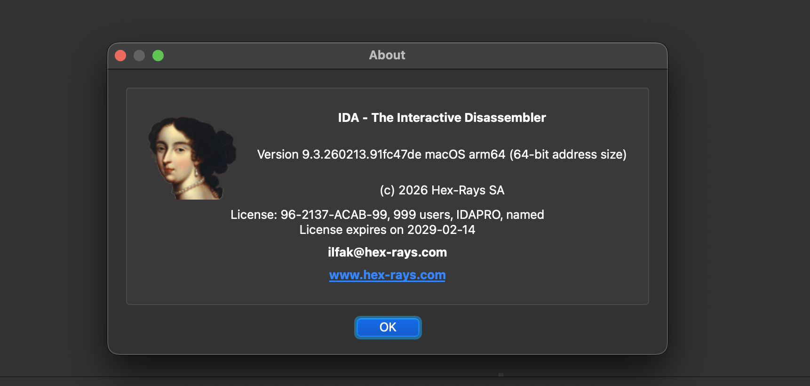

# IdaPro9.0
原文出处：[https://bbs.kanxue.com/thread-282846.htm](https://bbs.kanxue.com/thread-282846.htm)

> 这里提醒一下，我本来试过每次安装都要重新生成patched文件
>
> 在安装ida90的时候，提示需要python3.4或者更高的版本，如果你的电脑没有的话就自己安装升级一下吧。
>

在你的终端中输入`csrutil status`。如果显示：`System Integrity Protection status: disabled.`。那么你可以直接忽略这一步进入到下面的安装环节了  
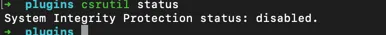

## 如何关闭SIP
1. Apple Silicon Mac 在关机时按住电源按钮（大约10 秒）。
2. 然后转到“选项”。您可能需要管理员密码。
3. 输入解锁密码后，在左上角点击实用工具并点击终端
4. 终端内输入命令：`csrutil disable`，然后回车执行输入电脑密码。
5. 提示输入y/n，输入y。回车后输入电脑密码
6. 等待一段时间，大概几秒左右。提示完成后重启电脑就好了

> 如果关闭sip有问题的话可以百度一下，其实教程很多也很详细。这里写一下只是为了让这篇文章看起来字多一些。
>

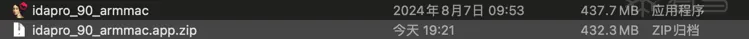

## 安装
双击打开`idapro_90_armmac`进入到安装界面

这里可能会有一个小插曲，就是不让你打开这个文件。提示：apple无法检查其是否包含恶意软件（图片网上找的，我自己的没截图）  
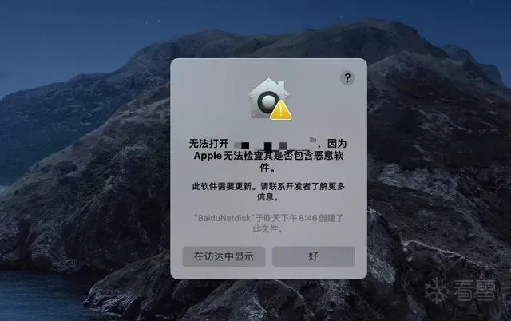  
解决方法：打开设置->隐私与安全性->安全性->允许打开这个文件。然后再打开这个文件就行了

> ps: 这个时候不要着急打开软件嗷。还要进行一些文件的替换以及删除  
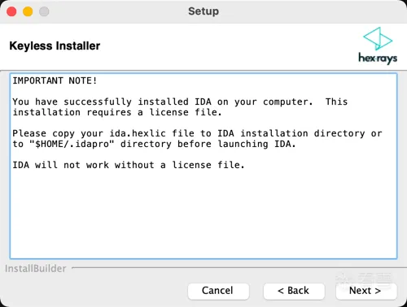
>

这个时候`crack_ida90_beta.py`文件就派上用上咯。需要将默认的`libida.dylib`、`libida.dylib`文件替换

1. 拿到ida安装目录下的`libida.dylib`、`libida.dylib`文件。与`crack_ida90_beta.py `文件放在同一个目录下。ida默认安装目录是：/Applications/IDA Professional 9.0.app/Contents/MacOS/  
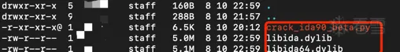
2. 使用python3命令执行`crack_ida90_beta.py`脚本  
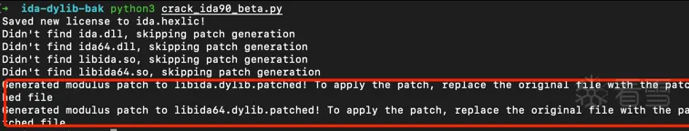  
这里就提示.patched文件生成完成了。上面的dll、so文件没有生成不需要关心，那个是linux和win系统需要使用的
3. 执行后会生成`idalic.hexlic`、`libida.dylib.patched`、`libida64.dylib.patched`三个文件  
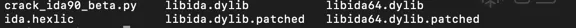
4. 将`idalic.hexlic`许可证文件复制到`$home/.idapro`目录下。如果不知道`$home`目录在哪里可以使用`echo $home`打印出来。这是讲ida.hexlic复制到`$home/.idapro`目录下的结果  
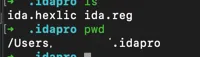
5. 将libida.dylib.patched、libida64.dylib.patched替换掉安装目录下默认的libida.dylib、libida64.dylib文件。这里就不放图了，应该都能完成吧

到这里你的ida就破解完成了。  
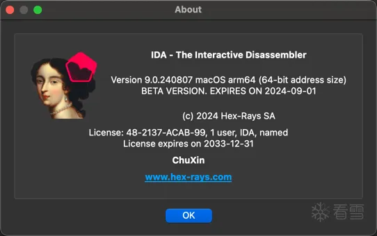

ps ：许可证文件路径是可以修改的。默认是在`$home/.idapro`目录  
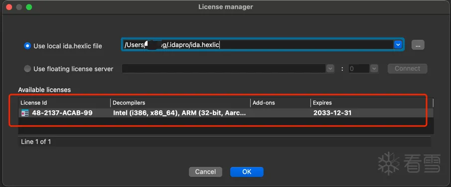

## 问题
### 问题1：软件崩溃了。
报错提示：System Integrity Protection Enable。这个问题就是没有将SIP机制关闭，回到上面的教程把SIP关闭就行了

这个问题不知道是不是只有我才出现了。

### 问题2：Oops! internal error 30016 occurred
解决方法就是将`/Applications/IDA Professional 9.0.app/Contents/MacOS/plugins/arm_mac_user64.dylib`文件去除就行了。  
这里我没有删除，而是将`arm_mac_user64.dylib`文件名称修改为：`arm_mac_user64.dylib.bak`防止后面需要使用到

