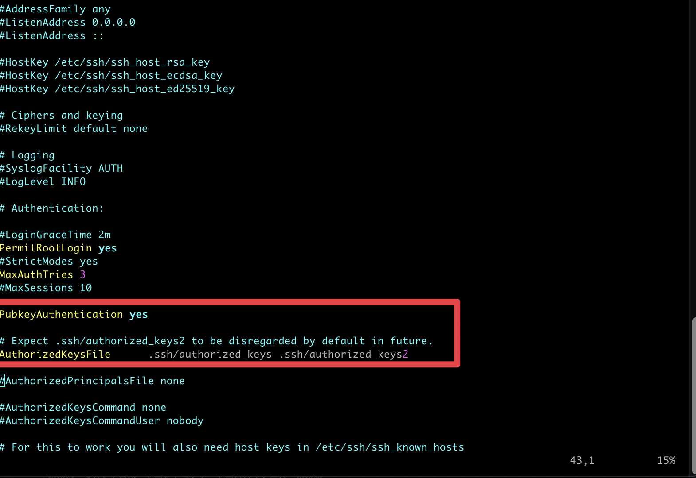

<!--more--> 
# 前言
为什么做这个知识库，是因为碰到了放入公钥后没有生效的问题。需要检查`/etc/ssh/sshd_config`文件中的`PubkeyAuthentication`和`AuthorizedKeysFile`是否有注释，如果有的话需要去掉。然后执行`sudo systemctl restart ssh`重启服务。




## 1. 概述
SSH 免密登录是通过 **公钥 / 私钥认证机制** 实现的安全登录方式，避免频繁输入密码，常用于服务器运维、自动化脚本、CI/CD、VS Code Remote 等场景。

适用系统：

+ 本地：Ubuntu 22.04 / macOS
+ 远程：Linux（Ubuntu / Debian / CentOS 等）或 macOS

---

## 2. 原理说明
+ 本地生成一对密钥：
    - **私钥（Private Key）**：仅保存在本地
    - **公钥（Public Key）**：上传到远程服务器
+ SSH 登录时：
    - 客户端使用私钥进行身份验证
    - 服务端使用公钥验证身份
+ 验证成功后无需输入密码

---

## 3. 生成 SSH Key（Ubuntu / macOS 通用）
### 3.1 检查是否已有 Key
```bash
ls ~/.ssh
```

常见文件：

+ `id_ed25519` / `id_ed25519.pub`（推荐）
+ `id_rsa` / `id_rsa.pub`

---

### 3.2 生成新 Key（推荐 ed25519）
```bash
ssh-keygen -t ed25519 -C "your_email@example.com"
```

说明：

+ 默认路径：`~/.ssh/id_ed25519`
+ 可设置 passphrase（推荐 macOS 使用）

> 兼容旧系统可使用：
>

```bash
ssh-keygen -t rsa -b 4096
```

---

## 4. 配置远程服务器公钥
### 4.1 方法一：ssh-copy-id（推荐）
#### Ubuntu 本地
```bash
ssh-copy-id user@remote_ip
```

#### macOS
```bash
brew install ssh-copy-id
ssh-copy-id user@remote_ip
```

---

### 4.2 方法二：手动配置（通用）
#### 4.2.1 查看本地公钥
```bash
cat ~/.ssh/id_ed25519.pub
```

#### 4.2.2 登录远程服务器
```bash
ssh user@remote_ip
```

#### 4.2.3 配置 authorized_keys
```bash
mkdir -p ~/.ssh
chmod 700 ~/.ssh
nano ~/.ssh/authorized_keys
```

将公钥粘贴进去，保存后：

```bash
chmod 600 ~/.ssh/authorized_keys
```

---

## 5. 测试免密登录
```bash
ssh user@remote_ip
```

成功标志：

+ 不再提示输入密码
+ 直接登录服务器

---

## 6. SSH 客户端配置（推荐）
### 6.1 配置文件位置
```bash
~/.ssh/config
```

### 6.2 示例配置
```properties
Host myserver
    HostName 192.168.1.100
    User ubuntu
    IdentityFile ~/.ssh/id_ed25519
```

使用方式：

```bash
ssh myserver
```

---

## 7. 远程 SSH 服务端检查（Ubuntu）
### 7.1 SSH 配置文件
```bash
sudo nano /etc/ssh/sshd_config
```

确保以下配置存在或未被注释：

```properties
PubkeyAuthentication yes
AuthorizedKeysFile .ssh/authorized_keys
```

### 7.2 重启 SSH 服务
```bash
sudo systemctl restart ssh
```

---

## 8. macOS 特有配置（Keychain）
将私钥加入系统钥匙串，避免每次输入 passphrase：

```bash
ssh-add --apple-use-keychain ~/.ssh/id_ed25519
```

可选配置：

```properties
Host *
    UseKeychain yes
    AddKeysToAgent yes
```

---

## 9. 常见问题排查
### 9.1 仍然要求输入密码
+ 检查权限（最常见问题）：

```bash
chmod 700 ~/.ssh
chmod 600 ~/.ssh/authorized_keys
```

---

### 9.2 Permission denied (publickey)
+ 用户名错误
+ 使用了错误的私钥
+ 服务器未加载公钥

调试命令：

```bash
ssh -v user@remote_ip
```

---

### 9.3 多 Key 场景冲突
在 `~/.ssh/config` 中明确指定：

```properties
IdentityFile ~/.ssh/id_ed25519
IdentitiesOnly yes
```

---

## 10. 安全最佳实践
+ 私钥 **绝不可上传** 到服务器
+ 生产环境建议：

```properties
PasswordAuthentication no
```

+ 定期轮换 SSH Key
+ 不同环境使用不同 Key

---

## 11. 典型使用场景
+ macOS → Ubuntu 服务器
+ Ubuntu → Ubuntu 批量运维
+ VS Code Remote SSH
+ Git / CI 自动化脚本
+ 跳板机（Bastion Host）

---

## 12. 附录：最简流程速查
```bash
ssh-keygen -t ed25519
ssh-copy-id user@ip
ssh user@ip
```

---

**文档维护建议**：

+ 统一 Key 命名规则
+ 在团队内部建立 SSH Key 管理规范
+ 配合 Ansible / Terraform 使用

