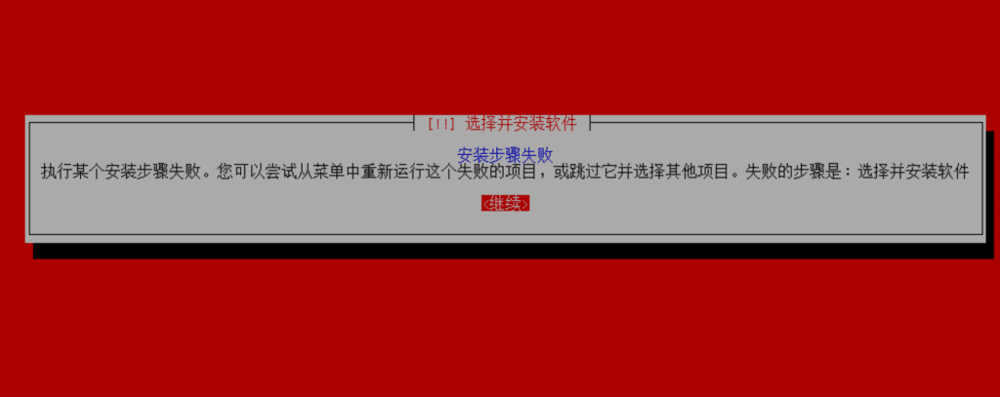
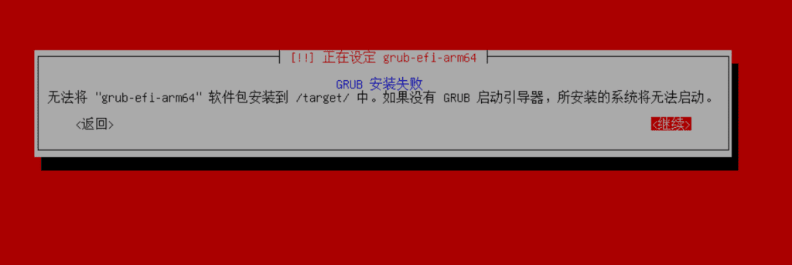
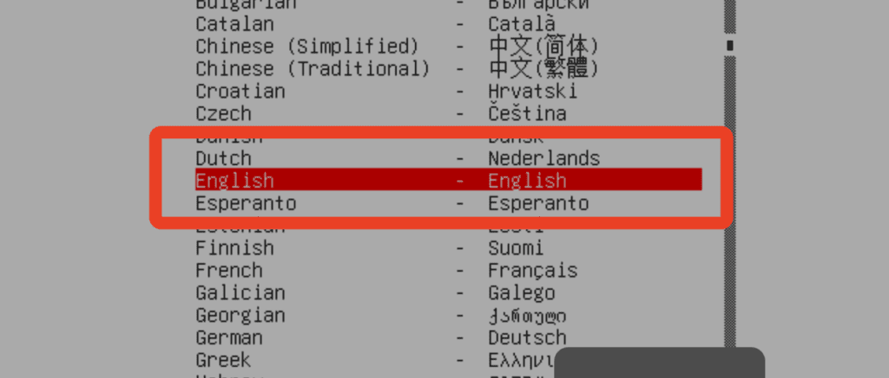

<!--more--> 
原文：[https://www.layer23-switch.com/blog/vmware-funsion-install-kali-error.html](https://www.layer23-switch.com/blog/vmware-funsion-install-kali-error.html)

# 先说结论
在安装程序第一步选择语言时**不要选择中文**  

在苹果 Mac M4 设备上使用 VMware Fusion 安装 Kali Linux ARM 版本来是一件很平常的事，但当我尝试安装最新的 **Kali Linux 2025.2 for ARM** 时，他卡在了“**Select and Install Software**”步骤一直报错

## 问题背景
我的设备环境如下：

+ **硬件**：Mac M4 芯片
+ **虚拟化平台**：VMware Fusion 13.6
+ **系统镜像**：Kali Linux 2025.2 ARM 最新版

在安装过程中，当安装流程进行到 **“Select and Install Software”** 步骤时，安装程序直接报错并终止。这一问题导致我无法完成最新版本的安装。

## 尝试过的常规解决方法
在查阅了 Google 上的相关帖子后，我尝试了以下常规方法，但全部无效：

1. **扩大虚拟硬盘容量**（增加磁盘空间，防止安装过程空间不足）
2. **增加虚拟机内存与 CPU 核心数**
3. **调整 VMware 虚拟机硬件配置**

遗憾的是，所有这些调整都无法解决 **“Select and Install Software”** 报错的问题。

## 尝试跳过安装步骤
有些解决方案建议**跳过 “Select and Install Software”**，先安装 GRUB 引导程序，然后再回到软件安装步骤继续。但我在执行这个方法时，发现：

+ 在安装 GRUB 阶段依旧会报错
+ 磁盘分区检查正常，没有异常
+ 问题依旧无法绕过

## 最终的有效解决方案

1. **在安装Kali时系统语言选择英文！**
2. 或者**安装较旧版本的 Kali Linux ARM**。下载**Kali Linux 2025.1C ARM 版本**，并在 VMware Fusion 13.6 中进行安装。

没错就是这么简单。无语。

## 可能的原因分析
虽然官方暂未明确 2025.2 版本在 ARM + VMware Fusion 环境下的安装问题，但结合社区反馈和我的测试经验，可能的原因包括：

+ 2025.2 ARM 版本的安装程序存在兼容性 bug
+ 部分软件源在安装阶段出现依赖或者编码相关冲突

## 建议与总结
如果你在 **VMware Fusion 13.6 + Mac M4** 环境中安装 **Kali Linux 2025.2 ARM** 时遇到 **“Select and Install Software”** 报错，建议：

1. **尝试旧版本**：直接使用 Kali Linux 2025.1C 或更早的 ARM 版本
2. **安装时Kali系统语言选择英文**
3. **关注官方更新**：密切关注 Kali 官方发行说明或 bug 修复

目前，在我的环境中，**Kali Linux 2025.1C** 是稳定可行的解决方案。

[Kali Linux 2025.1c Download](http://old.kali.org/kali-images/kali-2025.1c/)

