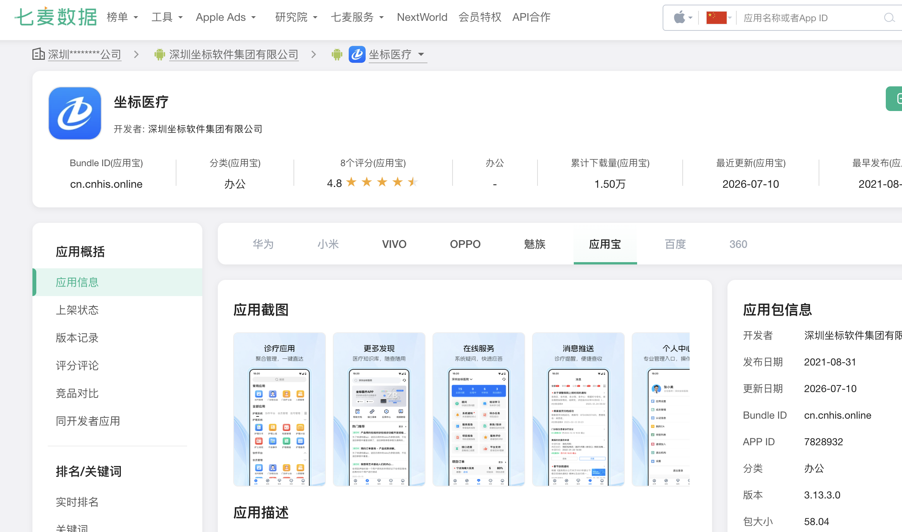
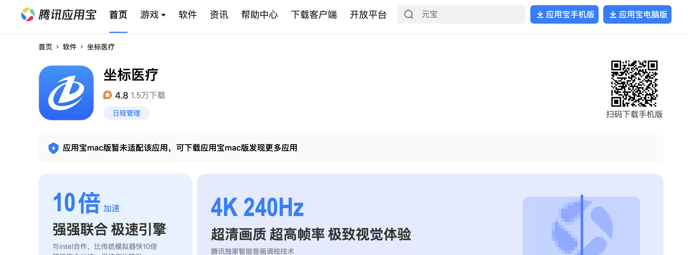
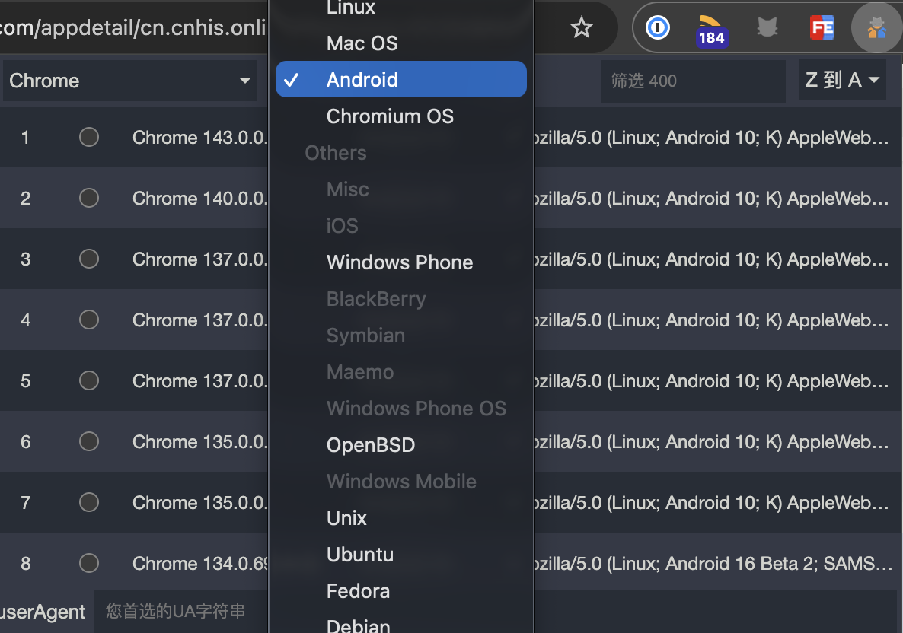
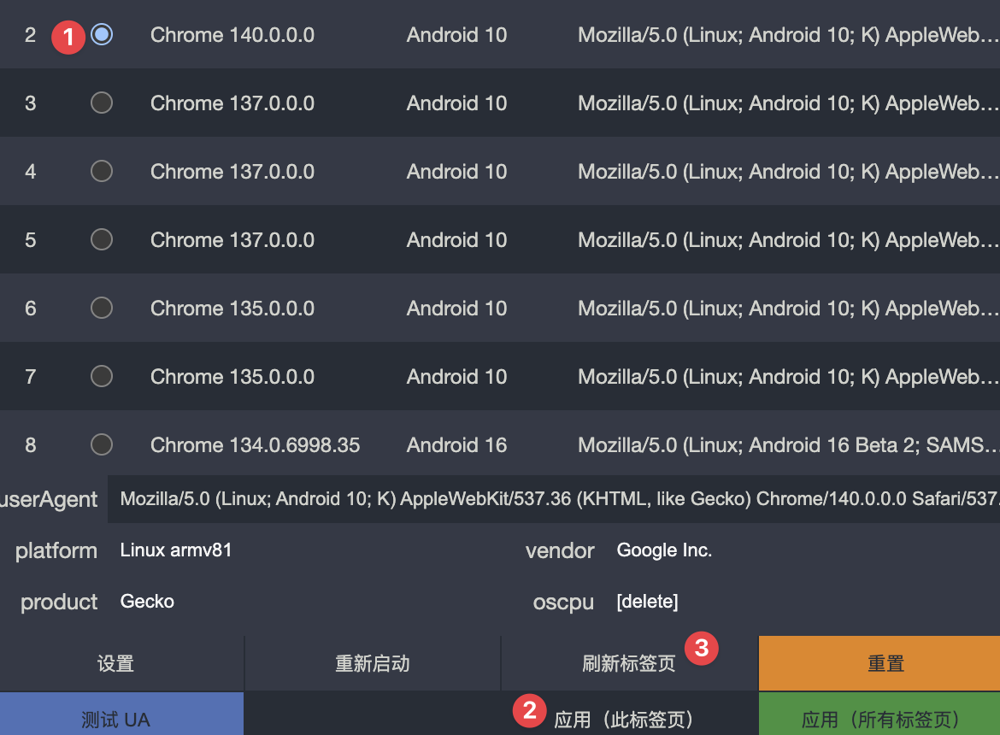

<!--more--> 
需要先按照一个伪造UA头的Chrome插件，我推荐[User-Agent Switcher and Manager](https://chromewebstore.google.com/detail/user-agent-switcher-and-m/bhchdcejhohfmigjafbampogmaanbfkg?pli=1)。

下面开始举例，找到想要下载的软件，可以通过[七麦数据](https://www.qimai.cn/)快捷搜索关键词，然后检查各大家应用商店情况。

这里可以拿到Bundle ID是最关键的，因为有了这个可以去[apkpure](https://apkpure.com/)检索直接下载。

我在macOS的UA下打开没有下载按钮，而且会自动下载应用宝的dmg

使用插件，选择安卓的chrome UA

任意选择一个选中，然后点击应用后刷新。

