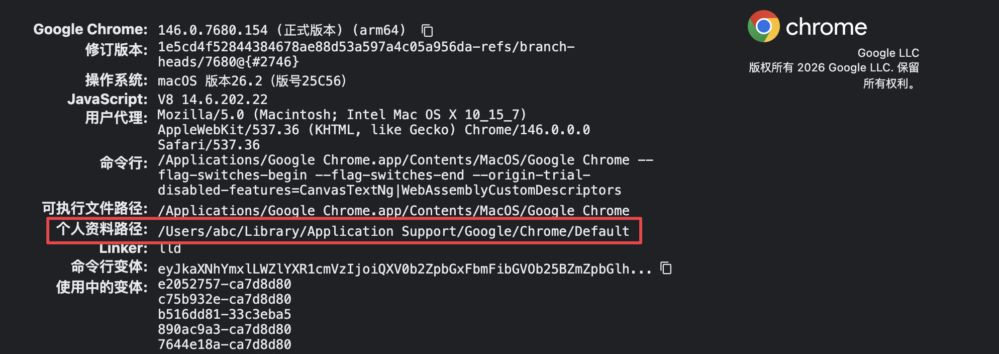
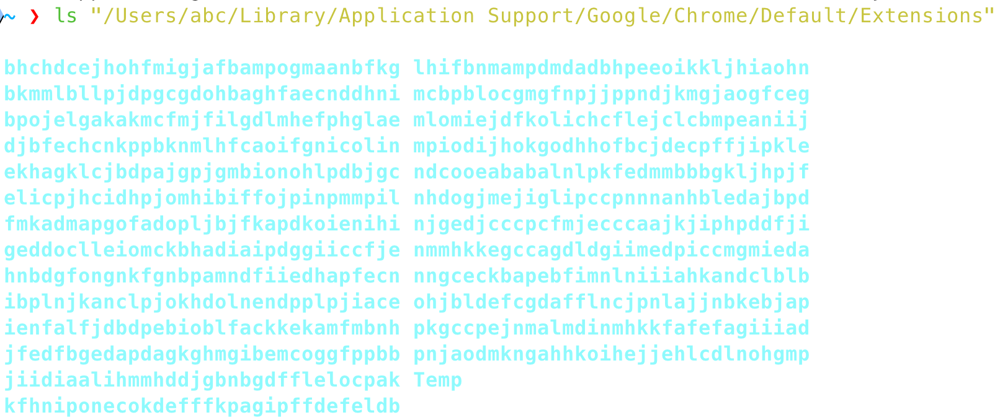
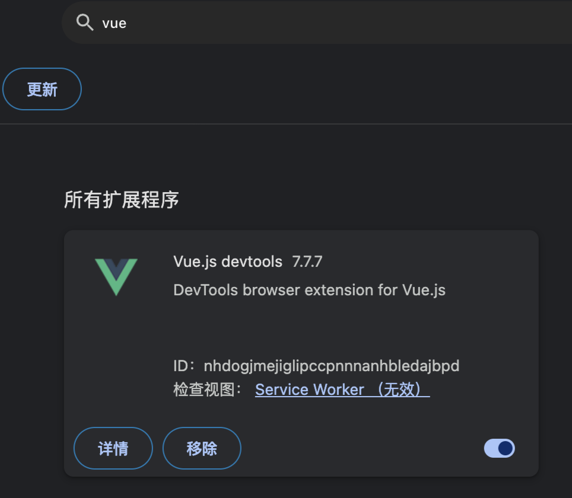
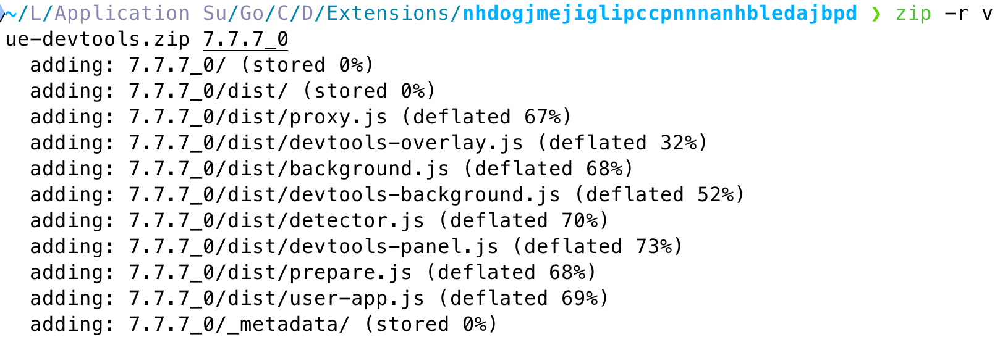

<!--more--> 
# 0x00 前言
下载chrome插件每次都需要梯子才能下载，当我需要在其他机器上安装相同插件时就会苦恼没有提供zip或者crx包的插件。就像是下载安卓应用一定要去Google Play里下一样，但是起码人家有第三方商城提供apk，这个我没有找到镜像站。

# 0x01 过程
需要你先打开游览器输入：`chrome://version/`

找到个人资料路径。



根据上面提供的路径拼接一下`/Extensions`然后ls看看是否正确，注意这里需要使用双引号，因为路径有空格。

```shell
 ls "/Users/abc/Library/Application Support/Google/Chrome/Default/Extensions"
```

可以看到路径下面有非常多的文件夹，而且命名看起来非常的奇怪。



找到一个例子，在`chrome://extensions/`页面可以看到有很多插件，可以看到这里有ID。上面的文件夹命名就是根据ID进行命名的。



cd 进入到目录

```shell
cd "/Users/abc/Library/Application Support/Google/Chrome/Default/Extensions/nhdogjmejiglipccpnnnanhbledajbpd"
```


可以看到有一个版本目录，如果有多个的情况，我们直接打包最新的即可。 

```shell
zip -r vue-devtools.zip 7.7.7_0
```



打包完成后，复制到其他电脑，解压缩即可。

