<!--more--> 
> 参考 ：[https://www.youtube.com/watch?v=2a1cwbmlEIY](https://www.youtube.com/watch?v=2a1cwbmlEIY)
>

# 0x00 前言
本文使用图文的方式介绍了一种通过解压修改XML的方法解决解决 Excel 工作表保护密码的问题，该方法仅适用于2007-2019版本的Excel软件生成带有工作表保护密码的表格文件。

注意，如果是需要密码才能打开文件的，此方法不适用。

# 0x01 解除工作表保护密码
为了实验，我新建了一个工作表，并通过下面的操作添加了保护密码。

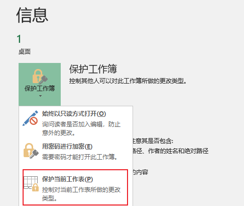

## 打开表格
当提示修改表格需要取消工作表保护才能编辑。

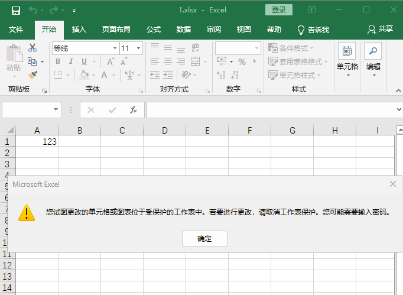

查看文档信息，点击取消保护，提示需要密码进行确认，但我们不知道密码。

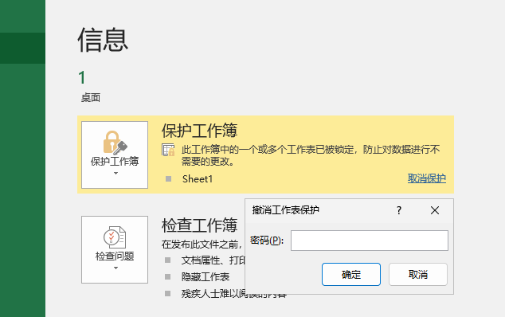

## 解压缩
复制表格并修改后缀名为zip。

将zip解压缩，进入工作表目录`1\xl\worksheets`

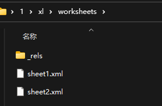

## 修改
通过notepad（记事本）打开文本，找到XML标记语言中的`sheetProtection`部分并删除保存。

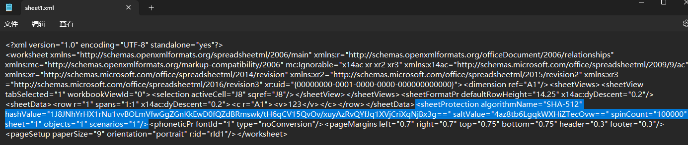

## 压缩成zip
将文件夹重新压缩成zip后修改后缀为`xlsx`

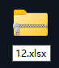

## 打开修改后的表格
此时我们再去修改已经没有阻拦了。

# 0x02 显示已经隐藏的工作表
我创建了一个表格，携带两张工作表，其中一张工作表被隐藏了。

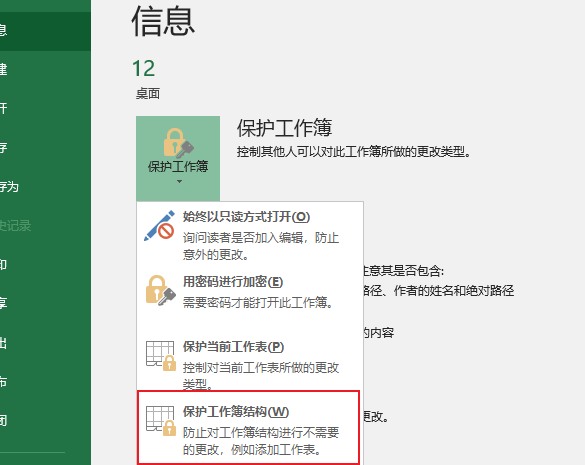

## 查看被隐藏的工作表
打开表格，鼠标右键Sheet1，点击查看代码。

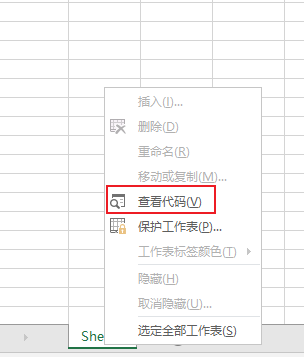

此时我们看到Sheet2的Visible属性是0，表示隐藏了。

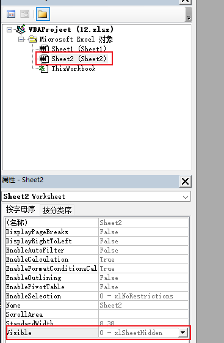

这里尝试修改成-1（显示），因为结构锁定的原因，提示不能修改。

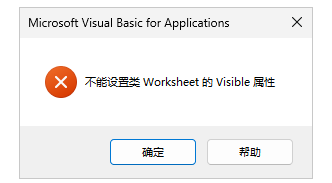

## 删除隐藏属性
通过解压缩得到XML文件后，找到`12\xl\workbook.xml`文件。

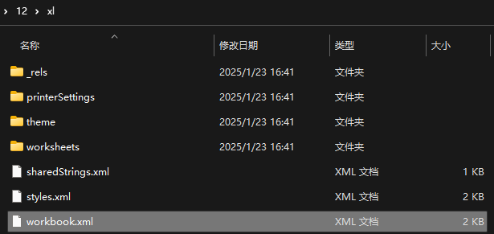

右键记事本打开，找到`state="hidden"`直接删除。

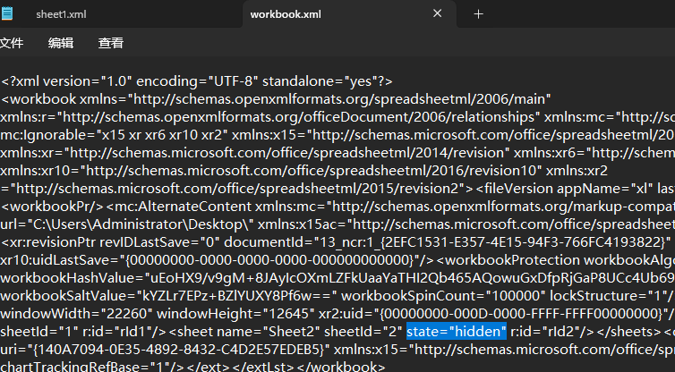

## 打开修改后的表格
尽管还提示保护。

可以看到被隐藏的工作表了。

# 0x03 后记
写这个是因为最近碰到了类似的文件，通过这种方式查看到了隐藏的信息。如果是用只能输入密码打开表格的，没有办法只能暴力破解。

