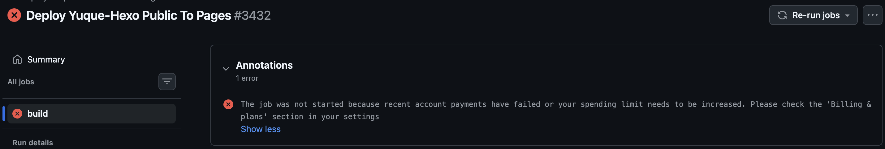
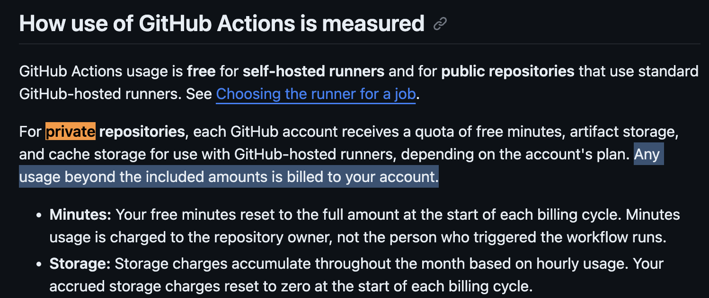
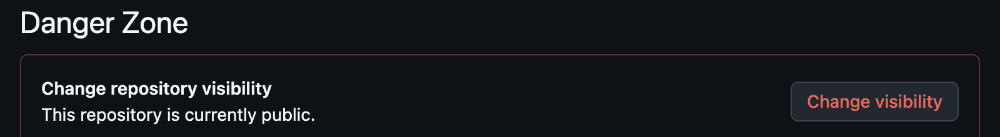

<!--more--> 
今天想要自动Action拉去一下语雀博客内容，发现提示需要收费！

从GitHub的文档发现，原来设置成私密仓库执行Action超出免费额度是要计费的！！！

[https://docs.github.com/en/billing/concepts/product-billing/github-actions](https://docs.github.com/en/billing/concepts/product-billing/github-actions?utm_source=chatgpt.com)

解决办法就是去修改仓库为Public就行了。

