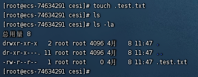
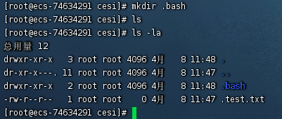
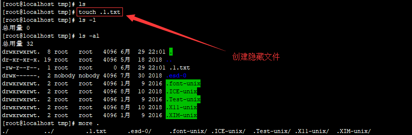
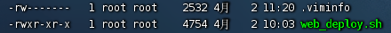
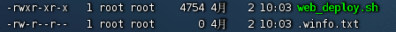
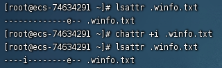
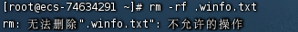
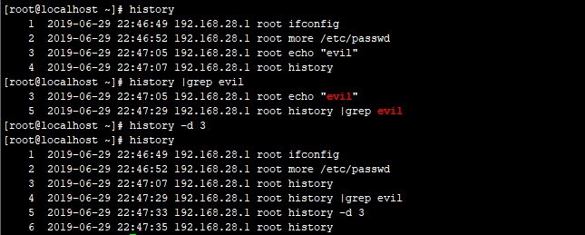

<!--more--> 
# 0x01 隐藏文件
<font style="color:rgb(51, 51, 51);">Linux 下创建一个隐藏文件：</font><font style="background-color:rgb(247, 247, 247);">touch .test.txt</font>

<font style="color:rgb(51, 51, 51);">touch 命令可以创建一个文件，文件名前面加一个 点 就代表是隐藏文件,如下图： </font>



除了创建文件，也可以创建文件夹



<font style="color:rgb(51, 51, 51);">一般的Linux下的隐藏目录使用命令</font><font style="background-color:rgb(247, 247, 247);">ls -l</font><font style="color:rgb(51, 51, 51);">是查看不出来的，只能查看到文件及文件夹，查看Linux下的隐藏文件需要用到命令：</font><font style="background-color:rgb(247, 247, 247);">ls -al</font>



<font style="color:rgb(51, 51, 51);">这里，我们可以看到在/tmp下，默认存在多个隐藏目录，这些目录是恶意文件常用来藏身的地方。如</font><font style="background-color:rgb(247, 247, 247);">/temp/.ICE-unix/、/temp/.Test-unix/、/temp/.X11-unix/、/temp/.XIM-unix/</font>

# 0x02 修改文件时间
`touch` 有一个 `-r`的操作

`-r, --reference=FILE   use this file's times instead of current time`

可以用已存在文件创建时间来替代现在的创建时间

已存在一个 4月2日创建的文件，现在新建的文件是 4月8日的。



`touch -r web_deploy.sh .winfo.txt`



> 文件不存在则创建文件，文件被修改过后时间会别更改，所以请修改文件后使用这个命令去修改时间。
>

<font style="color:rgb(51, 51, 51);">或者直接将时间戳修改成某年某月某日。如下 2014 年 01 月 02 日。</font>

`<font style="color:rgb(51, 51, 51);">touch -t 1401021042.30 webshell.php</font>`

# 0x03 文件锁定
> 这个操作需要 root 权限
>

在Linux中，使用chattr命令来防止root和其他管理用户误删除和修改重要文件以及目录。

```shell
chattr +i evil.php #锁定文件
rm -rf evil.php #提示禁止删除文件

lsattr evil.php #属性查看
chattr -i evil.php #解除锁定
rm -rf evil.php #彻底删除文件
```



  这个时候已经没法删除了



# <font style="color:rgb(51, 51, 51);">0x04 隐藏历史操作命令</font>
<font style="color:rgb(51, 51, 51);">在shell中执行的命令，不希望被记录在命令行历史中，如何在linux中开启无痕操作模式呢？</font>

### <font style="color:rgb(51, 51, 51);">技巧一：只针对你的工作关闭历史记录</font>
`[space]set +o history `

> 备注：[space] 表示空格。并且由于空格的缘故，该命令本身也不会被记录。 
>

<font style="color:rgb(51, 51, 51);">上面的命令会临时禁用历史功能，这意味着在这命令之后你执行的所有操作都不会记录到历史中，然而这个命令之前的所有东西都会原样记录在历史列表中。</font>

<font style="color:rgb(51, 51, 51);"></font>

<font style="color:rgb(51, 51, 51);">要重新开启历史功能，执行下面的命令：</font>

`[Space]set -o history` 

> 它将环境恢复原状，也就是你完成了你的工作，执行上述命令之后的命令都会出现在历史中。 
>

### <font style="color:rgb(51, 51, 51);">技巧二：从历史记录中删除指定的命令</font>
<font style="color:rgb(51, 51, 51);">假设历史记录中已经包含了一些你不希望记录的命令。这种情况下我们怎么办？很简单。通过下面的命令来删除：</font>

`history | grep "keyword" `

<font style="color:rgb(51, 51, 51);">输出历史记录中匹配的命令，每一条前面会有个数字。从历史记录中删除那个指定的项：</font>

`history -d [num] `



<font style="color:rgb(51, 51, 51);">这种技巧是关键记录删除，或者我们可以暴力点，比如前150行是用户的正常操作记录，150以后是攻击者操作记录。我们可以只保留正常的操作，删除攻击痕迹的历史操作记录，这里，我们只保留前150行：</font>

`sed -i '150,$d' .bash_history`

# 0x05 隐藏远程SSH登陆记录
隐身登录系统，不会被w、who、last等指令检测到。

`ssh -T root@127.0.0.1 /bin/bash -i `

不记录ssh公钥在本地.ssh目录中

`ssh -o UserKnownHostsFile=/dev/null -T user@host /bin/bash –i`


  


