<!--more--> 
# 0x01普通隐藏用户
> 需要管理员权限
>

通过在用户名后面添加 `$` 做到新建隐藏用户

`net user qax$ qaxnb@#123 /add` 

添加后再将用户添加到管理员组

`net localgroup administrators qax$ /add`

这两个命令可以直接用 `&&` 做一个无缝衔接。

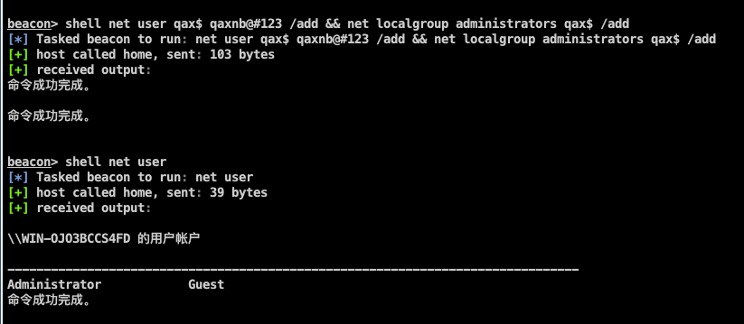

执行成功后，`net user` 获取用户列表是看不到我们创建的用户的。但是可以在控制面板的用户管理或者 `C:\User\qax$`看到相关的一些信息

我们还可以通过`net user qax$` 命令查看我们创建的用户。通过工具查看。

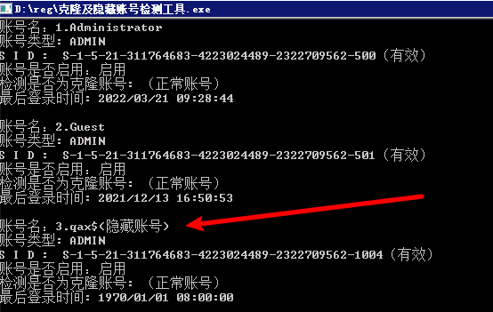

# 0x02 创建克隆用户
### 上机操作方法：
`win + R`打开运行，输入 `regedit` 打开注册表

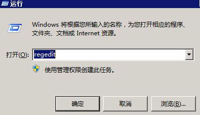

打开注册表后我们找到 SAM 目录

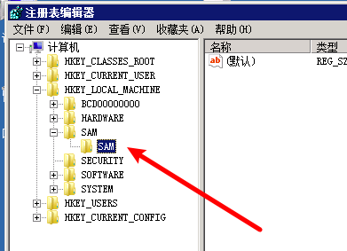

这个情况下我们没法读取，右键SAM文件夹打开权限。给 administrator 用户添加权限。

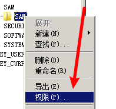

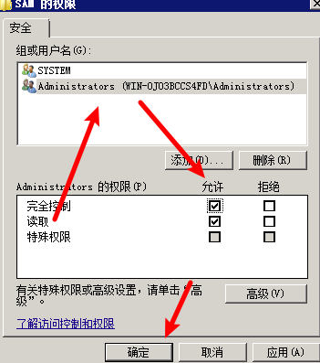

点击确认后，我们关闭注册表编辑页面，重新通过运行进行打开。

再次找到后我们可以访问 SAM 目录了。

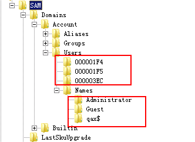

Users 文件夹下的文件和 Names 内的文件顺序对应。

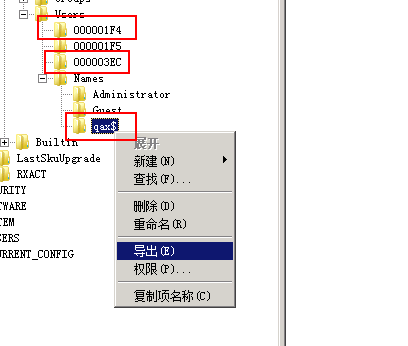

分别对这三个文件夹进行导出。

我打出命名为

+ 000001FA  -> a.reg
+ 000003EC -> q1.reg
+ qax$ -> q.reg

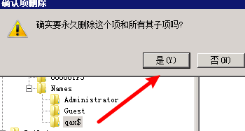

**并将注册表中的 **`**qax$**`**和 **`**000003EC**`** 删除**

**在 cmd 输入 **`**net user qax$ /del**`** 进行删除**

**这两步很关键，做完之后锁屏也发现不了我们的用户。**

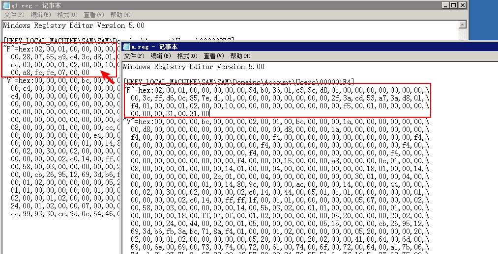

将 q1.reg 中的 F 替换成 a.reg 中的 F 值。可以整段复制进行替换。

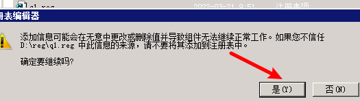

替换后将文本保存，然后将 `q1.reg` 和 `q.reg`双击进行添加。再次通过工具查看，发现已经克隆完毕。

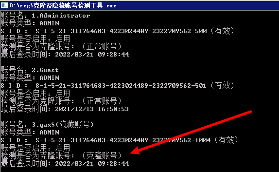

