<!--more--> 
# 0x01 通过设置隐藏属性进行隐藏
先开启查看隐藏文件的选项。

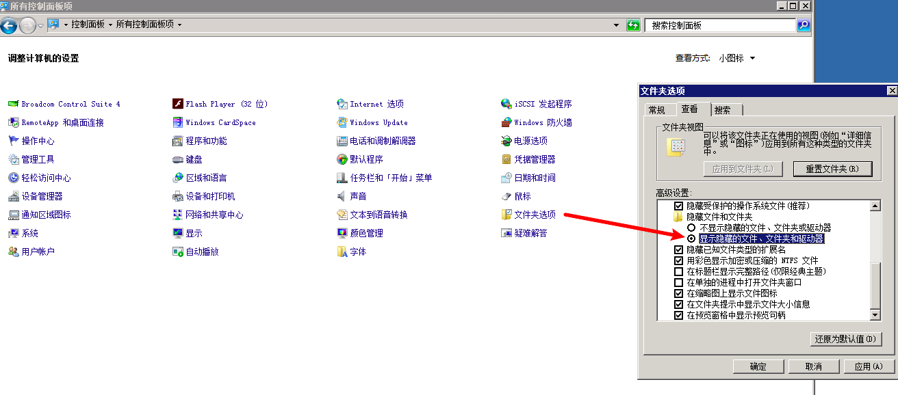

在桌面分别创建一个 `test`文件夹和一个 txt 文本

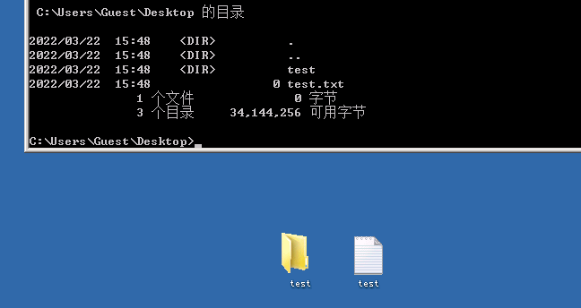

右键将文件添加隐藏属性，但是在显示隐藏文件下还是能看到。

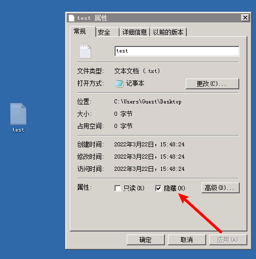

执行 `attrib.exe +s +a +h +r test`在**已开启显示隐藏文件选项下是无效的。**

这个命令就是把原本的文件夹增加了（s）系统文件属性、（a）存档文件属性、（r）只读文件属性和（h）隐藏文件属性。

**经过 attrib.exe 的强行设置之后，没法直接通过点击去取消隐藏。**

> 可以使用** **`attrib.exe +s +a -h +r pppp` 对文件夹进行恢复显示
>

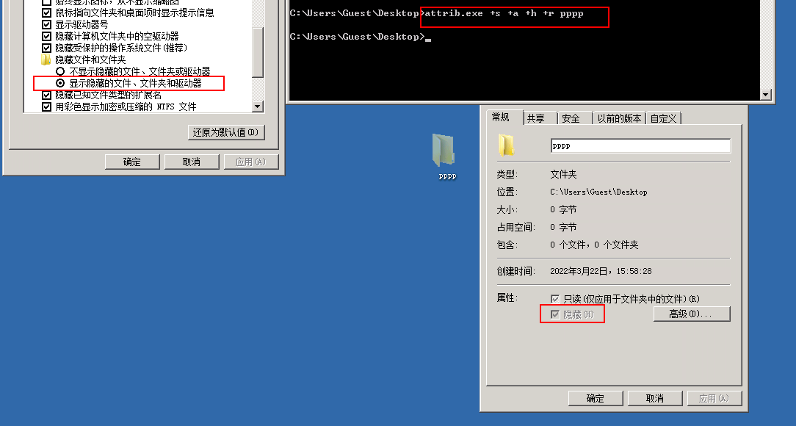

如果是在不显示隐藏文件夹的情况下去执行是可以做到隐藏的。

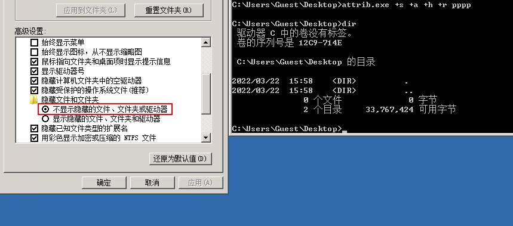

这个时候我们再去打开显示隐藏文件的选项，也看不到隐藏的文件。

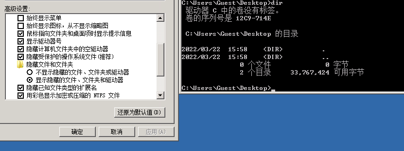

做到了相对 “真正”的隐藏文件。在隐藏文件后，我们可以通过 `cd` 命令进入文件夹。

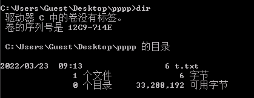

在 2016 standard 系统中，即使是在查看隐藏项目的情况下，使用该命令是可以直接隐藏的。因为 2008r2 使用的比较多，我们在实施操作时需要注意一下即可。

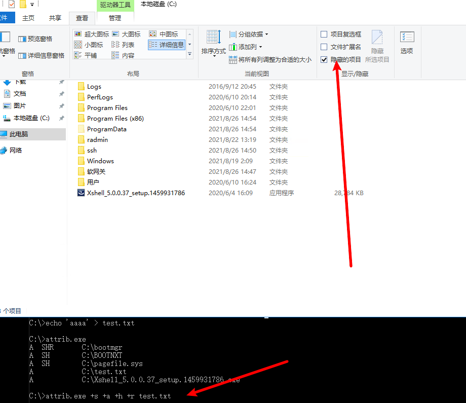

想要查看这样执行后隐藏的文件

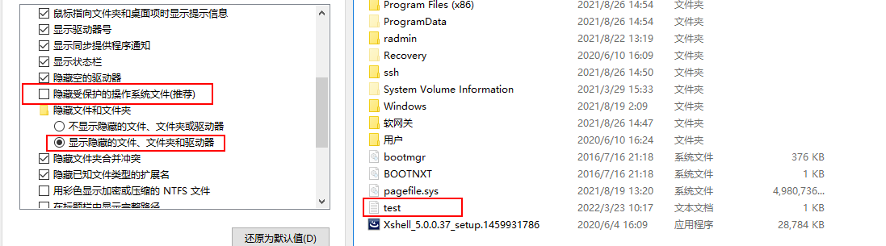

需要关闭隐藏受保护的操作系统文件。

# 0x02 新建系统图标文件夹
> 该操作 2008r2 和 2016 standard 上都是可行的。
>

1. 建一个文件夹，假设叫“我的电脑”
2. 然后把要存放的文件放在里面
3. 给文件夹重新命名为“我的电脑.{20D04FE0-3AEA-1069-A2D8-08002B30309D}”
4. 通过 `cd` 命令可以进入该文件夹

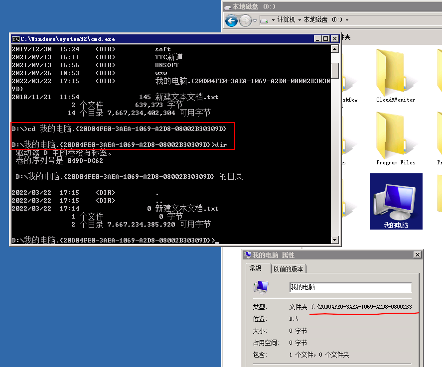

需要将文件写入这个文件夹，`copy` `move` 等命令没法执行

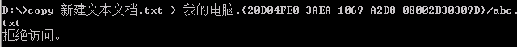

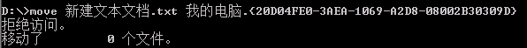

但是可以进入该目录使用 `echo` 写入

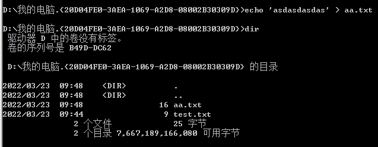

如果 cmd 进入了目录或者打开了里面的内容就没法删除改文件夹了。

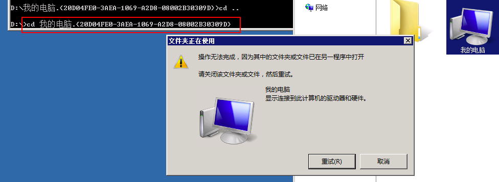

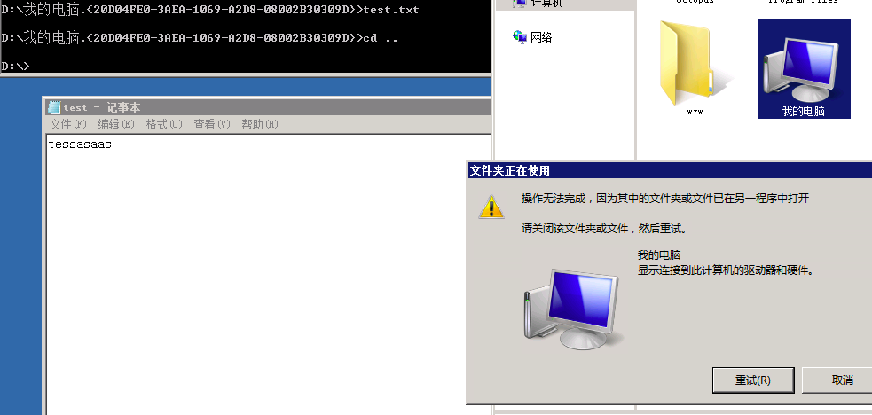

其他系统图片命名

```shell
我的电脑.{20D04FE0-3AEA-1069-A2D8-08002B30309D}
回收站.{645ff040-5081-101b-9f08-00aa002f954e}
拔号⽹络.{992CFFA0-F557-101A-88EC-00DD010CCC48}
打印机.{2227a280-3aea-1069-a2de-08002b30309d}
控制⾯板.{21ec2020-3aea-1069-a2dd-08002b30309d} 　　
⽹上邻居.{208D2C60-3AEA-1069-A2D7-08002B30309D}
```


# 0x03 畸形目录
只需要在目录名后面加两个点或者多个点。用户图形界面无法访问。

```shell
创建目录：md test...\ 
复制文件：copy test.txt a...\test.txt 
删除目录：rd /s/q test...\
```

//在目录中显示为test...，也有可能会显示为test..，随系统版本而定。 

在win11中，该目录点击后没有反应


在 cmd 中，也不能使用cd命令进入

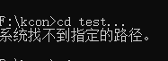

那么我们该怎么访问里面的文件呢，答案是通过浏览器来访问。在本地开一个http服务，然后通过浏览 器，可以直接访问到里面的文件。


这种操作适应性不高，在 2008r2 上新建是 `test...`

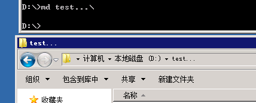

双击还是能点开的。但命令和图形界面都无法删除该文件夹


命令执行成功，但是文件夹还在。

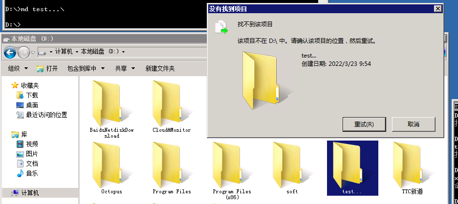

无法复制文件进去，只能通过图形界面进行添加文件。

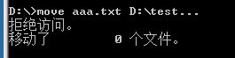

比如说拖拽添加文件，也是可以的。

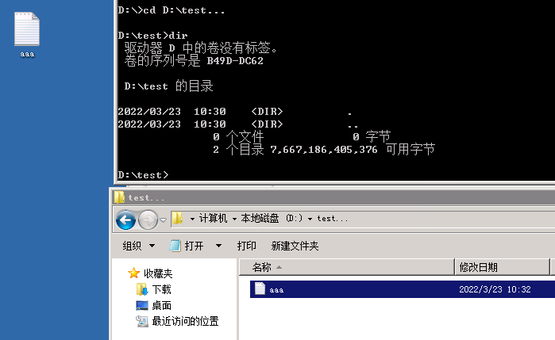

将文件拖进来后，`dir` 里没法显示但是文件是真实存在的。刷新后，文件消失不见，无法通过命令行打开。

 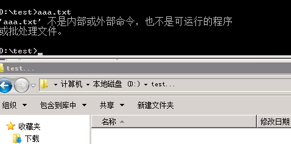

再次拖进来后发现文件还是存在的。但是**无法执行文件**

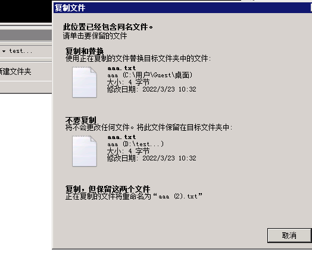

建议是在实战中新建后将木马文件上传到这里双击后进行刷新目录即可。

# 0x04 驱动级文件隐藏
<font style="color:rgb(51, 51, 51);">驱动隐藏我们可以用过一些软件来实现，软件名字叫：Easy File Locker</font>

<font style="color:rgb(51, 51, 51);">下载链接：</font><font style="color:rgb(51, 51, 51);"> </font>[http://www.xoslab.com/efl.html](http://www.xoslab.com/efl.html)

<font style="color:rgb(51, 51, 51);">如果你在网站目录未查找到相关文件，且系统目录存在存在以下文件：</font>

```shell
c:\WINDOWS\xlkfs.dat 
c:\WINDOWS\xlkfs.dll 
c:\WINDOWS\xlkfs.ini 
c:\WINDOWS\system32\drivers\xlkfs.sys 
```

<font style="color:rgb(51, 51, 51);">那么你，应该是遭遇了驱动级文件隐藏。</font>

<font style="color:rgb(51, 51, 51);">如何清除？</font>

```shell
1、查询服务状态： sc qc xlkfs 
2、停止服务： net stop xlkfs 服务停止以后，经驱动级隐藏的文件即可显现 
3、删除服务： sc delete xlkfs 
4、删除系统目录下面的文件，重启系统，确认服务已经被清理了。 
```

<font style="color:rgb(51, 51, 51);">隐藏文件的方式还有很多，比如伪装成一个系统文件夹图标，利用畸形文件名、保留文件名无法删除，甚至取一个与系统文件很像的文件名并放在正常目录里面，很难辨别出来。</font>

<font style="color:rgb(51, 51, 51);">这些隐藏文件的方式早已不再是秘密，而更多的恶意程序开始实现“无文件”攻击，这种方式极难被发现。</font>

