<!--more--> 
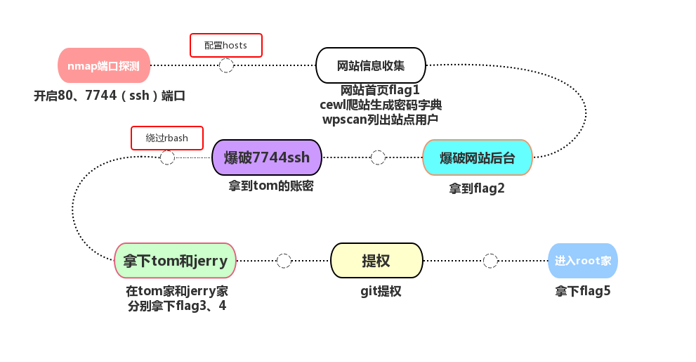


# 0x00 路径攻击重点
1. Host 解决跳转域名解析
2. WordPress 路径及用户爆破
3. rbash 绕过
4. suid 权限发现
5. git 提权

# 0x01 过程
## 信息收集
### 端口发现
使用攻击机kali自带的Namp工具，扫描DC-2靶场的端口开放情况。

使用命令`nmap -A -p- -T4 202.1.80.12`我们可以看到靶场是开放了80端口的，我们使用浏览器测试访问。

选项解释：

+ -A：这是一个选项，它启用了全面的扫描模式。在这种模式下，Nmap 会同时进行操作系统检测、版本检测、脚本扫描和 traceroute 等操作，能够尽可能多地获取目标主机的详细信息。
+ -p-：该选项用于指定扫描的端口范围。其中-表示扫描所有 65535 个 TCP 端口，即 Nmap 会对目标主机的从 1 到 65535 的所有 TCP 端口进行扫描，以找出哪些端口是开放的。
+ -T4：这是一个时间模板选项，它设定了扫描的速度。Nmap 提供了从-T0（最慢、最隐蔽）到-T5（最快、最不隐蔽）共 6 种不同的时间模板。-T4属于相对较快的扫描速度，在保证一定准确性的同时能提高扫描效率，但可能会比慢速扫描更容易被目标网络的入侵检测系统察觉。

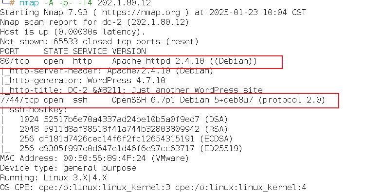

#### 思考：当我们用nmap没法得到端口信息怎么办？
在实战中，扫描0-65535端口是不理智的，虽然容易得到惊喜，但时间不允许我们这么干，我设置了T4还是太慢了。有人说，那我使用快速端口扫描呢？网络世界中，线程越多，链接越快，误报越多。我认为关注熟知端口即可，关注那些重点服务（危险服务）即可。我是这么做的：1.通过网络空间测绘网站得到大量相关IP 2.只扫描熟知端口 3.一旦出现可访问情况，直接爆破。

有一次经历记忆犹新——我在摸查企业资产时，通过这样的方式快速的找到了一个子公司官网服务器的RDP弱口令，可惜他们不算在那次的资产内。

### 重定向到域名
我们直接访问`http://202.1.80.12`发现无法访问靶场的80端口，而目网站被重定向到了域名：`dc-2`。

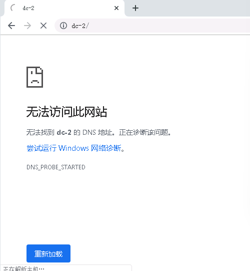

我们修改`C:\Windows\System32\drivers\etc`下的hosts文件，添加本地DNS域名解析。

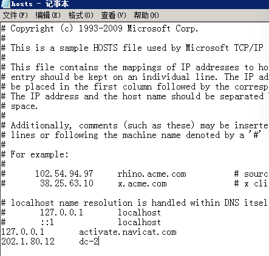

#### 思考：为什么需要添加域名解析呢？
在配置nginx时你可能会看到如下配置：

```plain
...              #全局块
events {         #events块
   ...
}
http      #http块
{
    server        #server块
    { 
    
        listen       80;
        server_name  dc-2;
        
    }
}
```

客户端使用 IP 访问时，请求中不会携带 Host 头信息为`dc-2`。Nginx 会根据 server_name 指令来匹配请求，由于请求的 Host 头不是 `dc-2`，所以该 server 块从 server_name 匹配角度来说不会直接命中。

所以我们知道Nginx、Apache中，都可通过配置文件进行域名绑定，如Nginx的default_server，Apache的httpd.conf配置中的ServerName。直接访问IP是无法访问成功的，而访问其绑定的域名才可以访问成功。在访问域名的时候能够直接重定向服务器相关站点的目录下，即可成功访问。  

#### 举一反三
在实战中，我们常遇到这种情况，IP访问时是nginx的默认页面，只有正确的域名才能访问到页面。可域名访问不是次次都有效的——我遇到过一次域名访问跳转到了内网的地址，我列举了收集到所有的IP进行Host绑定碰撞，结果访问到了一个“隐藏”资产。

### 分析网站组件
我们设置完Hosts时，再次测试访问靶场的80端口，成功访问到页面。

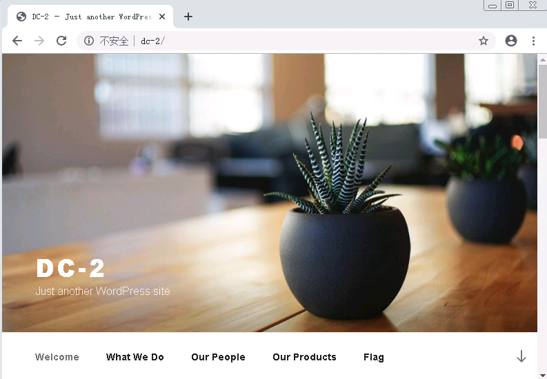

在访问到web界面后，我们可以使用浏览器插件Wappalyzer对靶场网站进行分析。但说实话，页面上直接提示了WordPress，并且如果你自己去搭建WordPress，恐怕第一个博客主题就是这个，我有这样的经验。

我们仔细观察看到web右下角有一个Flag，点击查看。

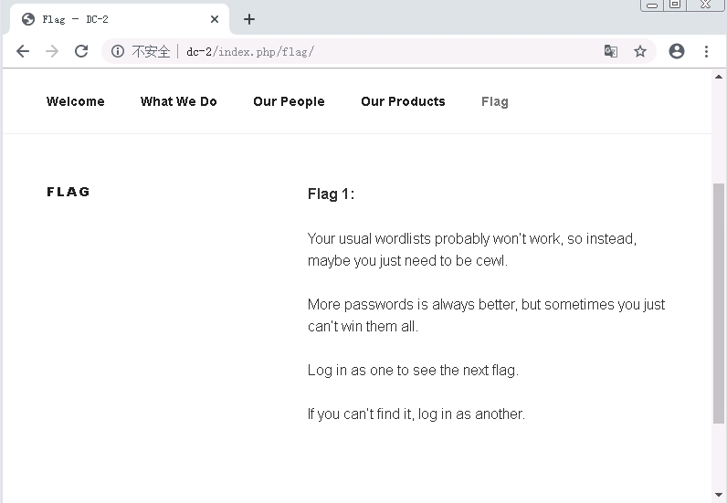

根据Flag的提示得知，网站是存在登录点的，我们在访问到的Web界面未发现登录点，此时我们需要扫描网站目录。

### 目录扫描
使用命令`dirb http://dc-2`

> `dirb` 是一款开源的命令行工具，工作原理是通过预先设定好的字典文件，将其中的目录和文件名逐一与目标网站进行比对，以此来判断目标网站是否存在这些资源。  
>
> 类似的常用软件：Dirsearch、ffuf（Fast web FUZZer）
>

根据扫描目录发现一个可疑的访问连接，我们进行测试访问。

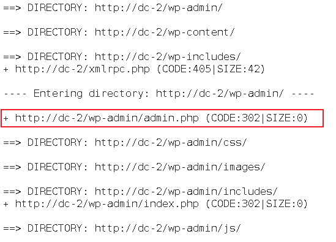

访问该路径，得到了后台登陆入口。

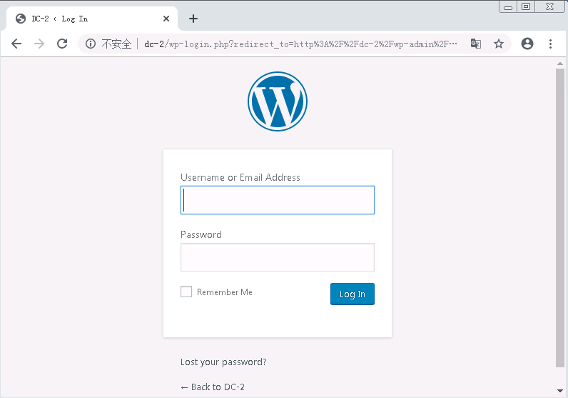

#### 思考：什么情况下应该去扫目录？
黑盒去攻击一个网站的工作量实在是太多，而且在你无法获得有效或混淆信息时，渗透工作简直难以进行。

在平时，我们尝试去监控一个企业的互联网攻击面暴露风险，我们需要准确的找到暴露的资产以及风险，当我们面对一个大型企业时，工作量（或者叫扫描任务量）呈指数级上涨，我们要求客户给我们提供扫描白名单，任务总有完成的一天，所以我们可以肆无忌惮的扫描。

在实战中，我们没有那么多时间去扫描了，只能先判断组件，针对性的拿字典扫描，而且线程还得降低，配合秒切IP来完成探测，可目录扫描不是每次都奏效的，我们需要多点运气。

#### 举一反三
在实战攻击中，面对诸多资产，我们不妨使用相对的“极小”字典进行尝试，毕竟软柿子更好拿捏。

或者使用fuff用不同的扫描方式进行尝试，即一个网站一个字典的扫描，不如试试同一个目录路径批量网站扫描。

我们在转换一下思路，说不定HTML、JS文件中藏有后台地址呢？可以使用Google插件`FindSomething`、Burp插件`HaE`、主动扫描工具`URLFinder`等工具。

## 获得Web权限
### 用户名遍历
在信息收集过程中，我们获取了靶场的登录界面和网站使用了WordPress，而针对WordPress有一款非常著名的扫描工具wpscan，我们使用wpscan对靶场进行扫描登录用户

命令：`wpscan --url http://dc-2/ -e u`

> WPScan的核心优势在于其独特的白盒测试方法。这种测试方式允许工具深入WordPress的内部结构，逐行检查代码，从而发现隐藏的安全隐患。具体而言，当用户启动WPScan时，它首先会对目标WordPress站点进行全面扫描，识别出所有已安装的插件、主题以及核心文件。接下来，WPScan会根据内置的庞大数据库，逐一比对这些组件是否存在已知的安全漏洞。
>
> 值得注意的是，WPScan不仅仅局限于表面的扫描工作。它还会进一步分析插件和主题的功能实现，查找可能存在的逻辑错误或不当配置，这些都是传统扫描工具难以捕捉的问题。通过这种方式，WPScan能够提供更加详尽且精准的安全报告，帮助管理员及时采取措施，加固网站的安全防线。
>

命令选项解释：

+ -e： 此为枚举（enumeration）参数，用于指定要在目标网站上进行的枚举操作。借助枚举，wpscan 可以收集到更多关于网站的信息，像用户、插件、主题等。在 -e 参数的语境下，u 代表枚举网站的用户信息。wpscan 会尝试找出目标 WordPress 网站上的注册用户。

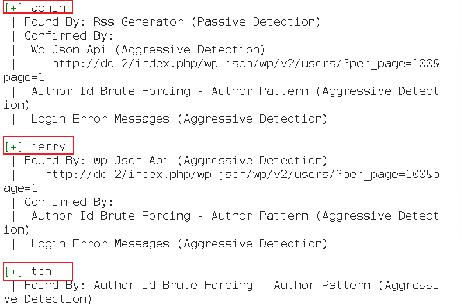

扫描后我们获取到三个账号admin、jerry、tom，我们创建一个user2.txt文本作为密码爆破的账号字典。

### 制作密码本
我们在使用cewl来爬取网站相关信息，构造成登录的密码字典，用于账号爆破。

命令：`cewl http://dc-2 -w passwd.txt`

> `cewl`（Custom Word List Generator）是一个用于从网页中提取单词并生成自定义字典文件的工具。你给出的命令 `cewl http://dc-2 -w passwd.txt` 的作用是从 `http://dc-2` 这个网页上抓取文本内容，提取其中的单词，然后将这些单词保存到 `passwd.txt` 文件中，该文件可以作为密码字典使用，常用于密码破解等安全测试场景。  
>

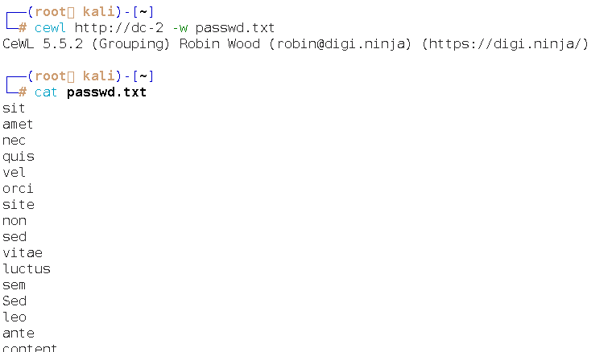

### 爆破用户
在获取账号字典user.txt和密码字典passwd.txt后，我们使用命令进行爆破。

命令：`wpscan --url http://dc-2/ -U user2.txt -P passwd.txt`

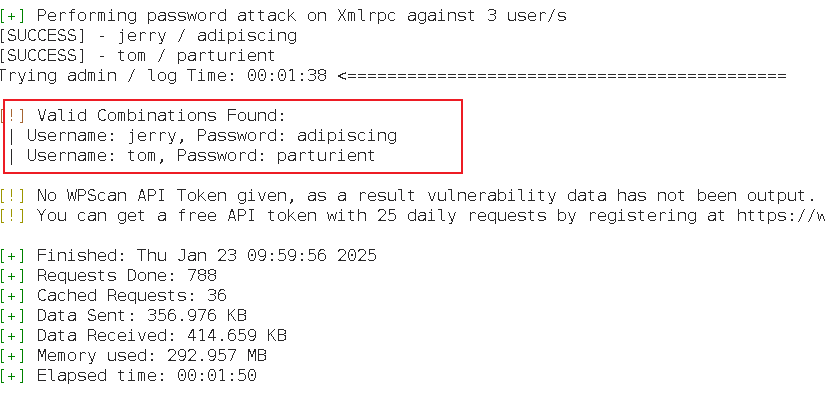

我们获取到了两组账号密码`jerry/adipiscing`、`tom/parturient`，尝试登录DC-2靶场。

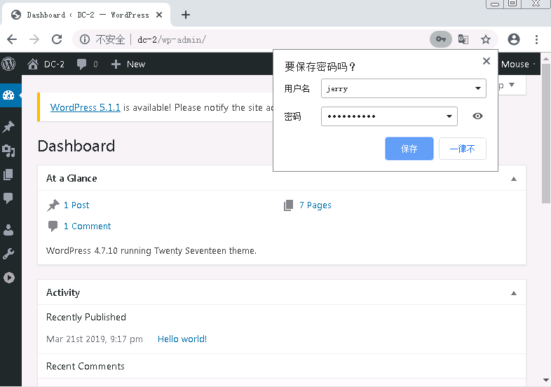

我们点击pages，可以看到隐藏的flag2。

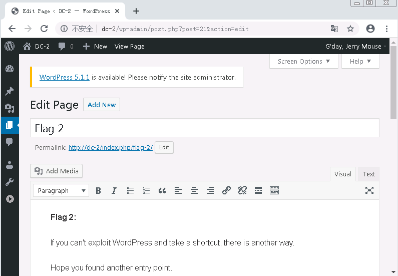

### 登录SSH
根据flag2的提示，我们需要从别的方面下手继续对靶场渗透，此时我们想起扫描时还发现一个改端口的SSH端口，而且我们爆破出来两个账号密码，我们测试登录。

命令：`ssh tom@202.1.80.12 -p 7744`

这里发现`jerry`无法登录，转而使用`tom`。

当我们使用`cat flag3.txt`命令时提示是`rbash`进行了限制。

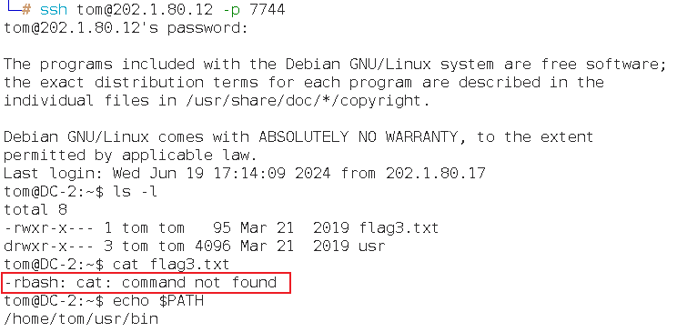

> `rbash` 即受限的 Bourne shell，它是一种对用户操作进行了限制的 shell 环境。  
>
> 限制规则
>
> + 命令搜索路径限制：用户不能更改 PATH 环境变量，这意味着用户只能使用 PATH 环境变量预先设定好的目录下的命令，无法通过修改 PATH 来执行其他目录中的命令。
> + 工作目录限制：用户不能使用 cd 命令更改当前工作目录，被限制在初始的工作目录内。
> + 命令输出重定向限制：用户无法使用输出重定向操作符（如 >、>> 等）将命令的输出重定向到文件，防止用户随意修改文件内容。
> + 脚本执行限制：用户通常不能执行不在 PATH 中的脚本文件，进一步限制了用户的操作范围。
>
> 要将用户的 shell 设置为 rbash，可以通过修改 /etc/passwd 文件来实现。也可以通过命令：`sudo usermod -s /bin/rbash testuser`实现。
>

我们先来查看一下 rbash 限制后能进行哪些操作，输入`echo $PATH`查看path路径的所有可执行的bin（二进制）文件。

发现路径就几个，通过命令枚举其中一个目录：`echo /home/tom/usr/bin/*`

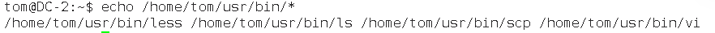

可以看到在rbash限制下，可以执行`less、ls、scp、vi`四个命令，我们可以使用vi命令查看flag3.txt文件。

命今：`vi flag3.txt`

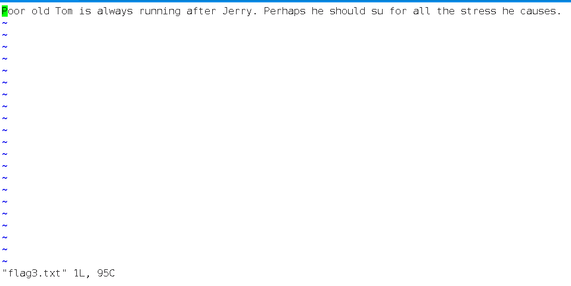

### rbash限制绕过
根据flag3.txt文件，我们需要提权才能进入下一步操作，我们就利用`vi`进行绕过。

先通过命令`vi`进入编辑解密，紧接着使用快捷键：`Shift+:`进入`vi`命令模式。

输入`set shell=/bin/bash`设置变量，回车执行。

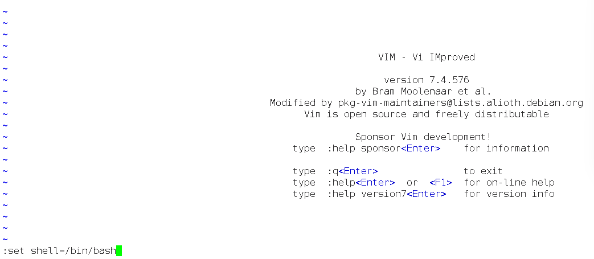

再次`Shift+:`进入`vi`命令模式，输入`shell`回车。

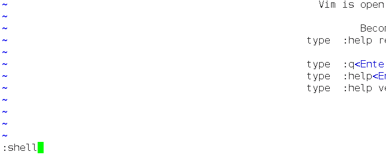

当看见退出了编辑器就说明成功了，接着我们看一下权限，输入命令`cat`，发现无法执行`cat`命令。

这是因为环境变量的问题，用以下命令添加一下两条路径即可。

```plain
export PATHE=$PATH:/bin/
export PATHE=$PATH:/usr/bin/
```

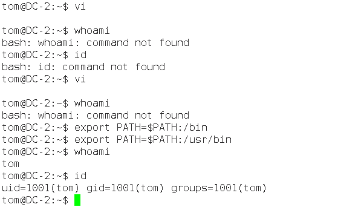

#### 思考：还有其他方式绕过吗？
可以使用`BASH_CMDS[a]=/bin/sh;a`

```plain
BASH_CMDS[a]=/bin/sh;a
/bin/bash
#添加环境变量
export PATH=$PATH:/bin/
export PATH=$PATH:/usr/bin
```

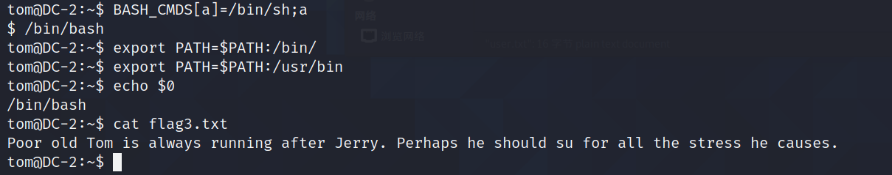

命令解释：

`BASH_CMDS[a]=/bin/sh;a`命令，通过`;`分成了两个命令。相当于：

```plain
# 设置 BASH_CMDS 数组
BASH_CMDS[a]=/bin/sh
# 执行 a，相当于执行 /bin/sh
a
```

1. `BASH_CMDS[a]=/bin/sh`
+ `BASH_CMDS` 是 Bash 中的一个关联数组，用于存储命令名和对应的命令路径。这个数组是 Bash 内部用来管理命令查找和执行的。
+ `[a]` 是数组的索引，这里将索引 `a` 对应的值设置为 `/bin/sh`，也就是将命令名 `a` 与 `/bin/sh` 这个 shell 解释器的路径关联起来。简单来说，就是告诉 Bash，当你输入 `a` 作为命令时，实际上要执行的是 `/bin/sh`。
2. `a`
+ 在执行完 `BASH_CMDS[a]=/bin/sh` 之后，输入 `a` 就相当于执行 `/bin/sh`。此时会启动一个新的 `sh` shell 会话，你可以在这个新的 shell 中执行各种命令。

### 切换SSH用户
此时我们账号的权限已经可以执行大部分命令，我们查询下是否可以执行`su`（用于切换用户身份）  命令。

命令：`compgen -c | grep su`

>  执行 `compgen -c` 会输出当前系统环境下所有可执行命令的列表。
>
> 通过管道符输出到 `grep su` 会筛选出包含 `su` 的命令名称。  
>

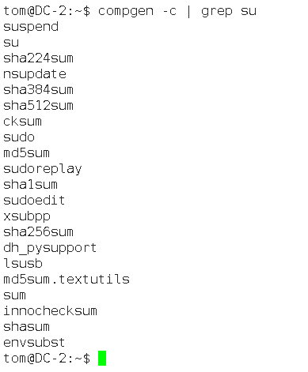

我们将账号切换至jerry，并搜索flag文件。


可以看到`/home/jerry/`日录下存在flag4.txt，我们进入`/home/jerry/`查看。

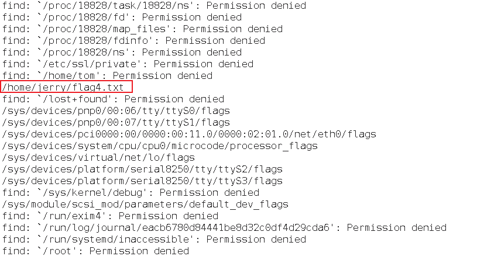

查看flag4.txt获取提示。

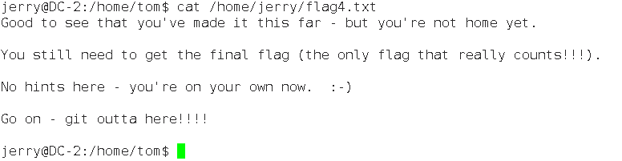

### Git提权
我们根据flag4.txt提示，尝试回到root目录发现权限不够无法进入，同时flag4.txt也提示我们使用git，我们可以使用git提权来进入root目录命令。我们使用命令搜索下具有SUID （Set User ID）  权限的二进制文件。

命令：`find / -user root -perm -4000 -print 2>/dev/null`

命令选项解释：

+ `**-user root**`：这是一个查找条件，限定只查找属于 `root` 用户的文件和目录。
+ `**-perm -4000**`：这是另一个查找条件，用于筛选具有特定权限的文件。其中 `4000` 对应的是 SUID 权限位。`-` 表示匹配任何包含该权限位的文件，也就是说只要文件具有 SUID 权限，就会被选中。SUID 权限允许普通用户以文件所有者（这里是 `root`）的身份执行该文件。
+ `**-print**`：指定查找结果的处理方式，这里是将符合条件的文件和目录的路径打印输出到标准输出。
+ `**2>/dev/null**`：这是一个错误信息重定向操作。`2` 代表标准错误输出，`/dev/null` 是一个特殊的设备文件，它会丢弃所有写入的数据。因此，该操作的作用是将命令执行过程中产生的错误信息丢弃，避免在终端上显示。

看到有个sudo，使用`sudo -l`查看当前用户能行使的权限命令是具有root权限的git。

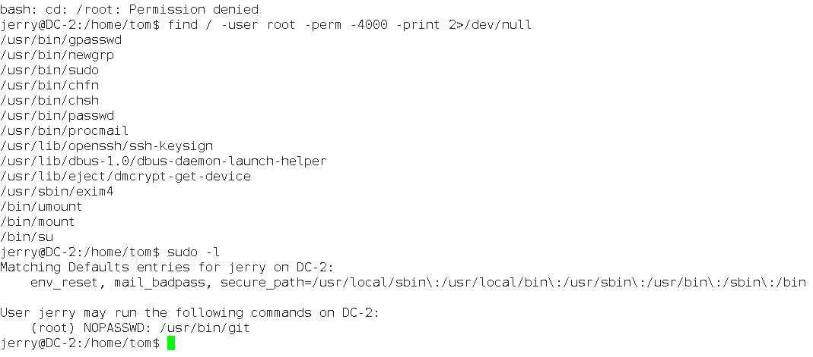

> **sudo**：它是一个允许普通用户以其他用户（通常是超级用户 `root`）权限执行命令的程序。`sudo` 的权限分配由 `/etc/sudoers` 文件控制，管理员可以依据需要为不同用户或用户组分配不同的 `sudo` 权限。
>
> **SUID**：这是文件权限的一种特殊设置。当一个文件被设置了 SUID 权限后，其他用户执行该文件时，会以文件所有者的身份运行。例如，若一个文件的所有者是 `root` 且设置了 SUID 权限，那么普通用户执行该文件时会获得 `root` 权限。
>

使用命令`sudo git help config`进入帮助文档查询界面。

> `git` 是一款分布式版本控制系统，用于跟踪文件变化、协调多人对项目的开发工作。`git help config` 用于显示 `git config` 命令的帮助文档，此文档会详细介绍 `git config` 命令的使用方法、可用选项和相关示例。  
>

回车后输入：`!/bin/bash`并回车。

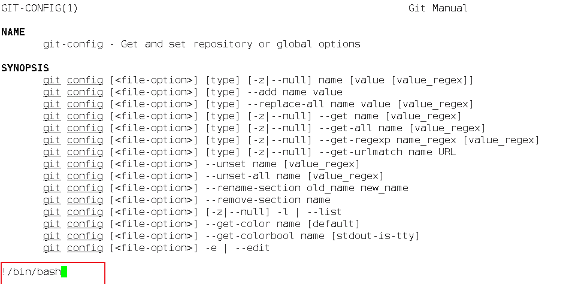

回车后我们的用户变为root，拥有root权限了，在roo目录下找到最终flag 。

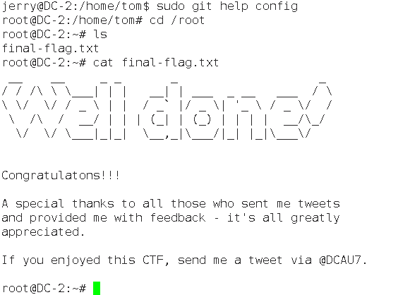

至此靶场渗透工作结束。


