<!--more--> 
## 漏洞描述
我们都知道，在使用手机拍照后，可以通过相册APP分类图片拍摄的地址来筛选我们在某个地方拍的相片，图片在存储这些额外的信息时使用了 Exif 图像文件格式，用于记录数码照片的属性信息和拍摄数据。我们统一把这些额外的信息称之为图片的 Exif 数据。

在一些摄影网站、查看 Exif 网站、网盘网站等上传图片，获取图片 Exif 数据并且将其返回至前端的功能实现，往往可能存在着EXIF XSS漏洞。根据是否存储图片来判断反射型 XSS 和存储型 XSS。

国外参考描述

[https://shahjerry33.medium.com/xss-via-exif-data-the-p2-elevator-d09e7b7fe9b9](https://shahjerry33.medium.com/xss-via-exif-data-the-p2-elevator-d09e7b7fe9b9)

## 漏洞复现
我们需要使用 exiftool 来修改我们图片的 exif 数据 [https://exiftool.org/](https://exiftool.org/)

我们的素材可以通过微信**原图**传输使用原相机拍照的图片到电脑上。

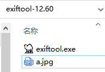

进入CMD，直接使用命令exiftool.exe a.jpg即可查看图片的 Exif 数据。

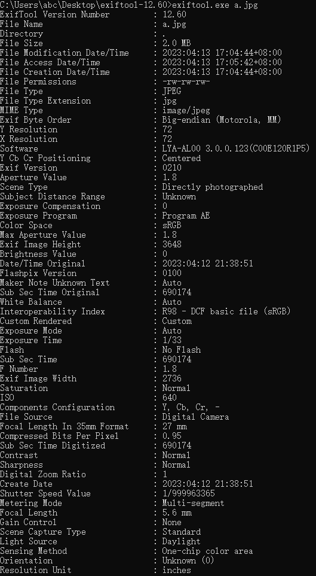

使用命令exiftool.exe -Software="" a.jpg

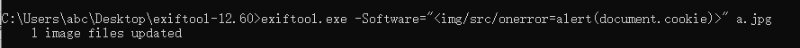

我找到一个《在线Exif查看、相片相机品牌拍摄参数查看》的网站：

[http://tu.chacuo.net/imageexif](http://tu.chacuo.net/imageexif)

当我们上传图片后就会弹出 Cookie。

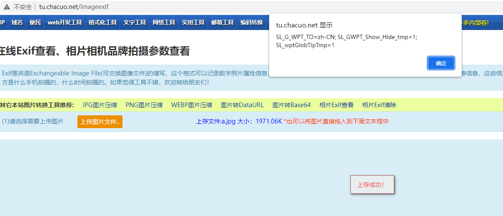

XSS 定位

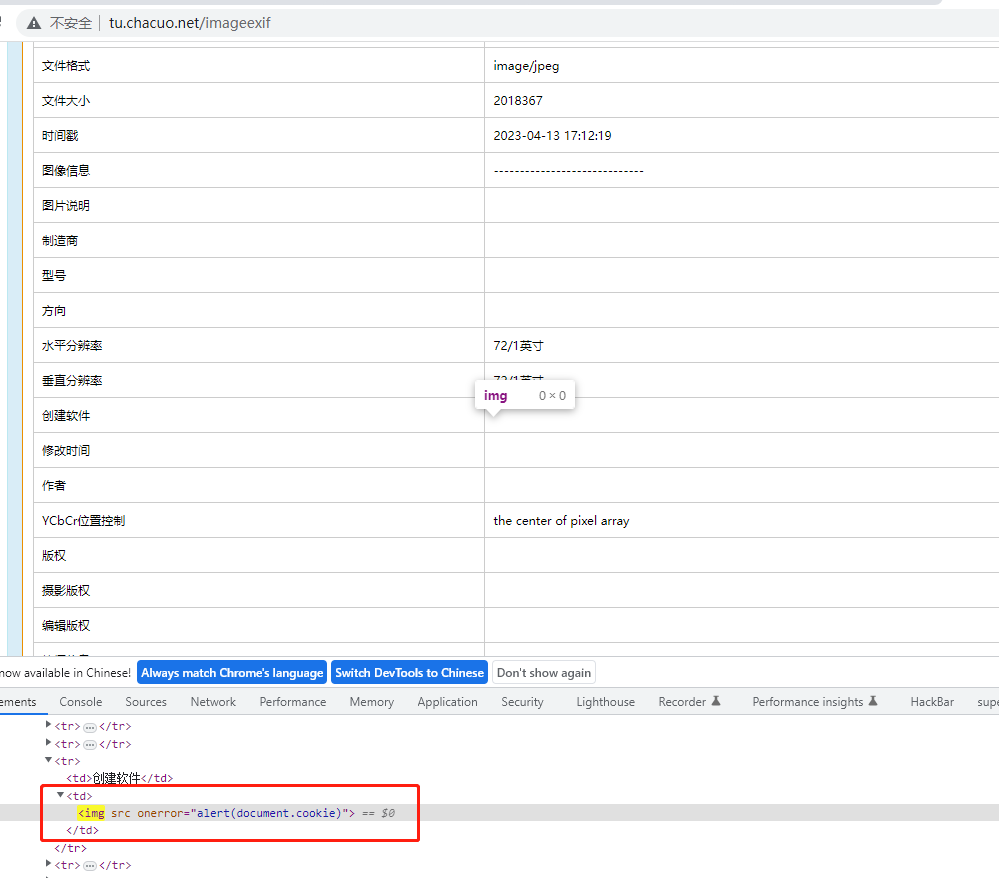

## 漏洞案例
### Nextcloud网盘存储
[https://hackerone.com/reports/896511](https://hackerone.com/reports/896511)

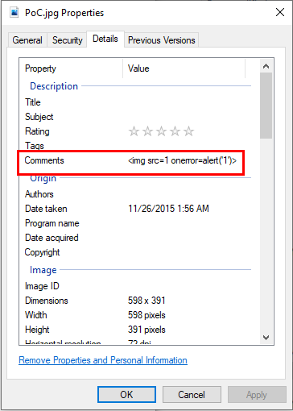

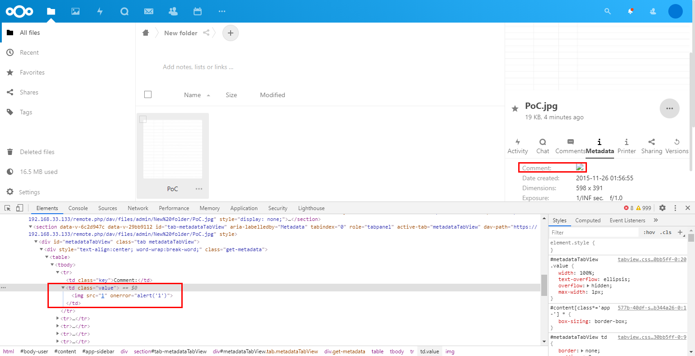

修复

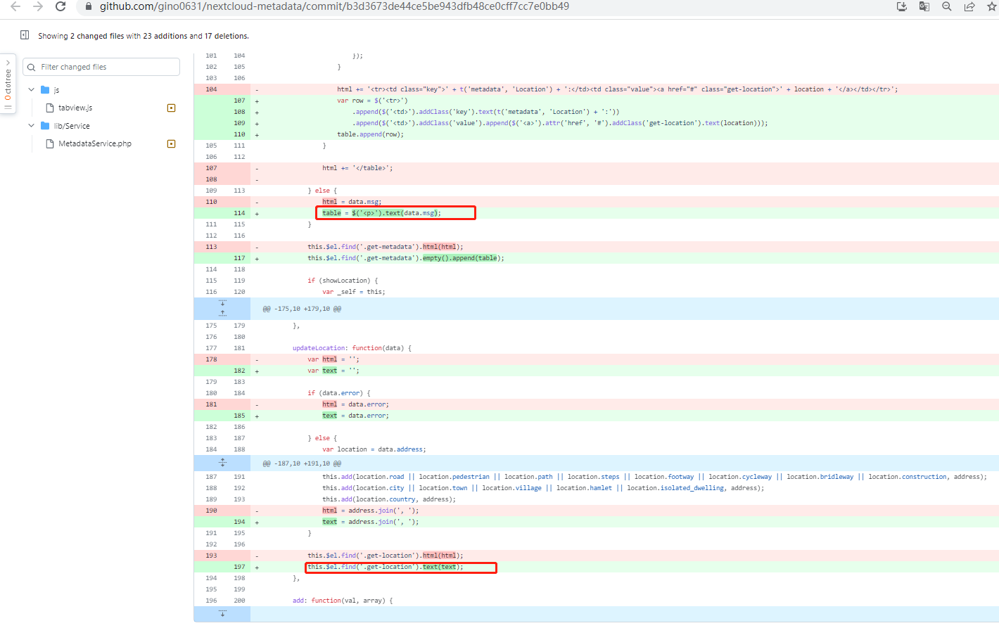

### GitLib 图片解析 RCE
[https://hackerone.com/reports/1154542](https://hackerone.com/reports/1154542)

CVE-2021-22204 [https://github.com/exiftool/exiftool/blob/11.70/lib/Image/ExifTool/DjVu.pm#L233](https://github.com/exiftool/exiftool/blob/11.70/lib/Image/ExifTool/DjVu.pm#L233)

文件lib/Image/ExifTool/DjVu.pm

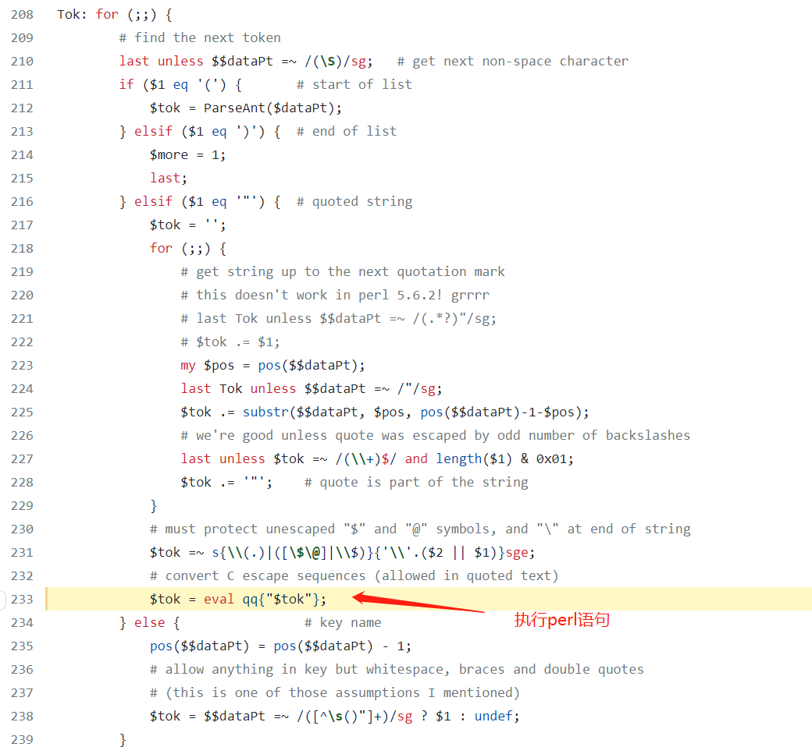

[https://github.com/LazyTitan33/ExifTool-DjVu-exploit/blob/main/CVE-2021-22204.py](https://github.com/LazyTitan33/ExifTool-DjVu-exploit/blob/main/CVE-2021-22204.py)

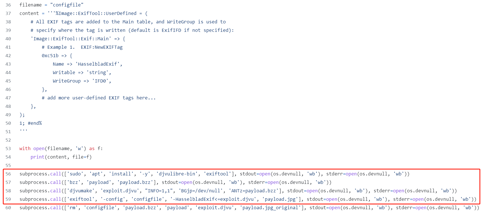

详细：[https://devcraft.io/2021/05/04/exiftool-arbitrary-code-execution-cve-2021-22204.html](https://devcraft.io/2021/05/04/exiftool-arbitrary-code-execution-cve-2021-22204.html)

DJVU示例文件： [https://github.com/exiftool/exiftool/blob/12.23/t/images/DjVu.djvu](https://github.com/exiftool/exiftool/blob/12.23/t/images/DjVu.djvu)

JPG转DJVU [https://convertio.co/zh/jpg-djvu/](https://convertio.co/zh/jpg-djvu/)

## 检测工具
Chrome插件： [https://github.com/yuLinnnn/ExifScan](https://github.com/yuLinnnn/ExifScan)

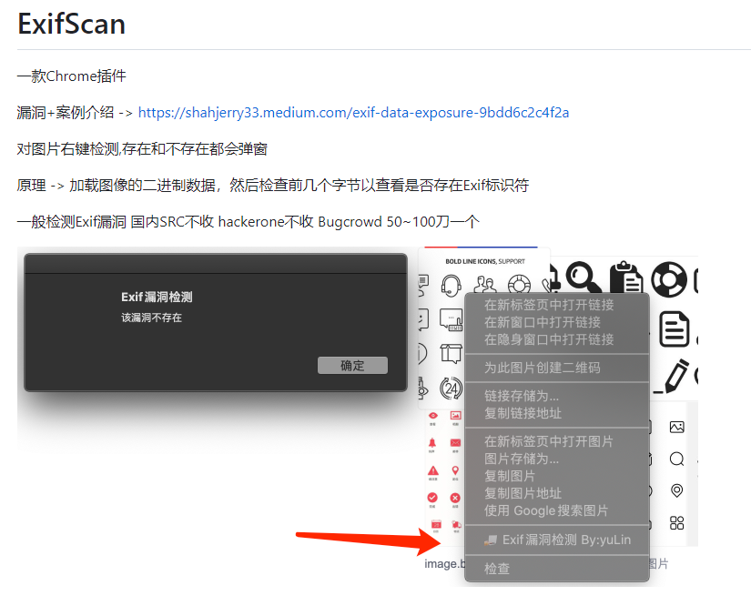

### 原理
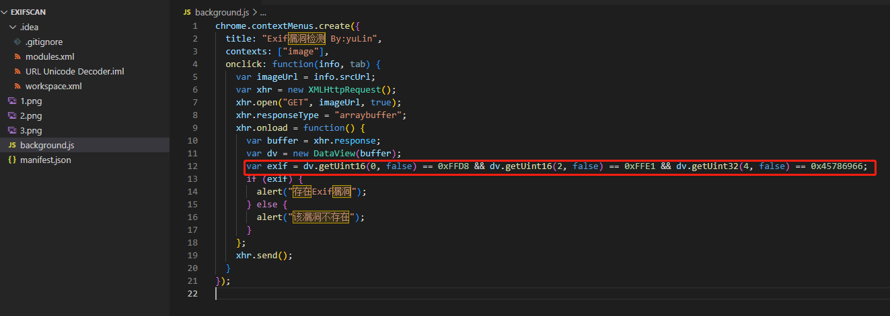

[https://gist.github.com/yepitschunked/9d2e73d9228f5a0b300d75babe2c3796](https://gist.github.com/yepitschunked/9d2e73d9228f5a0b300d75babe2c3796)

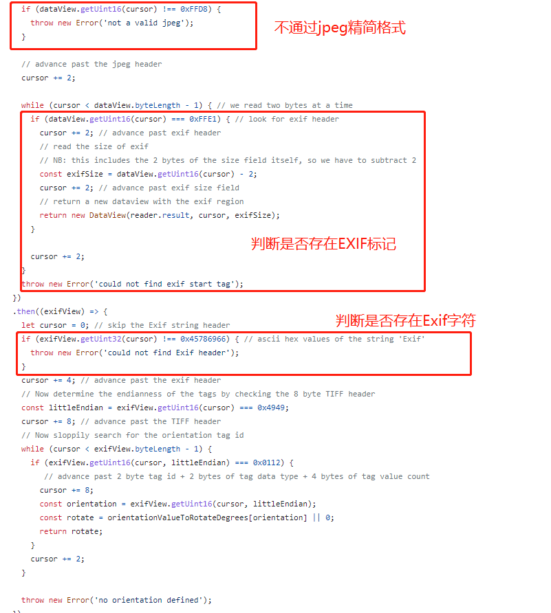

详细的标记查询。

[https://www.media.mit.edu/pia/Research/deepview/exif.html](https://www.media.mit.edu/pia/Research/deepview/exif.html)

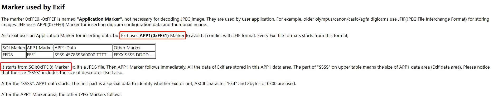

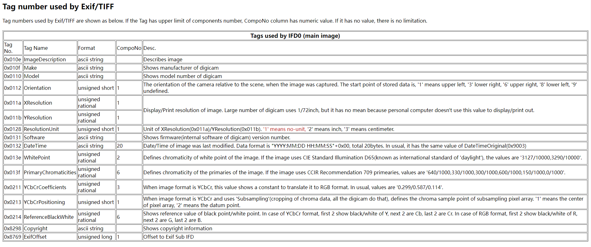

