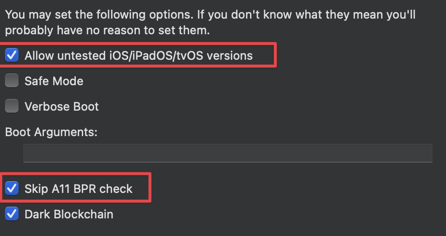
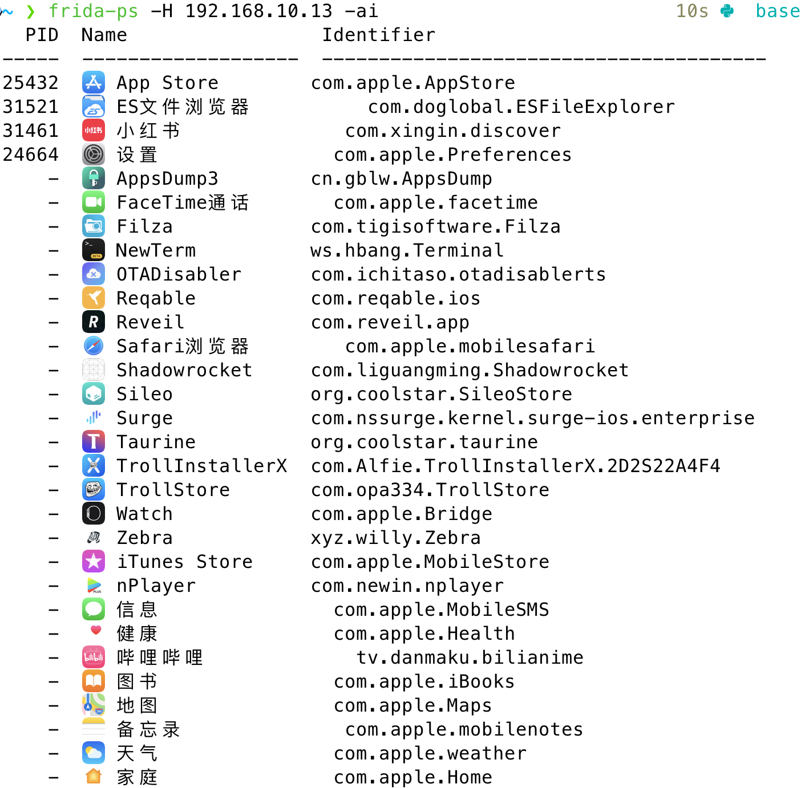
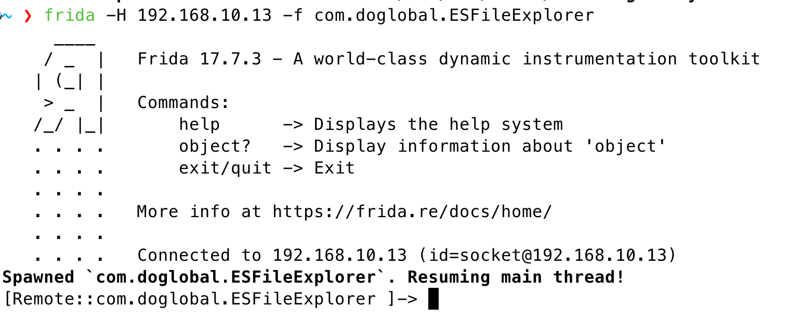

<!--more--> 
设备：iPhone8P

环境：arm64

# 0x00 越狱
一开始使用的是Taurine进行越狱，后面发现无法使用 Frida 脚本。然后看到了一个帖子上的网友也遇到了同样的问题，解决方案是使用checkra1n越狱即可。

1. 下载dmg版本
2. 打开checkra1n应用
3. 打开后是start不了的，先打开options，选择“允许未验证的版本”和“跳过A11 BPR检查”，然后back。
4. 点击start
5. 按照要求进入恢复模式就会自动完成。



[iphone_7_with_taurine_jailbreak_ios_version](https://www.reddit.com/r/jailbreak/comments/1cvx85k/iphone_7_with_taurine_jailbreak_ios_version_1481/?tl=zh-hans)  
[https://checkra.in/news/2020/09/iOS-14-announcement](https://checkra.in/news/2020/09/iOS-14-announcement)

# 0x01 安装 frida
新版本可能不太好用，我选择了旧版本。

1. 下载并解包

这里不是用dpkg -i 是因为环境说是arm，但真实的情况是arm64，无法直接安装。

```plain
wget https://github.com/frida/frida/releases/download/16.1.8/frida_16.1.8_iphoneos-arm64.deb
dpkg-deb -x frida_16.1.8_iphoneos-arm64.deb frida
killall frida-server
frida-server -l 0.0.0.0 &
ps aux | grep frida
```

2. 复制文件并赋予权限

```plain
ls frida/var/jb/usr/sbin/frida-server
cp frida/var/jb/usr/sbin/frida-server /usr/sbin/
chmod +x /usr/sbin/frida-server
find frida -name frida-agent.dylib
mkdir -p /usr/lib/frida
cp frida/var/jb/usr/lib/frida/frida-agent.dylib /usr/lib/frida/
chmod 755 /usr/lib/frida
chmod 755 /usr/lib/frida/frida-agent.dylib
```

3. 删除旧进程启动新的

这里记得是使用`-l`监听全局。

```plain
killall frida-server
frida-server -l 0.0.0.0 &
ps aux | grep frida
```

4. 在MacOS客户端安装Frida

```plain
pip install frida==16.1.8 frida-tools==12.3.0
```

5. 连接手机 Frida

```plain
frida-ps -H 192.168.10.13 -ai
```

这里可以看到已经在后台运行的应用PID以及所有的Name和包名。



ES文件游览器是免费的，但启动时会有广告，我们这次实验是去除广告启动。但我们还不知道有哪些广告类，先启动应用。

```plain
frida -H 192.168.10.13 -f com.doglobal.ESFileExplorer
```



启动后因为classes非常多，我们通过脚本导出所有的`ObjC.classes`类名到`classes.txt`然后传到客户端，交给chatgpt即可。

```plain
var f = new File("/var/mobile/classes.txt","w");

for (var name in ObjC.classes) {
    f.write(name + "\n");
}

f.close();
```

接着它帮我编写了一个脚本

```plain
if (ObjC.available) {

    console.log("NoAds script loaded");

    var adKeywords = [
        "ad",
        "ads",
        "advert",
        "doubleclick",
        "googlesyndication",
        "googleads",
        "adservice",
        "gdt",
        "baidu",
        "unityads",
        "mobads",
        "jad",
        "toutiao",
        "pangolin"
    ];


    function isAdUrl(url) {

        url = url.toLowerCase();

        for (var i = 0; i < adKeywords.length; i++) {

            if (url.indexOf(adKeywords[i]) !== -1) {
                return true;
            }
        }

        return false;
    }

    // 1️⃣ 拦截 HTTP 请求

    var NSURLRequest = ObjC.classes.NSURLRequest;

    Interceptor.attach(
        NSURLRequest["- initWithURL:"].implementation,
        {
            onEnter: function(args) {

                var url = ObjC.Object(args[2]).toString();

                if (isAdUrl(url)) {

                    console.log("Blocked Ad URL:", url);

                    args[2] = ObjC.classes.NSURL.URLWithString_("https://127.0.0.1/");
                }
            }
        }
    );


    // 2️⃣ 拦截广告 View

    var UIView = ObjC.classes.UIView;
    
    Interceptor.attach(
        UIView["- addSubview:"].implementation,
        {
            onEnter: function(args) {
    
                try {
    
                    var view = ObjC.Object(args[2]);
                    var name = view.$className;
    
                    if (name.indexOf("Ad") !== -1 ||
                        name.indexOf("AD") !== -1 ||
                        name.indexOf("JAD") !== -1 ||
                        name.indexOf("GAD") !== -1) {
    
                        console.log("Hide Ad View:", name);
    
                        view.setHidden_(1);
                        view.setAlpha_(0);
                    }
    
                } catch(err) {}
    
            }
        }
    );

}
```

完成

更加完整的案例：[[渗透测试]FRIDA HOOK：脱壳、手机抓包](https://boogipop.com/2023/05/29/%5B%E6%B8%97%E9%80%8F%E6%B5%8B%E8%AF%95%5DFRIDA%20HOOK%EF%BC%9A%E8%84%B1%E5%A3%B3%E3%80%81%E6%89%8B%E6%9C%BA%E6%8A%93%E5%8C%85%E7%BB%95%E8%BF%87SSL/)

