<!--more--> 
# 防护墙
主要考察阻止连接的配置和端口转发的配置

## Windows防火墙
控制面板\系统和安全\Windows Defender 防火墙

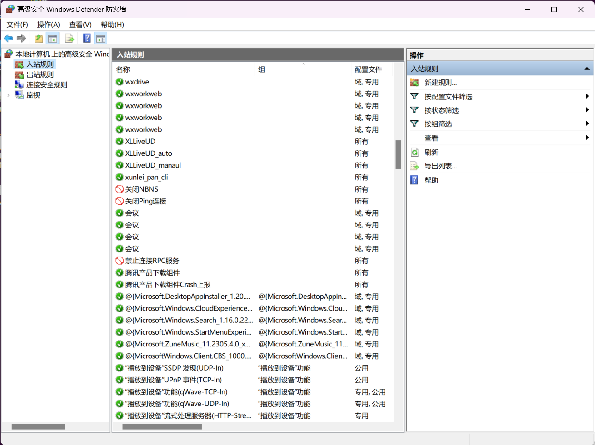

可以单个程序、端口或者自定义中的协议。

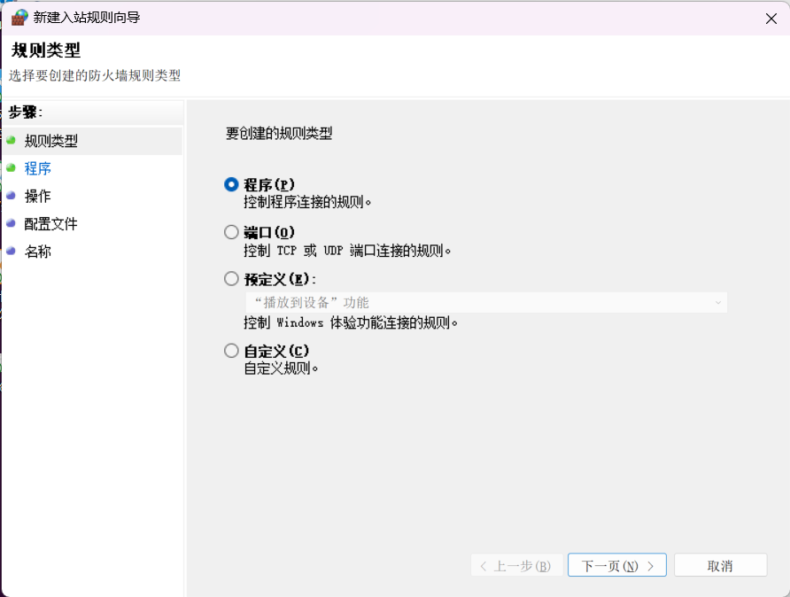

对应的操作有这三个。

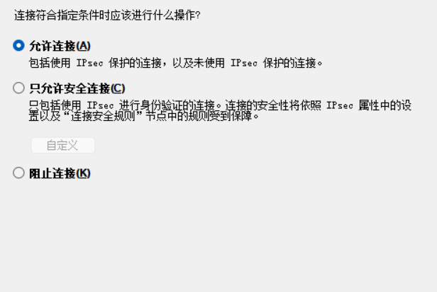

指定端口的窗口，可以自定义TCP和UDP。

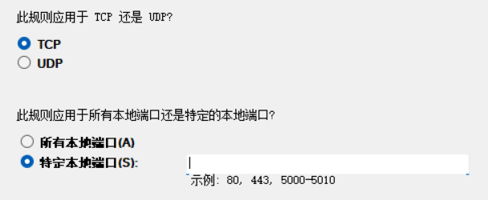

常用的协议是ICMP v4，也有其他协议。

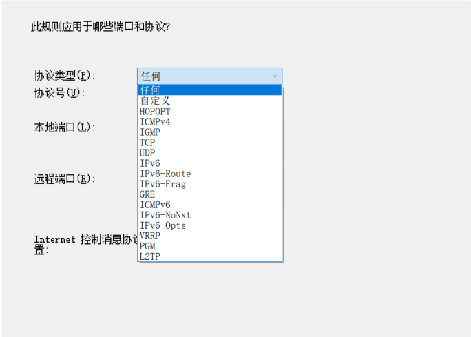

## Linux 防火墙
主要是iptables 命令熟悉

### 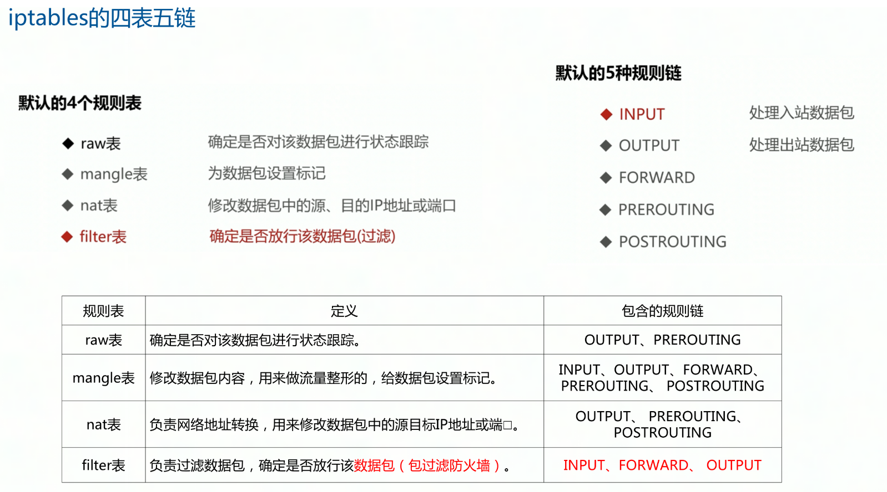
### 命令：
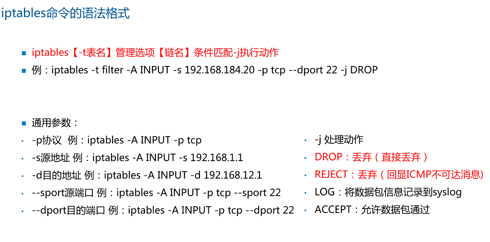


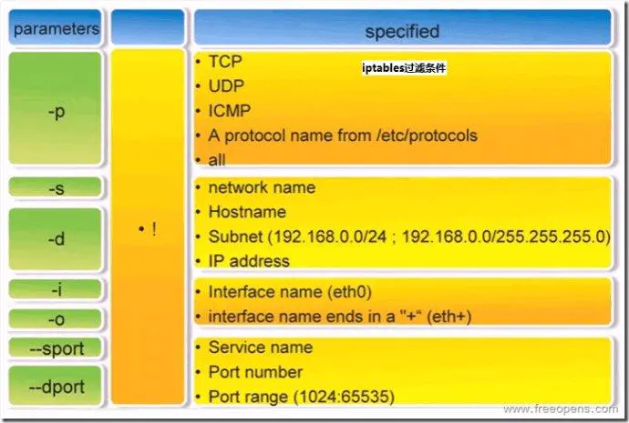

### iptables命令的管理控制选项：
<font style="color:#DF2A3F;">-A 在指定链的末尾添加（append）一条新的规则</font>

-D  删除（delete）指定链中的某一条规则，可以按规则序号和内容删除

-I  在指定链中插入（insert）一条新的规则，默认在第一行添加

<font style="color:#DF2A3F;">-L  列出（list）指定链中所有的规则进行查看</font>

<font style="color:#DF2A3F;">-F  清空（flush）</font>

-P  设置指定链的默认策略（policy）

### 命令
<font style="color:rgb(51, 51, 51);">防止 DoS 攻击</font>

```plain
iptables -A INPUT -p tcp --dport 80 -m limit --limit 25/minute --limit-burst 100 -j ACCEPT
```

<font style="color:rgb(51, 51, 51);">从外部向内部 Ping</font>

```plain
iptables -A INPUT -p icmp --icmp-type echo-request -j ACCEPT
iptables -A OUTPUT -p icmp --icmp-type echo-reply -j ACCEPT
```

<font style="color:rgb(51, 51, 51);">禁止转发来自MAC地址为00：0C：29：27：55：3F的和主机的数据包</font>

```plain
iptables -A FORWARD -m mac --mac-source 00:0c:29:27:55:3F -j DROP
```

<font style="color:rgb(51, 51, 51);">允许防火墙本机对外开放TCP端口20、21、25、110以及被动模式FTP端口1250-1280</font>

```plain
iptables -A INPUT -p tcp -m multiport --dport 20,21,25,110,1250:1280 -j ACCEPT
```

<font style="color:rgb(51, 51, 51);">设置 422 端口转发到 22 端口</font>

```plain
iptables -t nat -A PREROUTING -p tcp -d 192.168.102.37 --dport 422 -j DNAT --to 192.168.102.37:22
iptables -A INPUT -i eth0 -p tcp --dport 422 -m state --state NEW,ESTABLISHED -j ACCEPT
iptables -A OUTPUT -o eth0 -p tcp --sport 422 -m state --state ESTABLISHED -j ACCEPT
```

## snort
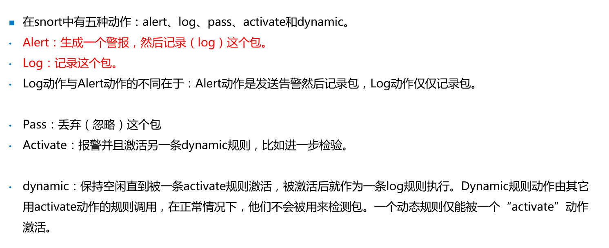


# 流量分析
## wireshark 常用过滤器命令
| 过滤方式 | 命令 |
| --- | --- |
| 通过IP进行过滤 | ip.addr==192.168.0.1<br/>ip.dst ==<br/>ip.src== |
| 通过端口过滤 | tcp.port<br/>tcp.dstport<br/>tcp.srcport<br/>upd.port<br/>upd.dstport<br/>udp.srcport |
| 通过HTTP请求过滤 | http.request.full_uri contains 'qq.com'<br/>http.request.method=='GET' |
| 通过协议过滤 | nbns<br/>tcp<br/>直接输入协议名称即可 |
| 特殊，列出SYN数据包 | tcp.flags.syn |
| 条件 | and<br/>or |


## DNS放大攻击流量
# 密码学
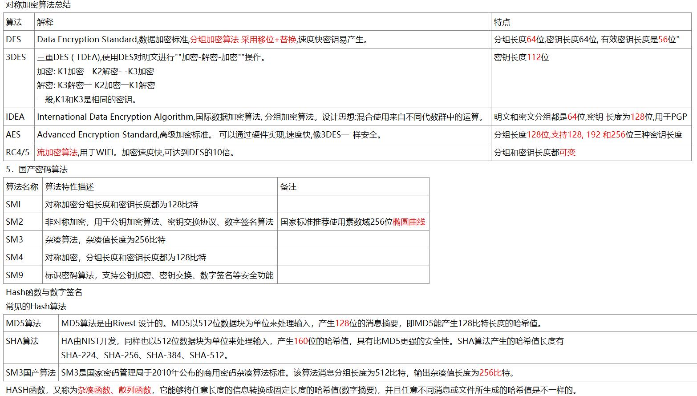

## RSA计算
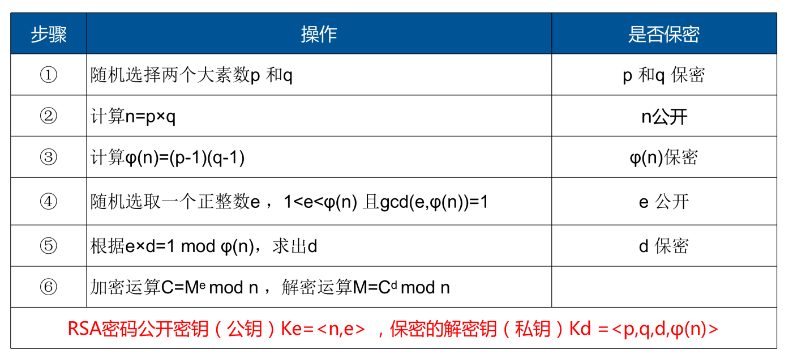

**特性：密文不能大于n，会产生回绕。**

8888mod6 得出来的数永远小于6，或者说永远小于n。

## 进制转换
8进制是3位，16进制是4位，可以使用间接法转换

转十进制用权值算法

十进制转其他进制用<font style="color:rgb(51, 51, 51);">取余法</font>

### <font style="color:rgb(51, 51, 51);">十进制 → 二进制</font>
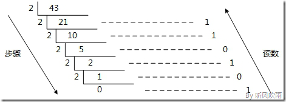

### <font style="color:rgb(51, 51, 51);">十进制 → 八进制</font>
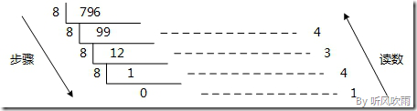

**间接法：**

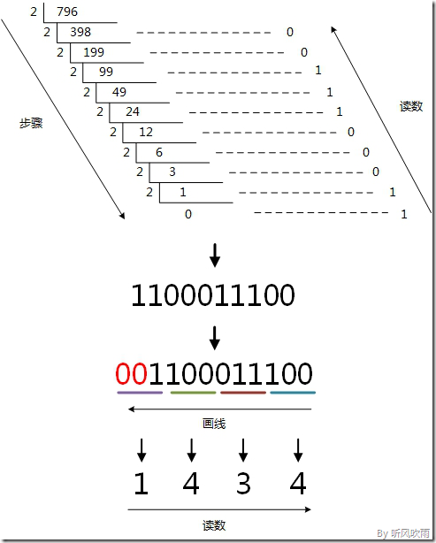

### <font style="color:rgb(51, 51, 51);">十进制 → 十六进制</font>
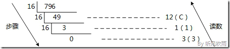

**间接法：**

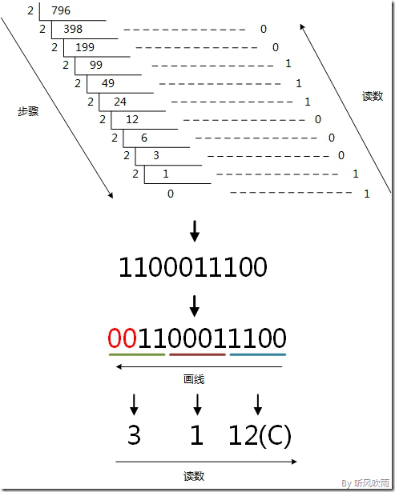

> <font style="color:rgb(51, 51, 51);">参考：</font>[<font style="color:rgb(51, 51, 51);">https://www.cnblogs.com/gaizai/p/4233780.html</font>](https://www.cnblogs.com/gaizai/p/4233780.html)
>

## <font style="color:rgb(51, 51, 51);">Ascii码</font>
需要注意的三个值：

+ **A-65**
+ **a-97**
+ 0-48

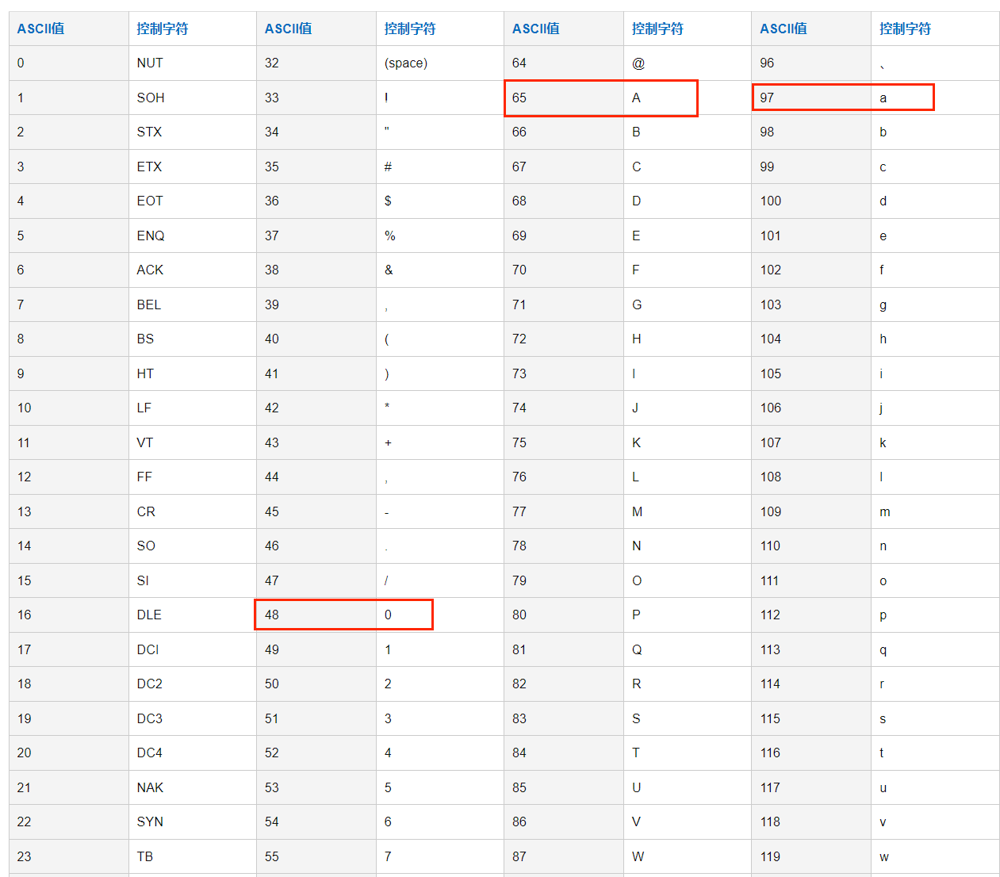

> 参考：[https://tool.oschina.net/commons?type=4](https://tool.oschina.net/commons?type=4)
>

# Linux应急
## 文件排查
<font style="color:#666666;">利用find查找具有suid权限的文件</font>

`find /usr/bin -perm -u=s`

查找24小时内被修改的特定文件：

`find ./ -mtime 0 -name "*.jsp"`  
查找72小时内新增的文件：

`find / -ctime -2`

查找类型链接

`find / -type=l`

## Linux系统安全增强技术
**inetd.conf（inetd.conf关闭不必要服务：telnet/finger/echo/chargen/rsh/login/tftp）**

**文件权限设置600，属主为root**

**services**

**文件权限设置644，属主为root**

BIOS程序：启用开机保护口令，启动提示用户输入密码

`/etc/hosts.deny`

编辑输入 ALL: ALL@ALL 禁止所有主机访问

`/etc/hosts.allow`

编辑输入 ftp: 10.1.1.1 foo.com 允许ip地址和主机名称访问ftp服务

使用tcpdchk进行配置检查

`/etc/profile`

配置TMOUT=600用户在10分钟无操作自动注销

/etc/skel/.bash_logout

rm -f $HOME/.bash_hsitory用户注销删除历史命令记录

（针对特定用户主目录修改/$HOME/.bash_hsitory）

httpd.conf

Apache主配置文件

con/access.conf

负责基本的读取文件控制，限制目录所能执行的功能及访问目录的权限


## 文件内容说明
**/etc/passwd # 存储用户文件的目录**

```plain
root:x:0:0:root:/root:/bin/bash
gdm:x:42:42::/var/lib/gdm:/sbin/nologin
```

解析：

```plain
root=用户名
x=表用户密码存储在/etc/shadow文件夹
0=UID用户账户，0是root，1-499(999)是系统账户，500(1000)-65535是普通账户
0=GID用户组
root=帐号描述用于备注
/root=用户主目录文件夹
/bin/bash=登录账户默认使用shell脚本远程登录，/bin/nologin=默认不能登录的账户
```

**/etc/shadow # 存储密码的目录**

```plain
root:$6$DUiJ86eiVo9kFVlgnYS1:17631:0:99999:7:::
daemon:*:17557:0:99999:7:10:17560:
```

解析：

```plain
root=用户名
$6$DUiJ86eiVo9kFVlgnYS1=用户密码加密字段
17631=密码已经使用的日期，从1970-1-1开始计算
0=密码最少多少天之后可以修改，0表示随时修改
99999=密码多少天之后必须修改，99999表示可以一直不用修改
7=密码修改前几天提醒用户修改，7表示7天之前提醒用户修改
10=密码没有修改延长10天后失效，如果是0则密码过期立即失效
17560=不管任何条件密码到期自动失效
保留字段，目前无含义
```

## 权限说明
普通用户输入行提示符是$，管理用户是#

**/etc/passwd # 默认644，最小权限444，允许其他用户访问**

**/etc/shadow # 默认600，最小权限400，不允许其他用户访问**

b rwx r-x -w- # d表示设备文件，数字权限表示为752

表示设备文件，文件所有者可：读/写/执行，文件所属用户组可：读/执行，其他用户可：写

```plain
- 普通文件
d 目录文件
l 链接文件
b 设备文件
p 管道文件
```

日志目录：/var/log

SSH登录日志：/var/log/secure

SSH 配置文件：/etc/ssh/sshd_config

SSH 公钥文件：id_rsa.pub

自动SSH服务：

```plain
systemct1 sshd start
systemct1 sshd stop
systemct1 sshd restart
```

## 文件属性
通过chattr可以修改文件属性

`chattr +a /etc/resolv.conf`

```plain
a：让文件或目录仅供附加用途。
b：不更新文件或目录的最后存取时间。
c：将文件或目录压缩后存放。
d：将文件或目录排除在倾倒操作之外。
i：不得任意更动文件或目录。
s：保密性删除文件或目录。
S：即时更新文件或目录。
u：预防意外删除。
```

# Windows应急
## 日志查看
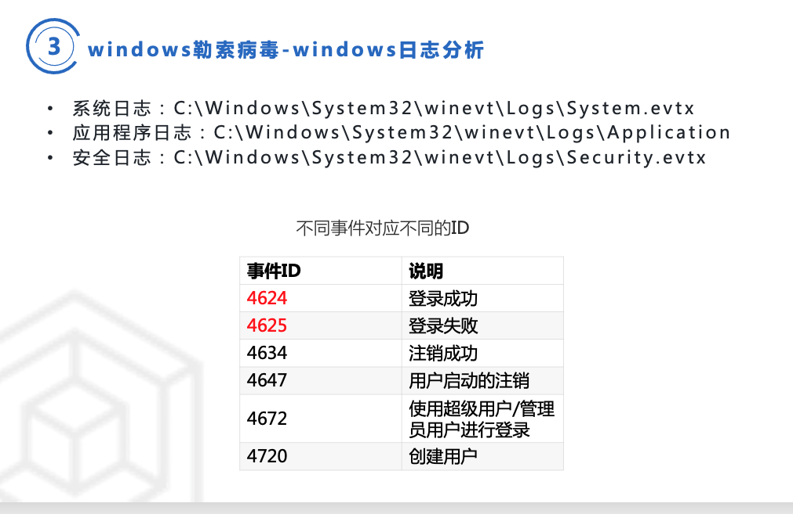

## 文件属性
可以通过 attrib.exe 进行变更

`attrib +r +a +s +h 文件`一般命令

```plain
ATTRIB [+R | -R] [+A | -A] [+S | -S] [+H | -H] [+O | -O] [+I | -I] [+X | -X] [+P | -P] [+U | -U]
       [drive:][path][filename] [/S [/D]] [/L]

  +   设置属性。
  -   清除属性。
  R   只读文件属性。
  A   存档文件属性。
  S   系统文件属性。
  H   隐藏文件属性。
  O   脱机属性。
  I   无内容索引文件属性。
   X   无清理文件属性。
  V   完整性属性。
  P   固定属性。
  U   非固定属性。
  [drive:][path][filename]
      指定属性要处理的文件。
  /S  处理当前文件夹及其所有子文件夹中
      的匹配文件。
  /D  也处理文件夹。
  /L  处理符号链接和
      符号链接目标的属性
```

# 移动安全
## 安卓四大组件
## 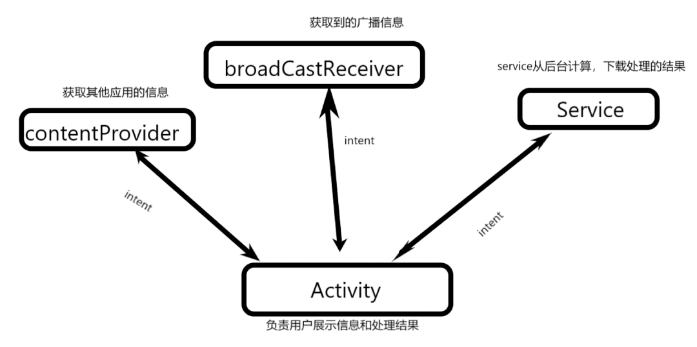  
安卓架构
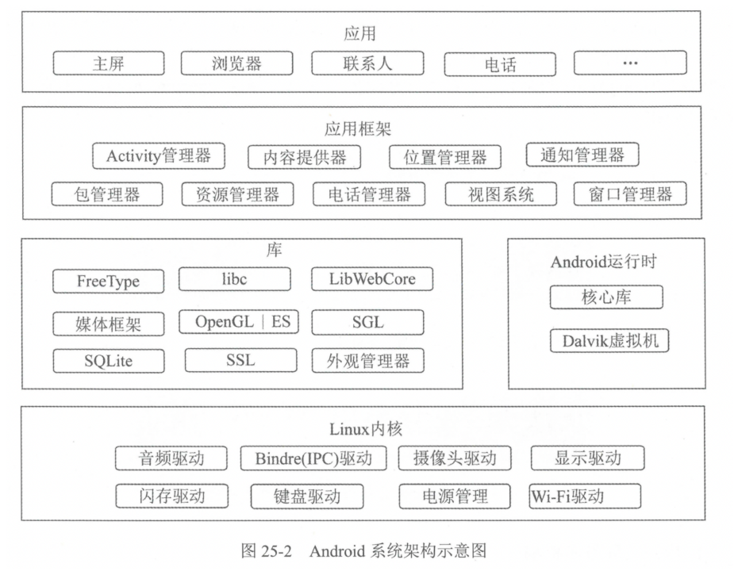

## 安卓架构安全措施
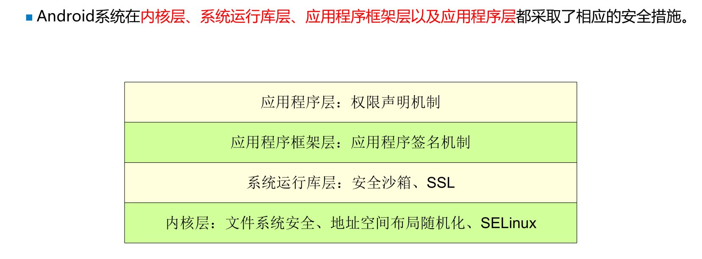

