<!--more--> 
## 0x00 声明
请严格遵守网络安全法相关条例！此分享主要用于交流学习，请勿用于非法用途，一切后果自付。
一切未经授权的网络攻击均为违法行为，互联网非法外之地。
## 0x01 前言
> 钓鱼演练核心是gophish，此平台联动邮件服务器可以做到对邮件的统筹下发，如果邮件中包含钓鱼链接，他还能够锁定个人并跟踪监测到该员工：“是否查看邮件”，“是否点击链接”，“是否输入数据”，并且图形化得展示出来，非常直观。

正是我们用来完成客户购买的“对公司员工进行钓鱼意识培训服务”任务的最好工具，有数据也有统计。
## 0x01 前期准备
这个企业级钓鱼演练平台主要使用了 **GoPhish开源网络钓鱼系统+EwoMail开源邮件服务器。**
其中 **GoPhish **可以使用 docker 安装，**EwoMail **需要通过 git 下载安装**。**
除此之外，我们需要准备一台配置 **2h2g的云服务器 **且25端口能解封。
这里我们使用的是腾讯云购买的服务器，系统是	**CentOS 7.8 64位。**
**可能有人会问，为什么要准备国内的机器？**因为国外发送的邮件很有可能给邮件网关拦截或者到垃圾邮件。当然也有不同的情况，你可以做好两手准备。
> **阿里云、华为云、腾讯云等大型服务厂商会禁止搭建邮服，可以选择小型服务器提供商。就算腾讯云服务器25端口可以解封，但如果被发现发送恶意邮件也是会给封禁的。这里的“发现”是指受害者反馈了恶意邮件后会让腾讯云收到通告单。**

## 0x02 腾讯云服务器25端口解封
访问 [https://console.cloud.tencent.com/secctrl/smtp](https://console.cloud.tencent.com/secctrl/smtp) 通过下面的操作可以解封 25 端口。
注意：只有（包年包月）云服务器 CVM 才可以解封。
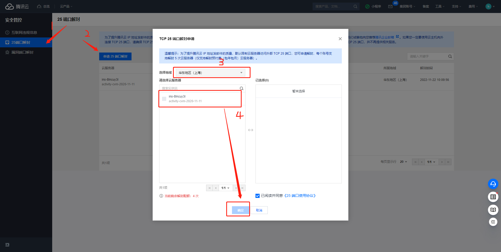

## 0x03 安装 EwoMail 邮件服务器
EwoMail GitHub地址：[GitHub - gyxuehu/EwoMail: EwoMail是基于Linux的企业邮箱服务器，集成了众多优秀稳定的组件，是一个快速部署、简单高效、多语言、安全稳定的邮件解决方案](https://github.com/gyxuehu/EwoMail)
EwoMail 官方网站地址：[EwoMail邮件服务器,企业邮箱,一键搭建,安全稳定的开源邮件系统](http://www.ewomail.com/)
EwoMail 官方文档地址：[简介 - EwoMail邮件服务器](http://doc.ewomail.com/docs/ewomail)
**EwoMail 安装后不能卸载只能停止服务，如果需要重装需要重装系统才可以。**
安装之前，我们先看 EwoMail 的环境要求。
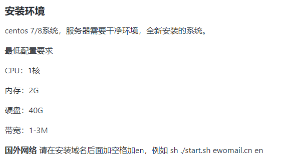
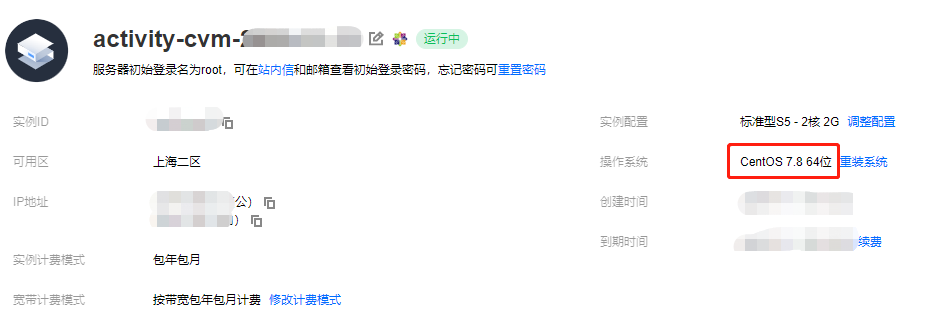
```shell
yum -y install git
cd /root
git clone https://gitee.com/laowu5/EwoMail.git
chmod -R 777 EwoMail
cd /root/EwoMail/install
sh ./start.sh xxx.com
```
> 这里安装会用到域名，作用是邮件服务器后缀。我们可以不需要购买域名，这里我们先随意使用 xxx.com 作为后缀。只是这样的话只能发送邮件，无法接收邮件，在钓鱼这个应用场景下，我们不需要接收邮件。

如果服务器的网络不好或者你选择流量收费模式有额度，你可以选择先本地下载 EwoMail 压缩包后上传服务器。
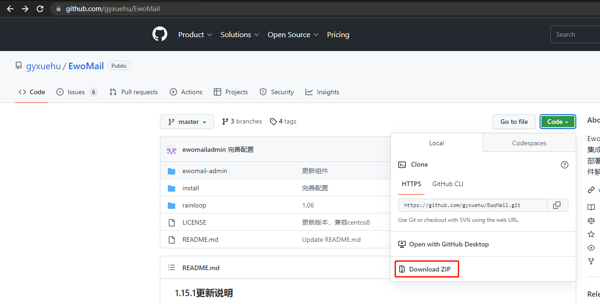

```shell
unzip EwoMail-master.zip
chmod 777 EwoMail-master
cd EwoMail-master/install/
sh ./start.sh xxx.com
```
安装完成后，我们可以去看使用了哪些端口。
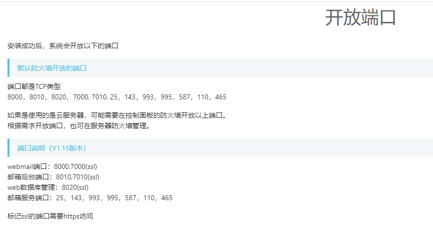
```shell
访问地址（将IP更换成你的IP即可）
邮箱管理后台：http://IP:8010 （默认账号admin，密码ewomail123）
邮箱管理后台ssl端口 https://IP:7010

web邮件系统：http://IP:8000
web邮件系统ssl端口 https://IP:7000

web数据库管理页面：https://IP:8020/
```
邮箱管理后台界面：
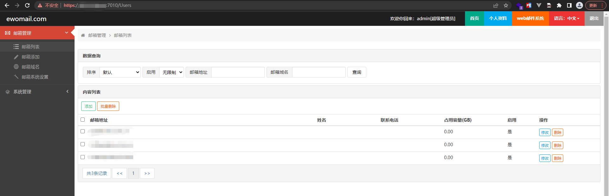
web邮件系统界面：
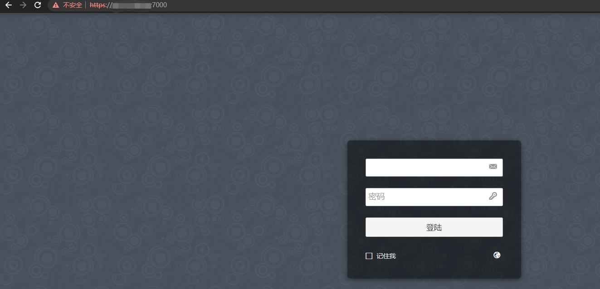
### 1. 内部通信【必须】
如果不做这一步无法登录web邮件服务器。会出现**域不允许**的问题。
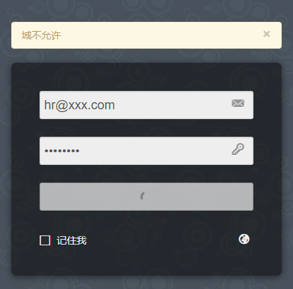
```shell
# 修改文件
vi /etc/hosts
# 填入
127.0.0.1   mail.xxx.com smtp.xxx.com imap.xxx.com
```
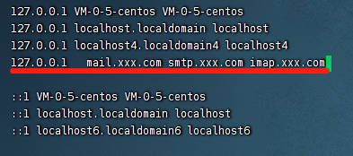
### 2. 修改默认密码
我们先通过账号admin/ewomail123 进入到邮箱管理后台，再进到个人资料处进行密码更改。
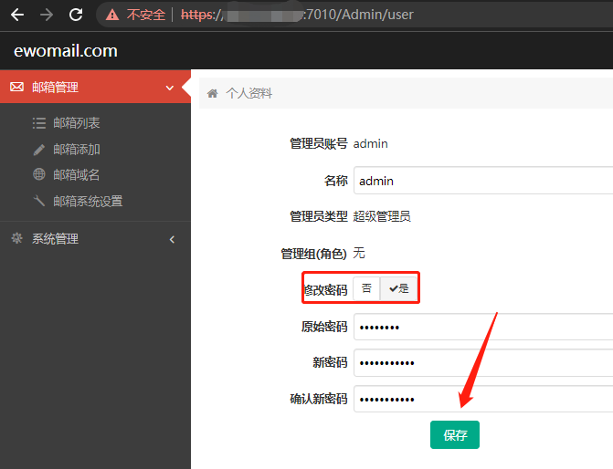
### 3. 创建邮件用户
在后台的左侧栏找到**邮箱添加**，这里使用 hr@xxx.com/12345678 作为账号的用户名和密码。
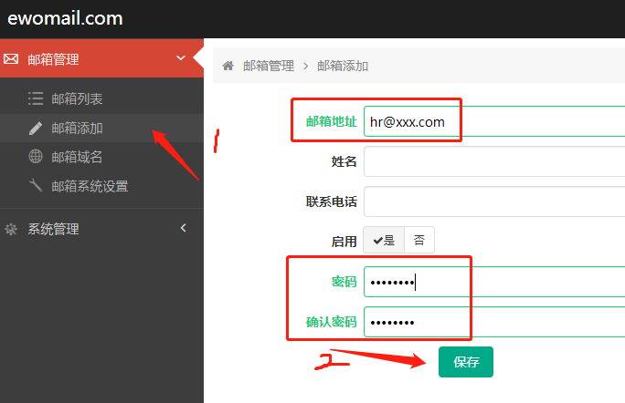
提示成功之后，我们去 web邮箱系统 登录测试。如果做完第一步，这里就不存在 域不允许 的问题。
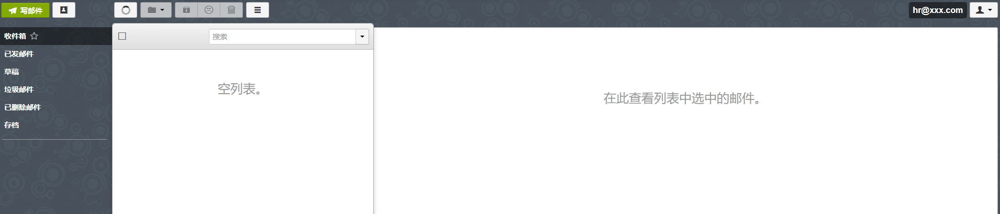
### 4. 如果你使用购买域名
如果你选择使用购买的域名，那么请你在执行安装脚本的时候使用域名。
```shell
sh ./start.sh 你购买的域名
```
后续都是使用该域名即可，无需修改本机的 hosts 文件。
你的域名DNS解析应该像这般配置。
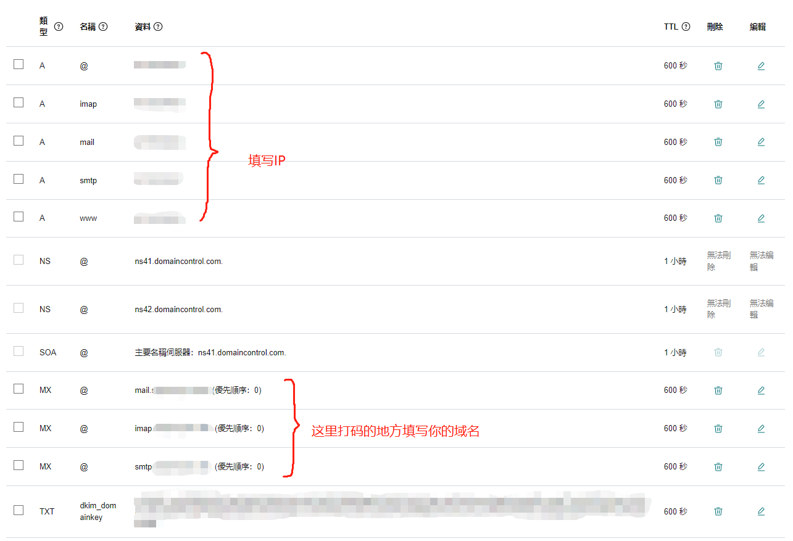
其中 TXT 记录里的 dkim_domainkey 用于提高邮件可信度。这里不进行赘述。
### 5. docker 安装 EwoMail 【NEW】
使用 Docker 新建 Centos 安装 EwoMail。这样一来我们可以随时关停邮件服务系统，也可以随时新建一个邮件服务系统。
项目地址：[https://github.com/linjiananallnt/EwoMailForDocker](https://github.com/linjiananallnt/EwoMailForDocker)
安装时请保证 8000,8010,8020,7000.7010.25,143,993,995,587,110,465 这些端口没被占用。
```
git clone https://github.com/linjiananallnt/EwoMailForDocker.git
cd EwoMailForDocker
sh ./start.sh
```
执行脚本之后请耐心等待，这个方法暂时没用日志输出，可以刷新 http://IP:8000 判断服务是否启动完毕。如果超过半个小时无法访问，说明安装失败。
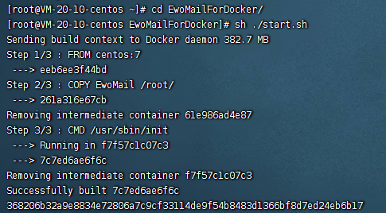
## 0x04 安装 **GoPhish 网络钓鱼系统**
Gophers Github项目地址：[https://github.com/gophish/gophish](https://github.com/gophish/gophish)
因为Gophish 的 Linux 安装最适合的发行系统是 Ubuntu ，但我们这里是 Centos 系统，所以我们这里选择使用 docker 进行安装 GoPhish。
```shell
yum install docker -y
systemctl start docker
docker pull gophish/gophish
docker run -it -d --rm --name gophish -p 3333:3333 -p 8003:80 -p 8004:8080 gophish/gophish
docker logs gophish(查看安装日志中的登录密码)
```
docker 语句中的 `-p 3333:3333 -p 8003:80 -p 8004:8080` 为容器映射VPS端口，其中 3333 是 Gophish 的后台访问端口，8003 是伪造的页面地址。我们可以随意更换映射VPS的端口，例如 `-p 13222:3333 -p 25530:80 -p 12430:8080` 更改之后我们可以使用 http://IP:13222 来访问 Gophish 后台。这里先按照上面给出的命令进行按照。
如果无法直接访问 3333 端口，请使用 https。
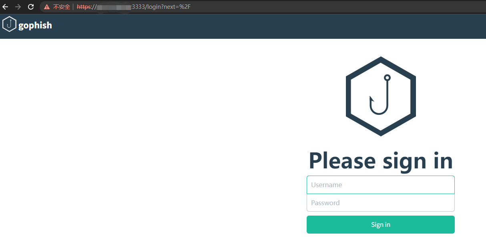
这里的账号是 admin 密码是创建服务时生成的，通过 `docker logs gophish`命令可以看到密码。
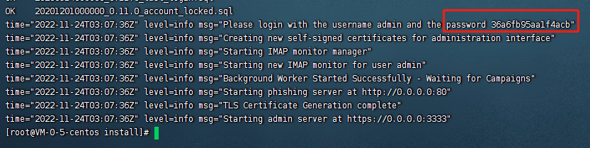
第一次登录需要修改密码。
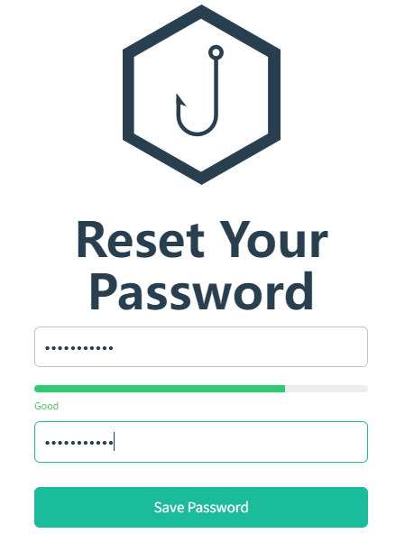
后台的左侧栏示意。
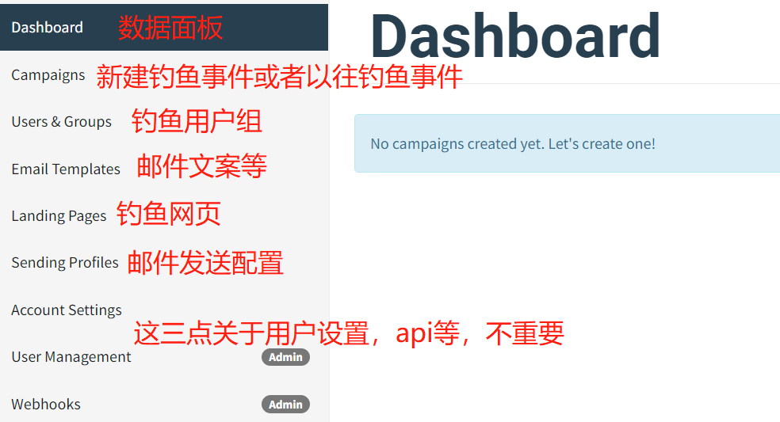
### 1. 创建邮箱发送服务配置
进入后台后找到 Sending Profiles
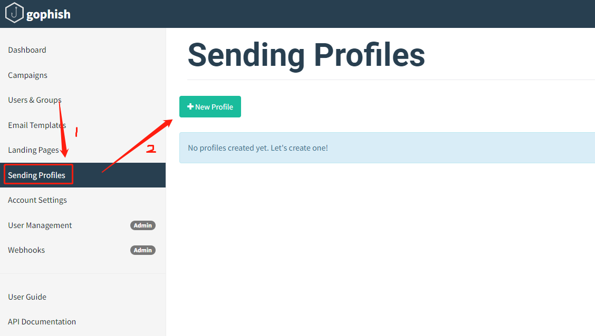
各字段解释：

- Name 随意填写，为Profile的名称
- From 别名，为邮件的发送人，这里的格式为 名字<邮件地址>，名字可以任意填写，但邮箱地址必须和下面的Username一致。
- Host smtp服务地址，因为我们没有做域名解析，所以直接填写 IP地址:25 即可。
- Username和Password 为上面创建的邮箱用户。

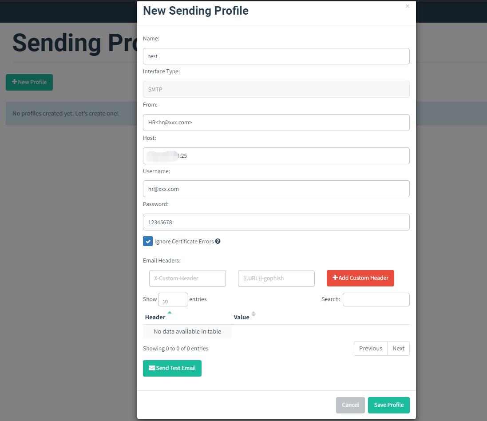
这里可以使用 Send Test Email 来测试是否能发送邮件。在第三个 input 填入收件人邮箱，点击 Send。
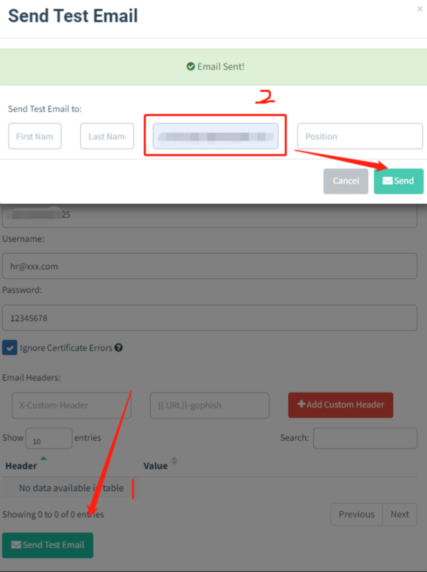
在收件人的邮箱可以看到发送成功。
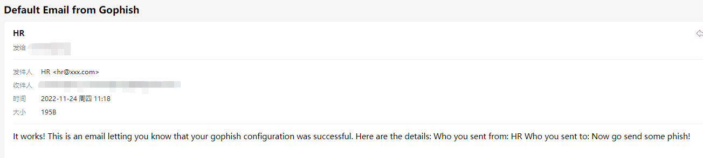
发件人为刚才我们自己命名的。到此邮件发送服务配置完毕。
### 2. 创建邮件内容模板
在左侧栏找到 Email Templates，点击添加新模板。
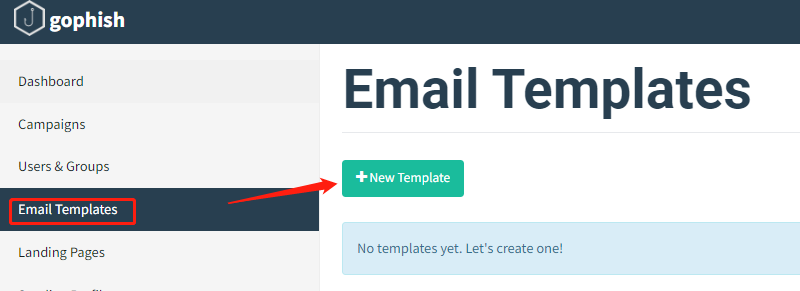
这里我们可以使用 GoPhish 的邮件模板导入功能，该功能十分强大。
我们去QQ邮箱随意点开一封邮件，例如下面。
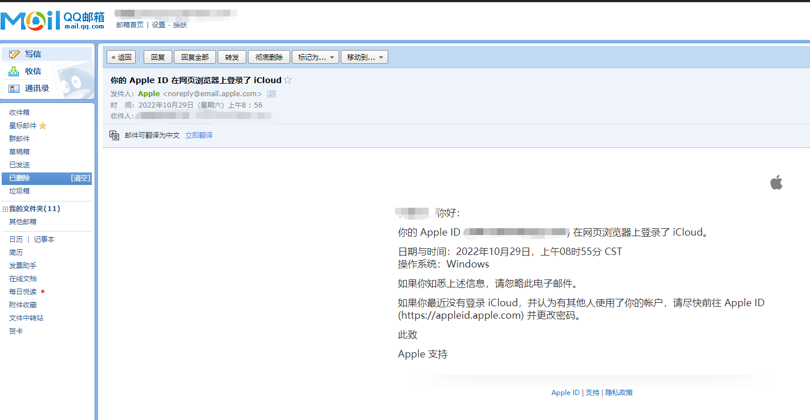
点开右上角的更多选项，找到显示邮件原文。
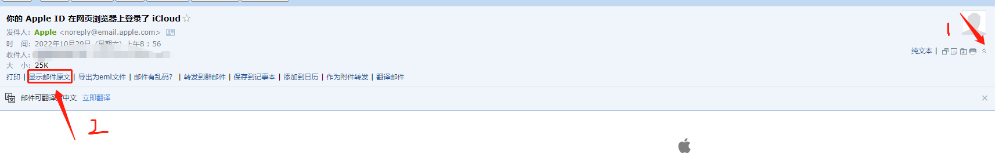
全选显示出来的内容并复制。
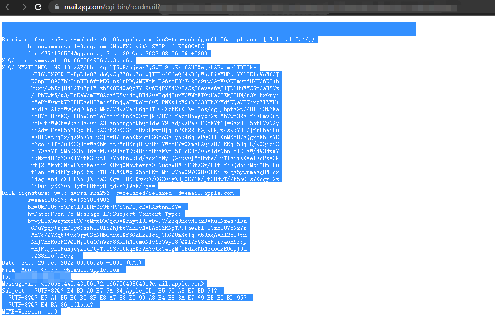
找到 Import Email 按钮。
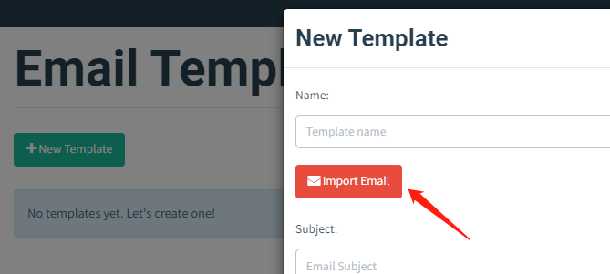
粘贴内容并点击导入。这里的 Change Links to Point to Landing Page 意思是将邮件内的链接替换成显示钓鱼页面的地址。因为你还没设置，所以使用 {{.URL}} 暂填代替。
> {{.Tracker}} 会被替换成 

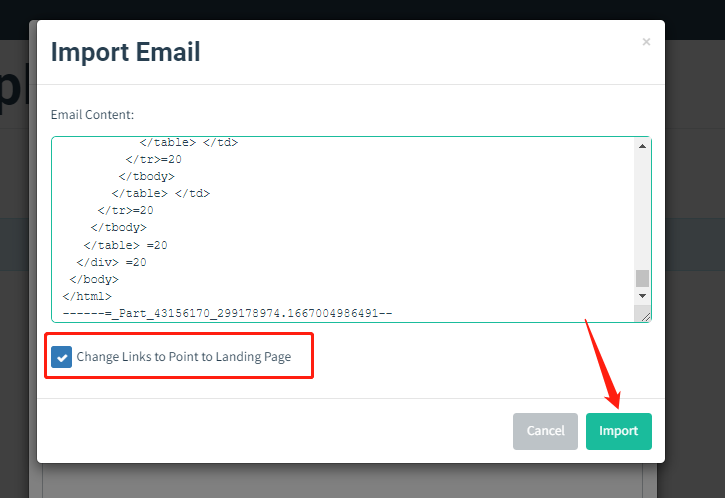
导入后点击 Source 就可以看到邮件内的所有链接替换成了 {{.URL}}。如下是官方提供的其他可以使用的参数。

| ariable | Description |
| --- | --- |
| {{.RId}} | The target's unique ID |
| {{.FirstName}} | The target's first  name |
| {{.LastName}} | The target's last name |
| {{.Position}} | The target's position |
| {{.Email}} | The target's email  address |
| {{.From}} | The spoofed sender |
| {{.TrackingURL}} | The URL to the  tracking handler |
| {{.Tracker}} | An alias for |
| {{.URL}} | The phishing URL |
| {{.BaseURL}} | The base URL with the  path and rid parameter stripped. Useful for making links to static files. |

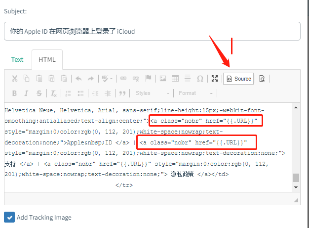
旁边的小图标，点击之后可以进行预览。可以拿来发现问题。
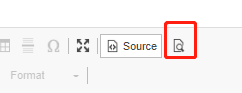
确认无误后点击保存，这里的 Add Tracking Image 的作用是在你的邮件内添加一张看不到的图片，用来判断是受害者是否点击了该邮件，用来统计数据使用。
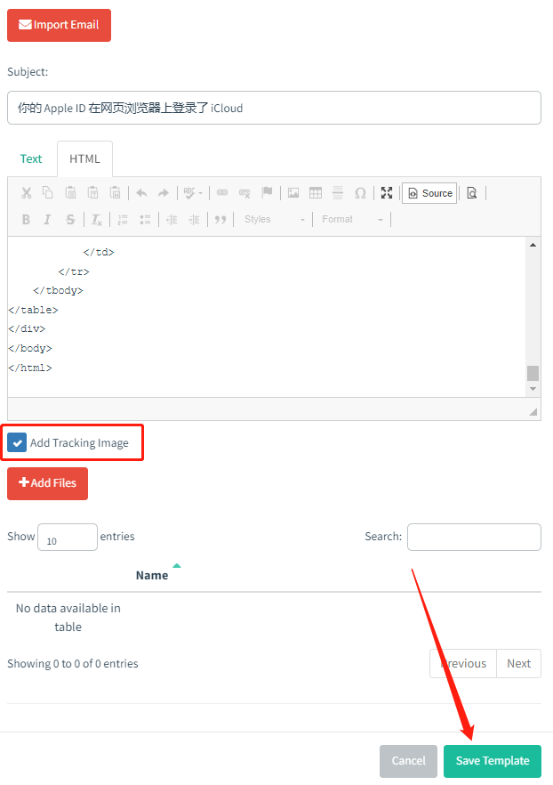
> outlook 禁止图片加载，可能会影响数据读取。

### 3. 创建钓鱼页面
在左侧栏找到 Landing Pages，点击新建页面。
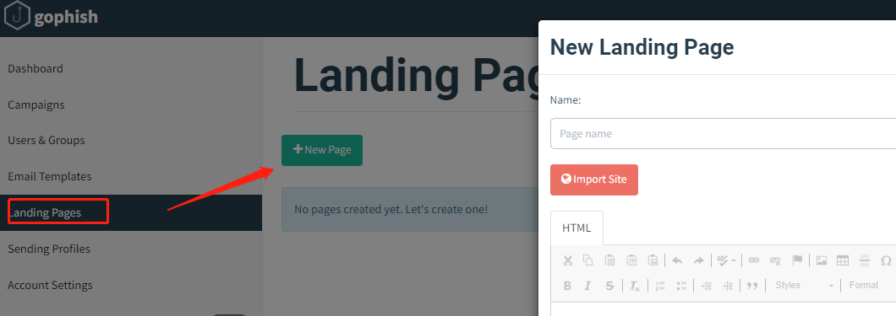
这里系统自带的 importsite 可以直接输入要 copy 的网站地址，但是这种方法我尝试了一些网站，有许多网站都不能完美 copy ，这里我介绍一种方法，使用火狐带的插件 Save Page WE 可以完美把网页给 copy 下来，然后把 copy 下的页面源码贴在 HTML 的位置就行了，这里我随便找个后台演示下。
火狐插件 Save Page WE下载地址：[Save Page WE – 下载 🦊 Firefox 扩展（zh-CN）](https://addons.mozilla.org/zh-CN/firefox/addon/save-page-we/?utm_source=addons.mozilla.org&utm_medium=referral&utm_content=search)
安装好插件，访问后台页面，右上角点击插件图标即可下载后台页面 html。
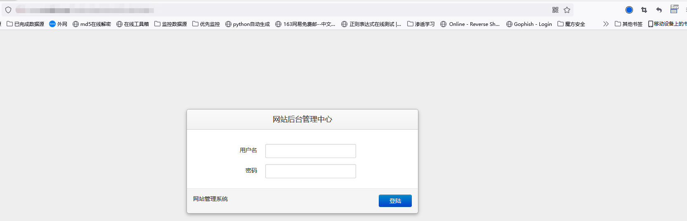
将下载好的 html 拖入任意编辑器，使用编辑器搜索 `<form`
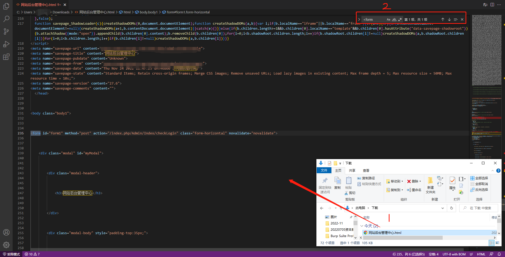
将 form 标签内的属性只保留两个。action 必须为空。
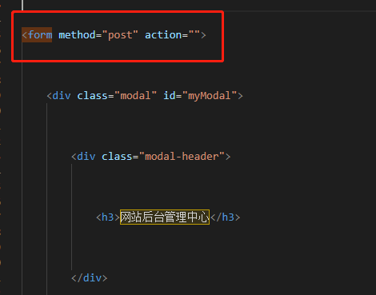
然后全选代码复制到 HTML 文本框内，同时你可以使用 Source 旁边的小图标进行预览。下面的两个选项必须勾选才能记录到数据，第三步的跳转页面可以不进行设置，但最好是跳到真实页面。
> 通常，进行钓鱼的目的往往是捕获受害用户的用户名及密码，因此，在点击Save Page之前，记得一定要勾选 Capture Submitted Data 。
> 当勾选了 Capture Submitted Data 后，页面会多出一个 Capture Passwords 的选项，显然是捕获密码。通常，可以选择勾选上以验证账号的可用性。如果仅仅是测试并统计受害用户是否提交数据而不泄露账号隐私，则可以不用勾选。
> 另外，当勾选了Capture Submitted Data后，页面还会多出一个Redirect to，其作用是当受害用户点击提交表单后，将页面重定向到指定的URL。可以填写被伪造网站的URL，营造出一种受害用户第一次填写账号密码填错的感觉。
> 一般来说，当一个登录页面提交的表单数据与数据库中不一致时，登录页面的URL会被添加上一个出错参数，以提示用户账号或密码出错，所以在Redirect to中，**最好填写带出错参数的URL，或着跳到错误页面**。

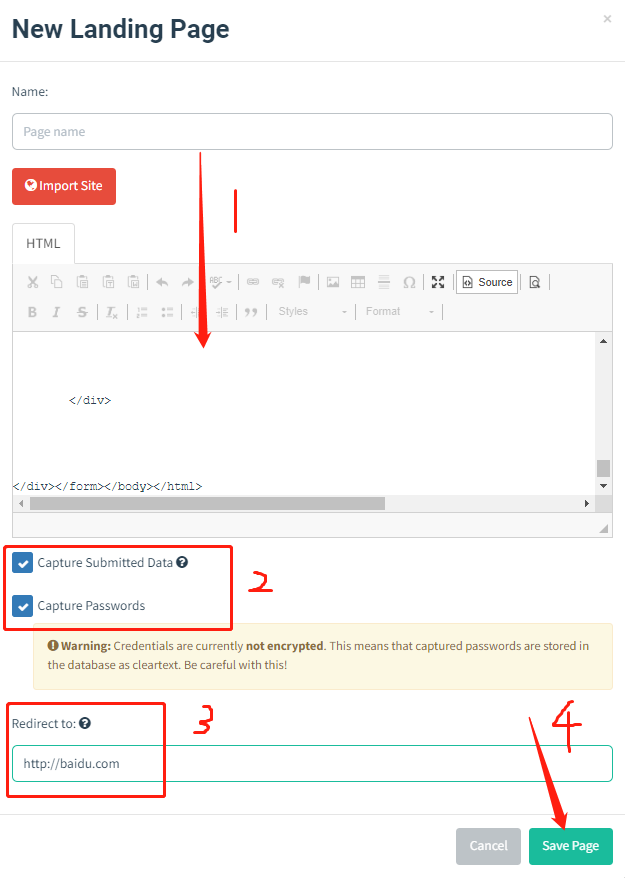
### 4. 添加受害人邮箱发送组
在左侧栏找到 Users & Groups 点击添加组，这里我们先下载导入模板。
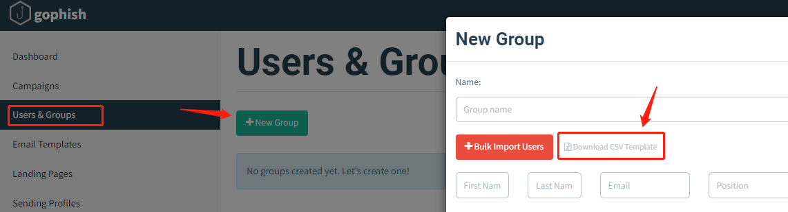
这里我们只需要填写 Email 一栏，为受害者邮箱地址，当然你也可以填写 First  Name 作为收件人的名称。
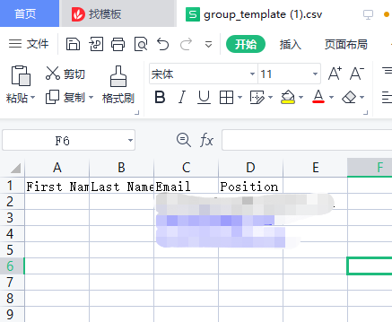
导入并保存，别忘记填写 Name 作为组的名称。
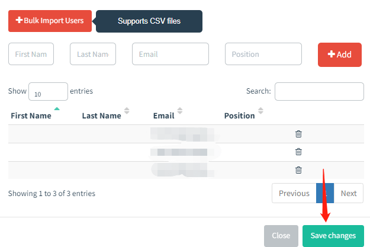
### 5. 发送钓鱼邮件测试
在左侧栏找到Campaigns，点击新建，这里表单里面的 URL 就是填充到上面第二部邮件内容里面的 {{.URL}} 处。
这里 Gophis 默认起的服务是 80 端口，通过 docker 映射到了 8003 端口，所以这里填入 http://IP:8003。点击完成，就会给受害者的邮箱发送钓鱼邮件了。
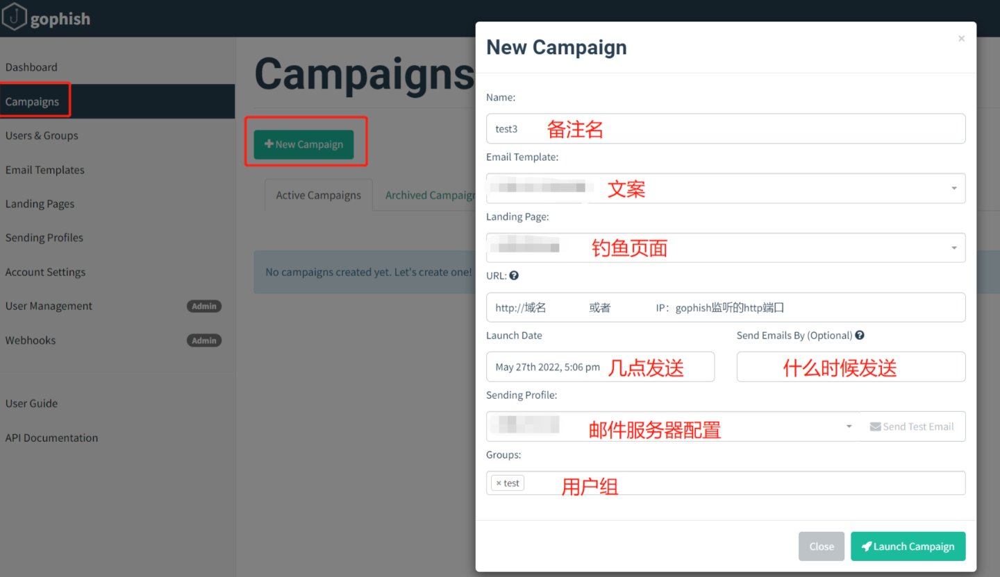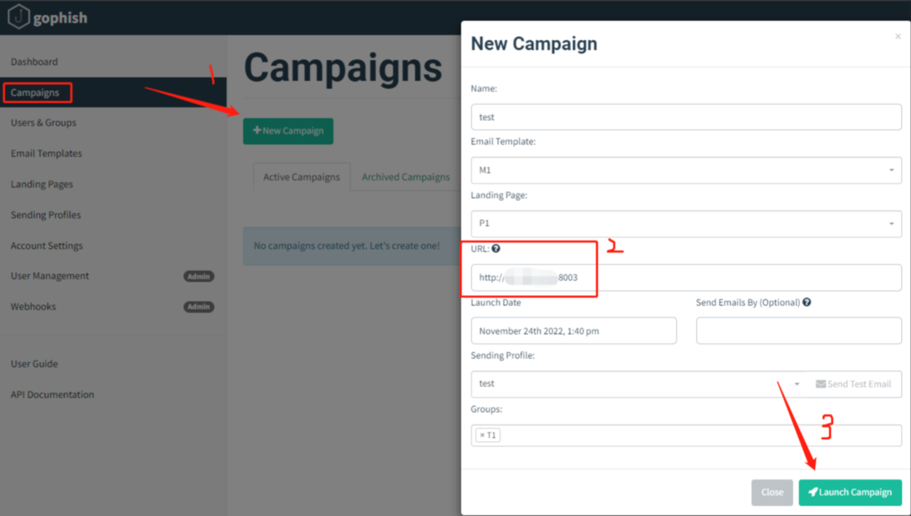
点击发送后，可以在受害者邮箱内看到邮件信息。
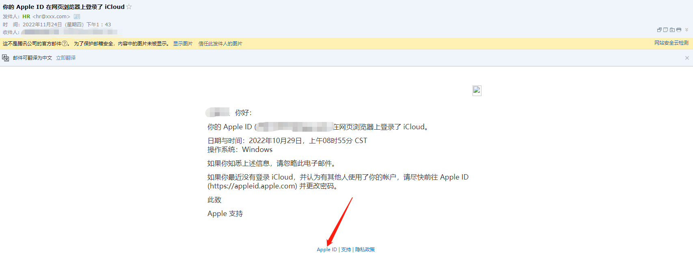
> 这里有个图片没用被加载，所以我们没法从 Gophis 的控制台看到统计。

点击下面的链接可以看到会跳转到我们指定的URL地址。
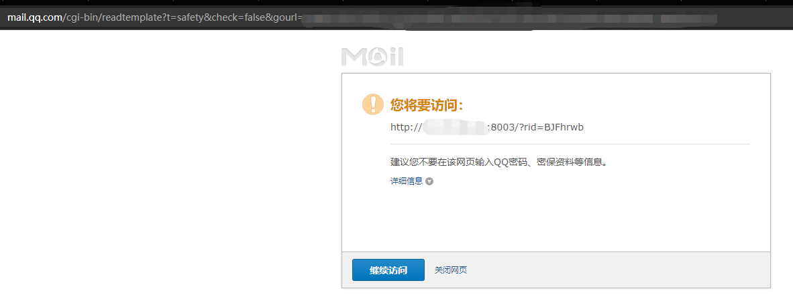
点击继续访问就是我们仿冒的网站后台页面。
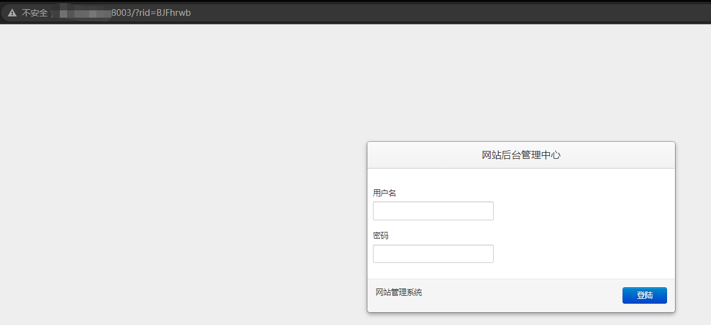
这里我们任意输入内容并提交后，就会跳转到我们第三步填写的 Redirect to 里面的地址。
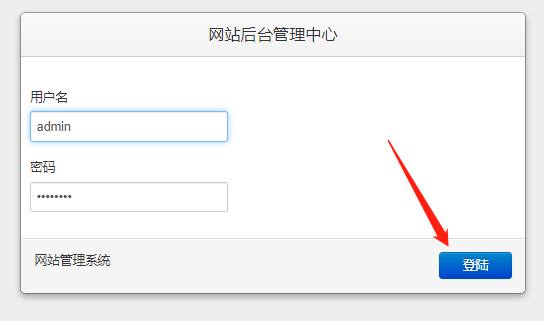
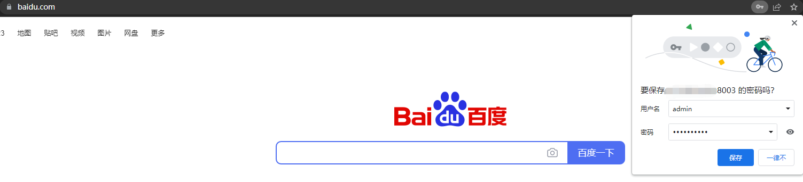
填写并提交之后可以看到记录了我们填写的表单信息。
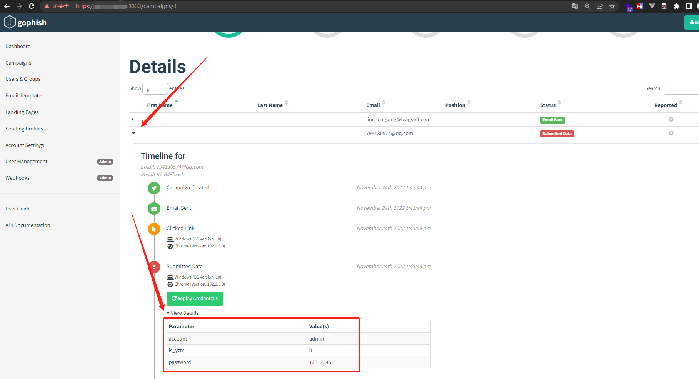
**值得注意的是 email headers 如果不进行配置，那么默认发送的邮件会包含 X-Mailer: gophish 字段，建议进行修改，这样可以绕过一些邮件的过滤，推荐设置以下4个值：Mime-Version、Received、X-Mailer、X-Originating-IP。**
### 6. 错误钓鱼页面模板坑
在导入真实网站来作为钓鱼页面时，绝大多数情况下并非仅通过Import就能够达到理想下的克隆，通过多次实践，总结出以下几点注意事项 。
**【捕获不到提交的数据】**
导入后要在HTML编辑框的非Source模式下观察源码解析情况，如果明显发现存在许多地方未加载，则有可能导入的源码并非页面完全加载后的前端代码，而是一个半成品，需要通过浏览器二次解析，渲染未加载的DOM。这种情况下，除非能够直接爬取页面完全加载后的前端代码，否则无法利用gophish进行钓鱼，造成的原因是不满足第2点。
**【捕获不到提交的数据】**
导入的前端源码，必须存在严格存在<form method="post" ···><input name="aaa" ··· /> ··· <input type="submit" ··· /></form>结构，即表单（POST方式）— Input标签（具有name属性）Input标签（submit类型）— 表单闭合的结构，如果不满足则无法捕获到提交的数据 。
**【捕获不到提交的数据】**
在满足第2点的结构的情况下，还需要求<form method="post" ···>在浏览器解析渲染后（即预览情况下）不能包含action属性，或者action属性的值为空。
否则将会把表单数据提交给action指定的页面，而导致无法被捕获到 。
**【捕获数据不齐全】**
对于需要被捕获的表单数据，除了input标签需要被包含在中，还需满足该存在name属性。例如<input name="username">,否则会因为没有字段名而导致value被忽略 。
**【密码被加密】**
针对https页面的import，通常密码会进行加密处理，这时需要通过审计导入的前端代码，找到加密的Java函数（多数情况存在于单独的js文件中，通过src引入），将其在gophish的HTML编辑框中删除，阻止表单数据被加密 。

## 0x05 发件人伪造
为了让邮件更加真实，明面上的功夫必不可少。其中发件人的信息是重点。如何进行发件人伪造，我们可以利用自己搭建的 EwoMail 邮件服务器进行伪造。
首选进入邮件服务器后台，在左侧栏找到邮箱域名选项，添加不属于我们自己的域名，或者不存在的域名。
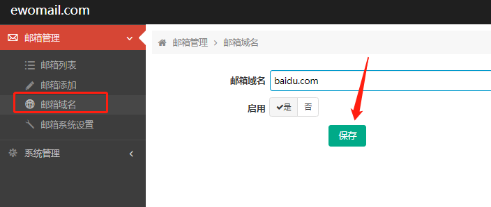
保存后利用 EwoMail 内部通信的机制，我们添加一道解析记录。
```shell
# 修改文件
vi /etc/hosts
# 填入
127.0.0.1   mail.baidu.com smtp.baidu.com imap.baidu.com
```
然后再添加该邮箱后缀的邮箱用户。
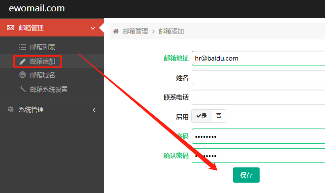
在 Gophis 新建邮件服务配置，同一个 Host 不同的邮件用户。在 Campaigns 的时候选择这个发送配置即可。
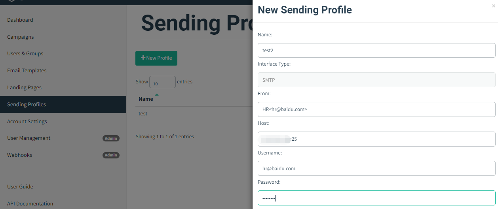
## 0x06 安装 sendmail 邮件服务【NEW】
上面我们讲的是讲 EwoMail 邮件服务器+GoPhish网络钓鱼系统安装到同一台服务器上面的钓鱼演练解决方案。尽管我将 EwoMail 使用 docker 进行安装，但避免不了它的提交过于庞大，开放端口过多，安装过多组件等缺点。其实这个模式我们很清楚，就是发送邮件的服务+GoPhish。在邮件服务上我们不一定要选择  EwoMail，为了追求体积小、安装方便。我们可以选择 sendmail。
我们可以使用 yum 包管理工具直接安装 sendmail。
```
yum install sendmail sendmail-cf mailutils sharutils -y
systemctl start sendmail saslauthd
```
安装完毕后，我们去 GoPhish 的 Sending Profiles 配置我们的邮件服务。
如果是使用 docker 安装的 GoPhish 需要在创建容器的时候添加上 `--network host`。
```
yum install docker -y
systemctl start docker
docker pull gophish/gophish
docker run -it -d --rm --network host --name gophish gophish/gophish
docker logs gophish
```
其中 Host 直接填写 127.0.0.1 即可。发件人 From 可以填写我们伪造的发件人，无需像 EwoMail 那样麻烦。
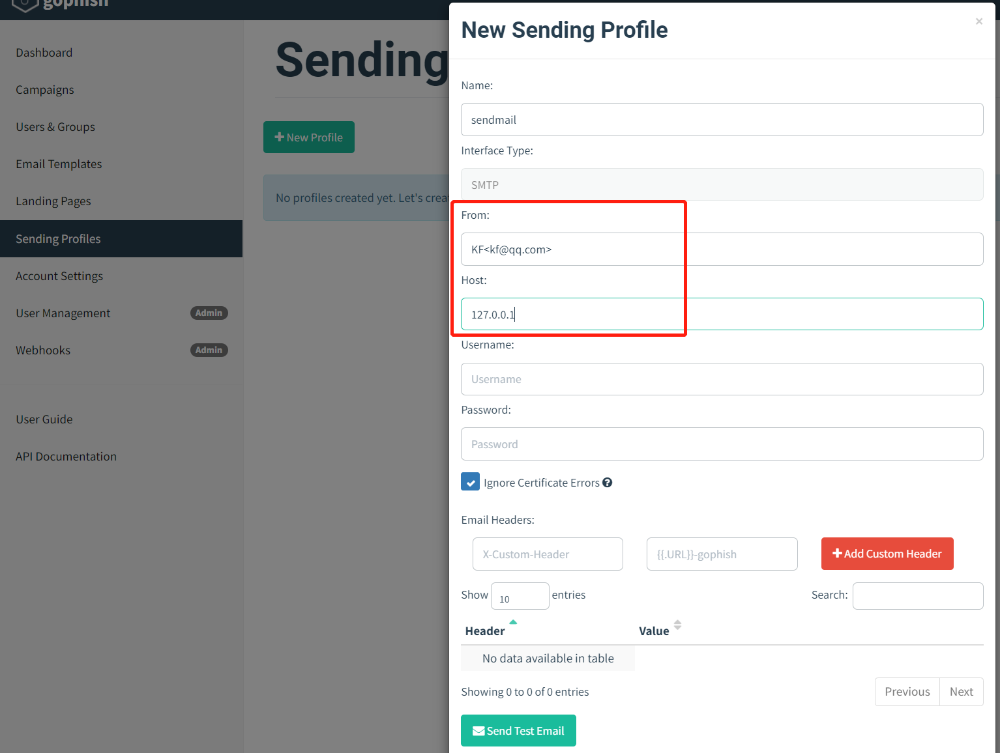
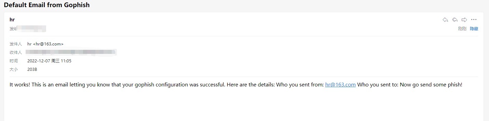
## 0x06 其他

1. **拦截**

在实战中，我们可能拿到的受害者名单非常多。导致可能存在邮箱服务器一个时间内发送邮件数量太多会导致很多邮件被退回的情况。我们可以在 Users & Groups 处将受害者名单分成多个组，并在 Campaigns 配置 send email by 处指定不同的时间段进行发送。而且不同的组可以使用不同的邮件服务发送人，这样可以大大降低拦截的概率。

2. **其他用法**

不一定是发送邮件然后让受害者进入我们准备好的界面，这个链接也可以是问卷星收集信息，也可以是被我们插入恶意存储XSS的网页。甚至你可以放入捆绑木马，恶意Office，ZIP + Link 钓鱼，Office里面放恶意仿冒钓鱼链接等，具体看技战法。
## 0x06 参考文章致谢
部分素材源自网络，侵删。

- [奇安信攻防社区-从零开始的钓鱼养成-(gophish+ewomail)](https://forum.butian.net/share/1736)
- [记一次企业钓鱼演练 - 先知社区](https://xz.aliyun.com/t/11400#toc-7)
- [钓鱼邮件Gophish系统实战指南_https_功能_com](https://www.sohu.com/a/563271006_121124374)
- [记一次钓鱼邮件演练](https://cn-sec.com/archives/1195470.html)
- [Gophish钓鱼实践指南 - FreeBuf网络安全行业门户](https://www.freebuf.com/articles/network/276463.html)
- [邮件发件人伪造 - T00ls.Com](https://www.t00ls.com/articles-65071.html)
- [https://www.sec-in.com/article/1171](https://www.sec-in.com/article/1171)
- [钓鱼邮件发件人伪造技术剖析 - FreeBuf网络安全行业门户](https://www.freebuf.com/articles/network/327768.html)

